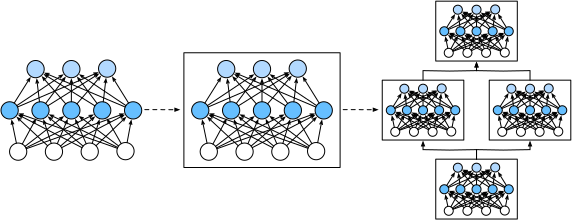

```{.python .input}
%load_ext d2lbook.tab
tab.interact_select(['mxnet', 'pytorch', 'tensorflow', 'jax'])
```

# Couches et modules
:label:`sec_model_construction`

Lorsque nous avons introduit pour la première fois les réseaux de neurones,
nous nous sommes concentrés sur les modèles linéaires avec une seule sortie.
Ici, le modèle entier ne consiste qu'en un seul neurone.
Notez qu'un seul neurone
(i) prend un ensemble d'entrées ;
(ii) génère une sortie scalaire correspondante ;
et (iii) possède un ensemble de paramètres associés qui peuvent être mis à jour
pour optimiser une fonction objectif d'intérêt.
Ensuite, une fois que nous avons commencé à penser aux réseaux à sorties multiples,
nous avons exploité l'arithmétique vectorisée
pour caractériser une couche entière de neurones.
Tout comme les neurones individuels,
les couches (i) prennent un ensemble d'entrées,
(ii) génèrent des sorties correspondantes,
et (iii) sont décrites par un ensemble de paramètres ajustables.
Lorsque nous avons étudié la régression softmax,
une seule couche était en soi le modèle.
Cependant, même lorsque nous avons ensuite
introduit les MLP,
nous pouvions toujours considérer que le modèle
conservait cette même structure de base.

Il est intéressant de noter que pour les MLP,
le modèle entier et ses couches constitutives
partagent cette structure.
Le modèle entier prend des entrées brutes (les caractéristiques),
génère des sorties (les prédictions),
et possède des paramètres
(les paramètres combinés de toutes les couches constitutives).
De même, chaque couche individuelle ingère des entrées
(fournies par la couche précédente),
génère des sorties (les entrées de la couche suivante),
et possède un ensemble de paramètres ajustables qui sont mis à jour
selon le signal qui circule vers l'arrière
depuis la couche suivante.


Bien que vous puissiez penser que les neurones, les couches et les modèles
nous donnent suffisamment d'abstractions pour mener à bien nos activités,
il s'avère que nous trouvons souvent pratique
de parler de composants plus grands
qu'une couche individuelle
mais plus petits que le modèle entier.
Par exemple, l'architecture ResNet-152,
extrêmement populaire en vision par ordinateur,
possède des centaines de couches.
Ces couches consistent en des motifs répétitifs de *groupes de couches*. Implémenter un tel réseau une couche à la fois peut devenir fastidieux.
Cette préoccupation n'est pas seulement hypothetique --- de tels
modèles de conception sont courants en pratique.
L'architecture ResNet mentionnée ci-dessus
a remporté les compétitions de vision par ordinateur ImageNet et COCO en 2015
pour la reconnaissance et la détection :cite:`He.Zhang.Ren.ea.2016`
et reste une architecture de référence pour de nombreuses tâches de vision.
Des architectures similaires dans lesquelles les couches sont disposées
selon divers motifs répétitifs
sont désormais omniprésentes dans d'autres domaines,
notamment le traitement du langage naturel et la parole.

Pour implémenter ces réseaux complexes,
nous introduisons le concept de *module* de réseau de neurones.
Un module pourrait décrire une seule couche,
un composant constitué de plusieurs couches,
ou le modèle entier lui-même !
L'un des avantages de travailler avec l'abstraction de module
est qu'ils peuvent être combinés dans des artefacts plus grands,
souvent de manière récursive. Ceci est illustré dans la :numref:`fig_blocks`. En définissant du code pour générer des modules
d'une complexité arbitraire à la demande,
nous pouvons écrire un code étonnamment compact
tout en implémentant des réseaux de neurones complexes.


:label:`fig_blocks`


D'un point de vue de la programmation, un module est représenté par une *classe*.
Toute sous-classe de celle-ci doit définir une méthode de propagation avant
qui transforme son entrée en sortie
et doit stocker tous les paramètres nécessaires.
Notez que certains modules ne nécessitent aucun paramètre du tout.
Enfin, un module doit posséder une méthode de rétropropagation,
afin de calculer les gradients.
Heureusement, grâce à une magie en coulisses
fournie par la différenciation automatique
(introduite dans la :numref:`sec_autograd`)
lors de la définition de notre propre module,
nous n'avons qu'à nous soucier des paramètres
et de la méthode de propagation avant.

```{.python .input}
%%tab mxnet
from mxnet import np, npx
from mxnet.gluon import nn
npx.set_np()
```

```{.python .input}
%%tab pytorch
import torch
from torch import nn
from torch.nn import functional as F
```

```{.python .input}
%%tab tensorflow
import tensorflow as tf
```

```{.python .input}
%%tab jax
from typing import List
from d2l import jax as d2l
from flax import linen as nn
import jax
from jax import numpy as jnp
```

[**Pour commencer, nous revisitons le code
que nous avons utilisé pour implémenter les MLP**]
(:numref:`sec_mlp`).
Le code suivant génère un réseau
avec une couche cachée entièrement connectée
de 256 unités et une activation ReLU,
suivie d'une couche de sortie entièrement connectée
de dix unités (sans fonction d'activation).

```{.python .input}
%%tab mxnet
net = nn.Sequential()
net.add(nn.Dense(256, activation='relu'))
net.add(nn.Dense(10))
net.initialize()

X = np.random.uniform(size=(2, 20))
net(X).shape
```

```{.python .input}
%%tab pytorch
net = nn.Sequential(nn.LazyLinear(256), nn.ReLU(), nn.LazyLinear(10))

X = torch.rand(2, 20)
net(X).shape
```

```{.python .input}
%%tab tensorflow
net = tf.keras.models.Sequential([
    tf.keras.layers.Dense(256, activation=tf.nn.relu),
    tf.keras.layers.Dense(10),
])

X = tf.random.uniform((2, 20))
net(X).shape
```

```{.python .input}
%%tab jax
net = nn.Sequential([nn.Dense(256), nn.relu, nn.Dense(10)])

# get_key is a d2l saved function returning jax.random.PRNGKey(random_seed)
X = jax.random.uniform(d2l.get_key(), (2, 20))
params = net.init(d2l.get_key(), X)
net.apply(params, X).shape
```

:begin_tab:`mxnet`
Dans cet exemple, nous avons construit
notre modèle en instanciant un `nn.Sequential`,
en affectant l'objet retourné à la variable `net`.
Ensuite, nous appelons à plusieurs reprises sa méthode `add`,
en ajoutant des couches dans l'ordre
dans lequel elles doivent être exécutées.
En résumé, `nn.Sequential` définit un type spécial de `Block`,
la classe qui présente un *module* dans Gluon.
Il maintient une liste ordonnée de `Block` constitutifs.
La méthode `add` facilite simplement
l'ajout de chaque `Block` successif à la liste.
Notez que chaque couche est une instance de la classe `Dense`
qui est elle-même une sous-classe de `Block`.
La méthode de propagation avant (`forward`) est également remarquablement simple :
elle enchaîne chaque `Block` de la liste,
passant la sortie de chacun comme entrée au suivant.
Notez que jusqu'à présent, nous avons invoqué nos modèles
via la construction `net(X)` pour obtenir leurs sorties.
Il s'agit en fait d'un raccourci pour `net.forward(X)`,
une astuce Python élégante réalisée via
la méthode `__call__` de la classe `Block`.
:end_tab:

:begin_tab:`pytorch`
Dans cet exemple, nous avons construit
notre modèle en instanciant un `nn.Sequential`, avec des couches passées en arguments dans l'ordre
dans lequel elles doivent être exécutées.
En bref, (**`nn.Sequential` définit un type spécial de `Module`**),
la classe qui présente un module dans PyTorch.
Il maintient une liste ordonnée de `Module` constitutifs.
Notez que chacune des deux couches entièrement connectées est une instance de la classe `Linear`
qui est elle-même une sous-classe de `Module`.
La méthode de propagation avant (`forward`) est également remarquablement simple :
elle enchaîne chaque module de la liste,
passant la sortie de chacun comme entrée au suivant.
Notez que jusqu'à présent, nous avons invoqué nos modèles
via la construction `net(X)` pour obtenir leurs sorties.
Il s'agit en fait d'un raccourci pour `net.__call__(X)`.
:end_tab:

:begin_tab:`tensorflow`
Dans cet exemple, nous avons construit
notre modèle en instanciant un `keras.models.Sequential`, avec des couches passées en arguments dans l'ordre
dans lequel elles doivent être exécutées.
En bref, `Sequential` définit un type spécial de `keras.Model`,
la classe qui présente un module dans Keras.
Il maintient une liste ordonnée de `Model` constitutifs.
Notez que chacune des deux couches entièrement connectées est une instance de la classe `Dense`
qui est elle-même une sous-classe de `Model`.
La méthode de propagation avant (`call`) est également remarquablement simple :
elle enchaîne chaque module de la liste,
passant la sortie de chacun comme entrée au suivant.
Notez que jusqu'à présent, nous avons invoqué nos modèles
via la construction `net(X)` pour obtenir leurs sorties.
Il s'agit en fait d'un raccourci pour `net.call(X)`,
une astuce Python élégante réalisée via
la méthode `__call__` de la classe de module.
:end_tab:

## [**Un module personnalisé**]

Peut-être le moyen le plus simple de développer une intuition
sur le fonctionnement d'un module
est d'en implémenter un nous-mêmes.
Avant de faire cela,
nous résumons brièvement les fonctionnalités de base
que chaque module doit fournir :


1. Ingérer les données d'entrée en tant qu'arguments de sa méthode de propagation avant.
1. Générer une sortie en faisant en sorte que la méthode de propagation avant renvoie une valeur. Notez que la sortie peut avoir une forme différente de celle de l'entrée. Par exemple, la première couche entièrement connectée de notre modèle ci-dessus ingère une entrée de dimension arbitraire mais renvoie une sortie de dimension 256.
1. Calculer le gradient de sa sortie par rapport à son entrée, qui peut être consulté via sa méthode de rétropropagation. Typiquement, cela se produit automatiquement.
1. Stocker et fournir l'accès aux paramètres nécessaires
   à l'exécution du calcul de propagation avant.
1. Initialiser les paramètres du modèle selon les besoins.


Dans l'extrait suivant,
nous codons un module à partir de zéro
correspondant à un MLP
avec une couche cachée de 256 unités,
et une couche de sortie de dimension 10.
Notez que la classe `MLP` ci-dessous hérite de la classe qui représente un module.
Nous nous appuierons fortement sur les méthodes de la classe parente,
en fournissant seulement notre propre constructeur (la méthode `__init__` en Python) et la méthode de propagation avant.

```{.python .input}
%%tab mxnet
class MLP(nn.Block):
    def __init__(self):
        # Call the constructor of the MLP parent class nn.Block to perform
        # the necessary initialization
        super().__init__()
        self.hidden = nn.Dense(256, activation='relu')
        self.out = nn.Dense(10)

    # Define the forward propagation of the model, that is, how to return the
    # required model output based on the input X
    def forward(self, X):
        return self.out(self.hidden(X))
```

```{.python .input}
%%tab pytorch
class MLP(nn.Module):
    def __init__(self):
        # Call the constructor of the parent class nn.Module to perform
        # the necessary initialization
        super().__init__()
        self.hidden = nn.LazyLinear(256)
        self.out = nn.LazyLinear(10)

    # Define the forward propagation of the model, that is, how to return the
    # required model output based on the input X
    def forward(self, X):
        return self.out(F.relu(self.hidden(X)))
```

```{.python .input}
%%tab tensorflow
class MLP(tf.keras.Model):
    def __init__(self):
        # Call the constructor of the parent class tf.keras.Model to perform
        # the necessary initialization
        super().__init__()
        self.hidden = tf.keras.layers.Dense(units=256, activation=tf.nn.relu)
        self.out = tf.keras.layers.Dense(units=10)

    # Define the forward propagation of the model, that is, how to return the
    # required model output based on the input X
    def call(self, X):
        return self.out(self.hidden((X)))
```

```{.python .input}
%%tab jax
class MLP(nn.Module):
    def setup(self):
        # Define the layers
        self.hidden = nn.Dense(256)
        self.out = nn.Dense(10)

    # Define the forward propagation of the model, that is, how to return the
    # required model output based on the input X
    def __call__(self, X):
        return self.out(nn.relu(self.hidden(X)))
```

Concentrons-nous d'abord sur la méthode de propagation avant.
Notez qu'elle prend `X` en entrée,
calcule la représentation cachée
avec la fonction d'activation appliquée,
et produit ses logits.
Dans cette implémentation de `MLP`,
les deux couches sont des variables d'instance.
Pour voir pourquoi cela est raisonnable, imaginez
instancier deux MLP, `net1` et `net2`,
et les entraîner sur des données différentes.
Naturellement, nous nous attendrions à ce qu'ils
représentent deux modèles appris différents.

Nous [**instancions les couches du MLP**]
dans le constructeur
(**et invoquons ensuite ces couches**)
à chaque appel de la méthode de propagation avant.
Notez quelques détails clés.
Premièrement, notre méthode `__init__` personnalisée
invoque la méthode `__init__` de la classe parente
via `super().__init__()`,
nous épargnant la peine de réécrire
le code répétitif applicable à la plupart des modules.
Nous instancions ensuite nos deux couches entièrement connectées,
en les affectant à `self.hidden` et `self.out`.
Notez qu'à moins d'implémenter une nouvelle couche,
nous n'avons pas à nous soucier de la méthode de rétropropagation
ou de l'initialisation des paramètres.
Le système générera ces méthodes automatiquement.
Essayons cela.

```{.python .input}
%%tab pytorch, mxnet, tensorflow
net = MLP()
if tab.selected('mxnet'):
    net.initialize()
net(X).shape
```

```{.python .input}
%%tab jax
net = MLP()
params = net.init(d2l.get_key(), X)
net.apply(params, X).shape
```

Une vertu clé de l'abstraction de module est sa polyvalence.
Nous pouvons sous-classer un module pour créer des couches
(telles que la classe de couche entièrement connectée),
des modèles entiers (tels que la classe `MLP` ci-dessus),
ou divers composants de complexité intermédiaire.
Nous exploitons cette polyvalence
tout au long des chapitres à venir,
par exemple lors de l'étude des
réseaux de neurones convolutifs.


## [**Le module séquentiel**]
:label:`subsec_model-construction-sequential`

Nous pouvons maintenant examiner de plus près
le fonctionnement de la classe `Sequential`.
Rappelez-vous que `Sequential` a été conçu
pour enchaîner d'autres modules ensemble.
Pour construire notre propre `MySequential` simplifié,
nous avons juste besoin de définir deux méthodes clés :

1. Une méthode pour ajouter des modules un par un à une liste.
1. Une méthode de propagation avant pour faire passer une entrée à travers la chaîne de modules, dans le même ordre qu'ils ont été ajoutés.

La classe `MySequential` suivante offre les mêmes
fonctionnalités que la classe `Sequential` par défaut.

```{.python .input}
%%tab mxnet
class MySequential(nn.Block):
    def add(self, block):
        # Here, block is an instance of a Block subclass, and we assume that
        # it has a unique name. We save it in the member variable _children of
        # the Block class, and its type is OrderedDict. When the MySequential
        # instance calls the initialize method, the system automatically
        # initializes all members of _children
        self._children[block.name] = block

    def forward(self, X):
        # OrderedDict guarantees that members will be traversed in the order
        # they were added
        for block in self._children.values():
            X = block(X)
        return X
```

```{.python .input}
%%tab pytorch
class MySequential(nn.Module):
    def __init__(self, *args):
        super().__init__()
        for idx, module in enumerate(args):
            self.add_module(str(idx), module)

    def forward(self, X):
        for module in self.children():            
            X = module(X)
        return X
```

```{.python .input}
%%tab tensorflow
class MySequential(tf.keras.Model):
    def __init__(self, *args):
        super().__init__()
        self.modules = args

    def call(self, X):
        for module in self.modules:
            X = module(X)
        return X
```

```{.python .input}
%%tab jax
class MySequential(nn.Module):
    modules: List

    def __call__(self, X):
        for module in self.modules:
            X = module(X)
        return X
```

:begin_tab:`mxnet`
La méthode `add` ajoute un seul bloc
au dictionnaire ordonné `_children`.
Vous vous demandez peut-être pourquoi chaque `Block` Gluon
possède un attribut `_children`
et pourquoi nous l'avons utilisé plutôt que de
définir nous-mêmes une liste Python.
En bref, le principal avantage de `_children`
est que lors de l'initialisation des paramètres de notre bloc,
Gluon sait regarder à l'intérieur du dictionnaire `_children`
pour trouver des sous-blocs dont les
paramètres doivent également être initialisés.
:end_tab:

:begin_tab:`pytorch`
Dans la méthode `__init__`, nous ajoutons chaque module
en appelant la méthode `add_modules`. Ces modules peuvent être consultés par la méthode `children` ultérieurement.
De cette façon, le système connaît les modules ajoutés
et initialisera correctement les paramètres de chaque module.
:end_tab:

Lorsque la méthode de propagation avant de notre `MySequential` est invoquée,
chaque module ajouté est exécuté
dans l'ordre dans lequel il a été ajouté.
Nous pouvons maintenant réimplémenter un MLP
en utilisant notre classe `MySequential`.

```{.python .input}
%%tab mxnet
net = MySequential()
net.add(nn.Dense(256, activation='relu'))
net.add(nn.Dense(10))
net.initialize()
net(X).shape
```

```{.python .input}
%%tab pytorch
net = MySequential(nn.LazyLinear(256), nn.ReLU(), nn.LazyLinear(10))
net(X).shape
```

```{.python .input}
%%tab tensorflow
net = MySequential(
    tf.keras.layers.Dense(units=256, activation=tf.nn.relu),
    tf.keras.layers.Dense(10))
net(X).shape
```

```{.python .input}
%%tab jax
net = MySequential([nn.Dense(256), nn.relu, nn.Dense(10)])
params = net.init(d2l.get_key(), X)
net.apply(params, X).shape
```

Notez que cette utilisation de `MySequential`
est identique au code que nous avons écrit précédemment
pour la classe `Sequential`
(comme décrit dans la :numref:`sec_mlp`).


## [**Exécution de code dans la méthode de propagation avant**]

La classe `Sequential` facilite la construction de modèles,
nous permettant d'assembler de nouvelles architectures
sans avoir à définir notre propre classe.
Cependant, toutes les architectures ne sont pas de simples chaînes.
Lorsqu'une plus grande flexibilité est requise,
nous voudrons définir nos propres blocs.
For exemple, nous pourrions vouloir exécuter
le flux de contrôle de Python dans la méthode de propagation avant.
De plus, nous pourrions vouloir effectuer
des opérations mathématiques arbitraires,
sans nous fier simplement à des couches de réseau de neurones prédéfinies.

Vous avez peut-être remarqué que jusqu'à présent,
toutes les opérations dans nos réseaux
ont agi sur les activations de notre réseau
et sur ses paramètres.
Parfois, cependant, nous pourrions vouloir
incorporer des termes
qui ne sont ni le résultat de couches précédentes
ni des paramètres mis à jour.
Nous les appelons des *paramètres constants*.
Supposons par exemple que nous voulions une couche
qui calcule la fonction
$f(\mathbf{x},\mathbf{w}) = c \cdot \mathbf{w}^\top \mathbf{x}$,
où $\mathbf{x}$ est l'entrée, $\mathbf{w}$ est notre paramètre,
et $c$ est une constante spécifiée
qui n'est pas mise à jour lors de l'optimisation.
Nous implémentons donc une classe `FixedHiddenMLP` comme suit.

```{.python .input}
%%tab mxnet
class FixedHiddenMLP(nn.Block):
    def __init__(self):
        super().__init__()
        # Random weight parameters created with the get_constant method
        # are not updated during training (i.e., constant parameters)
        self.rand_weight = self.params.get_constant(
            'rand_weight', np.random.uniform(size=(20, 20)))
        self.dense = nn.Dense(20, activation='relu')

    def forward(self, X):
        X = self.dense(X)
        # Use the created constant parameters, as well as the relu and dot
        # functions
        X = npx.relu(np.dot(X, self.rand_weight.data()) + 1)
        # Reuse the fully connected layer. This is equivalent to sharing
        # parameters with two fully connected layers
        X = self.dense(X)
        # Control flow
        while np.abs(X).sum() > 1:
            X /= 2
        return X.sum()
```

```{.python .input}
%%tab pytorch
class FixedHiddenMLP(nn.Module):
    def __init__(self):
        super().__init__()
        # Random weight parameters that will not compute gradients and
        # therefore keep constant during training
        self.rand_weight = torch.rand((20, 20))
        self.linear = nn.LazyLinear(20)

    def forward(self, X):
        X = self.linear(X)        
        X = F.relu(X @ self.rand_weight + 1)
        # Reuse the fully connected layer. This is equivalent to sharing
        # parameters with two fully connected layers
        X = self.linear(X)
        # Control flow
        while X.abs().sum() > 1:
            X /= 2
        return X.sum()
```

```{.python .input}
%%tab tensorflow
class FixedHiddenMLP(tf.keras.Model):
    def __init__(self):
        super().__init__()
        self.flatten = tf.keras.layers.Flatten()
        # Random weight parameters created with tf.constant are not updated
        # during training (i.e., constant parameters)
        self.rand_weight = tf.constant(tf.random.uniform((20, 20)))
        self.dense = tf.keras.layers.Dense(20, activation=tf.nn.relu)

    def call(self, inputs):
        X = self.flatten(inputs)
        # Use the created constant parameters, as well as the relu and
        # matmul functions
        X = tf.nn.relu(tf.matmul(X, self.rand_weight) + 1)
        # Reuse the fully connected layer. This is equivalent to sharing
        # parameters with two fully connected layers
        X = self.dense(X)
        # Control flow
        while tf.reduce_sum(tf.math.abs(X)) > 1:
            X /= 2
        return tf.reduce_sum(X)
```

```{.python .input}
%%tab jax
class FixedHiddenMLP(nn.Module):
    # Random weight parameters that will not compute gradients and
    # therefore keep constant during training
    rand_weight: jnp.array = jax.random.uniform(d2l.get_key(), (20, 20))

    def setup(self):
        self.dense = nn.Dense(20)

    def __call__(self, X):
        X = self.dense(X)
        X = nn.relu(X @ self.rand_weight + 1)
        # Reuse the fully connected layer. This is equivalent to sharing
        # parameters with two fully connected layers
        X = self.dense(X)
        # Control flow
        while jnp.abs(X).sum() > 1:
            X /= 2
        return X.sum()
```

Dans ce modèle,
nous implémentons une couche cachée dont les poids
(`self.rand_weight`) sont initialisés de manière aléatoire
lors de l'instanciation et sont ensuite constants.
Ce poids n'est pas un paramètre du modèle
et n'est donc jamais mis à jour par rétropropagation.
Le réseau fait ensuite passer la sortie de cette couche \"fixe\"
à travers une couche entièrement connectée.

Notez qu'avant de renvoyer la sortie,
notre modèle a fait quelque chose d'inhabituel.
Nous avons exécuté une boucle while, testant
la condition selon laquelle sa norme $\ell_1$ est supérieure à $1$,
et divisant notre vecteur de sortie par $2$
jusqu'à ce qu'il satisfasse la condition.
Enfin, nous avons renvoyé la somme des entrées de `X`.
À notre connaissance, aucun réseau de neurones standard
ne réalise cette opération.
Notez que cette opération particulière peut ne pas être utile
dans une tâche du monde réel.
Notre point est seulement de vous montrer comment intégrer
du code arbitraire dans le flux de vos
calculs de réseau de neurones.

```{.python .input}
%%tab pytorch, mxnet, tensorflow
net = FixedHiddenMLP()
if tab.selected('mxnet'):
    net.initialize()
net(X)
```

```{.python .input}
%%tab jax
net = FixedHiddenMLP()
params = net.init(d2l.get_key(), X)
net.apply(params, X)
```

Nous pouvons [**combiner différentes manières
d'assembler des modules.**]
Dans l'exemple suivant, nous imbriquons des modules
de manière créative.

```{.python .input}
%%tab mxnet
class NestMLP(nn.Block):
    def __init__(self, **kwargs):
        super().__init__(**kwargs)
        self.net = nn.Sequential()
        self.net.add(nn.Dense(64, activation='relu'),
                     nn.Dense(32, activation='relu'))
        self.dense = nn.Dense(16, activation='relu')

    def forward(self, X):
        return self.dense(self.net(X))

chimera = nn.Sequential()
chimera.add(NestMLP(), nn.Dense(20), FixedHiddenMLP())
chimera.initialize()
chimera(X)
```

```{.python .input}
%%tab pytorch
class NestMLP(nn.Module):
    def __init__(self):
        super().__init__()
        self.net = nn.Sequential(nn.LazyLinear(64), nn.ReLU(),
                                 nn.LazyLinear(32), nn.ReLU())
        self.linear = nn.LazyLinear(16)

    def forward(self, X):
        return self.linear(self.net(X))

chimera = nn.Sequential(NestMLP(), nn.LazyLinear(20), FixedHiddenMLP())
chimera(X)
```

```{.python .input}
%%tab tensorflow
class NestMLP(tf.keras.Model):
    def __init__(self):
        super().__init__()
        self.net = tf.keras.Sequential()
        self.net.add(tf.keras.layers.Dense(64, activation=tf.nn.relu))
        self.net.add(tf.keras.layers.Dense(32, activation=tf.nn.relu))
        self.dense = tf.keras.layers.Dense(16, activation=tf.nn.relu)

    def call(self, inputs):
        return self.dense(self.net(inputs))

chimera = tf.keras.Sequential()
chimera.add(NestMLP())
chimera.add(tf.keras.layers.Dense(20))
chimera.add(FixedHiddenMLP())
chimera(X)
```

```{.python .input}
%%tab jax
class NestMLP(nn.Module):
    def setup(self):
        self.net = nn.Sequential([nn.Dense(64), nn.relu,
                                  nn.Dense(32), nn.relu])
        self.dense = nn.Dense(16)

    def __call__(self, X):
        return self.dense(self.net(X))


chimera = nn.Sequential([NestMLP(), nn.Dense(20), FixedHiddenMLP()])
params = chimera.init(d2l.get_key(), X)
chimera.apply(params, X)
```

## Résumé

Les couches individuelles peuvent être des modules.
Plusieurs couches peuvent constituer un module.
Plusieurs modules peuvent constituer un module.

Un module peut contenir du code.
Les modules s'occupent d'une grande partie de l'intendance, y compris l'initialisation des paramètres et la rétropropagation.
Les concaténations séquentielles de couches et de modules sont gérées par le module `Sequential`.


## Exercices

1. Quels types de problèmes surviendront si vous modifiez `MySequential` pour stocker les modules dans une liste Python ?
1. Implémentez un module qui prend deux modules en argument, par exemple `net1` et `net2`, et renvoie la sortie concaténée des deux réseaux dans la propagation avant. C'est ce qu'on appelle aussi un *module parallèle*.
1. Supposez que vous vouliez concaténer plusieurs instances du même réseau. Implémentez une fonction d'usine qui génère plusieurs instances du même module et construisez un réseau plus large à partir de celui-ci.

:begin_tab:`mxnet`
[Discussions](https://discuss.d2l.ai/t/54)
:end_tab:

:begin_tab:`pytorch`
[Discussions](https://discuss.d2l.ai/t/55)
:end_tab:

:begin_tab:`tensorflow`
[Discussions](https://discuss.d2l.ai/t/264)
:end_tab:

:begin_tab:`jax`
[Discussions](https://discuss.d2l.ai/t/17989)
:end_tab:
