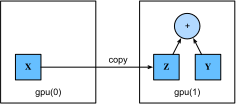

```{.python .input}
%load_ext d2lbook.tab
tab.interact_select(['mxnet', 'pytorch', 'tensorflow', 'jax'])
```

# GPU
:label:`sec_use_gpu`

Dans :numref:`tab_intro_decade`, nous avons illustré la croissance rapide du calcul au cours des deux dernières décennies. En résumé, les performances des GPU ont été multipliées par 1000 chaque décennie depuis 2000. Cela offre de grandes opportunités, mais suggère également qu'il existait une demande importante pour de telles performances.

Dans cette section, nous commençons à discuter de la manière d'exploiter cette performance de calcul pour vos recherches. D'abord en utilisant un seul GPU et, plus tard, comment utiliser plusieurs GPU et plusieurs serveurs (avec plusieurs GPU).

Plus précisément, nous verrons comment utiliser un seul GPU NVIDIA pour les calculs. Tout d'abord, assurez-vous d'avoir au moins un GPU NVIDIA installé. Ensuite, téléchargez le [pilote NVIDIA et CUDA](https://developer.nvidia.com/cuda-downloads) et suivez les instructions pour définir le chemin approprié. Une fois ces préparatifs terminés, la commande `nvidia-smi` peut être utilisée pour (**afficher les informations de la carte graphique**).

:begin_tab:`mxnet`
Vous avez peut-être remarqué qu'un tenseur MXNet semble presque identique à un `ndarray` NumPy. Mais il y a quelques différences cruciales. L'une des caractéristiques clés qui distingue MXNet de NumPy est sa prise en charge de divers périphériques matériels.

Dans MXNet, chaque tableau possède un contexte. Jusqu'à présent, par défaut, toutes les variables et les calculs associés ont été affectés au CPU. Typiquement, d'autres contextes peuvent être divers GPU. Les choses peuvent devenir encore plus complexes lorsque nous déployons des tâches sur plusieurs serveurs. En affectant intelligemment les tableaux aux contextes, nous pouvons minimiser le temps passé à transférer des données entre les périphériques. Par exemple, lors de l'entraînement de réseaux de neurones sur un serveur avec un GPU, nous préférons généralement que les paramètres du modèle résident sur le GPU.

Ensuite, nous devons confirmer que la version GPU de MXNet est installée. Si une version CPU de MXNet est déjà installée, nous devons d'abord la désinstaller. Par exemple, utilisez la commande `pip uninstall mxnet`, puis installez la version MXNet correspondante en fonction de votre version de CUDA. En supposant que CUDA 10.0 soit installé, vous pouvez installer la version de MXNet qui prend en charge CUDA 10.0 via `pip install mxnet-cu100`.
:end_tab:

:begin_tab:`pytorch`
Dans PyTorch, chaque tableau possède un périphérique (device) ; nous y faisons souvent référence en tant que *contexte*. Jusqu'à présent, par défaut, toutes les variables et les calculs associés ont été affectés au CPU. Typiquement, d'autres contextes peuvent être divers GPU. Les choses peuvent devenir encore plus complexes lorsque nous déployons des tâches sur plusieurs serveurs. En affectant intelligemment les tableaux aux contextes, nous pouvons minimiser le temps passé à transférer des données entre les périphériques. Par exemple, lors de l'entraînement de réseaux de neurones sur un serveur avec un GPU, nous préférons généralement que les paramètres du modèle résident sur le GPU.
:end_tab:

Pour exécuter les programmes de cette section, vous avez besoin d'au moins deux GPU. Notez que cela peut paraître extravagant pour la plupart des ordinateurs de bureau, mais c'est facilement accessible dans le cloud, par exemple en utilisant les instances multi-GPU d'AWS EC2. Presque toutes les autres sections ne nécessitent *pas* plusieurs GPU, mais ici nous souhaitons simplement illustrer le flux de données entre différents périphériques.

```{.python .input}
%%tab mxnet
from d2l import mxnet as d2l
from mxnet import np, npx
from mxnet.gluon import nn
npx.set_np()
```

```{.python .input}
%%tab pytorch
from d2l import torch as d2l
import torch
from torch import nn
```

```{.python .input}
%%tab tensorflow
from d2l import tensorflow as d2l
import tensorflow as tf
```

```{.python .input}
%%tab jax
from d2l import jax as d2l
from flax import linen as nn
import jax
from jax import numpy as jnp
```

## [**Unités de calcul**]

Nous pouvons spécifier des périphériques, tels que les CPU et les GPU, pour le stockage et le calcul. Par défaut, les tenseurs sont créés dans la mémoire principale, puis le CPU est utilisé pour les calculs.

:begin_tab:`mxnet`
Dans MXNet, le CPU et le GPU peuvent être indiqués par `cpu()` et `gpu()`. Il convient de noter que `cpu()` (ou tout entier entre parenthèses) désigne tous les CPU physiques et la mémoire. Cela signifie que les calculs de MXNet essaieront d'utiliser tous les cœurs du CPU. Cependant, `gpu()` ne représente qu'une seule carte et la mémoire correspondante. S'il y a plusieurs GPU, nous utilisons `gpu(i)` pour représenter le $i^\textrm{ème}$ GPU ($i$ commence à 0). De plus, `gpu(0)` et `gpu()` sont équivalents.
:end_tab:

:begin_tab:`pytorch`
Dans PyTorch, le CPU et le GPU peuvent être indiqués par `torch.device('cpu')` and `torch.device('cuda')`. Il convient de noter que le périphérique `cpu` désigne tous les CPU physiques et la mémoire. Cela signifie que les calculs de PyTorch essaieront d'utiliser tous les cœurs du CPU. Cependant, un périphérique `gpu` ne représente qu'une seule carte et la mémoire correspondante. S'il y a plusieurs GPU, nous utilisons `torch.device(f'cuda:{i}')` pour représenter le $i^\textrm{ème}$ GPU ($i$ commence à 0). De plus, `gpu:0` et `gpu` sont équivalents.
:end_tab:

```{.python .input}
%%tab pytorch
def cpu():  #@save
    """Get the CPU device."""
    return torch.device('cpu')

def gpu(i=0):  #@save
    """Get a GPU device."""
    return torch.device(f'cuda:{i}')

cpu(), gpu(), gpu(1)
```

```{.python .input}
%%tab mxnet, tensorflow, jax
def cpu():  #@save
    """Get the CPU device."""
    if tab.selected('mxnet'):
        return npx.cpu()
    if tab.selected('tensorflow'):
        return tf.device('/CPU:0')
    if tab.selected('jax'):
        return jax.devices('cpu')[0]

def gpu(i=0):  #@save
    """Get a GPU device."""
    if tab.selected('mxnet'):
        return npx.gpu(i)
    if tab.selected('tensorflow'):
        return tf.device(f'/GPU:{i}')
    if tab.selected('jax'):
        return jax.devices('gpu')[i]

cpu(), gpu(), gpu(1)
```

Nous pouvons (**interroger le nombre de GPU disponibles.**)

```{.python .input}
%%tab pytorch
def num_gpus():  #@save
    """Get the number of available GPUs."""
    return torch.cuda.device_count()

num_gpus()
```

```{.python .input}
%%tab mxnet, tensorflow, jax
def num_gpus():  #@save
    """Get the number of available GPUs."""
    if tab.selected('mxnet'):
        return npx.num_gpus()
    if tab.selected('tensorflow'):
        return len(tf.config.experimental.list_physical_devices('GPU'))
    if tab.selected('jax'):
        try:
            return jax.device_count('gpu')
        except:
            return 0  # No GPU backend found

num_gpus()
```

Nous [**définissons maintenant deux fonctions pratiques qui nous permettent d'exécuter du code même si les GPU demandés n'existent pas.**]

```{.python .input}
%%tab all
def try_gpu(i=0):  #@save
    """Return gpu(i) if exists, otherwise return cpu()."""
    if num_gpus() >= i + 1:
        return gpu(i)
    return cpu()

def try_all_gpus():  #@save
    """Return all available GPUs, or [cpu(),] if no GPU exists."""
    return [gpu(i) for i in range(num_gpus())]

try_gpu(), try_gpu(10), try_all_gpus()
```

## Tenseurs et GPU

:begin_tab:`pytorch`
Par défaut, les tenseurs sont créés sur le CPU. Nous pouvons [**interroger le périphérique où se trouve le tenseur.**]
:end_tab:

:begin_tab:`mxnet`
Par défaut, les tenseurs sont créés sur le CPU. Nous pouvons [**interroger le périphérique où se trouve le tenseur.**]
:end_tab:

:begin_tab:`tensorflow, jax`
Par défaut, les tenseurs sont créés sur le GPU/TPU s'ils sont disponibles, sinon le CPU est utilisé. Nous pouvons [**interroger le périphérique où se trouve le tenseur.**]
:end_tab:

```{.python .input}
%%tab mxnet
x = np.array([1, 2, 3])
x.ctx
```

```{.python .input}
%%tab pytorch
x = torch.tensor([1, 2, 3])
x.device
```

```{.python .input}
%%tab tensorflow
x = tf.constant([1, 2, 3])
x.device
```

```{.python .input}
%%tab jax
x = jnp.array([1, 2, 3])
x.device()
```

Il est important de noter que chaque fois que nous voulons opérer sur plusieurs termes, ils doivent se trouver sur le même périphérique. Par exemple, si nous additionnons deux tenseurs, nous devons nous assurer que les deux arguments résident sur le même périphérique ; sinon, le framework ne saurait pas où stocker le résultat ni même comment décider où effectuer le calcul.

### Stockage sur le GPU

Il existe plusieurs façons de [**stocker un tenseur sur le GPU.**] Par exemple, nous pouvons spécifier un périphérique de stockage lors de la création d'un tenseur. Ensuite, nous créons la variable tenseur `X` sur le premier `gpu`. Le tenseur créé sur un GPU ne consomme que la mémoire de ce GPU. Nous pouvons utiliser la commande `nvidia-smi` pour visualiser l'utilisation de la mémoire du GPU. En général, nous devons nous assurer de ne pas créer de données dépassant la limite de mémoire du GPU.

```{.python .input}
%%tab mxnet
X = np.ones((2, 3), ctx=try_gpu())
X
```

```{.python .input}
%%tab pytorch
X = torch.ones(2, 3, device=try_gpu())
X
```

```{.python .input}
%%tab tensorflow
with try_gpu():
    X = tf.ones((2, 3))
X
```

```{.python .input}
%%tab jax
# By default JAX puts arrays to GPUs or TPUs if available
X = jax.device_put(jnp.ones((2, 3)), try_gpu())
X
```

En supposant que vous ayez au moins deux GPU, le code suivant va (**créer un tenseur aléatoire, `Y`, sur le deuxième GPU.**)

```{.python .input}
%%tab mxnet
Y = np.random.uniform(size=(2, 3), ctx=try_gpu(1))
Y
```

```{.python .input}
%%tab pytorch
Y = torch.rand(2, 3, device=try_gpu(1))
Y
```

```{.python .input}
%%tab tensorflow
with try_gpu(1):
    Y = tf.random.uniform((2, 3))
Y
```

```{.python .input}
%%tab jax
Y = jax.device_put(jax.random.uniform(jax.random.PRNGKey(0), (2, 3)),
                   try_gpu(1))
Y
```

### Copie

[**Si nous voulons calculer `X + Y`, nous devons décider où effectuer cette opération.**] Par exemple, comme le montre la :numref:`fig_copyto`, nous pouvons transférer `X` vers le deuxième GPU et y effectuer l'opération. *N'ajoutez pas* simplement `X` et `Y`, car cela entraînerait une exception. Le moteur d'exécution ne saurait pas quoi faire : il ne peut pas trouver de données sur le même périphérique et il échoue. Puisque `Y` réside sur le deuxième GPU, nous devons y déplacer `X` avant de pouvoir additionner les deux.


:label:`fig_copyto`

```{.python .input}
%%tab mxnet
Z = X.copyto(try_gpu(1))
print(X)
print(Z)
```

```{.python .input}
%%tab pytorch
Z = X.cuda(1)
print(X)
print(Z)
```

```{.python .input}
%%tab tensorflow
with try_gpu(1):
    Z = X
print(X)
print(Z)
```

```{.python .input}
%%tab jax
Z = jax.device_put(X, try_gpu(1))
print(X)
print(Z)
```

Maintenant que [**les données (`Z` et `Y`) sont sur le même GPU, nous pouvons les additionner.**]

```{.python .input}
%%tab all
Y + Z
```

:begin_tab:`mxnet`
Imaginez que votre variable `Z` réside déjà sur votre deuxième GPU. Que se passe-t-il si nous appelons toujours `Z.copyto(gpu(1))` ? Cela fera une copie et allouera une nouvelle mémoire, même si cette variable réside déjà sur le périphérique souhaité. Il arrive parfois que, selon l'environnement dans lequel notre code s'exécute, deux variables résident déjà sur le même périphérique. Nous voulons donc faire une copie uniquement si les variables résident actuellement dans des périphériques différents. Dans ces cas, nous pouvons appeler `as_in_ctx`. Si la variable réside déjà dans le périphérique spécifié, il s'agit alors d'une opération nulle (no-op). À moins que vous ne souhaitiez spécifiquement faire une copie, `as_in_ctx` est la méthode de choix.
:end_tab:

:begin_tab:`pytorch`
Mais que se passe-t-il si votre variable `Z` résidait déjà sur votre deuxième GPU ? Que se passe-t-il si nous appelons toujours `Z.cuda(1)` ? Cela renverra `Z` au lieu de faire une copie et d'allouer une nouvelle mémoire.
:end_tab:

:begin_tab:`tensorflow`
Imaginez que votre variable `Z` réside déjà sur votre deuxième GPU. Que se passe-t-il si nous appelons toujours `Z2 = Z` sous le même contexte de périphérique ? Cela renverra `Z` au lieu de faire une copie et d'allouer une nouvelle mémoire.
:end_tab:

:begin_tab:`jax`
Imaginez que votre variable `Z` réside déjà sur votre deuxième GPU. Que se passe-t-il si nous appelons toujours `Z2 = Z` sous le même contexte de périphérique ? Cela renverra `Z` au lieu de faire une copie et d'allouer une nouvelle mémoire.
:end_tab:

```{.python .input}
%%tab mxnet
Z.as_in_ctx(try_gpu(1)) is Z
```

```{.python .input}
%%tab pytorch
Z.cuda(1) is Z
```

```{.python .input}
%%tab tensorflow
with try_gpu(1):
    Z2 = Z
Z2 is Z
```

```{.python .input}
%%tab jax
Z2 = jax.device_put(Z, try_gpu(1))
Z2 is Z
```

### Remarques annexes

Les gens utilisent les GPU pour faire de l'apprentissage automatique parce qu'ils s'attendent à ce qu'ils soient rapides. Mais le transfert de variables entre périphériques est lent : bien plus lent que le calcul. Nous voulons donc que vous soyez sûr à 100 % de vouloir faire quelque chose de lent avant de vous laisser le faire. Si le framework d'apprentissage profond effectuait simplement la copie automatiquement sans planter, vous ne vous rendriez peut-être pas compte que vous avez écrit du code lent.

Le transfert de données est non seulement lent, mais il rend également la parallélisation beaucoup plus difficile, car nous devons attendre que les données soient envoyées (ou plutôt reçues) avant de pouvoir procéder à d'autres opérations. C'est pourquoi les opérations de copie doivent être effectuées avec grand soin. En règle générale, de nombreuses petites opérations sont bien pires qu'une seule grande opération. De plus, plusieurs opérations à la fois valent bien mieux que de nombreuses opérations individuelles parsemées dans le code, à moins que vous ne sachiez ce que vous faites. C'est le cas car de telles opérations peuvent bloquer si un périphérique doit attendre l'autre avant de pouvoir faire autre chose. C'est un peu comme commander son café dans une file d'attente plutôt que de le pré-commander par téléphone et de découvrir qu'il est prêt quand vous l'êtes.

Enfin, lorsque nous affichons des tenseurs ou convertissons des tenseurs au format NumPy, si les données ne sont pas dans la mémoire principale, le framework les copiera d'abord dans la mémoire principale, ce qui entraînera une surcharge de transmission supplémentaire. Pire encore, c'est désormais sujet au redoutable verrou global de l'interprète (GIL) qui fait que tout attend que Python termine.


## [**Réseaux de neurones et GPU**]

De même, un modèle de réseau de neurones peut spécifier des périphériques. Le code suivant place les paramètres du modèle sur le GPU.

```{.python .input}
%%tab mxnet
net = nn.Sequential()
net.add(nn.Dense(1))
net.initialize(ctx=try_gpu())
```

```{.python .input}
%%tab pytorch
net = nn.Sequential(nn.LazyLinear(1))
net = net.to(device=try_gpu())
```

```{.python .input}
%%tab tensorflow
strategy = tf.distribute.MirroredStrategy()
with strategy.scope():
    net = tf.keras.models.Sequential([
        tf.keras.layers.Dense(1)])
```

```{.python .input}
%%tab jax
net = nn.Sequential([nn.Dense(1)])

key1, key2 = jax.random.split(jax.random.PRNGKey(0))
x = jax.random.normal(key1, (10,))  # Dummy input
params = net.init(key2, x)  # Initialization call
```

Nous verrons beaucoup plus d'exemples de la façon d'exécuter des modèles sur des GPU dans les chapitres suivants, simplement parce que les modèles deviendront un peu plus intensifs en calcul.

Par exemple, lorsque l'entrée est un tenseur sur le GPU, le modèle calculera le résultat sur le même GPU.

```{.python .input}
%%tab mxnet, pytorch, tensorflow
net(X)
```

```{.python .input}
%%tab jax
net.apply(params, x)
```

Confirmons (**que les paramètres du modèle sont stockés sur le même GPU.**)

```{.python .input}
%%tab mxnet
net[0].weight.data().ctx
```

```{.python .input}
%%tab pytorch
net[0].weight.data.device
```

```{.python .input}
%%tab tensorflow
net.layers[0].weights[0].device, net.layers[0].weights[1].device
```

```{.python .input}
%%tab jax
print(jax.tree_util.tree_map(lambda x: x.device(), params))
```

Laissons l'entraîneur (trainer) prendre en charge le GPU.

```{.python .input}
%%tab mxnet
@d2l.add_to_class(d2l.Module)  #@save
def set_scratch_params_device(self, device):
    for attr in dir(self):
        a = getattr(self, attr)
        if isinstance(a, np.ndarray):
            with autograd.record():
                setattr(self, attr, a.as_in_ctx(device))
            getattr(self, attr).attach_grad()
        if isinstance(a, d2l.Module):
            a.set_scratch_params_device(device)
        if isinstance(a, list):
            for elem in a:
                elem.set_scratch_params_device(device)
```

```{.python .input}
%%tab mxnet, pytorch
@d2l.add_to_class(d2l.Trainer)  #@save
def __init__(self, max_epochs, num_gpus=0, gradient_clip_val=0):
    self.save_hyperparameters()
    self.gpus = [d2l.gpu(i) for i in range(min(num_gpus, d2l.num_gpus()))]

@d2l.add_to_class(d2l.Trainer)  #@save
def prepare_batch(self, batch):
    if self.gpus:
        batch = [d2l.to(a, self.gpus[0]) for a in batch]
    return batch

@d2l.add_to_class(d2l.Trainer)  #@save
def prepare_model(self, model):
    model.trainer = self
    model.board.xlim = [0, self.max_epochs]
    if self.gpus:
        if tab.selected('mxnet'):
            model.collect_params().reset_ctx(self.gpus[0])
            model.set_scratch_params_device(self.gpus[0])
        if tab.selected('pytorch'):
            model.to(self.gpus[0])
    self.model = model
```

```{.python .input}
%%tab jax
@d2l.add_to_class(d2l.Trainer)  #@save
def __init__(self, max_epochs, num_gpus=0, gradient_clip_val=0):
    self.save_hyperparameters()
    self.gpus = [d2l.gpu(i) for i in range(min(num_gpus, d2l.num_gpus()))]

@d2l.add_to_class(d2l.Trainer)  #@save
def prepare_batch(self, batch):
    if self.gpus:
        batch = [d2l.to(a, self.gpus[0]) for a in batch]
    return batch
```

En bref, tant que toutes les données et tous les paramètres sont sur le même périphérique, nous pouvons apprendre des modèles efficacement. Dans les chapitres suivants, nous verrons plusieurs de ces exemples.

## Résumé

Nous pouvons spécifier des périphériques pour le stockage et le calcul, tels que le CPU ou le GPU. Par défaut, les données sont créées dans la mémoire principale, puis utilisent le CPU pour les calculs. Le framework d'apprentissage profond exige que toutes les données d'entrée pour le calcul se trouvent sur le même périphérique, qu'il s'agisse du CPU ou du même GPU. Vous pouvez perdre des performances significatives en déplaçant des données sans précaution. Une erreur typique est la suivante : calculer la perte pour chaque mini-lot sur le GPU et la rapporter à l'utilisateur sur la ligne de commande (ou l'enregistrer dans un `ndarray` NumPy) déclenchera un verrou global de l'interprète qui bloquera tous les GPU. Il est bien préférable d'allouer de la mémoire pour la journalisation à l'intérieur du GPU et de ne déplacer que les journaux plus volumineux.

## Exercices

1. Essayez une tâche de calcul plus importante, telle que la multiplication de grandes matrices, et voyez la différence de vitesse entre le CPU et le GPU. Qu'en est-il d'une tâche avec un petit nombre de calculs ?
1. Comment devrions-nous lire et écrire les paramètres du modèle sur le GPU ?
1. Mesurez le temps nécessaire pour effectuer 1000 multiplications matrice-matrice de matrices $100 \times 100$ et enregistrez la norme de Frobenius de la matrice de sortie un résultat à la fois. Comparez cela avec la conservation d'un journal sur le GPU et le transfert du seul résultat final.
1. Mesurez le temps nécessaire pour effectuer deux multiplications matrice-matrice sur deux GPU en même temps. Comparez-le au calcul en séquence sur un seul GPU. Indice : vous devriez voir une mise à l'échelle presque linéaire.

:begin_tab:`mxnet`
[Discussions](https://discuss.d2l.ai/t/62)
:end_tab:

:begin_tab:`pytorch`
[Discussions](https://discuss.d2l.ai/t/63)
:end_tab:

:begin_tab:`tensorflow`
[Discussions](https://discuss.d2l.ai/t/270)
:end_tab:

:begin_tab:`jax`
[Discussions](https://discuss.d2l.ai/t/17995)
:end_tab:
