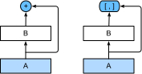
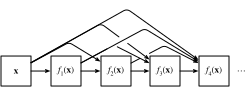

```{.python .input}
%load_ext d2lbook.tab
tab.interact_select(['mxnet', 'pytorch', 'tensorflow', 'jax'])
```

# Réseaux à connexions denses (DenseNet)
:label:`sec_densenet`

ResNet a considérablement changé la vision de la manière de paramétrer les fonctions dans les réseaux profonds. *DenseNet* (réseau convolutif dense) est dans une certaine mesure l'extension logique de ceci :cite:`Huang.Liu.Van-Der-Maaten.ea.2017`.
DenseNet se caractérise à la fois par le schéma de connectivité où chaque couche se connecte à toutes les couches précédentes et par l'opération de concaténation (plutôt que l'opérateur d'addition dans ResNet) pour préserver et réutiliser les caractéristiques des couches antérieures.
Pour comprendre comment y parvenir, faisons un petit détour par les mathématiques.

```{.python .input}
%%tab mxnet
from d2l import mxnet as d2l
from mxnet import init, np, npx
from mxnet.gluon import nn
npx.set_np()
```

```{.python .input}
%%tab pytorch
from d2l import torch as d2l
import torch
from torch import nn
```

```{.python .input}
%%tab tensorflow
from d2l import tensorflow as d2l
import tensorflow as tf
```

```{.python .input}
%%tab jax
from d2l import jax as d2l
from flax import linen as nn
from jax import numpy as jnp
import jax
```

## De ResNet à DenseNet

Rappelez-vous le développement de Taylor pour les fonctions. Au point $x = 0$, il peut s'écrire comme

$$f(x) = f(0) + x \cdot \left[f'(0) + x \cdot \left[\frac{f''(0)}{2!}  + x \cdot \left[\frac{f'''(0)}{3!}  + \cdots \right]\right]\right].$$


Le point clé est qu'il décompose une fonction en termes d'ordre de plus en plus élevé. Dans le même esprit, ResNet décompose les fonctions en

$$f(\mathbf{x}) = \mathbf{x} + g(\mathbf{x}).$$

C'est-à-dire que ResNet décompose $f$ en un terme linéaire simple et un terme non linéaire plus complexe.
Et si nous voulions capturer (pas nécessairement ajouter) des informations au-delà de deux termes ?
Une telle solution est DenseNet :cite:`Huang.Liu.Van-Der-Maaten.ea.2017`.


:label:`fig_densenet_block`

Comme le montre la :numref:`fig_densenet_block`, la principale différence entre ResNet et DenseNet est que dans ce dernier cas, les sorties sont *concaténées* (notées $[,]$) plutôt qu'ajoutées.
En conséquence, nous effectuons un mappage de $\mathbf{x}$ vers ses valeurs après avoir appliqué une séquence de fonctions de plus en plus complexes :

$$\mathbf{x} \to \left[
\mathbf{x},
f_1(\mathbf{x}),
f_2\left(\left[\mathbf{x}, f_1\left(\mathbf{x}\right)\right]\right), f_3\left(\left[\mathbf{x}, f_1\left(\mathbf{x}\right), f_2\left(\left[\mathbf{x}, f_1\left(\mathbf{x}\right)\right]\right)\right]\right), \ldots\right].$$

À la fin, toutes ces fonctions sont combinées dans un MLP pour réduire à nouveau le nombre de caractéristiques. En termes d'implémentation, c'est assez simple :
plutôt que d'ajouter des termes, nous les concaténons. Le nom DenseNet vient du fait que le graphe de dépendance entre les variables devient assez dense. La dernière couche d'une telle chaîne est densément connectée à toutes les couches précédentes. Les connexions denses sont illustrées dans la :numref:`fig_densenet`.


:label:`fig_densenet`

Les principaux composants qui constituent un DenseNet sont les *blocs denses* (dense blocks) et les *couches de transition* (transition layers). Les premiers définissent comment les entrées et les sorties sont concaténées, tandis que les secondes contrôlent le nombre de canaux afin qu'il ne soit pas trop important, 
puisque l'expansion $\mathbf{x} \to \left[\mathbf{x}, f_1(\mathbf{x}),
f_2\left(\left[\mathbf{x}, f_1\left(\mathbf{x}\right)\right]\right), \ldots \right]$ peut être de dimension assez élevée.


## [**Blocs denses**]

DenseNet utilise la structure modifiée « normalisation par lots, activation et convolution » de ResNet (voir l'exercice de la :numref:`sec_resnet`).
Tout d'abord, nous implémentons cette structure de bloc de convolution.

```{.python .input}
%%tab mxnet
def conv_block(num_channels):
    blk = nn.Sequential()
    blk.add(nn.BatchNorm(),
            nn.Activation('relu'),
            nn.Conv2D(num_channels, kernel_size=3, padding=1))
    return blk
```

```{.python .input}
%%tab pytorch
def conv_block(num_channels):
    return nn.Sequential(
        nn.LazyBatchNorm2d(), nn.ReLU(),
        nn.LazyConv2d(num_channels, kernel_size=3, padding=1))
```

```{.python .input}
%%tab tensorflow
class ConvBlock(tf.keras.layers.Layer):
    def __init__(self, num_channels):
        super(ConvBlock, self).__init__()
        self.bn = tf.keras.layers.BatchNormalization()
        self.relu = tf.keras.layers.ReLU()
        self.conv = tf.keras.layers.Conv2D(
            filters=num_channels, kernel_size=(3, 3), padding='same')

        self.listLayers = [self.bn, self.relu, self.conv]

    def call(self, x):
        y = x
        for layer in self.listLayers.layers:
            y = layer(y)
        y = tf.keras.layers.concatenate([x,y], axis=-1)
        return y
```

```{.python .input}
%%tab jax
class ConvBlock(nn.Module):
    num_channels: int
    training: bool = True

    @nn.compact
    def __call__(self, X):
        Y = nn.relu(nn.BatchNorm(not self.training)(X))
        Y = nn.Conv(self.num_channels, kernel_size=(3, 3), padding=(1, 1))(Y)
        Y = jnp.concatenate((X, Y), axis=-1)
        return Y
```

Un *bloc dense* se compose de plusieurs blocs de convolution, chacun utilisant le même nombre de canaux de sortie. Lors de la propagation vers l'avant, nous concaténons cependant l'entrée et la sortie de chaque bloc de convolution sur la dimension des canaux. L'évaluation paresseuse (*lazy evaluation*) nous permet d'ajuster automatiquement la dimensionnalité.

```{.python .input}
%%tab mxnet
class DenseBlock(nn.Block):
    def __init__(self, num_convs, num_channels):
        super().__init__()
        self.net = nn.Sequential()
        for _ in range(num_convs):
            self.net.add(conv_block(num_channels))

    def forward(self, X):
        for blk in self.net:
            Y = blk(X)
            # Concatenate input and output of each block along the channels
            X = np.concatenate((X, Y), axis=1)
        return X
```

```{.python .input}
%%tab pytorch
class DenseBlock(nn.Module):
    def __init__(self, num_convs, num_channels):
        super(DenseBlock, self).__init__()
        layer = []
        for i in range(num_convs):
            layer.append(conv_block(num_channels))
        self.net = nn.Sequential(*layer)

    def forward(self, X):
        for blk in self.net:
            Y = blk(X)
            # Concatenate input and output of each block along the channels
            X = torch.cat((X, Y), dim=1)
        return X
```

```{.python .input}
%%tab tensorflow
class DenseBlock(tf.keras.layers.Layer):
    def __init__(self, num_convs, num_channels):
        super(DenseBlock, self).__init__()
        self.listLayers = []
        for _ in range(num_convs):
            self.listLayers.append(ConvBlock(num_channels))

    def call(self, x):
        for layer in self.listLayers.layers:
            x = layer(x)
        return x
```

```{.python .input}
%%tab jax
class DenseBlock(nn.Module):
    num_convs: int
    num_channels: int
    training: bool = True

    def setup(self):
        layer = []
        for i in range(self.num_convs):
            layer.append(ConvBlock(self.num_channels, self.training))
        self.net = nn.Sequential(layer)

    def __call__(self, X):
        return self.net(X)
```

Dans l'exemple suivant, nous [**définissons une instance de `DenseBlock`**] avec deux blocs de convolution de 10 canaux de sortie. En utilisant une entrée à trois canaux, nous obtiendrons une sortie à $3 + 10 + 10=23$ canaux. Le nombre de canaux des blocs de convolution contrôle la croissance du nombre de canaux de sortie par rapport au nombre de canaux d'entrée. C'est ce qu'on appelle aussi le *taux de croissance* (*growth rate*).

```{.python .input}
%%tab pytorch, mxnet, tensorflow
blk = DenseBlock(2, 10)
if tab.selected('mxnet'):
    X = np.random.uniform(size=(4, 3, 8, 8))
    blk.initialize()
if tab.selected('pytorch'):
    X = torch.randn(4, 3, 8, 8)
if tab.selected('tensorflow'):
    X = tf.random.uniform((4, 8, 8, 3))
Y = blk(X)
Y.shape
```

```{.python .input}
%%tab jax
blk = DenseBlock(2, 10)
X = jnp.zeros((4, 8, 8, 3))
Y = blk.init_with_output(d2l.get_key(), X)[0]
Y.shape
```

## [**Couches de transition**]

Comme chaque bloc dense augmentera le nombre de canaux, en ajouter trop conduira à un modèle excessivement complexe. Une *couche de transition* est utilisée pour contrôler la complexité du modèle. Elle réduit le nombre de canaux en utilisant une convolution $1\times 1$. De plus, elle divise par deux la hauteur et la largeur via un pooling moyen (*average pooling*) avec une foulée (*stride*) de 2.

```{.python .input}
%%tab mxnet
def transition_block(num_channels):
    blk = nn.Sequential()
    blk.add(nn.BatchNorm(), nn.Activation('relu'),
            nn.Conv2D(num_channels, kernel_size=1),
            nn.AvgPool2D(pool_size=2, strides=2))
    return blk
```

```{.python .input}
%%tab pytorch
def transition_block(num_channels):
    return nn.Sequential(
        nn.LazyBatchNorm2d(), nn.ReLU(),
        nn.LazyConv2d(num_channels, kernel_size=1),
        nn.AvgPool2d(kernel_size=2, stride=2))
```

```{.python .input}
%%tab tensorflow
class TransitionBlock(tf.keras.layers.Layer):
    def __init__(self, num_channels, **kwargs):
        super(TransitionBlock, self).__init__(**kwargs)
        self.batch_norm = tf.keras.layers.BatchNormalization()
        self.relu = tf.keras.layers.ReLU()
        self.conv = tf.keras.layers.Conv2D(num_channels, kernel_size=1)
        self.avg_pool = tf.keras.layers.AvgPool2D(pool_size=2, strides=2)

    def call(self, x):
        x = self.batch_norm(x)
        x = self.relu(x)
        x = self.conv(x)
        return self.avg_pool(x)
```

```{.python .input}
%%tab jax
class TransitionBlock(nn.Module):
    num_channels: int
    training: bool = True

    @nn.compact
    def __call__(self, X):
        X = nn.BatchNorm(not self.training)(X)
        X = nn.relu(X)
        X = nn.Conv(self.num_channels, kernel_size=(1, 1))(X)
        X = nn.avg_pool(X, window_shape=(2, 2), strides=(2, 2))
        return X
```

[**Appliquez une couche de transition**] avec 10 canaux à la sortie du bloc dense de l'exemple précédent. Cela réduit le nombre de canaux de sortie à 10 et divise par deux la hauteur et la largeur.

```{.python .input}
%%tab mxnet
blk = transition_block(10)
blk.initialize()
blk(Y).shape
```

```{.python .input}
%%tab pytorch
blk = transition_block(10)
blk(Y).shape
```

```{.python .input}
%%tab tensorflow
blk = TransitionBlock(10)
blk(Y).shape
```

```{.python .input}
%%tab jax
blk = TransitionBlock(10)
blk.init_with_output(d2l.get_key(), Y)[0].shape
```

## [**Modèle DenseNet**]

Ensuite, nous allons construire un modèle DenseNet. DenseNet utilise d'abord la même couche convolutive unique et la même couche de max-pooling que dans ResNet.

```{.python .input}
%%tab pytorch, mxnet, tensorflow
class DenseNet(d2l.Classifier):
    def b1(self):
        if tab.selected('mxnet'):
            net = nn.Sequential()
            net.add(nn.Conv2D(64, kernel_size=7, strides=2, padding=3),
                nn.BatchNorm(), nn.Activation('relu'),
                nn.MaxPool2D(pool_size=3, strides=2, padding=1))
            return net
        if tab.selected('pytorch'):
            return nn.Sequential(
                nn.LazyConv2d(64, kernel_size=7, stride=2, padding=3),
                nn.LazyBatchNorm2d(), nn.ReLU(),
                nn.MaxPool2d(kernel_size=3, stride=2, padding=1))
        if tab.selected('tensorflow'):
            return tf.keras.models.Sequential([
                tf.keras.layers.Conv2D(
                    64, kernel_size=7, strides=2, padding='same'),
                tf.keras.layers.BatchNormalization(),
                tf.keras.layers.ReLU(),
                tf.keras.layers.MaxPool2D(
                    pool_size=3, strides=2, padding='same')])
```

```{.python .input}
%%tab jax
class DenseNet(d2l.Classifier):
    num_channels: int = 64
    growth_rate: int = 32
    arch: tuple = (4, 4, 4, 4)
    lr: float = 0.1
    num_classes: int = 10
    training: bool = True

    def setup(self):
        self.net = self.create_net()

    def b1(self):
        return nn.Sequential([
            nn.Conv(64, kernel_size=(7, 7), strides=(2, 2), padding='same'),
            nn.BatchNorm(not self.training),
            nn.relu,
            lambda x: nn.max_pool(x, window_shape=(3, 3),
                                  strides=(2, 2), padding='same')
        ])
```

Ensuite, tout comme les quatre modules composés de blocs résiduels utilisés par ResNet, DenseNet utilise quatre blocs denses. Comme pour ResNet, nous pouvons définir le nombre de couches convolutives utilisées dans chaque bloc dense. Ici, nous le fixons à 4, conformément au modèle ResNet-18 de la :numref:`sec_resnet`. De plus, nous fixons le nombre de canaux (c'est-à-dire le taux de croissance) des couches convolutives du bloc dense à 32, de sorte que 128 canaux seront ajoutés à chaque bloc dense.

Dans ResNet, la hauteur et la largeur sont réduites entre chaque module par un bloc résiduel avec une foulée de 2. Ici, nous utilisons la couche de transition pour diviser par deux la hauteur et la largeur et diviser par deux le nombre de canaux. Semblable à ResNet, une couche de pooling global et une couche entièrement connectée sont connectées à la fin pour produire la sortie.

```{.python .input}
%%tab pytorch, mxnet, tensorflow
@d2l.add_to_class(DenseNet)
def __init__(self, num_channels=64, growth_rate=32, arch=(4, 4, 4, 4),
             lr=0.1, num_classes=10):
    super(DenseNet, self).__init__()
    self.save_hyperparameters()
    if tab.selected('mxnet'):
        self.net = nn.Sequential()
        self.net.add(self.b1())
        for i, num_convs in enumerate(arch):
            self.net.add(DenseBlock(num_convs, growth_rate))
            # The number of output channels in the previous dense block
            num_channels += num_convs * growth_rate
            # A transition layer that halves the number of channels is added
            # between the dense blocks
            if i != len(arch) - 1:
                num_channels //= 2
                self.net.add(transition_block(num_channels))
        self.net.add(nn.BatchNorm(), nn.Activation('relu'),
                     nn.GlobalAvgPool2D(), nn.Dense(num_classes))
        self.net.initialize(init.Xavier())
    if tab.selected('pytorch'):
        self.net = nn.Sequential(self.b1())
        for i, num_convs in enumerate(arch):
            self.net.add_module(f'dense_blk{i+1}', DenseBlock(num_convs,
                                                              growth_rate))
            # The number of output channels in the previous dense block
            num_channels += num_convs * growth_rate
            # A transition layer that halves the number of channels is added
            # between the dense blocks
            if i != len(arch) - 1:
                num_channels //= 2
                self.net.add_module(f'tran_blk{i+1}', transition_block(
                    num_channels))
        self.net.add_module('last', nn.Sequential(
            nn.LazyBatchNorm2d(), nn.ReLU(),
            nn.AdaptiveAvgPool2d((1, 1)), nn.Flatten(),
            nn.LazyLinear(num_classes)))
        self.net.apply(d2l.init_cnn)
    if tab.selected('tensorflow'):
        self.net = tf.keras.models.Sequential(self.b1())
        for i, num_convs in enumerate(arch):
            self.net.add(DenseBlock(num_convs, growth_rate))
            # The number of output channels in the previous dense block
            num_channels += num_convs * growth_rate
            # A transition layer that halves the number of channels is added
            # between the dense blocks
            if i != len(arch) - 1:
                num_channels //= 2
                self.net.add(TransitionBlock(num_channels))
        self.net.add(tf.keras.models.Sequential([
            tf.keras.layers.BatchNormalization(),
            tf.keras.layers.ReLU(),
            tf.keras.layers.GlobalAvgPool2D(),
            tf.keras.layers.Flatten(),
            tf.keras.layers.Dense(num_classes)]))
```

```{.python .input}
%%tab jax
@d2l.add_to_class(DenseNet)
def create_net(self):
    net = self.b1()
    for i, num_convs in enumerate(self.arch):
        net.layers.extend([DenseBlock(num_convs, self.growth_rate,
                                      training=self.training)])
        # The number of output channels in the previous dense block
        num_channels = self.num_channels + (num_convs * self.growth_rate)
        # A transition layer that halves the number of channels is added
        # between the dense blocks
        if i != len(self.arch) - 1:
            num_channels //= 2
            net.layers.extend([TransitionBlock(num_channels,
                                               training=self.training)])
    net.layers.extend([
        nn.BatchNorm(not self.training),
        nn.relu,
        lambda x: nn.avg_pool(x, window_shape=x.shape[1:3],
                              strides=x.shape[1:3], padding='valid'),
        lambda x: x.reshape((x.shape[0], -1)),
        nn.Dense(self.num_classes)
    ])
    return net
```

## [**Entraînement**]

Comme nous utilisons ici un réseau plus profond, dans cette section, nous réduirons la hauteur et la largeur d'entrée de 224 à 96 pour simplifier le calcul.

```{.python .input}
%%tab mxnet, pytorch, jax
model = DenseNet(lr=0.01)
trainer = d2l.Trainer(max_epochs=10, num_gpus=1)
data = d2l.FashionMNIST(batch_size=128, resize=(96, 96))
trainer.fit(model, data)
```

```{.python .input}
%%tab tensorflow
trainer = d2l.Trainer(max_epochs=10)
data = d2l.FashionMNIST(batch_size=128, resize=(96, 96))
with d2l.try_gpu():
    model = DenseNet(lr=0.01)
    trainer.fit(model, data)
```

## Résumé et discussion

Les principaux composants qui constituent DenseNet sont les blocs denses et les couches de transition. Pour ces dernières, nous devons garder la dimensionnalité sous contrôle lors de la composition du réseau en ajoutant des couches de transition qui réduisent à nouveau le nombre de canaux.
En termes de connexions entre couches, contrairement à ResNet où les entrées et les sorties sont additionnées, DenseNet concatène les entrées et les sorties sur la dimension des canaux.
Bien que ces opérations de concaténation réutilisent les caractéristiques pour atteindre une efficacité de calcul, elles entraînent malheureusement une forte consommation de mémoire GPU. Par conséquent, l'application de DenseNet peut nécessiter des implémentations plus économes en mémoire qui peuvent augmenter le temps d'entraînement :cite:`pleiss2017memory`.


## Exercices

1. Pourquoi utilisons-nous un pooling moyen plutôt qu'un max-pooling dans la couche de transition ?
1. L'un des avantages mentionnés dans l'article DenseNet est que ses paramètres de modèle sont plus petits que ceux de ResNet. Pourquoi est-ce le cas ?
1. Un problème pour lequel DenseNet a été critiqué est sa consommation de mémoire élevée.
    1. Est-ce vraiment le cas ? Essayez de changer la forme d'entrée en $224\times 224$ pour comparer empiriquement la consommation réelle de mémoire GPU.
    1. Pouvez-vous imaginer un autre moyen de réduire la consommation de mémoire ? Comment devriez-vous changer le framework ?
1. Implémentez les différentes versions de DenseNet présentées dans le Tableau 1 de l'article DenseNet :cite:`Huang.Liu.Van-Der-Maaten.ea.2017`.
1. Concevez un modèle basé sur MLP en appliquant l'idée de DenseNet. Appliquez-le à la tâche de prédiction du prix des logements dans la :numref:`sec_kaggle_house`.

:begin_tab:`mxnet`
[Discussions](https://discuss.d2l.ai/t/87)
:end_tab:

:begin_tab:`pytorch`
[Discussions](https://discuss.d2l.ai/t/88)
:end_tab:

:begin_tab:`tensorflow`
[Discussions](https://discuss.d2l.ai/t/331)
:end_tab:

:begin_tab:`jax`
[Discussions](https://discuss.d2l.ai/t/18008)
:end_tab:
