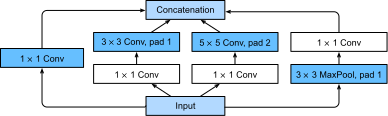
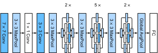

```{.python .input}
%load_ext d2lbook.tab
tab.interact_select(['mxnet', 'pytorch', 'tensorflow', 'jax'])
```

# Réseaux à branches multiples (GoogLeNet)
:label:`sec_googlenet`

En 2014, *GoogLeNet* a remporté le défi ImageNet :cite:`Szegedy.Liu.Jia.ea.2015`, en utilisant une structure qui combinait les forces de NiN :cite:`Lin.Chen.Yan.2013`, des blocs répétés :cite:`Simonyan.Zisserman.2014` et un cocktail de noyaux de convolution. C'était sans doute aussi le premier réseau à présenter une distinction claire entre la base (ingestion des données), le corps (traitement des données) et la tête (prédiction) dans un CNN. Ce schéma de conception a persisté depuis lors dans la conception des réseaux profonds : la *base* est constituée par les deux ou trois premières convolutions qui opèrent sur l'image. Elles extraient des caractéristiques de bas niveau à partir des images sous-jacentes. Ceci est suivi d'un *corps* de blocs convolutionnels. Enfin, la *tête* fait correspondre les caractéristiques obtenues jusqu'à présent au problème de classification, de segmentation, de détection ou de suivi requis.

La contribution clé de GoogLeNet a été la conception du corps du réseau. Il a résolu le problème de la sélection des noyaux de convolution de manière ingénieuse. Alors que d'autres travaux tentaient d'identifier quelle convolution, allant de $1 \times 1$ à $11 \times 11$, serait la meilleure, il a simplement *concaténé* des convolutions à branches multiples. Dans ce qui suit, nous présentons une version légèrement simplifiée de GoogLeNet : la conception originale incluait un certain nombre d'astuces pour stabiliser l'entraînement via des fonctions de perte intermédiaires, appliquées à plusieurs couches du réseau. Elles ne sont plus nécessaires grâce à la disponibilité d'algorithmes d'entraînement améliorés.

```{.python .input}
%%tab mxnet
from d2l import mxnet as d2l
from mxnet import np, npx, init
from mxnet.gluon import nn
npx.set_np()
```

```{.python .input}
%%tab pytorch
from d2l import torch as d2l
import torch
from torch import nn
from torch.nn import functional as F
```

```{.python .input}
%%tab tensorflow
import tensorflow as tf
from d2l import tensorflow as d2l
```

```{.python .input}
%%tab jax
from d2l import jax as d2l
from flax import linen as nn
from jax import numpy as jnp
import jax
```

## (**Blocs Inception**)

Le bloc convolutionnel de base de GoogLeNet est appelé *bloc Inception*, provenant du mème « we need to go deeper » (nous devons aller plus loin) du film *Inception*.


:label:`fig_inception`

Comme illustré dans la :numref:`fig_inception`, le bloc Inception se compose de quatre branches parallèles. Les trois premières branches utilisent des couches de convolution avec des tailles de fenêtre de $1\times 1$, $3\times 3$ et $5\times 5$ pour extraire des informations de différentes tailles spatiales. Les deux branches centrales ajoutent également une convolution $1\times 1$ de l'entrée pour réduire le nombre de canaux, diminuant ainsi la complexité du modèle. La quatrième branche utilise une couche de max-pooling de $3\times 3$, suivie d'une couche de convolution $1\times 1$ pour modifier le nombre de canaux. Les quatre branches utilisent toutes un rembourrage approprié pour donner à l'entrée et à la sortie les mêmes hauteur et largeur. Enfin, les sorties de chaque branche sont concaténées le long de la dimension des canaux et constituent la sortie du bloc. Les hyperparamètres couramment ajustés du bloc Inception sont le nombre de canaux de sortie par couche, c'est-à-dire comment allouer la capacité entre les convolutions de différentes tailles.

```{.python .input}
%%tab mxnet
class Inception(nn.Block):
    # c1--c4 are the number of output channels for each branch
    def __init__(self, c1, c2, c3, c4, **kwargs):
        super(Inception, self).__init__(**kwargs)
        # Branch 1
        self.b1_1 = nn.Conv2D(c1, kernel_size=1, activation='relu')
        # Branch 2
        self.b2_1 = nn.Conv2D(c2[0], kernel_size=1, activation='relu')
        self.b2_2 = nn.Conv2D(c2[1], kernel_size=3, padding=1,
                              activation='relu')
        # Branch 3
        self.b3_1 = nn.Conv2D(c3[0], kernel_size=1, activation='relu')
        self.b3_2 = nn.Conv2D(c3[1], kernel_size=5, padding=2,
                              activation='relu')
        # Branch 4
        self.b4_1 = nn.MaxPool2D(pool_size=3, strides=1, padding=1)
        self.b4_2 = nn.Conv2D(c4, kernel_size=1, activation='relu')

    def forward(self, x):
        b1 = self.b1_1(x)
        b2 = self.b2_2(self.b2_1(x))
        b3 = self.b3_2(self.b3_1(x))
        b4 = self.b4_2(self.b4_1(x))
        return np.concatenate((b1, b2, b3, b4), axis=1)
```

```{.python .input}
%%tab pytorch
class Inception(nn.Module):
    # c1--c4 are the number of output channels for each branch
    def __init__(self, c1, c2, c3, c4, **kwargs):
        super(Inception, self).__init__(**kwargs)
        # Branch 1
        self.b1_1 = nn.LazyConv2d(c1, kernel_size=1)
        # Branch 2
        self.b2_1 = nn.LazyConv2d(c2[0], kernel_size=1)
        self.b2_2 = nn.LazyConv2d(c2[1], kernel_size=3, padding=1)
        # Branch 3
        self.b3_1 = nn.LazyConv2d(c3[0], kernel_size=1)
        self.b3_2 = nn.LazyConv2d(c3[1], kernel_size=5, padding=2)
        # Branch 4
        self.b4_1 = nn.MaxPool2d(kernel_size=3, stride=1, padding=1)
        self.b4_2 = nn.LazyConv2d(c4, kernel_size=1)

    def forward(self, x):
        b1 = F.relu(self.b1_1(x))
        b2 = F.relu(self.b2_2(F.relu(self.b2_1(x))))
        b3 = F.relu(self.b3_2(F.relu(self.b3_1(x))))
        b4 = F.relu(self.b4_2(self.b4_1(x)))
        return torch.cat((b1, b2, b3, b4), dim=1)
```

```{.python .input}
%%tab tensorflow
class Inception(tf.keras.Model):
    # c1--c4 are the number of output channels for each branch
    def __init__(self, c1, c2, c3, c4):
        super().__init__()
        self.b1_1 = tf.keras.layers.Conv2D(c1, 1, activation='relu')
        self.b2_1 = tf.keras.layers.Conv2D(c2[0], 1, activation='relu')
        self.b2_2 = tf.keras.layers.Conv2D(c2[1], 3, padding='same',
                                           activation='relu')
        self.b3_1 = tf.keras.layers.Conv2D(c3[0], 1, activation='relu')
        self.b3_2 = tf.keras.layers.Conv2D(c3[1], 5, padding='same',
                                           activation='relu')
        self.b4_1 = tf.keras.layers.MaxPool2D(3, 1, padding='same')
        self.b4_2 = tf.keras.layers.Conv2D(c4, 1, activation='relu')

    def call(self, x):
        b1 = self.b1_1(x)
        b2 = self.b2_2(self.b2_1(x))
        b3 = self.b3_2(self.b3_1(x))
        b4 = self.b4_2(self.b4_1(x))
        return tf.keras.layers.Concatenate()([b1, b2, b3, b4])
```

```{.python .input}
%%tab jax
class Inception(nn.Module):
    # `c1`--`c4` are the number of output channels for each branch
    c1: int
    c2: tuple
    c3: tuple
    c4: int

    def setup(self):
        # Branch 1
        self.b1_1 = nn.Conv(self.c1, kernel_size=(1, 1))
        # Branch 2
        self.b2_1 = nn.Conv(self.c2[0], kernel_size=(1, 1))
        self.b2_2 = nn.Conv(self.c2[1], kernel_size=(3, 3), padding='same')
        # Branch 3
        self.b3_1 = nn.Conv(self.c3[0], kernel_size=(1, 1))
        self.b3_2 = nn.Conv(self.c3[1], kernel_size=(5, 5), padding='same')
        # Branch 4
        self.b4_1 = lambda x: nn.max_pool(x, window_shape=(3, 3),
                                          strides=(1, 1), padding='same')
        self.b4_2 = nn.Conv(self.c4, kernel_size=(1, 1))

    def __call__(self, x):
        b1 = nn.relu(self.b1_1(x))
        b2 = nn.relu(self.b2_2(nn.relu(self.b2_1(x))))
        b3 = nn.relu(self.b3_2(nn.relu(self.b3_1(x))))
        b4 = nn.relu(self.b4_2(self.b4_1(x)))
        return jnp.concatenate((b1, b2, b3, b4), axis=-1)
```

Pour acquérir une certaine intuition sur la raison pour laquelle ce réseau fonctionne si bien, considérez la combinaison des filtres. Ils explorent l'image avec une variété de tailles de filtres. Cela signifie que des détails à différentes échelles peuvent être reconnus efficacement par des filtres de différentes tailles. En même temps, nous pouvons allouer différentes quantités de paramètres pour différents filtres.


## [**Modèle GoogLeNet**]

Comme le montre la :numref:`fig_inception_full`, GoogLeNet utilise un empilement d'un total de 9 blocs Inception, organisés en trois groupes avec du max-pooling entre les deux, et un global average pooling dans sa tête pour générer ses estimations. Le max-pooling entre les blocs Inception réduit la dimensionnalité. À sa base, le premier module est similaire à AlexNet et LeNet.


:label:`fig_inception_full`

Nous pouvons maintenant implémenter GoogLeNet pièce par pièce. Commençons par la base. Le premier module utilise une couche de convolution $7\times 7$ à 64 canaux.

```{.python .input}
%%tab pytorch, mxnet, tensorflow
class GoogleNet(d2l.Classifier):
    def b1(self):
        if tab.selected('mxnet'):
            net = nn.Sequential()
            net.add(nn.Conv2D(64, kernel_size=7, strides=2, padding=3,
                              activation='relu'),
                    nn.MaxPool2D(pool_size=3, strides=2, padding=1))
            return net
        if tab.selected('pytorch'):
            return nn.Sequential(
                nn.LazyConv2d(64, kernel_size=7, stride=2, padding=3),
                nn.ReLU(), nn.MaxPool2d(kernel_size=3, stride=2, padding=1))
        if tab.selected('tensorflow'):
            return tf.keras.models.Sequential([
                tf.keras.layers.Conv2D(64, 7, strides=2, padding='same',
                                       activation='relu'),
                tf.keras.layers.MaxPool2D(pool_size=3, strides=2,
                                          padding='same')])
```

```{.python .input}
%%tab jax
class GoogleNet(d2l.Classifier):
    lr: float = 0.1
    num_classes: int = 10

    def setup(self):
        self.net = nn.Sequential([self.b1(), self.b2(), self.b3(), self.b4(),
                                  self.b5(), nn.Dense(self.num_classes)])

    def b1(self):
        return nn.Sequential([
                nn.Conv(64, kernel_size=(7, 7), strides=(2, 2), padding='same'),
                nn.relu,
                lambda x: nn.max_pool(x, window_shape=(3, 3), strides=(2, 2),
                                      padding='same')])
```

Le deuxième module utilise deux couches de convolution : d'abord, une couche de convolution $1\times 1$ à 64 canaux, suivie d'une couche de convolution $3\times 3$ qui triple le nombre de canaux. Cela correspond à la deuxième branche du bloc Inception et conclut la conception du corps. À ce stade, nous avons 192 canaux.

```{.python .input}
%%tab all
@d2l.add_to_class(GoogleNet)
def b2(self):
    if tab.selected('mxnet'):
        net = nn.Sequential()
        net.add(nn.Conv2D(64, kernel_size=1, activation='relu'),
               nn.Conv2D(192, kernel_size=3, padding=1, activation='relu'),
               nn.MaxPool2D(pool_size=3, strides=2, padding=1))
        return net
    if tab.selected('pytorch'):
        return nn.Sequential(
            nn.LazyConv2d(64, kernel_size=1), nn.ReLU(),
            nn.LazyConv2d(192, kernel_size=3, padding=1), nn.ReLU(),
            nn.MaxPool2d(kernel_size=3, stride=2, padding=1))
    if tab.selected('tensorflow'):
        return tf.keras.Sequential([
            tf.keras.layers.Conv2D(64, 1, activation='relu'),
            tf.keras.layers.Conv2D(192, 3, padding='same', activation='relu'),
            tf.keras.layers.MaxPool2D(pool_size=3, strides=2, padding='same')])
    if tab.selected('jax'):
        return nn.Sequential([nn.Conv(64, kernel_size=(1, 1)),
                              nn.relu,
                              nn.Conv(192, kernel_size=(3, 3), padding='same'),
                              nn.relu,
                              lambda x: nn.max_pool(x, window_shape=(3, 3),
                                                    strides=(2, 2),
                                                    padding='same')])
```

Le troisième module connecte deux blocs Inception complets en série. Le nombre de canaux de sortie du premier bloc Inception est $64+128+32+32=256$. Cela revient à un rapport du nombre de canaux de sortie parmi les quatre branches de $2:4:1:1$. Pour y parvenir, nous réduisons d'abord les dimensions d'entrée de $\frac{1}{2}$ et de $\frac{1}{12}$ respectivement dans les deuxième et troisième branches pour arriver à $96 = 192/2$ et $16 = 192/12$ canaux respectivement.

Le nombre de canaux de sortie du deuxième bloc Inception est porté à $128+192+96+64=480$, ce qui donne un rapport de $128:192:96:64 = 4:6:3:2$. Comme précédemment, nous devons réduire le nombre de dimensions intermédiaires dans les deuxième et troisième canaux. Une échelle de $\frac{1}{2}$ et $\frac{1}{8}$ respectivement suffit, produisant $128$ et $32$ canaux respectivement. Ceci est capturé par les arguments des constructeurs de blocs `Inception` suivants.

```{.python .input}
%%tab all
@d2l.add_to_class(GoogleNet)
def b3(self):
    if tab.selected('mxnet'):
        net = nn.Sequential()
        net.add(Inception(64, (96, 128), (16, 32), 32),
               Inception(128, (128, 192), (32, 96), 64),
               nn.MaxPool2D(pool_size=3, strides=2, padding=1))
        return net
    if tab.selected('pytorch'):
        return nn.Sequential(Inception(64, (96, 128), (16, 32), 32),
                             Inception(128, (128, 192), (32, 96), 64),
                             nn.MaxPool2d(kernel_size=3, stride=2, padding=1))
    if tab.selected('tensorflow'):
        return tf.keras.models.Sequential([
            Inception(64, (96, 128), (16, 32), 32),
            Inception(128, (128, 192), (32, 96), 64),
            tf.keras.layers.MaxPool2D(pool_size=3, strides=2, padding='same')])
    if tab.selected('jax'):
        return nn.Sequential([Inception(64, (96, 128), (16, 32), 32),
                              Inception(128, (128, 192), (32, 96), 64),
                              lambda x: nn.max_pool(x, window_shape=(3, 3),
                                                    strides=(2, 2),
                                                    padding='same')])
```

Le quatrième module est plus compliqué. Il connecte cinq blocs Inception en série, et ils ont respectivement $192+208+48+64=512$, $160+224+64+64=512$, $128+256+64+64=512$, $112+288+64+64=528$ et $256+320+128+128=832$ canaux de sortie. Le nombre de canaux assignés à ces branches est similaire à celui du troisième module : la deuxième branche avec la couche de convolution $3\times 3$ produit le plus grand nombre de canaux, suivie par la première branche avec seulement la couche de convolution $1\times 1$, la troisième branche avec la couche de convolution $5\times 5$ et la quatrième branche avec la couche de max-pooling $3\times 3$. Les deuxième et troisième branches réduiront d'abord le nombre de canaux selon le rapport. Ces rapports sont légèrement différents selon les blocs Inception.

```{.python .input}
%%tab all
@d2l.add_to_class(GoogleNet)
def b4(self):
    if tab.selected('mxnet'):
        net = nn.Sequential()
        net.add(Inception(192, (96, 208), (16, 48), 64),
                Inception(160, (112, 224), (24, 64), 64),
                Inception(128, (128, 256), (24, 64), 64),
                Inception(112, (144, 288), (32, 64), 64),
                Inception(256, (160, 320), (32, 128), 128),
                nn.MaxPool2D(pool_size=3, strides=2, padding=1))
        return net
    if tab.selected('pytorch'):
        return nn.Sequential(Inception(192, (96, 208), (16, 48), 64),
                             Inception(160, (112, 224), (24, 64), 64),
                             Inception(128, (128, 256), (24, 64), 64),
                             Inception(112, (144, 288), (32, 64), 64),
                             Inception(256, (160, 320), (32, 128), 128),
                             nn.MaxPool2d(kernel_size=3, stride=2, padding=1))
    if tab.selected('tensorflow'):
        return tf.keras.Sequential([
            Inception(192, (96, 208), (16, 48), 64),
            Inception(160, (112, 224), (24, 64), 64),
            Inception(128, (128, 256), (24, 64), 64),
            Inception(112, (144, 288), (32, 64), 64),
            Inception(256, (160, 320), (32, 128), 128),
            tf.keras.layers.MaxPool2D(pool_size=3, strides=2, padding='same')])
    if tab.selected('jax'):
        return nn.Sequential([Inception(192, (96, 208), (16, 48), 64),
                              Inception(160, (112, 224), (24, 64), 64),
                              Inception(128, (128, 256), (24, 64), 64),
                              Inception(112, (144, 288), (32, 64), 64),
                              Inception(256, (160, 320), (32, 128), 128),
                              lambda x: nn.max_pool(x, window_shape=(3, 3),
                                                    strides=(2, 2),
                                                    padding='same')])
```

Le cinquième module possède deux blocs Inception avec $256+320+128+128=832$ et $384+384+128+128=1024$ canaux de sortie. Le nombre de canaux attribués à chaque branche est le même que dans les troisième et quatrième modules, mais diffère par les valeurs spécifiques. Il convient de noter que le cinquième bloc est suivi de la couche de sortie. Ce bloc utilise la couche de global average pooling pour changer la hauteur et la largeur de chaque canal à 1, tout comme dans NiN. Enfin, nous transformons la sortie en un tableau bidimensionnel suivi d'une couche entièrement connectée dont le nombre de sorties est le nombre de classes d'étiquettes.

```{.python .input}
%%tab all
@d2l.add_to_class(GoogleNet)
def b5(self):
    if tab.selected('mxnet'):
        net = nn.Sequential()
        net.add(Inception(256, (160, 320), (32, 128), 128),
                Inception(384, (192, 384), (48, 128), 128),
                nn.GlobalAvgPool2D())
        return net
    if tab.selected('pytorch'):
        return nn.Sequential(Inception(256, (160, 320), (32, 128), 128),
                             Inception(384, (192, 384), (48, 128), 128),
                             nn.AdaptiveAvgPool2d((1,1)), nn.Flatten())
    if tab.selected('tensorflow'):
        return tf.keras.Sequential([
            Inception(256, (160, 320), (32, 128), 128),
            Inception(384, (192, 384), (48, 128), 128),
            tf.keras.layers.GlobalAvgPool2D(),
            tf.keras.layers.Flatten()])
    if tab.selected('jax'):
        return nn.Sequential([Inception(256, (160, 320), (32, 128), 128),
                              Inception(384, (192, 384), (48, 128), 128),
                              # Flax does not provide a GlobalAvgPool2D layer
                              lambda x: nn.avg_pool(x,
                                                    window_shape=x.shape[1:3],
                                                    strides=x.shape[1:3],
                                                    padding='valid'),
                              lambda x: x.reshape((x.shape[0], -1))])
```

Maintenant que nous avons défini tous les blocs de `b1` à `b5`, il ne s'agit plus que de les assembler tous en un réseau complet.

```{.python .input}
%%tab pytorch, mxnet, tensorflow
@d2l.add_to_class(GoogleNet)
def __init__(self, lr=0.1, num_classes=10):
    super(GoogleNet, self).__init__()
    self.save_hyperparameters()
    if tab.selected('mxnet'):
        self.net = nn.Sequential()
        self.net.add(self.b1(), self.b2(), self.b3(), self.b4(), self.b5(),
                     nn.Dense(num_classes))
        self.net.initialize(init.Xavier())
    if tab.selected('pytorch'):
        self.net = nn.Sequential(self.b1(), self.b2(), self.b3(), self.b4(),
                                 self.b5(), nn.LazyLinear(num_classes))
        self.net.apply(d2l.init_cnn)
    if tab.selected('tensorflow'):
        self.net = tf.keras.Sequential([
            self.b1(), self.b2(), self.b3(), self.b4(), self.b5(),
            tf.keras.layers.Dense(num_classes)])
```

Le modèle GoogLeNet est complexe d'un point de vue calculatoire. Notez le grand nombre d'hyperparamètres relativement arbitraires en termes de nombre de canaux choisis, de nombre de blocs avant la réduction de dimensionnalité, de partitionnement relatif de la capacité entre les canaux, etc. Cela est dû en grande partie au fait qu'au moment de l'introduction de GoogLeNet, les outils automatiques pour la définition de réseaux ou l'exploration de la conception n'étaient pas encore disponibles. Par exemple, nous considérons désormais comme acquis qu'un cadre d'apprentissage profond compétent soit capable d'inférer automatiquement les dimensions des tenseurs d'entrée. À l'époque, bon nombre de ces configurations devaient être spécifiées explicitement par l'expérimentateur, ralentissant ainsi souvent l'expérimentation active. De plus, les outils nécessaires à l'exploration automatique étaient encore en pleine évolution et les expériences initiales se résumaient largement à une exploration coûteuse par force brute, à des algorithmes génétiques et à des stratégies similaires.

Pour l'instant, la seule modification que nous allons effectuer est de [**réduire la hauteur et la largeur d'entrée de 224 à 96 pour avoir un temps d'entraînement raisonnable sur Fashion-MNIST.**] Cela simplifie le calcul. Jetons un coup d'œil aux changements de forme de la sortie entre les différents modules.

```{.python .input}
%%tab mxnet, pytorch
model = GoogleNet().layer_summary((1, 1, 96, 96))
```

```{.python .input}
%%tab tensorflow, jax
model = GoogleNet().layer_summary((1, 96, 96, 1))
```

## [**Entraînement**]

Comme précédemment, nous entraînons notre modèle en utilisant le jeu de données Fashion-MNIST. Nous le transformons en une résolution de $96 \times 96$ pixels avant d'appeler la procédure d'entraînement.

```{.python .input}
%%tab mxnet, pytorch, jax
model = GoogleNet(lr=0.01)
trainer = d2l.Trainer(max_epochs=10, num_gpus=1)
data = d2l.FashionMNIST(batch_size=128, resize=(96, 96))
if tab.selected('pytorch'):
    model.apply_init([next(iter(data.get_dataloader(True)))[0]], d2l.init_cnn)
trainer.fit(model, data)
```

```{.python .input}
%%tab tensorflow
trainer = d2l.Trainer(max_epochs=10)
data = d2l.FashionMNIST(batch_size=128, resize=(96, 96))
with d2l.try_gpu():
    model = GoogleNet(lr=0.01)
    trainer.fit(model, data)
```

## Discussion

Une caractéristique clé de GoogLeNet est qu'il est en réalité *moins coûteux* à calculer que ses prédécesseurs tout en offrant simultanément une précision améliorée. Cela marque le début d'une conception de réseau beaucoup plus délibérée qui arbitre entre le coût d'évaluation d'un réseau et une réduction des erreurs. Cela marque également le début de l'expérimentation au niveau des blocs avec les hyperparamètres de conception du réseau, même si elle était entièrement manuelle à l'époque. Nous reviendrons sur ce sujet dans la :numref:`sec_cnn-design` lors de la discussion des stratégies d'exploration de la structure du réseau.

Au cours des sections suivantes, nous rencontrerons un certain nombre de choix de conception (par exemple, la normalisation par lots, les connexions résiduelles et le regroupement de canaux) qui nous permettent d'améliorer considérablement les réseaux. Pour l'instant, vous pouvez être fier d'avoir implémenté ce qui est sans doute le premier CNN véritablement moderne.

## Exercices

1. GoogLeNet a eu un tel succès qu'il a connu un certain nombre d'itérations, améliorant progressivement la vitesse et la précision. Essayez d'en implémenter et d'en exécuter quelques-unes. Elles incluent les suivantes :
    1. Ajouter une couche de normalisation par lots :cite:`Ioffe.Szegedy.2015`, comme décrit plus loin dans la :numref:`sec_batch_norm`.
    1. Faire des ajustements au bloc Inception (largeur, choix et ordre des convolutions), comme décrit dans :citet:`Szegedy.Vanhoucke.Ioffe.ea.2016`.
    1. Utiliser le label smoothing pour la régularisation du modèle, comme décrit dans :citet:`Szegedy.Vanhoucke.Ioffe.ea.2016`.
    1. Faire d'autres ajustements au bloc Inception en ajoutant une connexion résiduelle :cite:`Szegedy.Ioffe.Vanhoucke.ea.2017`, comme décrit plus loin dans la :numref:`sec_resnet`.
1. Quelle est la taille d'image minimale nécessaire pour que GoogLeNet fonctionne ?
1. Pouvez-vous concevoir une variante de GoogLeNet qui fonctionne sur la résolution native de Fashion-MNIST de $28 \times 28$ pixels ? Comment devriez-vous modifier la base, le corps et la tête du réseau, si tant est qu'il faille modifier quelque chose ?
1. Comparez les tailles des paramètres des modèles AlexNet, VGG, NiN et GoogLeNet. Comment les deux dernières architectures de réseaux réduisent-elles considérablement la taille des paramètres du modèle ?
1. Comparez la quantité de calcul nécessaire dans GoogLeNet et AlexNet. Comment cela affecte-t-il la conception d'une puce accélératrice, par exemple en termes de taille de mémoire, de bande passante mémoire, de taille de cache, de quantité de calcul et de l'avantage des opérations spécialisées ?

:begin_tab:`mxnet`
[Discussions](https://discuss.d2l.ai/t/81)
:end_tab:

:begin_tab:`pytorch`
[Discussions](https://discuss.d2l.ai/t/82)
:end_tab:

:begin_tab:`tensorflow`
[Discussions](https://discuss.d2l.ai/t/316)
:end_tab:

:begin_tab:`jax`
[Discussions](https://discuss.d2l.ai/t/18004)
:end_tab:
