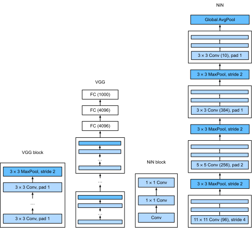

```{.python .input}
%load_ext d2lbook.tab
tab.interact_select(['mxnet', 'pytorch', 'tensorflow', 'jax'])
```

# Network in Network (NiN)
:label:`sec_nin`

LeNet, AlexNet et VGG partagent tous un schéma de conception commun :
extraire des caractéristiques en exploitant la structure *spatiale*
via une séquence de couches de convolution et de pooling,
puis post-traiter les représentations via des couches entièrement connectées.
Les améliorations apportées à LeNet par AlexNet et VGG résident principalement
dans la manière dont ces réseaux plus récents élargissent et approfondissent ces deux modules.

Cette conception pose deux défis majeurs.
Premièrement, les couches entièrement connectées à la fin
de l'architecture consomment un nombre énorme de paramètres. Par exemple, même un modèle
simple tel que VGG-11 nécessite une matrice monstrueuse, occupant presque
400 Mo de RAM en simple précision (FP32). C'est un obstacle important au calcul, en particulier sur
les appareils mobiles et embarqués. Après tout, même les téléphones mobiles haut de gamme ne disposent pas de plus de 8 Go de RAM. À l'époque où VGG a été inventé, c'était un ordre de grandeur inférieur (l'iPhone 4S avait 512 Mo). À ce titre, il aurait été difficile de justifier de consacrer la majeure partie de la mémoire à un classificateur d'images.

Deuxièmement, il est tout aussi impossible d'ajouter des couches entièrement connectées
plus tôt dans le réseau pour augmenter le degré de non-linéarité : cela détruirait la
structure spatiale et nécessiterait potentiellement encore plus de mémoire.

Les blocs *network in network* (*NiN*) :cite:`Lin.Chen.Yan.2013` offrent une alternative,
capable de résoudre ces deux problèmes par une stratégie simple.
Ils ont été proposés sur la base d'une intuition très simple : (i) utiliser des convolutions $1 \times 1$ pour ajouter
des non-linéarités locales à travers les activations des canaux et (ii) utiliser le pooling moyen global (*global average pooling*) pour intégrer
tous les emplacements dans la dernière couche de représentation. Notez que le pooling moyen global ne
serait pas efficace s'il n'y avait pas les non-linéarités ajoutées. Plongeons dans le détail.

```{.python .input}
%%tab mxnet
from d2l import mxnet as d2l
from mxnet import np, npx, init
from mxnet.gluon import nn
npx.set_np()
```

```{.python .input}
%%tab pytorch
from d2l import torch as d2l
import torch
from torch import nn
```

```{.python .input}
%%tab tensorflow
import tensorflow as tf
from d2l import tensorflow as d2l
```

```{.python .input}
%%tab jax
from d2l import jax as d2l
from flax import linen as nn
import jax
from jax import numpy as jnp
```

## (**Blocs NiN**)

Rappelez-vous de la :numref:`subsec_1x1`. Nous y disions que les entrées et sorties des couches convolutives
consistent en des tenseurs à quatre dimensions avec des axes
correspondant à l'exemple, au canal, à la hauteur et à la largeur.
Rappelez-vous également que les entrées et sorties des couches entièrement connectées
sont typiquement des tenseurs bidimensionnels correspondant à l'exemple et à la caractéristique.
L'idée derrière NiN est d'appliquer une couche entièrement connectée
à chaque emplacement de pixel (pour chaque hauteur et largeur).
La convolution $1 \times 1$ résultante peut être considérée comme
une couche entièrement connectée agissant indépendamment sur chaque emplacement de pixel.

La :numref:`fig_nin` illustre les principales différences structurelles
entre VGG et NiN, et leurs blocs.
Notez à la fois la différence dans les blocs NiN (la convolution initiale est suivie de convolutions $1 \times 1$, alors que VGG conserve des convolutions $3 \times 3$) et à la fin où nous n'avons plus besoin d'une couche géante entièrement connectée.


:width:`600px`
:label:`fig_nin`

```{.python .input}
%%tab mxnet
def nin_block(num_channels, kernel_size, strides, padding):
    blk = nn.Sequential()
    blk.add(nn.Conv2D(num_channels, kernel_size, strides, padding,
                      activation='relu'),
            nn.Conv2D(num_channels, kernel_size=1, activation='relu'),
            nn.Conv2D(num_channels, kernel_size=1, activation='relu'))
    return blk
```

```{.python .input}
%%tab pytorch
def nin_block(out_channels, kernel_size, strides, padding):
    return nn.Sequential(
        nn.LazyConv2d(out_channels, kernel_size, strides, padding), nn.ReLU(),
        nn.LazyConv2d(out_channels, kernel_size=1), nn.ReLU(),
        nn.LazyConv2d(out_channels, kernel_size=1), nn.ReLU())
```

```{.python .input}
%%tab tensorflow
def nin_block(out_channels, kernel_size, strides, padding):
    return tf.keras.models.Sequential([
    tf.keras.layers.Conv2D(out_channels, kernel_size, strides=strides,
                           padding=padding),
    tf.keras.layers.Activation('relu'),
    tf.keras.layers.Conv2D(out_channels, 1),
    tf.keras.layers.Activation('relu'),
    tf.keras.layers.Conv2D(out_channels, 1),
    tf.keras.layers.Activation('relu')])
```

```{.python .input}
%%tab jax
def nin_block(out_channels, kernel_size, strides, padding):
    return nn.Sequential([
        nn.Conv(out_channels, kernel_size, strides, padding),
        nn.relu,
        nn.Conv(out_channels, kernel_size=(1, 1)), nn.relu,
        nn.Conv(out_channels, kernel_size=(1, 1)), nn.relu])
```

## [**Modèle NiN**]

NiN utilise les mêmes tailles de convolution initiales qu'AlexNet (il a été proposé peu de temps après).
Les tailles de noyau sont respectivement de $11 \times 11$, $5 \times 5$ et $3 \times 3$,
et les nombres de canaux de sortie correspondent à ceux d'AlexNet. Chaque bloc NiN est suivi d'une couche de pooling maximum (*max-pooling*)
avec une foulée (*stride*) de 2 et une fenêtre de forme $3 \times 3$.

La deuxième différence significative entre NiN et AlexNet ou VGG
est que NiN évite complètement les couches entièrement connectées.
Au lieu de cela, NiN utilise un bloc NiN avec un nombre de canaux de sortie égal au nombre de classes d'étiquettes, suivi d'une couche de pooling moyen *global*,
produisant un vecteur de logits.
Cette conception réduit considérablement le nombre de paramètres de modèle requis, bien qu'au prix d'une augmentation potentielle du temps d'entraînement.

```{.python .input}
%%tab pytorch, mxnet, tensorflow
class NiN(d2l.Classifier):
    def __init__(self, lr=0.1, num_classes=10):
        super().__init__()
        self.save_hyperparameters()
        if tab.selected('mxnet'):
            self.net = nn.Sequential()
            self.net.add(
                nin_block(96, kernel_size=11, strides=4, padding=0),
                nn.MaxPool2D(pool_size=3, strides=2),
                nin_block(256, kernel_size=5, strides=1, padding=2),
                nn.MaxPool2D(pool_size=3, strides=2),
                nin_block(384, kernel_size=3, strides=1, padding=1),
                nn.MaxPool2D(pool_size=3, strides=2),
                nn.Dropout(0.5),
                nin_block(num_classes, kernel_size=3, strides=1, padding=1),
                nn.GlobalAvgPool2D(),
                nn.Flatten())
            self.net.initialize(init.Xavier())
        if tab.selected('pytorch'):
            self.net = nn.Sequential(
                nin_block(96, kernel_size=11, strides=4, padding=0),
                nn.MaxPool2d(3, stride=2),
                nin_block(256, kernel_size=5, strides=1, padding=2),
                nn.MaxPool2d(3, stride=2),
                nin_block(384, kernel_size=3, strides=1, padding=1),
                nn.MaxPool2d(3, stride=2),
                nn.Dropout(0.5),
                nin_block(num_classes, kernel_size=3, strides=1, padding=1),
                nn.AdaptiveAvgPool2d((1, 1)),
                nn.Flatten())
            self.net.apply(d2l.init_cnn)
        if tab.selected('tensorflow'):
            self.net = tf.keras.models.Sequential([
                nin_block(96, kernel_size=11, strides=4, padding='valid'),
                tf.keras.layers.MaxPool2D(pool_size=3, strides=2),
                nin_block(256, kernel_size=5, strides=1, padding='same'),
                tf.keras.layers.MaxPool2D(pool_size=3, strides=2),
                nin_block(384, kernel_size=3, strides=1, padding='same'),
                tf.keras.layers.MaxPool2D(pool_size=3, strides=2),
                tf.keras.layers.Dropout(0.5),
                nin_block(num_classes, kernel_size=3, strides=1, padding='same'),
                tf.keras.layers.GlobalAvgPool2D(),
                tf.keras.layers.Flatten()])
```

```{.python .input}
%%tab jax
class NiN(d2l.Classifier):
    lr: float = 0.1
    num_classes = 10
    training: bool = True

    def setup(self):
        self.net = nn.Sequential([
            nin_block(96, kernel_size=(11, 11), strides=(4, 4), padding=(0, 0)),
            lambda x: nn.max_pool(x, (3, 3), strides=(2, 2)),
            nin_block(256, kernel_size=(5, 5), strides=(1, 1), padding=(2, 2)),
            lambda x: nn.max_pool(x, (3, 3), strides=(2, 2)),
            nin_block(384, kernel_size=(3, 3), strides=(1, 1), padding=(1, 1)),
            lambda x: nn.max_pool(x, (3, 3), strides=(2, 2)),
            nn.Dropout(0.5, deterministic=not self.training),
            nin_block(self.num_classes, kernel_size=(3, 3), strides=1, padding=(1, 1)),
            lambda x: nn.avg_pool(x, (5, 5)),  # global avg pooling
            lambda x: x.reshape((x.shape[0], -1))  # flatten
        ])
```

Nous créons un exemple de données pour voir [**la forme de sortie de chaque bloc**].

```{.python .input}
%%tab mxnet, pytorch
NiN().layer_summary((1, 1, 224, 224))
```

```{.python .input}
%%tab tensorflow
NiN().layer_summary((1, 224, 224, 1))
```

```{.python .input}
%%tab jax
NiN(training=False).layer_summary((1, 224, 224, 1))
```

## [**Entraînement**]

Comme précédemment, nous utilisons Fashion-MNIST pour entraîner le modèle en utilisant le même 
optimisateur que celui que nous avons utilisé pour AlexNet et VGG.

```{.python .input}
%%tab mxnet, pytorch, jax
model = NiN(lr=0.05)
trainer = d2l.Trainer(max_epochs=10, num_gpus=1)
data = d2l.FashionMNIST(batch_size=128, resize=(224, 224))
if tab.selected('pytorch'):
    model.apply_init([next(iter(data.get_dataloader(True)))[0]], d2l.init_cnn)
trainer.fit(model, data)
```

```{.python .input}
%%tab tensorflow
trainer = d2l.Trainer(max_epochs=10)
data = d2l.FashionMNIST(batch_size=128, resize=(224, 224))
with d2l.try_gpu():
    model = NiN(lr=0.05)
    trainer.fit(model, data)
```

## Résumé

NiN possède considérablement moins de paramètres qu'AlexNet et VGG. Cela provient principalement du fait qu'il n'a pas besoin de couches géantes entièrement connectées. Au lieu de cela, il utilise un pooling moyen global pour agréger tous les emplacements de l'image après la dernière étape du corps du réseau. Cela évite le besoin d'opérations de réduction coûteuses (apprises) et les remplace par une simple moyenne. Ce qui a surpris les chercheurs à l'époque, c'est le fait que cette opération de moyenne ne nuisait pas à la précision. Notez que la moyenne sur une représentation de faible résolution (avec de nombreux canaux) ajoute également à la quantité d'invariance par translation que le réseau peut gérer.

Le choix de moins de convolutions avec des noyaux larges et leur remplacement par des convolutions $1 \times 1$ aide davantage à réduire le nombre de paramètres. Cela peut répondre à une quantité importante de non-linéarité à travers les canaux dans n'importe quel emplacement donné. Les convolutions $1 \times 1$ et le pooling moyen global ont tous deux influencé de manière significative les conceptions ultérieures de CNN.

## Exercices

1. Pourquoi y a-t-il deux couches convolutives $1 \times 1$ par bloc NiN ? Augmentez leur nombre à trois. Réduisez leur nombre à un. Qu'est-ce qui change ?
1. Qu'est-ce qui change si vous remplacez les convolutions $1 \times 1$ par des convolutions $3 \times 3$ ?
1. Que se passe-t-il si vous remplacez le pooling moyen global par une couche entièrement connectée (vitesse, précision, nombre de paramètres) ?
1. Calculez l'utilisation des ressources pour NiN.
    1. Quel est le nombre de paramètres ?
    1. Quelle est la quantité de calcul ?
    1. Quelle est la quantité de mémoire nécessaire pendant l'entraînement ?
    1. Quelle est la quantité de mémoire nécessaire pendant la prédiction ?
1. Quels sont les problèmes possibles liés à la réduction de la représentation $384 \times 5 \times 5$ à une représentation $10 \times 5 \times 5$ en une seule étape ?
1. Utilisez les décisions de conception structurelle de VGG qui ont conduit à VGG-11, VGG-16 et VGG-19 pour concevoir une famille de réseaux de type NiN.

:begin_tab:`mxnet`
[Discussions](https://discuss.d2l.ai/t/79)
:end_tab:

:begin_tab:`pytorch`
[Discussions](https://discuss.d2l.ai/t/80)
:end_tab:

:begin_tab:`jax`
[Discussions](https://discuss.d2l.ai/t/18003)
:end_tab:
