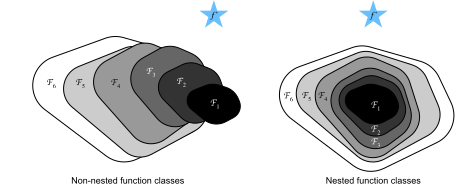
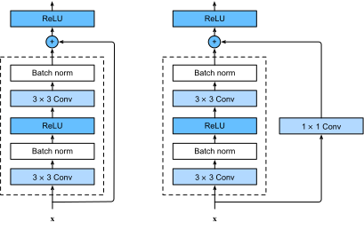
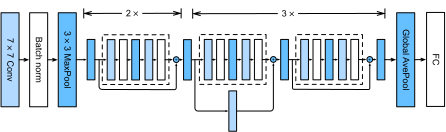

```{.python .input}
%load_ext d2lbook.tab
tab.interact_select(['mxnet', 'pytorch', 'tensorflow', 'jax'])
```

# Réseaux résiduels (ResNet) et ResNeXt
:label:`sec_resnet`

À mesure que nous concevons des réseaux de plus en plus profonds, il devient impératif de comprendre comment l'ajout de couches peut augmenter la complexité et l'expressivité du réseau. Plus important encore est la capacité à concevoir des réseaux où l'ajout de couches rend les réseaux strictement plus expressifs plutôt que simplement différents. Pour progresser, nous avons besoin d'un peu de mathématiques.

```{.python .input}
%%tab mxnet
from d2l import mxnet as d2l
from mxnet import np, npx, init
from mxnet.gluon import nn
npx.set_np()
```

```{.python .input}
%%tab pytorch
from d2l import torch as d2l
import torch
from torch import nn
from torch.nn import functional as F
```

```{.python .input}
%%tab tensorflow
import tensorflow as tf
from d2l import tensorflow as d2l
```

```{.python .input}
%%tab jax
from d2l import jax as d2l
from flax import linen as nn
from jax import numpy as jnp
import jax
```

## Classes de fonctions

Considérons $\mathcal{F}$, la classe de fonctions qu'une architecture de réseau spécifique (ainsi que les taux d'apprentissage et d'autres réglages d'hyperparamètres) peut atteindre. C'est-à-dire que pour tout $f \in \mathcal{F}$, il existe un ensemble de paramètres (par exemple, des poids et des biais) qui peuvent être obtenus par un entraînement sur un jeu de données approprié. Supposons que $f^*$ soit la fonction « vérité » que nous aimerions vraiment trouver. Si elle est dans $\mathcal{F}$, nous sommes sur la bonne voie, mais typiquement nous ne serons pas aussi chanceux. Au lieu de cela, nous essaierons de trouver une fonction $f^*_\mathcal{F}$ qui soit notre meilleur choix au sein de $\mathcal{F}$. Par exemple, étant donné un jeu de données avec des caractéristiques $\mathbf{X}$ et des étiquettes $\mathbf{y}$, nous pourrions essayer de la trouver en résolvant le problème d'optimisation suivant :

$$f^*_\mathcal{F} \stackrel{\textrm{def}}{=} \mathop{\mathrm{argmin}}_f L(\mathbf{X}, \mathbf{y}, f) \textrm{ subject to } f \in \mathcal{F}.$$

Nous savons que la régularisation :cite:`tikhonov1977solutions,morozov2012methods` peut contrôler la complexité de $\mathcal{F}$ et atteindre la cohérence, de sorte qu'une plus grande taille de données d'entraînement conduit généralement à une meilleure $f^*_\mathcal{F}$. Il est raisonnable de supposer que si nous concevons une architecture différente et plus puissante $\mathcal{F}'$, nous devrions arriver à un meilleur résultat. En d'autres termes, nous nous attendrions à ce que $f^*_{\mathcal{F}'}$ soit « meilleure » que $f^*_{\mathcal{F}}$. Cependant, si $\mathcal{F} \not\subseteq \mathcal{F}'$, il n'y a aucune garantie que cela se produise. En fait, $f^*_{\mathcal{F}'}$ pourrait bien être pire. Comme illustré par la :numref:`fig_functionclasses`, pour des classes de fonctions non imbriquées, une classe de fonctions plus grande ne se rapproche pas toujours de la fonction « vérité » $f^*$. Par exemple, à gauche de la :numref:`fig_functionclasses`, bien que $\mathcal{F}_3$ soit plus proche de $f^*$ que $\mathcal{F}_1$, $\mathcal{F}_6$ s'en éloigne et il n'y a aucune garantie qu'une augmentation supplémentaire de la complexité puisse réduire la distance par rapport à $f^*$. Avec des classes de fonctions imbriquées où $\mathcal{F}_1 \subseteq \cdots \subseteq \mathcal{F}_6$ à droite de la :numref:`fig_functionclasses`, nous pouvons éviter le problème susmentionné des classes de fonctions non imbriquées.



:label:`fig_functionclasses`

Ainsi, ce n'est que si les classes de fonctions plus grandes contiennent les plus petites que nous avons la garantie qu'augmenter leur taille accroît strictement le pouvoir expressif du réseau. Pour les réseaux de neurones profonds, si nous pouvons entraîner la couche nouvellement ajoutée en une fonction identité $f(\mathbf{x}) = \mathbf{x}$, le nouveau modèle sera aussi efficace que le modèle original. Comme le nouveau modèle peut obtenir une meilleure solution pour s'adapter au jeu de données d'entraînement, la couche ajoutée pourrait faciliter la réduction des erreurs d'entraînement.

C'est la question que :citet:`He.Zhang.Ren.ea.2016` ont considérée lorsqu'ils travaillaient sur des modèles de vision par ordinateur très profonds. Au cœur de leur *réseau résiduel* (*ResNet*) proposé se trouve l'idée que chaque couche supplémentaire devrait plus facilement contenir la fonction identité comme l'un de ses éléments. Ces considérations sont assez profondes mais elles ont mené à une solution étonnamment simple, un *bloc résiduel*. Grâce à lui, ResNet a remporté le ImageNet Large Scale Visual Recognition Challenge en 2015. La conception a eu une influence profonde sur la manière de construire des réseaux de neurones profonds. Par exemple, des blocs résiduels ont été ajoutés aux réseaux récurrents :cite:`prakash2016neural,kim2017residual`. De même, les Transformers :cite:`Vaswani.Shazeer.Parmar.ea.2017` les utilisent pour empiler efficacement de nombreuses couches de réseaux. Il est également utilisé dans les réseaux de neurones sur graphes :cite:`Kipf.Welling.2016` et, en tant que concept de base, il a été largement utilisé en vision par ordinateur :cite:`Redmon.Farhadi.2018,Ren.He.Girshick.ea.2015`. Notez que les réseaux résiduels sont précédés par les réseaux autoroutes (highway networks) :cite:`srivastava2015highway` qui partagent une partie de la motivation, bien que sans la paramétrisation élégante autour de la fonction identité.


## (**Blocs résiduels**)
:label:`subsec_residual-blks`

Concentrons-nous sur une partie locale d'un réseau de neurones, telle que représentée dans la :numref:`fig_residual_block`. Notons l'entrée par $\mathbf{x}$. Nous supposons que $f(\mathbf{x})$, l'application sous-jacente souhaitée que nous voulons obtenir par apprentissage, doit être utilisée comme entrée de la fonction d'activation au sommet. À gauche, la partie à l'intérieur de la boîte en pointillés doit apprendre directement $f(\mathbf{x})$. À droite, la partie à l'intérieur de la boîte en pointillés doit apprendre l'*application résiduelle* $g(\mathbf{x}) = f(\mathbf{x}) - \mathbf{x}$, d'où le nom du bloc résiduel. Si l'application identité $f(\mathbf{x}) = \mathbf{x}$ est l'application sous-jacente souhaitée, l'application résiduelle revient à $g(\mathbf{x}) = 0$ et elle est donc plus facile à apprendre : il suffit de pousser vers zéro les poids et les biais de la couche de poids supérieure (par exemple, une couche entièrement connectée ou une couche convolutive) à l'intérieur de la boîte en pointillés. La figure de droite illustre le *bloc résiduel* de ResNet, où la ligne pleine transportant l'entrée de la couche $\mathbf{x}$ vers l'opérateur d'addition est appelée une *connexion résiduelle* (ou *connexion de raccourci*). Avec les blocs résiduels, les entrées peuvent se propager vers l'avant plus rapidement via les connexions résiduelles à travers les couches. En fait, le bloc résiduel peut être considéré comme un cas particulier du bloc Inception multi-branches : il possède deux branches dont l'une est l'application identité.


:label:`fig_residual_block`


ResNet reprend la conception complète de la couche convolutive $3\times 3$ de VGG. Le bloc résiduel comporte deux couches convolutives $3\times 3$ avec le même nombre de canaux de sortie. Chaque couche convolutive est suivie d'une couche de normalisation par lots (batch normalization) et d'une fonction d'activation ReLU. Ensuite, nous sautons ces deux opérations de convolution et ajoutons l'entrée directement avant la fonction d'activation ReLU finale. Ce type de conception exige que la sortie des deux couches convolutives ait la même forme que l'entrée, afin qu'elles puissent être additionnées. Si nous voulons changer le nombre de canaux, nous devons introduire une couche convolutive $1\times 1$ supplémentaire pour transformer l'entrée dans la forme souhaitée pour l'opération d'addition. Jetons un coup d'œil au code ci-dessous.

```{.python .input}
%%tab mxnet
class Residual(nn.Block):  #@save
    """The Residual block of ResNet models."""
    def __init__(self, num_channels, use_1x1conv=False, strides=1, **kwargs):
        super().__init__(**kwargs)
        self.conv1 = nn.Conv2D(num_channels, kernel_size=3, padding=1,
                               strides=strides)
        self.conv2 = nn.Conv2D(num_channels, kernel_size=3, padding=1)
        if use_1x1conv:
            self.conv3 = nn.Conv2D(num_channels, kernel_size=1,
                                   strides=strides)
        else:
            self.conv3 = None
        self.bn1 = nn.BatchNorm()
        self.bn2 = nn.BatchNorm()

    def forward(self, X):
        Y = npx.relu(self.bn1(self.conv1(X)))
        Y = self.bn2(self.conv2(Y))
        if self.conv3:
            X = self.conv3(X)
        return npx.relu(Y + X)
```

```{.python .input}
%%tab pytorch
class Residual(nn.Module):  #@save
    """The Residual block of ResNet models."""
    def __init__(self, num_channels, use_1x1conv=False, strides=1):
        super().__init__()
        self.conv1 = nn.LazyConv2d(num_channels, kernel_size=3, padding=1,
                                   stride=strides)
        self.conv2 = nn.LazyConv2d(num_channels, kernel_size=3, padding=1)
        if use_1x1conv:
            self.conv3 = nn.LazyConv2d(num_channels, kernel_size=1,
                                       stride=strides)
        else:
            self.conv3 = None
        self.bn1 = nn.LazyBatchNorm2d()
        self.bn2 = nn.LazyBatchNorm2d()

    def forward(self, X):
        Y = F.relu(self.bn1(self.conv1(X)))
        Y = self.bn2(self.conv2(Y))
        if self.conv3:
            X = self.conv3(X)
        Y += X
        return F.relu(Y)
```

```{.python .input}
%%tab tensorflow
class Residual(tf.keras.Model):  #@save
    """The Residual block of ResNet models."""
    def __init__(self, num_channels, use_1x1conv=False, strides=1):
        super().__init__()
        self.conv1 = tf.keras.layers.Conv2D(num_channels, padding='same',
                                            kernel_size=3, strides=strides)
        self.conv2 = tf.keras.layers.Conv2D(num_channels, kernel_size=3,
                                            padding='same')
        self.conv3 = None
        if use_1x1conv:
            self.conv3 = tf.keras.layers.Conv2D(num_channels, kernel_size=1,
                                                strides=strides)
        self.bn1 = tf.keras.layers.BatchNormalization()
        self.bn2 = tf.keras.layers.BatchNormalization()

    def call(self, X):
        Y = tf.keras.activations.relu(self.bn1(self.conv1(X)))
        Y = self.bn2(self.conv2(Y))
        if self.conv3 is not None:
            X = self.conv3(X)
        Y += X
        return tf.keras.activations.relu(Y)
```

```{.python .input}
%%tab jax
class Residual(nn.Module):  #@save
    """The Residual block of ResNet models."""
    num_channels: int
    use_1x1conv: bool = False
    strides: tuple = (1, 1)
    training: bool = True

    def setup(self):
        self.conv1 = nn.Conv(self.num_channels, kernel_size=(3, 3),
                             padding='same', strides=self.strides)
        self.conv2 = nn.Conv(self.num_channels, kernel_size=(3, 3),
                             padding='same')
        if self.use_1x1conv:
            self.conv3 = nn.Conv(self.num_channels, kernel_size=(1, 1),
                                 strides=self.strides)
        else:
            self.conv3 = None
        self.bn1 = nn.BatchNorm(not self.training)
        self.bn2 = nn.BatchNorm(not self.training)

    def __call__(self, X):
        Y = nn.relu(self.bn1(self.conv1(X)))
        Y = self.bn2(self.conv2(Y))
        if self.conv3:
            X = self.conv3(X)
        Y += X
        return nn.relu(Y)
```

Ce code génère deux types de réseaux : l'un où nous ajoutons l'entrée à la sortie avant d'appliquer la non-linéarité ReLU chaque fois que `use_1x1conv=False` ; et l'un où nous ajustons les canaux et la résolution au moyen d'une convolution $1 \times 1$ avant l'addition. La :numref:`fig_resnet_block` illustre cela.


:label:`fig_resnet_block`

Regardons maintenant [**une situation où l'entrée et la sortie sont de la même forme**], où la convolution $1 \times 1$ n'est pas nécessaire.

```{.python .input}
%%tab mxnet, pytorch
if tab.selected('mxnet'):
    blk = Residual(3)
    blk.initialize()
if tab.selected('pytorch'):
    blk = Residual(3)
X = d2l.randn(4, 3, 6, 6)
blk(X).shape
```

```{.python .input}
%%tab tensorflow
blk = Residual(3)
X = d2l.normal((4, 6, 6, 3))
Y = blk(X)
Y.shape
```

```{.python .input}
%%tab jax
blk = Residual(3)
X = jax.random.normal(d2l.get_key(), (4, 6, 6, 3))
blk.init_with_output(d2l.get_key(), X)[0].shape
```

Nous avons également la possibilité de [**diviser par deux la hauteur et la largeur de sortie tout en augmentant le nombre de canaux de sortie**].
Dans ce cas, nous utilisons des convolutions $1 \times 1$ via `use_1x1conv=True`. Cela s'avère utile au début de chaque bloc ResNet pour réduire la dimensionnalité spatiale via `strides=2`.

```{.python .input}
%%tab pytorch, mxnet, tensorflow
blk = Residual(6, use_1x1conv=True, strides=2)
if tab.selected('mxnet'):
    blk.initialize()
blk(X).shape
```

```{.python .input}
%%tab jax
blk = Residual(6, use_1x1conv=True, strides=(2, 2))
blk.init_with_output(d2l.get_key(), X)[0].shape
```

## [**Modèle ResNet**]

Les deux premières couches de ResNet sont les mêmes que celles de GoogLeNet que nous avons décrites précédemment : la couche convolutive $7\times 7$ avec 64 canaux de sortie et une foulée de 2 est suivie de la couche de max-pooling $3\times 3$ avec une foulée de 2. La différence est la couche de normalisation par lots ajoutée après chaque couche convolutive dans ResNet.

```{.python .input}
%%tab pytorch, mxnet, tensorflow
class ResNet(d2l.Classifier):
    def b1(self):
        if tab.selected('mxnet'):
            net = nn.Sequential()
            net.add(nn.Conv2D(64, kernel_size=7, strides=2, padding=3),
                    nn.BatchNorm(), nn.Activation('relu'),
                    nn.MaxPool2D(pool_size=3, strides=2, padding=1))
            return net
        if tab.selected('pytorch'):
            return nn.Sequential(
                nn.LazyConv2d(64, kernel_size=7, stride=2, padding=3),
                nn.LazyBatchNorm2d(), nn.ReLU(),
                nn.MaxPool2d(kernel_size=3, stride=2, padding=1))
        if tab.selected('tensorflow'):
            return tf.keras.models.Sequential([
                tf.keras.layers.Conv2D(64, kernel_size=7, strides=2,
                                       padding='same'),
                tf.keras.layers.BatchNormalization(),
                tf.keras.layers.Activation('relu'),
                tf.keras.layers.MaxPool2D(pool_size=3, strides=2,
                                          padding='same')])
```

```{.python .input}
%%tab jax
class ResNet(d2l.Classifier):
    arch: tuple
    lr: float = 0.1
    num_classes: int = 10
    training: bool = True

    def setup(self):
        self.net = self.create_net()

    def b1(self):
        return nn.Sequential([
            nn.Conv(64, kernel_size=(7, 7), strides=(2, 2), padding='same'),
            nn.BatchNorm(not self.training), nn.relu,
            lambda x: nn.max_pool(x, window_shape=(3, 3), strides=(2, 2),
                                  padding='same')])
```

GoogLeNet utilise quatre modules composés de blocs Inception.
Cependant, ResNet utilise quatre modules composés de blocs résiduels, chacun utilisant plusieurs blocs résiduels avec le même nombre de canaux de sortie.
Le nombre de canaux dans le premier module est le même que le nombre de canaux d'entrée. Puisqu'une couche de max-pooling avec une foulée de 2 a déjà été utilisée, il n'est pas nécessaire de réduire la hauteur et la largeur. Dans le premier bloc résiduel pour chacun des modules suivants, le nombre de canaux est doublé par rapport à celui du module précédent, et la hauteur et la largeur sont divisées par deux.

```{.python .input}
%%tab mxnet
@d2l.add_to_class(ResNet)
def block(self, num_residuals, num_channels, first_block=False):
    blk = nn.Sequential()
    for i in range(num_residuals):
        if i == 0 and not first_block:
            blk.add(Residual(num_channels, use_1x1conv=True, strides=2))
        else:
            blk.add(Residual(num_channels))
    return blk
```

```{.python .input}
%%tab pytorch
@d2l.add_to_class(ResNet)
def block(self, num_residuals, num_channels, first_block=False):
    blk = []
    for i in range(num_residuals):
        if i == 0 and not first_block:
            blk.append(Residual(num_channels, use_1x1conv=True, strides=2))
        else:
            blk.append(Residual(num_channels))
    return nn.Sequential(*blk)
```

```{.python .input}
%%tab tensorflow
@d2l.add_to_class(ResNet)
def block(self, num_residuals, num_channels, first_block=False):
    blk = tf.keras.models.Sequential()
    for i in range(num_residuals):
        if i == 0 and not first_block:
            blk.add(Residual(num_channels, use_1x1conv=True, strides=2))
        else:
            blk.add(Residual(num_channels))
    return blk
```

```{.python .input}
%%tab jax
@d2l.add_to_class(ResNet)
def block(self, num_residuals, num_channels, first_block=False):
    blk = []
    for i in range(num_residuals):
        if i == 0 and not first_block:
            blk.append(Residual(num_channels, use_1x1conv=True,
                                strides=(2, 2), training=self.training))
        else:
            blk.append(Residual(num_channels, training=self.training))
    return nn.Sequential(blk)
```

Ensuite, nous ajoutons tous les modules à ResNet. Ici, deux blocs résiduels sont utilisés pour chaque module. Enfin, tout comme GoogLeNet, nous ajoutons une couche de pooling moyen global (global average pooling), suivie de la sortie de la couche entièrement connectée.

```{.python .input}
%%tab pytorch, mxnet, tensorflow
@d2l.add_to_class(ResNet)
def __init__(self, arch, lr=0.1, num_classes=10):
    super(ResNet, self).__init__()
    self.save_hyperparameters()
    if tab.selected('mxnet'):
        self.net = nn.Sequential()
        self.net.add(self.b1())
        for i, b in enumerate(arch):
            self.net.add(self.block(*b, first_block=(i==0)))
        self.net.add(nn.GlobalAvgPool2D(), nn.Dense(num_classes))
        self.net.initialize(init.Xavier())
    if tab.selected('pytorch'):
        self.net = nn.Sequential(self.b1())
        for i, b in enumerate(arch):
            self.net.add_module(f'b{i+2}', self.block(*b, first_block=(i==0)))
        self.net.add_module('last', nn.Sequential(
            nn.AdaptiveAvgPool2d((1, 1)), nn.Flatten(),
            nn.LazyLinear(num_classes)))
        self.net.apply(d2l.init_cnn)
    if tab.selected('tensorflow'):
        self.net = tf.keras.models.Sequential(self.b1())
        for i, b in enumerate(arch):
            self.net.add(self.block(*b, first_block=(i==0)))
        self.net.add(tf.keras.models.Sequential([
            tf.keras.layers.GlobalAvgPool2D(),
            tf.keras.layers.Dense(units=num_classes)]))
```

```{.python .input}
# %%tab jax
@d2l.add_to_class(ResNet)
def create_net(self):
    net = nn.Sequential([self.b1()])
    for i, b in enumerate(self.arch):
        net.layers.extend([self.block(*b, first_block=(i==0))])
    net.layers.extend([nn.Sequential([
        # Flax does not provide a GlobalAvg2D layer
        lambda x: nn.avg_pool(x, window_shape=x.shape[1:3],
                              strides=x.shape[1:3], padding='valid'),
        lambda x: x.reshape((x.shape[0], -1)),
        nn.Dense(self.num_classes)])])
    return net
```

Il y a quatre couches convolutives dans chaque module (en excluant la couche convolutive $1\times 1$). Avec la première couche convolutive $7\times 7$ et la couche entièrement connectée finale, il y a 18 couches au total. Par conséquent, ce modèle est communément connu sous le nom de ResNet-18.
En configurant différents nombres de canaux et de blocs résiduels dans le module, nous pouvons créer différents modèles ResNet, tels que le ResNet-152 plus profond à 152 couches. Bien que l'architecture principale de ResNet soit similaire à celle de GoogLeNet, la structure de ResNet est plus simple et plus facile à modifier. Tous ces facteurs ont entraîné l'utilisation rapide et généralisée de ResNet. La :numref:`fig_resnet18` représente le ResNet-18 complet.


:label:`fig_resnet18`

Avant d'entraîner ResNet, [**observons comment la forme de l'entrée change à travers les différents modules de ResNet**]. Comme dans toutes les architectures précédentes, la résolution diminue tandis que le nombre de canaux augmente jusqu'au point où une couche de pooling moyen global agrège toutes les caractéristiques.

```{.python .input}
%%tab pytorch, mxnet, tensorflow
class ResNet18(ResNet):
    def __init__(self, lr=0.1, num_classes=10):
        super().__init__(((2, 64), (2, 128), (2, 256), (2, 512)),
                       lr, num_classes)
```

```{.python .input}
%%tab jax
class ResNet18(ResNet):
    arch: tuple = ((2, 64), (2, 128), (2, 256), (2, 512))
    lr: float = 0.1
    num_classes: int = 10
```

```{.python .input}
%%tab pytorch, mxnet
ResNet18().layer_summary((1, 1, 96, 96))
```

```{.python .input}
%%tab tensorflow
ResNet18().layer_summary((1, 96, 96, 1))
```

```{.python .input}
%%tab jax
ResNet18(training=False).layer_summary((1, 96, 96, 1))
```

## [**Entraînement**]

Nous entraînons ResNet sur le jeu de données Fashion-MNIST, comme auparavant. ResNet est une architecture assez puissante et flexible. Le graphique capturant la perte d'entraînement et de validation illustre un écart important entre les deux courbes, la perte d'entraînement étant considérablement plus faible. Pour un réseau de cette flexibilité, davantage de données d'entraînement offriraient un avantage distinct pour combler l'écart et améliorer la précision.

```{.python .input}
%%tab mxnet, pytorch, jax
model = ResNet18(lr=0.01)
trainer = d2l.Trainer(max_epochs=10, num_gpus=1)
data = d2l.FashionMNIST(batch_size=128, resize=(96, 96))
if tab.selected('pytorch'):
    model.apply_init([next(iter(data.get_dataloader(True)))[0]], d2l.init_cnn)
trainer.fit(model, data)
```

```{.python .input}
%%tab tensorflow
trainer = d2l.Trainer(max_epochs=10)
data = d2l.FashionMNIST(batch_size=128, resize=(96, 96))
with d2l.try_gpu():
    model = ResNet18(lr=0.01)
    trainer.fit(model, data)
```

## ResNeXt
:label:`subsec_resnext`

L'un des défis que l'on rencontre dans la conception de ResNet est le compromis entre la non-linéarité et la dimensionnalité au sein d'un bloc donné. C'est-à-dire que nous pourrions ajouter plus de non-linéarité en augmentant le nombre de couches, ou en augmentant la largeur des convolutions. Une stratégie alternative consiste à augmenter le nombre de canaux pouvant transporter des informations entre les blocs. Malheureusement, cette dernière s'accompagne d'une pénalité quadratique puisque le coût computationnel de l'ingestion de $c_\textrm{i}$ canaux et de l'émission de $c_\textrm{o}$ canaux est proportionnel à $\mathcal{O}(c_\textrm{i} \cdot c_\textrm{o})$ (voir notre discussion dans la :numref:`sec_channels`). 

Nous pouvons nous inspirer du bloc Inception de la :numref:`fig_inception` dont les informations circulent à travers le bloc en groupes séparés. L'application de l'idée de multiples groupes indépendants au bloc ResNet de la :numref:`fig_resnet_block` a conduit à la conception de ResNeXt :cite:`Xie.Girshick.Dollar.ea.2017`.
À la différence du méli-mélo de transformations dans Inception, 
ResNeXt adopte la *même* transformation dans toutes les branches,
ainsi minimisant le besoin de réglage manuel de chaque branche. 


:label:`fig_resnext_block`

Diviser une convolution de $c_\textrm{i}$ à $c_\textrm{o}$ canaux en un groupe de $g$ groupes de taille $c_\textrm{i}/g$ générant $g$ sorties de taille $c_\textrm{o}/g$ est appelé, assez justement, une *convolution groupée*. Le coût computationnel (proportionnellement) est réduit de $\mathcal{O}(c_\textrm{i} \cdot c_\textrm{o})$ à $\mathcal{O}(g \cdot (c_\textrm{i}/g) \cdot (c_\textrm{o}/g)) = \mathcal{O}(c_\textrm{i} \cdot c_\textrm{o} / g)$, c'est-à-dire qu'il est $g$ fois plus rapide. Mieux encore, le nombre de paramètres nécessaires pour générer la sortie est également réduit d'une matrice $c_\textrm{i} \times c_\textrm{o}$ à $g$ matrices plus petites de taille $(c_\textrm{i}/g) \times (c_\textrm{o}/g)$, encore une réduction d'un facteur $g$. Dans ce qui suit, nous supposons que $c_\textrm{i}$ et $c_\textrm{o}$ sont tous deux divisibles par $g$. 

Le seul défi de cette conception est qu'aucune information n'est échangée entre les $g$ groupes. Le bloc ResNeXt de la 
:numref:`fig_resnext_block` corrige cela de deux manières : la convolution groupée avec un noyau $3 \times 3$ est prise en sandwich entre deux convolutions $1 \times 1$. La seconde remplit une double fonction en ramenant le nombre de canaux à sa valeur initiale. L'avantage est que nous ne payons que le coût $\mathcal{O}(c \cdot b)$ pour les noyaux $1 \times 1$ et que nous pouvons nous contenter d'un coût $\mathcal{O}(b^2 / g)$ pour les noyaux $3 \times 3$. Similairement à l'implémentation du bloc résiduel dans la
:numref:`subsec_residual-blks`, la connexion résiduelle est remplacée (donc généralisée) par une convolution $1 \times 1$.

La figure de droite dans la :numref:`fig_resnext_block` fournit un résumé beaucoup plus concis du bloc de réseau résultant. Il jouera également un rôle majeur dans la conception de CNN modernes génériques dans la :numref:`sec_cnn-design`. Notez que l'idée des convolutions groupées remonte à l'implémentation d'AlexNet :cite:`Krizhevsky.Sutskever.Hinton.2012`. Lors de la distribution du réseau sur deux GPU avec une mémoire limitée, l'implémentation traitait chaque GPU comme son propre canal sans effets néfastes. 

L'implémentation suivante de la classe `ResNeXtBlock` prend comme argument `groups` ($g$), avec 
`bot_channels` ($b$) canaux intermédiaires (goulot d'étranglement). Enfin, lorsque nous devons réduire la hauteur et la largeur de la représentation, nous ajouteons une foulée de $2$ en définissant `use_1x1conv=True, strides=2`.

```{.python .input}
%%tab mxnet
class ResNeXtBlock(nn.Block):  #@save
    """The ResNeXt block."""
    def __init__(self, num_channels, groups, bot_mul,
                 use_1x1conv=False, strides=1, **kwargs):
        super().__init__(**kwargs)
        bot_channels = int(round(num_channels * bot_mul))
        self.conv1 = nn.Conv2D(bot_channels, kernel_size=1, padding=0,
                               strides=1)
        self.conv2 = nn.Conv2D(bot_channels, kernel_size=3, padding=1, 
                               strides=strides, groups=bot_channels//groups)
        self.conv3 = nn.Conv2D(num_channels, kernel_size=1, padding=0,
                               strides=1)
        self.bn1 = nn.BatchNorm()
        self.bn2 = nn.BatchNorm()
        self.bn3 = nn.BatchNorm()
        if use_1x1conv:
            self.conv4 = nn.Conv2D(num_channels, kernel_size=1,
                                   strides=strides)
            self.bn4 = nn.BatchNorm()
        else:
            self.conv4 = None

    def forward(self, X):
        Y = npx.relu(self.bn1(self.conv1(X)))
        Y = npx.relu(self.bn2(self.conv2(Y)))
        Y = self.bn3(self.conv3(Y))
        if self.conv4:
            X = self.bn4(self.conv4(X))
        return npx.relu(Y + X)
```

```{.python .input}
%%tab pytorch
class ResNeXtBlock(nn.Module):  #@save
    """The ResNeXt block."""
    def __init__(self, num_channels, groups, bot_mul, use_1x1conv=False,
                 strides=1):
        super().__init__()
        bot_channels = int(round(num_channels * bot_mul))
        self.conv1 = nn.LazyConv2d(bot_channels, kernel_size=1, stride=1)
        self.conv2 = nn.LazyConv2d(bot_channels, kernel_size=3,
                                   stride=strides, padding=1,
                                   groups=bot_channels//groups)
        self.conv3 = nn.LazyConv2d(num_channels, kernel_size=1, stride=1)
        self.bn1 = nn.LazyBatchNorm2d()
        self.bn2 = nn.LazyBatchNorm2d()
        self.bn3 = nn.LazyBatchNorm2d()
        if use_1x1conv:
            self.conv4 = nn.LazyConv2d(num_channels, kernel_size=1, 
                                       stride=strides)
            self.bn4 = nn.LazyBatchNorm2d()
        else:
            self.conv4 = None

    def forward(self, X):
        Y = F.relu(self.bn1(self.conv1(X)))
        Y = F.relu(self.bn2(self.conv2(Y)))
        Y = self.bn3(self.conv3(Y))
        if self.conv4:
            X = self.bn4(self.conv4(X))
        return F.relu(Y + X)
```

```{.python .input}
%%tab tensorflow
class ResNeXtBlock(tf.keras.Model):  #@save
    """The ResNeXt block."""
    def __init__(self, num_channels, groups, bot_mul, use_1x1conv=False,
                 strides=1):
        super().__init__()
        bot_channels = int(round(num_channels * bot_mul))
        self.conv1 = tf.keras.layers.Conv2D(bot_channels, 1, strides=1)
        self.conv2 = tf.keras.layers.Conv2D(bot_channels, 3, strides=strides,
                                            padding="same",
                                            groups=bot_channels//groups)
        self.conv3 = tf.keras.layers.Conv2D(num_channels, 1, strides=1)
        self.bn1 = tf.keras.layers.BatchNormalization()
        self.bn2 = tf.keras.layers.BatchNormalization()
        self.bn3 = tf.keras.layers.BatchNormalization()
        if use_1x1conv:
            self.conv4 = tf.keras.layers.Conv2D(num_channels, 1,
                                                strides=strides)
            self.bn4 = tf.keras.layers.BatchNormalization()
        else:
            self.conv4 = None

    def call(self, X):
        Y = tf.keras.activations.relu(self.bn1(self.conv1(X)))
        Y = tf.keras.activations.relu(self.bn2(self.conv2(Y)))
        Y = self.bn3(self.conv3(Y))
        if self.conv4:
            X = self.bn4(self.conv4(X))
        return tf.keras.activations.relu(Y + X)
```

```{.python .input}
%%tab jax
class ResNeXtBlock(nn.Module):  #@save
    """The ResNeXt block."""
    num_channels: int
    groups: int
    bot_mul: int
    use_1x1conv: bool = False
    strides: tuple = (1, 1)
    training: bool = True

    def setup(self):
        bot_channels = int(round(self.num_channels * self.bot_mul))
        self.conv1 = nn.Conv(bot_channels, kernel_size=(1, 1),
                               strides=(1, 1))
        self.conv2 = nn.Conv(bot_channels, kernel_size=(3, 3),
                               strides=self.strides, padding='same',
                               feature_group_count=bot_channels//self.groups)
        self.conv3 = nn.Conv(self.num_channels, kernel_size=(1, 1),
                               strides=(1, 1))
        self.bn1 = nn.BatchNorm(not self.training)
        self.bn2 = nn.BatchNorm(not self.training)
        self.bn3 = nn.BatchNorm(not self.training)
        if self.use_1x1conv:
            self.conv4 = nn.Conv(self.num_channels, kernel_size=(1, 1),
                                       strides=self.strides)
            self.bn4 = nn.BatchNorm(not self.training)
        else:
            self.conv4 = None

    def __call__(self, X):
        Y = nn.relu(self.bn1(self.conv1(X)))
        Y = nn.relu(self.bn2(self.conv2(Y)))
        Y = self.bn3(self.conv3(Y))
        if self.conv4:
            X = self.bn4(self.conv4(X))
        return nn.relu(Y + X)
```

Son utilisation est tout à fait analogue à celle du `ResNetBlock` discuté précédemment. Par exemple, lors de l'utilisation de (`use_1x1conv=False, strides=1`), l'entrée et la sortie sont de la même forme. Alternativement, le réglage `use_1x1conv=True, strides=2` divise par deux la hauteur et la largeur de sortie.

```{.python .input}
%%tab mxnet, pytorch
blk = ResNeXtBlock(32, 16, 1)
if tab.selected('mxnet'):
    blk.initialize()
X = d2l.randn(4, 32, 96, 96)
blk(X).shape
```

```{.python .input}
%%tab tensorflow
blk = ResNeXtBlock(32, 16, 1)
X = d2l.normal((4, 96, 96, 32))
Y = blk(X)
Y.shape
```

```{.python .input}
%%tab jax
blk = ResNeXtBlock(32, 16, 1)
X = jnp.zeros((4, 96, 96, 32))
blk.init_with_output(d2l.get_key(), X)[0].shape
```

## Résumé et discussion

Les classes de fonctions imbriquées sont souhaitables car elles nous permettent d'obtenir des classes de fonctions strictement *plus puissantes* plutôt que subtilement *différentes* lors de l'ajout de capacité. Une façon d'y parvenir est de laisser les couches supplémentaires transmettre simplement l'entrée à la sortie. Les connexions résiduelles permettent cela. En conséquence, cela modifie le biais inductif, passant de fonctions simples de la forme $f(\mathbf{x}) = 0$ à des fonctions simples ressemblant à $f(\mathbf{x}) = \mathbf{x}$.

L'application résiduelle peut apprendre la fonction identité plus facilement, par exemple en poussant les paramètres de la couche de poids vers zéro. Nous pouvons entraîner un réseau de neurones *profond* efficace en ayant des blocs résiduels. Les entrées peuvent se propager vers l'avant plus rapidement grâce aux connexions résiduelles à travers les couches. En conséquence, nous pouvons ainsi entraîner des réseaux beaucoup plus profonds. Par exemple, l'article original sur ResNet :cite:`He.Zhang.Ren.ea.2016` permettait jusqu'à 152 couches. Un autre avantage des réseaux résiduels est qu'ils nous permettent d'ajouter des couches, initialisées comme la fonction identité, *pendant* le processus d'entraînement. Après tout, le comportement par défaut d'une couche est de laisser passer les données sans changement. Cela peut accélérer l'entraînement de très grands réseaux dans certains cas. 

Avant les connexions résiduelles, des chemins de contournement avec des unités de porte (gating units) ont été introduits pour entraîner efficacement des réseaux autoroutes avec plus de 100 couches :cite:`srivastava2015highway`. En utilisant des fonctions identités comme chemins de contournement, ResNet a obtenu des performances remarquables sur plusieurs tâches de vision par ordinateur. Les connexions résiduelles ont eu une influence majeure sur la conception des réseaux de neurones profonds ultérieurs, qu'ils soient de nature convolutive ou séquentielle. Comme nous l'introduirons plus tard, l'architecture Transformer :cite:`Vaswani.Shazeer.Parmar.ea.2017` adopte des connexions résiduelles (ainsi que d'autres choix de conception) et est omniprésente dans des domaines aussi divers que le langage, la vision, la parole et l'apprentissage par renforcement.

ResNeXt est un exemple de la façon dont la conception des réseaux de neurones convolutifs a évolué au fil du temps : en étant plus économe en calcul et en faisant un compromis avec la taille des activations (nombre de canaux), il permet des réseaux plus rapides et plus précis à moindre coût. Une autre façon de voir les convolutions groupées est de penser à une matrice bloc-diagonale pour les poids convolutifs. Notez qu'il existe pas mal de « astuces » de ce genre qui mènent à des réseaux plus efficaces. Par exemple, ShiftNet :cite:`wu2018shift` imite les effets d'une convolution $3 \times 3$, simplement en ajoutant des activations décalées aux canaux, offrant une complexité de fonction accrue, cette fois sans aucun coût computationnel. 

Une caractéristique commune des conceptions que nous avons discutées jusqu'à présent est que la conception du réseau est assez manuelle, reposant principalement sur l'ingéniosité du concepteur pour trouver les « bons » hyperparamètres de réseau. Bien que cela soit clairement réalisable, c'est aussi très coûteux en temps humain et il n'y a aucune garantie que le résultat soit optimal de quelque manière que ce soit. Dans la :numref:`sec_cnn-design`, nous discuterons d'un certain nombre de stratégies pour obtenir des réseaux de haute qualité de manière plus automatisée. En particulier, nous passerons en revue la notion d'*espaces de conception de réseaux* qui a conduit aux modèles RegNetX/Y :cite:`Radosavovic.Kosaraju.Girshick.ea.2020`.

## Exercices

1. Quelles sont les principales différences entre le bloc Inception de la :numref:`fig_inception` et le bloc résiduel ? Comment se comparent-ils en termes de calcul, de précision et des classes de fonctions qu'ils peuvent décrire ?
1. Référez-vous au tableau 1 de l'article ResNet :cite:`He.Zhang.Ren.ea.2016` pour implémenter différentes variantes du réseau. 
1. Pour les réseaux plus profonds, ResNet introduit une architecture « goulot d'étranglement » (bottleneck) pour réduire la complexité du modèle. Essayez de l'implémenter.
1. Dans les versions ultérieures de ResNet, les auteurs ont changé la structure « convolution, normalisation par lots et activation » en structure « normalisation par lots, activation et convolution ». Apportez vous-même cette amélioration. Voir la figure 1 dans :citet:`He.Zhang.Ren.ea.2016*1` pour plus de détails.
1. Pourquoi ne pouvons-nous pas simplement augmenter la complexité des fonctions sans limite, même si les classes de fonctions sont imbriquées ?

:begin_tab:`mxnet`
[Discussions](https://discuss.d2l.ai/t/85)
:end_tab:

:begin_tab:`pytorch`
[Discussions](https://discuss.d2l.ai/t/86)
:end_tab:

:begin_tab:`tensorflow`
[Discussions](https://discuss.d2l.ai/t/8737)
:end_tab:

:begin_tab:`jax`
[Discussions](https://discuss.d2l.ai/t/18006)
:end_tab:
