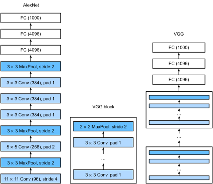

```{.python .input  n=1}
%load_ext d2lbook.tab
tab.interact_select(['mxnet', 'pytorch', 'tensorflow', 'jax'])
```

# Réseaux utilisant des blocs (VGG)
:label:`sec_vgg`

Alors qu'AlexNet offrait des preuves empiriques que les CNN profonds
peuvent obtenir de bons résultats, il ne fournissait pas de modèle général
pour guider les chercheurs ultérieurs dans la conception de nouveaux réseaux.
Dans les sections suivantes, nous introduirons plusieurs concepts heuristiques
couramment utilisés pour concevoir des réseaux profonds.

Les progrès dans ce domaine reflètent ceux de la VLSI (intégration à très grande échelle) 
dans la conception de puces
où les ingénieurs sont passés du placement de transistors
à des éléments logiques, puis à des blocs logiques :cite:`Mead.1980`.
De même, la conception des architectures de réseaux de neurones
est devenue progressivement plus abstraite,
les chercheurs passant d'une réflexion en termes de
neurones individuels à des couches entières,
et maintenant à des blocs, des motifs répétés de couches. Une décennie plus tard, cela a maintenant
progressé jusqu'à l'utilisation par les chercheurs de modèles entièrement entraînés pour les réutiliser pour des tâches différentes, 
bien que liées. Ces grands modèles pré-entraînés sont généralement appelés 
*modèles fondations* (foundation models) :cite:`bommasani2021opportunities`. 

Retour à la conception des réseaux. L'idée d'utiliser des blocs est apparue pour la première fois avec le
Visual Geometry Group (VGG) de l'Université d'Oxford,
dans leur réseau éponyme *VGG* :cite:`Simonyan.Zisserman.2014`.
Il est facile d'implémenter ces structures répétées en code
avec n'importe quel framework de deep learning moderne en utilisant des boucles et des sous-programmes.

```{.python .input}
%%tab mxnet
from d2l import mxnet as d2l
from mxnet import np, npx, init
from mxnet.gluon import nn
npx.set_np()
```

```{.python .input}
%%tab pytorch
from d2l import torch as d2l
import torch
from torch import nn
```

```{.python .input}
%%tab tensorflow
import tensorflow as tf
from d2l import tensorflow as d2l
```

```{.python .input}
%%tab jax
from d2l import jax as d2l
from flax import linen as nn
import jax
```

## (**Blocs VGG**)
:label:`subsec_vgg-blocks`

Le bloc de construction de base des CNN
est une séquence des éléments suivants :
(i) une couche convolutive
avec un remplissage (padding) pour maintenir la résolution,
(ii) une non-linéarité telle qu'une ReLU,
(iii) une couche de regroupement (pooling) telle
que le max-pooling pour réduire la résolution. L'un des problèmes de 
cette approche est que la résolution spatiale diminue assez rapidement. En particulier, 
cela impose une limite stricte de $\log_2 d$ couches convolutives au réseau avant que toutes 
les dimensions ($d$) ne soient épuisées. Par exemple, dans le cas d'ImageNet, il serait impossible d'avoir 
plus de 8 couches convolutives de cette manière. 

L'idée clé de :citet:`Simonyan.Zisserman.2014` était d'utiliser *plusieurs* convolutions entre les étapes de sous-échantillonnage
via le max-pooling sous la forme d'un bloc. Ils s'intéressaient principalement à savoir si les réseaux profonds ou 
larges étaient les plus performants. Par exemple, l'application successive de deux convolutions $3 \times 3$
touche les mêmes pixels qu'une seule convolution $5 \times 5$. Dans le même temps, cette dernière utilise approximativement 
autant de paramètres ($25 \cdot c^2$) que trois convolutions $3 \times 3$ ($3 \cdot 9 \cdot c^2$). 
Dans une analyse assez détaillée, ils ont montré que les réseaux profonds et étroits surpassent considérablement leurs homologues peu profonds. Cela a lancé le deep learning dans une quête de réseaux toujours plus profonds avec plus de 100 couches pour des applications typiques.
L'empilement de convolutions $3 \times 3$
est devenu une norme d'excellence dans les réseaux profonds ultérieurs (une décision de conception qui n'a été remise en question que récemment par 
:citet:`liu2022convnet`). Par conséquent, les implémentations rapides pour les petites convolutions sont devenues un élément de base sur les GPU :cite:`lavin2016fast`. 

Retour à VGG : un bloc VGG consiste en une *séquence* de convolutions avec des noyaux $3\times3$ et un remplissage de 1 
(conservant la hauteur et la largeur), suivie d'une couche de max-pooling $2 \times 2$ avec une foulée (stride) de 2
(divisant par deux la hauteur et la largeur après chaque bloc).
Dans le code ci-dessous, nous définissons une fonction appelée `vgg_block`
pour implémenter un bloc VGG.

La fonction ci-dessous prend deux arguments,
correspondant au nombre de couches convolutives `num_convs`
et au nombre de canaux de sortie `num_channels`.

```{.python .input  n=2}
%%tab mxnet
def vgg_block(num_convs, num_channels):
    blk = nn.Sequential()
    for _ in range(num_convs):
        blk.add(nn.Conv2D(num_channels, kernel_size=3,
                          padding=1, activation='relu'))
    blk.add(nn.MaxPool2D(pool_size=2, strides=2))
    return blk
```

```{.python .input  n=3}
%%tab pytorch
def vgg_block(num_convs, out_channels):
    layers = []
    for _ in range(num_convs):
        layers.append(nn.LazyConv2d(out_channels, kernel_size=3, padding=1))
        layers.append(nn.ReLU())
    layers.append(nn.MaxPool2d(kernel_size=2,stride=2))
    return nn.Sequential(*layers)
```

```{.python .input  n=4}
%%tab tensorflow
def vgg_block(num_convs, num_channels):
    blk = tf.keras.models.Sequential()
    for _ in range(num_convs):
        blk.add(
            tf.keras.layers.Conv2D(num_channels, kernel_size=3,
                                   padding='same', activation='relu'))
    blk.add(tf.keras.layers.MaxPool2D(pool_size=2, strides=2))
    return blk
```

```{.python .input}
%%tab jax
def vgg_block(num_convs, out_channels):
    layers = []
    for _ in range(num_convs):
        layers.append(nn.Conv(out_channels, kernel_size=(3, 3), padding=(1, 1)))
        layers.append(nn.relu)
    layers.append(lambda x: nn.max_pool(x, window_shape=(2, 2), strides=(2, 2)))
    return nn.Sequential(layers)
```

## [**Réseau VGG**]
:label:`subsec_vgg-network`

Comme AlexNet et LeNet, 
le réseau VGG peut être divisé en deux parties :
la première consistant principalement en des couches convolutives et de regroupement
et la seconde consistant en des couches entièrement connectées qui sont identiques à celles d'AlexNet. 
La différence clé est 
que les couches convolutives sont regroupées dans des transformations non linéaires qui 
laissent la dimensionnalité inchangée, suivies d'une étape de réduction de résolution, comme 
illustré dans :numref:`fig_vgg`. 


:width:`400px`
:label:`fig_vgg`

La partie convolutive du réseau connecte successivement plusieurs blocs VGG de la :numref:`fig_vgg` (également définis dans la fonction `vgg_block`). Ce regroupement de convolutions est un motif qui est 
resté presque inchangé au cours de la dernière décennie, bien que le choix spécifique des 
opérations ait subi des modifications considérables. 
La variable `arch` consiste en une liste de tuples (un par bloc),
où chacun contient deux valeurs : le nombre de couches convolutives
et le nombre de canaux de sortie,
qui sont précisément les arguments requis pour appeler
la fonction `vgg_block`. À ce titre, VGG définit une *famille* de réseaux plutôt qu'une 
simple manifestation spécifique. Pour construire un réseau spécifique, nous itérons simplement sur `arch` pour composer les blocs.

```{.python .input  n=5}
%%tab pytorch, mxnet, tensorflow
class VGG(d2l.Classifier):
    def __init__(self, arch, lr=0.1, num_classes=10):
        super().__init__()
        self.save_hyperparameters()
        if tab.selected('mxnet'):
            self.net = nn.Sequential()
            for (num_convs, num_channels) in arch:
                self.net.add(vgg_block(num_convs, num_channels))
            self.net.add(nn.Dense(4096, activation='relu'), nn.Dropout(0.5),
                         nn.Dense(4096, activation='relu'), nn.Dropout(0.5),
                         nn.Dense(num_classes))
            self.net.initialize(init.Xavier())
        if tab.selected('pytorch'):
            conv_blks = []
            for (num_convs, out_channels) in arch:
                conv_blks.append(vgg_block(num_convs, out_channels))
            self.net = nn.Sequential(
                *conv_blks, nn.Flatten(),
                nn.LazyLinear(4096), nn.ReLU(), nn.Dropout(0.5),
                nn.LazyLinear(4096), nn.ReLU(), nn.Dropout(0.5),
                nn.LazyLinear(num_classes))
            self.net.apply(d2l.init_cnn)
        if tab.selected('tensorflow'):
            self.net = tf.keras.models.Sequential()
            for (num_convs, num_channels) in arch:
                self.net.add(vgg_block(num_convs, num_channels))
            self.net.add(
                tf.keras.models.Sequential([
                tf.keras.layers.Flatten(),
                tf.keras.layers.Dense(4096, activation='relu'),
                tf.keras.layers.Dropout(0.5),
                tf.keras.layers.Dense(4096, activation='relu'),
                tf.keras.layers.Dropout(0.5),
                tf.keras.layers.Dense(num_classes)]))
```

```{.python .input  n=5}
%%tab jax
class VGG(d2l.Classifier):
    arch: list
    lr: float = 0.1
    num_classes: int = 10
    training: bool = True

    def setup(self):
        conv_blks = []
        for (num_convs, out_channels) in self.arch:
            conv_blks.append(vgg_block(num_convs, out_channels))

        self.net = nn.Sequential([
            *conv_blks,
            lambda x: x.reshape((x.shape[0], -1)),  # flatten
            nn.Dense(4096), nn.relu,
            nn.Dropout(0.5, deterministic=not self.training),
            nn.Dense(4096), nn.relu,
            nn.Dropout(0.5, deterministic=not self.training),
            nn.Dense(self.num_classes)])
```

Le réseau VGG original comportait cinq blocs convolutifs,
parmi lesquels les deux premiers ont une couche convolutive chacun
et les trois derniers contiennent deux couches convolutives chacun.
Le premier bloc possède 64 canaux de sortie
et chaque bloc suivant double le nombre de canaux de sortie,
jusqu'à ce que ce nombre atteigne 512.
Comme ce réseau utilise huit couches convolutives
et trois couches entièrement connectées, on l'appelle souvent VGG-11.

```{.python .input  n=6}
%%tab pytorch, mxnet
VGG(arch=((1, 64), (1, 128), (2, 256), (2, 512), (2, 512))).layer_summary(
    (1, 1, 224, 224))
```

```{.python .input  n=7}
%%tab tensorflow
VGG(arch=((1, 64), (1, 128), (2, 256), (2, 512), (2, 512))).layer_summary(
    (1, 224, 224, 1))
```

```{.python .input}
%%tab jax
VGG(arch=((1, 64), (1, 128), (2, 256), (2, 512), (2, 512)),
    training=False).layer_summary((1, 224, 224, 1))
```

Comme vous pouvez le voir, nous divisons par deux la hauteur et la largeur à chaque bloc,
pour finalement atteindre une hauteur et une largeur de 7
avant d'aplatir les représentations
pour qu'elles soient traitées par la partie entièrement connectée du réseau. 
:citet:`Simonyan.Zisserman.2014` a décrit plusieurs autres variantes de VGG. 
En fait, il est devenu la norme de proposer des *familles* de réseaux avec 
différents compromis vitesse-précision lors de l'introduction d'une nouvelle architecture. 

## Entraînement

[**Comme VGG-11 est plus exigeant en termes de calcul qu'AlexNet,
nous construisons un réseau avec un nombre de canaux plus petit.**]
C'est plus que suffisant pour l'entraînement sur Fashion-MNIST.
Le processus d'[**entraînement du modèle**] est similaire à celui d'AlexNet dans la :numref:`sec_alexnet`. 
Observez à nouveau la correspondance étroite entre les pertes de validation et d'entraînement, 
suggérant seulement une petite quantité de surapprentissage.

```{.python .input  n=8}
%%tab mxnet, pytorch, jax
model = VGG(arch=((1, 16), (1, 32), (2, 64), (2, 128), (2, 128)), lr=0.01)
trainer = d2l.Trainer(max_epochs=10, num_gpus=1)
data = d2l.FashionMNIST(batch_size=128, resize=(224, 224))
if tab.selected('pytorch'):
    model.apply_init([next(iter(data.get_dataloader(True)))[0]], d2l.init_cnn)
trainer.fit(model, data)
```

```{.python .input  n=9}
%%tab tensorflow
trainer = d2l.Trainer(max_epochs=10)
data = d2l.FashionMNIST(batch_size=128, resize=(224, 224))
with d2l.try_gpu():
    model = VGG(arch=((1, 16), (1, 32), (2, 64), (2, 128), (2, 128)), lr=0.01)
    trainer.fit(model, data)
```

## Résumé

On pourrait soutenir que VGG est le premier réseau de neurones convolutif véritablement moderne. Alors qu'AlexNet a introduit de nombreux composants de ce qui rend le deep learning efficace à grande échelle, c'est VGG qui a sans doute introduit des propriétés clés telles que les blocs de convolutions multiples et une préférence pour les réseaux profonds et étroits. C'est également le premier réseau qui est en fait toute une famille de modèles paramétrés de manière similaire, offrant au praticien un large compromis entre complexité et vitesse. C'est aussi là que les frameworks de deep learning modernes brillent. Il n'est plus nécessaire de générer des fichiers de configuration XML pour spécifier un réseau, mais plutôt d'assembler lesdits réseaux par simple code Python. 

Plus récemment, ParNet :cite:`Goyal.Bochkovskiy.Deng.ea.2021` a démontré qu'il est possible d'obtenir des performances compétitives en utilisant une architecture beaucoup plus peu profonde grâce à un grand nombre de calculs parallèles. C'est un développement passionnant et on peut espérer qu'il influencera les conceptions d'architectures à l'avenir. Pour le reste du chapitre, cependant, nous suivrons le chemin du progrès scientifique de la dernière décennie. 

## Exercices


1. Comparé à AlexNet, VGG est beaucoup plus lent en termes de calcul et nécessite également plus de mémoire GPU. 
    1. Comparez le nombre de paramètres nécessaires pour AlexNet et VGG.
    1. Comparez le nombre d'opérations en virgule flottante utilisées dans les couches convolutives et dans les couches entièrement connectées. 
    1. Comment pourriez-vous réduire le coût de calcul généré par les couches entièrement connectées ?
1. Lors de l'affichage des dimensions associées aux différentes couches du réseau, nous ne voyons que les informations associées à huit blocs (plus quelques transformations auxiliaires), même si le réseau possède 11 couches. Où sont passées les trois couches restantes ?
1. Utilisez le tableau 1 de l'article VGG :cite:`Simonyan.Zisserman.2014` pour construire d'autres modèles courants, tels que VGG-16 ou VGG-19.
1. Augmenter la résolution de Fashion-MNIST d'un facteur huit, de $28 \times 28$ à $224 \times 224$ dimensions, est un gaspillage important. Essayez de modifier l'architecture du réseau et la conversion de résolution, par exemple vers 56 ou 84 dimensions pour son entrée. Pouvez-vous le faire sans réduire la précision du réseau ? Consultez l'article VGG :cite:`Simonyan.Zisserman.2014` pour des idées sur l'ajout de plus de non-linéarités avant le sous-échantillonnage.

:begin_tab:`mxnet`
[Discussions](https://discuss.d2l.ai/t/77)
:end_tab:

:begin_tab:`pytorch`
[Discussions](https://discuss.d2l.ai/t/78)
:end_tab:

:begin_tab:`tensorflow`
[Discussions](https://discuss.d2l.ai/t/277)
:end_tab:

:begin_tab:`jax`
[Discussions](https://discuss.d2l.ai/t/18002)
:end_tab:
