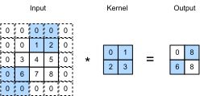

```{.python .input}
%load_ext d2lbook.tab
tab.interact_select(['mxnet', 'pytorch', 'tensorflow', 'jax'])
```

# Remplissage et pas
:label:`sec_padding`

Rappelez-vous l'exemple d'une convolution dans la :numref:`fig_correlation`.
L'entrée avait une hauteur et une largeur de 3
et le noyau de convolution avait une hauteur et une largeur de 2,
produisant une représentation en sortie de dimension $2\times2$.
En supposant que la forme de l'entrée soit $n_\textrm{h}\times n_\textrm{w}$
et que la forme du noyau de convolution soit $k_\textrm{h}\times k_\textrm{w}$,
la forme de la sortie sera $(n_\textrm{h}-k_\textrm{h}+1) \times (n_\textrm{w}-k_\textrm{w}+1)$ :
nous ne pouvons faire glisser le noyau de convolution que jusqu'à ce qu'il n'y ait plus
de pixels sur lesquels appliquer la convolution.

Dans ce qui suit, nous explorerons un certain nombre de techniques,
notamment le remplissage et les convolutions à pas (strided convolutions),
qui offrent plus de contrôle sur la taille de la sortie.
Comme motivation, notez que puisque les noyaux ont généralement
une largeur et une hauteur supérieures à 1,
après avoir appliqué de nombreuses convolutions successives,
nous avons tendance à nous retrouver avec des sorties
considérablement plus petites que notre entrée.
Si nous commençons par une image de $240 \times 240$ pixels,
dix couches de convolutions $5 \times 5$
réduisent l'image à $200 \times 200$ pixels,
supprimant $30 \%$ de l'image et, par la même occasion,
effaçant toute information intéressante
sur les bords de l'image originale.
Le *remplissage* (padding) est l'outil le plus populaire pour gérer ce problème.
Dans d'autres cas, nous pouvons vouloir réduire considérablement la dimensionnalité,
par exemple si nous trouvons la résolution d'entrée originale trop encombrante.
Les *convolutions à pas* sont une technique populaire qui peut aider dans ces cas-là.

```{.python .input}
%%tab mxnet
from mxnet import np, npx
from mxnet.gluon import nn
npx.set_np()
```

```{.python .input}
%%tab pytorch
import torch
from torch import nn
```

```{.python .input}
%%tab tensorflow
import tensorflow as tf
```

```{.python .input}
%%tab jax
from d2l import jax as d2l
from flax import linen as nn
import jax
from jax import numpy as jnp
```

## Remplissage

Comme décrit plus haut, un problème délicat lors de l'application de couches convolutives
est que nous avons tendance à perdre des pixels sur le périmètre de notre image. Considérez la :numref:`img_conv_reuse` qui illustre l'utilisation des pixels en fonction de la taille du noyau de convolution et de la position dans l'image. Les pixels dans les coins sont à peine utilisés.


:label:`img_conv_reuse`

Comme nous utilisons généralement de petits noyaux,
pour une convolution donnée,
nous pourrions ne perdre que quelques pixels,
mais cela peut s'accumuler à mesure que nous appliquons
de nombreuses couches convolutives successives.
Une solution simple à ce problème
consiste à ajouter des pixels supplémentaires de remplissage autour de la bordure de notre image d'entrée,
augmentant ainsi la taille effective de l'image.
Généralement, nous fixons la valeur des pixels supplémentaires à zéro.
Dans la :numref:`img_conv_pad`, nous appliquons un remplissage à une entrée $3 \times 3$,
augmentant sa taille à $5 \times 5$.
La sortie correspondante passe alors à une matrice $4 \times 4$.
Les portions ombrées représentent le premier élément de sortie ainsi que les éléments des tenseurs d'entrée et de noyau utilisés pour le calcul de la sortie : $0\times0+0\times1+0\times2+0\times3=0$.


:label:`img_conv_pad`

En général, si nous ajoutons un total de $p_\textrm{h}$ lignes de remplissage
(environ la moitié en haut et la moitié en bas)
et un total de $p_\textrm{w}$ colonnes de remplissage
(environ la moitié à gauche et la moitié à droite),
la forme de la sortie sera

$$(n_\textrm{h}-k_\textrm{h}+p_\textrm{h}+1)\times(n_\textrm{w}-k_\textrm{w}+p_\textrm{w}+1).$$

Cela signifie que la hauteur et la largeur de la sortie
augmenteront respectivement de $p_\textrm{h}$ et $p_\textrm{w}$.

Dans de nombreux cas, nous voudrons fixer $p_\textrm{h}=k_\textrm{h}-1$ et $p_\textrm{w}=k_\textrm{w}-1$
pour donner à l'entrée et à la sortie les mêmes hauteur et largeur.
Cela facilitera la prédiction de la forme de sortie de chaque couche
lors de la construction du réseau.
En supposant que $k_\textrm{h}$ soit impair ici,
nous ajouterons $p_\textrm{h}/2$ lignes de chaque côté de la hauteur.
Si $k_\textrm{h}$ est pair, une possibilité est d'ajouter
$\lceil p_\textrm{h}/2\rceil$ lignes en haut de l'entrée
et $\lfloor p_\textrm{h}/2\rfloor$ lignes en bas.
Nous remplirons les deux côtés de la largeur de la même manière.

Les CNN utilisent couramment des noyaux de convolution
avec des valeurs de hauteur et de largeur impaires, telles que 1, 3, 5 ou 7.
Le choix de tailles de noyau impaires présente l'avantage
de pouvoir préserver la dimensionnalité
tout en ajoutant le même nombre de lignes en haut et en bas,
et le même nombre de colonnes à gauche et à droite.

De plus, cette pratique consistant à utiliser des noyaux impairs
et un remplissage pour préserver précisément la dimensionnalité
offre un avantage pratique.
Pour tout tenseur bidimensionnel `X`,
lorsque la taille du noyau est impaire
et que le nombre de lignes et de colonnes de remplissage
de tous les côtés est le même,
produisant ainsi une sortie de même hauteur et largeur que l'entrée,
nous savons que la sortie `Y[i, j]` est calculée
par corrélation croisée de l'entrée et du noyau de convolution
avec la fenêtre centrée sur `X[i, j]`.

Dans l'exemple suivant, nous créons une couche convolutive bidimensionnelle
avec une hauteur et une largeur de 3
et (**appliquons 1 pixel de remplissage de tous les côtés.**)
Étant donné une entrée d'une hauteur et d'une largeur de 8,
nous constatons que la hauteur et la largeur de la sortie sont également de 8.

```{.python .input}
%%tab mxnet
# We define a helper function to calculate convolutions. It initializes 
# the convolutional layer weights and performs corresponding dimensionality 
# elevations and reductions on the input and output
def comp_conv2d(conv2d, X):
    conv2d.initialize()
    # (1, 1) indicates that batch size and the number of channels are both 1
    X = X.reshape((1, 1) + X.shape)
    Y = conv2d(X)
    # Strip the first two dimensions: examples and channels
    return Y.reshape(Y.shape[2:])

# 1 row and column is padded on either side, so a total of 2 rows or columns are added
conv2d = nn.Conv2D(1, kernel_size=3, padding=1)
X = np.random.uniform(size=(8, 8))
comp_conv2d(conv2d, X).shape
```

```{.python .input}
%%tab pytorch
# We define a helper function to calculate convolutions. It initializes the
# convolutional layer weights and performs corresponding dimensionality
# elevations and reductions on the input and output
def comp_conv2d(conv2d, X):
    # (1, 1) indicates that batch size and the number of channels are both 1
    X = X.reshape((1, 1) + X.shape)
    Y = conv2d(X)
    # Strip the first two dimensions: examples and channels
    return Y.reshape(Y.shape[2:])

# 1 row and column is padded on either side, so a total of 2 rows or columns
# are added
conv2d = nn.LazyConv2d(1, kernel_size=3, padding=1)
X = torch.rand(size=(8, 8))
comp_conv2d(conv2d, X).shape
```

```{.python .input}
%%tab tensorflow
# We define a helper function to calculate convolutions. It initializes
# the convolutional layer weights and performs corresponding dimensionality
# elevations and reductions on the input and output
def comp_conv2d(conv2d, X):
    # (1, 1) indicates that batch size and the number of channels are both 1
    X = tf.reshape(X, (1, ) + X.shape + (1, ))
    Y = conv2d(X)
    # Strip the first two dimensions: examples and channels
    return tf.reshape(Y, Y.shape[1:3])
# 1 row and column is padded on either side, so a total of 2 rows or columns
# are added
conv2d = tf.keras.layers.Conv2D(1, kernel_size=3, padding='same')
X = tf.random.uniform(shape=(8, 8))
comp_conv2d(conv2d, X).shape
```

```{.python .input}
%%tab jax
# We define a helper function to calculate convolutions. It initializes
# the convolutional layer weights and performs corresponding dimensionality
# elevations and reductions on the input and output
def comp_conv2d(conv2d, X):
    # (1, X.shape, 1) indicates that batch size and the number of channels are both 1
    key = jax.random.PRNGKey(d2l.get_seed())
    X = X.reshape((1,) + X.shape + (1,))
    Y, _ = conv2d.init_with_output(key, X)
    # Strip the dimensions: examples and channels
    return Y.reshape(Y.shape[1:3])
# 1 row and column is padded on either side, so a total of 2 rows or columns are added
conv2d = nn.Conv(1, kernel_size=(3, 3), padding='SAME')
X = jax.random.uniform(jax.random.PRNGKey(d2l.get_seed()), shape=(8, 8))
comp_conv2d(conv2d, X).shape
```

Lorsque la hauteur et la largeur du noyau de convolution sont différentes,
nous pouvons faire en sorte que la sortie et l'entrée aient les mêmes hauteur et largeur
en [**définissant des nombres de remplissage différents pour la hauteur et la largeur.**]

```{.python .input}
%%tab mxnet
# We use a convolution kernel with height 5 and width 3. The padding on
# either side of the height and width are 2 and 1, respectively
conv2d = nn.Conv2D(1, kernel_size=(5, 3), padding=(2, 1))
comp_conv2d(conv2d, X).shape
```

```{.python .input}
%%tab pytorch
# We use a convolution kernel with height 5 and width 3. The padding on either
# side of the height and width are 2 and 1, respectively
conv2d = nn.LazyConv2d(1, kernel_size=(5, 3), padding=(2, 1))
comp_conv2d(conv2d, X).shape
```

```{.python .input}
%%tab tensorflow
# We use a convolution kernel with height 5 and width 3. The padding on
# either side of the height and width are 2 and 1, respectively
conv2d = tf.keras.layers.Conv2D(1, kernel_size=(5, 3), padding='same')
comp_conv2d(conv2d, X).shape
```

```{.python .input}
%%tab jax
# We use a convolution kernel with height 5 and width 3. The padding on
# either side of the height and width are 2 and 1, respectively
conv2d = nn.Conv(1, kernel_size=(5, 3), padding=(2, 1))
comp_conv2d(conv2d, X).shape
```

## Pas

Lors du calcul de la corrélation croisée,
nous commençons avec la fenêtre de convolution
dans le coin supérieur gauche du tenseur d'entrée,
puis nous la faisons glisser sur tous les emplacements vers le bas et vers la droite.
Dans les exemples précédents, nous avons fait glisser par défaut un élément à la fois.
Cependant, parfois, soit pour l'efficacité de calcul,
soit parce que nous souhaitons sous-échantillonner,
nous déplaçons notre fenêtre de plus d'un élément à la fois,
en sautant les emplacements intermédiaires. C'est particulièrement utile si le noyau de convolution
est grand car il capture une large zone de l'image sous-jacente.

Nous appelons *pas* (stride) le nombre de lignes et de colonnes parcourues par glissement.
Jusqu'à présent, nous avons utilisé des pas de 1, tant pour la hauteur que pour la largeur.
Parfois, nous pouvons vouloir utiliser un pas plus grand.
La :numref:`img_conv_stride` montre une opération de corrélation croisée bidimensionnelle
avec un pas de 3 verticalement et 2 horizontalement.
Les portions ombrées sont les éléments de sortie ainsi que les éléments des tenseurs d'entrée et de noyau utilisés pour le calcul de la sortie : $0\times0+0\times1+1\times2+2\times3=8$, $0\times0+6\times1+0\times2+0\times3=6$.
Nous pouvons voir que lorsque le deuxième élément de la première colonne est généré,
la fenêtre de convolution glisse de trois lignes vers le bas.
La fenêtre de convolution glisse de deux colonnes vers la droite
lorsque le deuxième élément de la première ligne est généré.
Lorsque la fenêtre de convolution continue de glisser de deux colonnes vers la droite sur l'entrée,
il n'y a pas de sortie car l'élément d'entrée ne peut pas remplir la fenêtre
(à moins d'ajouter une autre colonne de remplissage).


:label:`img_conv_stride`

En général, lorsque le pas pour la hauteur est $s_\textrm{h}$
et le pas pour la largeur est $s_\textrm{w}$, la forme de la sortie est

$$\lfloor(n_\textrm{h}-k_\textrm{h}+p_\textrm{h}+s_\textrm{h})/s_\textrm{h}\rfloor \times \lfloor(n_\textrm{w}-k_\textrm{w}+p_\textrm{w}+s_\textrm{w})/s_\textrm{w}\rfloor.$$

Si nous fixons $p_\textrm{h}=k_\textrm{h}-1$ and $p_\textrm{w}=k_\textrm{w}-1$,
alors la forme de la sortie peut être simplifiée en
$\lfloor(n_\textrm{h}+s_\textrm{h}-1)/s_\textrm{h}\rfloor \times \lfloor(n_\textrm{w}+s_\textrm{w}-1)/s_\textrm{w}\rfloor$.
Pour aller plus loin, si la hauteur et la largeur de l'entrée
sont divisibles par les pas sur la hauteur et la largeur,
alors la forme de la sortie sera $(n_\textrm{h}/s_\textrm{h}) \times (n_\textrm{w}/s_\textrm{w})$.

Ci-dessous, nous [**fixons les pas sur la hauteur et la largeur à 2**],
réduisant ainsi de moitié la hauteur et la largeur de l'entrée.

```{.python .input}
%%tab mxnet
conv2d = nn.Conv2D(1, kernel_size=3, padding=1, strides=2)
comp_conv2d(conv2d, X).shape
```

```{.python .input}
%%tab pytorch
conv2d = nn.LazyConv2d(1, kernel_size=3, padding=1, stride=2)
comp_conv2d(conv2d, X).shape
```

```{.python .input}
%%tab tensorflow
conv2d = tf.keras.layers.Conv2D(1, kernel_size=3, padding='same', strides=2)
comp_conv2d(conv2d, X).shape
```

```{.python .input}
%%tab jax
conv2d = nn.Conv(1, kernel_size=(3, 3), padding=1, strides=2)
comp_conv2d(conv2d, X).shape
```

Voyons (**un exemple légèrement plus complexe**).

```{.python .input}
%%tab mxnet
conv2d = nn.Conv2D(1, kernel_size=(3, 5), padding=(0, 1), strides=(3, 4))
comp_conv2d(conv2d, X).shape
```

```{.python .input}
%%tab pytorch
conv2d = nn.LazyConv2d(1, kernel_size=(3, 5), padding=(0, 1), stride=(3, 4))
comp_conv2d(conv2d, X).shape
```

```{.python .input}
%%tab tensorflow
conv2d = tf.keras.layers.Conv2D(1, kernel_size=(3,5), padding='valid',
                                strides=(3, 4))
comp_conv2d(conv2d, X).shape
```

```{.python .input}
%%tab jax
conv2d = nn.Conv(1, kernel_size=(3, 5), padding=(0, 1), strides=(3, 4))
comp_conv2d(conv2d, X).shape
```

## Résumé et discussion

Le remplissage peut augmenter la hauteur et la largeur de la sortie. Ceci est souvent utilisé pour donner à la sortie les mêmes hauteur et largeur qu'à l'entrée afin d'éviter une réduction indésirable de la sortie. De plus, cela garantit que tous les pixels sont utilisés avec la même fréquence. Généralement, nous choisissons un remplissage symétrique des deux côtés de la hauteur et de la largeur de l'entrée. Dans ce cas, nous parlons de remplissage $(p_\textrm{h}, p_\textrm{w})$. Le plus souvent, nous fixons $p_\textrm{h} = p_\textrm{w}$, auquel cas nous indiquons simplement que nous choisissons un remplissage $p$.

Une convention similaire s'applique aux pas. Lorsque le pas horizontal $s_\textrm{h}$ et le pas vertical $s_\textrm{w}$ correspondent, nous parlons simplement de pas $s$. Le pas peut réduire la résolution de la sortie, par exemple en réduisant la hauteur et la largeur de la sortie à seulement $1/n$ de la hauteur et de la largeur de l'entrée pour $n > 1$. Par défaut, le remplissage est de 0 et le pas est de 1.

Jusqu'à présent, tous les remplissages dont nous avons discuté consistaient simplement à étendre les images avec des zéros. Cela présente un avantage de calcul significatif car c'est trivial à réaliser. De plus, les opérateurs peuvent être conçus pour tirer parti de ce remplissage implicitement sans avoir besoin d'allouer de la mémoire supplémentaire. En même temps, cela permet aux CNN d'encoder des informations de position implicites dans une image, simplement en apprenant où se trouve l'« espace blanc ». Il existe de nombreuses alternatives au remplissage par des zéros. :citet:`Alsallakh.Kokhlikyan.Miglani.ea.2020` en a fourni un aperçu complet (bien que sans cas clair quant au moment d'utiliser des remplissages non nuls, sauf en cas d'apparition d'artefacts).

## Exercices

1. Étant donné le dernier exemple de code de cette section avec une taille de noyau de $(3, 5)$, un remplissage de $(0, 1)$ et un pas de $(3, 4)$, calculez la forme de la sortie pour vérifier si elle est cohérente avec le résultat expérimental.
1. Pour les signaux audio, à quoi correspond un pas de 2 ?
1. Implémentez le remplissage miroir (mirror padding), c'est-à-dire un remplissage où les valeurs de bordure sont simplement reflétées pour étendre les tenseurs.
1. Quels sont les avantages de calcul d'un pas supérieur à 1 ?
1. Quels pourraient être les avantages statistiques d'un pas supérieur à 1 ?
1. Comment implémenteriez-vous un pas de $\frac{1}{2}$ ? À quoi cela correspond-il ? Quand cela serait-il utile ?

:begin_tab:`mxnet`
[Discussions](https://discuss.d2l.ai/t/67)
:end_tab:

:begin_tab:`pytorch`
[Discussions](https://discuss.d2l.ai/t/68)
:end_tab:

:begin_tab:`tensorflow`
[Discussions](https://discuss.d2l.ai/t/272)
:end_tab:

:begin_tab:`jax`
[Discussions](https://discuss.d2l.ai/t/17997)
:end_tab:
