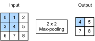

```{.python .input}
%load_ext d2lbook.tab
tab.interact_select(['mxnet', 'pytorch', 'tensorflow', 'jax'])
```

# Regroupement
:label:`sec_pooling`

Dans de nombreux cas, notre tâche finale pose une question globale sur l'image,
par exemple : *contient-elle un chat ?* Par conséquent, les unités de notre couche finale 
doivent être sensibles à l'ensemble de l'entrée.
En agrégeant progressivement les informations, produisant des cartes de plus en plus grossières,
nous atteignons cet objectif d'apprendre finalement une représentation globale,
tout en conservant tous les avantages des couches convolutives aux couches intermédiaires du traitement.
Plus nous avançons dans le réseau,
plus le champ récepteur (par rapport à l'entrée)
auquel chaque nœud caché est sensible est grand. La réduction de la résolution spatiale 
accélère ce processus, 
car les noyaux de convolution couvrent une surface effective plus grande. 

De plus, lors de la détection de caractéristiques de bas niveau, telles que les bords
(comme discuté dans la :numref:`sec_conv_layer`),
nous voulons souvent que nos représentations soient quelque peu invariantes par translation.
Par exemple, si nous prenons l'image `X`
avec une délinéation nette entre le noir et le blanc
et décalons l'image entière d'un pixel vers la droite,
c'est-à-dire `Z[i, j] = X[i, j + 1]`,
alors la sortie pour la nouvelle image `Z` pourrait être radicalement différente.
Le bord se sera décalé d'un pixel.
En réalité, les objets n'apparaissent presque jamais exactement au même endroit.
En fait, même avec un trépied et un objet stationnaire,
les vibrations de l'appareil photo dues au mouvement de l'obturateur
pourraient décaler le tout d'un pixel environ (les appareils photo haut de gamme sont dotés de fonctions spéciales pour résoudre ce problème).

Cette section présente les *couches de regroupement* (*pooling layers*),
qui servent le double objectif d'atténuer la sensibilité des couches convolutives à l'emplacement
et de sous-échantillonner spatialement les représentations.

```{.python .input}
%%tab mxnet
from d2l import mxnet as d2l
from mxnet import np, npx
from mxnet.gluon import nn
npx.set_np()
```

```{.python .input}
%%tab pytorch
from d2l import torch as d2l
import torch
from torch import nn
```

```{.python .input}
%%tab jax
from d2l import jax as d2l
from flax import linen as nn
import jax
from jax import numpy as jnp
```

## Regroupement maximal et regroupement moyen

Comme les couches convolutives, les opérateurs de *regroupement*
consistent en une fenêtre de forme fixe qui glisse sur
toutes les régions de l'entrée selon son pas,
calculant une seule sortie pour chaque emplacement traversé
par la fenêtre de forme fixe (parfois appelée *fenêtre de regroupement*).
Cependant, contrairement au calcul de corrélation croisée
des entrées et des noyaux dans la couche convolutive,
la couche de regroupement ne contient aucun paramètre (il n'y a pas de *noyau*).
Au lieu de cela, les opérateurs de regroupement sont déterministes,
calculant généralement soit la valeur maximale, soit la valeur moyenne
des éléments de la fenêtre de regroupement.
Ces opérations sont respectivement appelées *regroupement maximal* (*max-pooling* en abrégé)
et *regroupement moyen* (*average pooling*).

Le *regroupement moyen* est pratiquement aussi ancien que les CNN. L'idée est proche du 
sous-échantillonnage d'une image. Plutôt que de simplement prendre la valeur d'un pixel sur deux (ou trois) 
pour l'image à basse résolution, nous pouvons faire la moyenne des pixels adjacents pour obtenir 
une image avec un meilleur rapport signal sur bruit puisque nous combinons les informations 
de plusieurs pixels adjacents. Le *regroupement maximal* a été introduit dans 
:citet:`Riesenhuber.Poggio.1999` dans le contexte des neurosciences cognitives pour décrire 
comment l'agrégation d'informations pourrait être agrégée de manière hiérarchique dans le but 
de la reconnaissance d'objets ; il existait déjà une version antérieure en reconnaissance vocale :cite:`Yamaguchi.Sakamoto.Akabane.ea.1990`. Dans presque tous les cas, le regroupement maximal, comme on l'appelle aussi, 
est préférable au regroupement moyen. 

Dans les deux cas, comme avec l'opérateur de corrélation croisée,
nous pouvons considérer que la fenêtre de regroupement
commence en haut à gauche du tenseur d'entrée
et glisse sur celui-ci de gauche à droite et de haut en bas.
À chaque emplacement touché par la fenêtre de regroupement,
elle calcule la valeur maximale ou moyenne
du sous-tenseur d'entrée dans la fenêtre,
selon que le regroupement maximal ou moyen est utilisé.



:label:`fig_pooling`

Le tenseur de sortie dans la :numref:`fig_pooling` a une hauteur de 2 et une largeur de 2.
Les quatre éléments sont dérivés de la valeur maximale dans chaque fenêtre de regroupement :

$$
\max(0, 1, 3, 4)=4,\\
\max(1, 2, 4, 5)=5,\\
\max(3, 4, 6, 7)=7,\\
\max(4, 5, 7, 8)=8.\\
$$

Plus généralement, nous pouvons définir une couche de regroupement de $p \times q$ en agrégeant sur 
une région de ladite taille. Pour en revenir au problème de la détection de bords, 
nous utilisons la sortie de la couche convolutive
comme entrée d'un regroupement maximal de $2\times 2$.
Désignons par `X` l'entrée de la couche convolutive et par `Y` la sortie de la couche de regroupement. 
Que les valeurs de `X[i, j]`, `X[i, j + 1]`, 
`X[i+1, j]` et `X[i+1, j + 1]` soient différentes ou non,
la couche de regroupement produit toujours `Y[i, j] = 1`.
C'est-à-dire qu'en utilisant la couche de regroupement maximal $2\times 2$,
nous pouvons toujours détecter si le motif reconnu par la couche convolutive
ne se déplace pas de plus d'un élément en hauteur ou en largeur.

Dans le code ci-dessous, nous (**implémentons la propagation avant de la couche de regroupement**) dans la fonction `pool2d`.
Cette fonction est similaire à la fonction `corr2d`
dans la :numref:`sec_conv_layer`.
Cependant, aucun noyau n'est nécessaire, le calcul de la sortie
étant soit le maximum soit la moyenne de chaque région de l'entrée.

```{.python .input}
%%tab mxnet, pytorch
def pool2d(X, pool_size, mode='max'):
    p_h, p_w = pool_size
    Y = d2l.zeros((X.shape[0] - p_h + 1, X.shape[1] - p_w + 1))
    for i in range(Y.shape[0]):
        for j in range(Y.shape[1]):
            if mode == 'max':
                Y[i, j] = X[i: i + p_h, j: j + p_w].max()
            elif mode == 'avg':
                Y[i, j] = X[i: i + p_h, j: j + p_w].mean()
    return Y
```

```{.python .input}
%%tab jax
def pool2d(X, pool_size, mode='max'):
    p_h, p_w = pool_size
    Y = jnp.zeros((X.shape[0] - p_h + 1, X.shape[1] - p_w + 1))
    for i in range(Y.shape[0]):
        for j in range(Y.shape[1]):
            if mode == 'max':
                Y = Y.at[i, j].set(X[i: i + p_h, j: j + p_w].max())
            elif mode == 'avg':
                Y = Y.at[i, j].set(X[i: i + p_h, j: j + p_w].mean())
    return Y
```

```{.python .input}
%%tab tensorflow
import tensorflow as tf

def pool2d(X, pool_size, mode='max'):
    p_h, p_w = pool_size
    Y = tf.Variable(tf.zeros((X.shape[0] - p_h + 1, X.shape[1] - p_w +1)))
    for i in range(Y.shape[0]):
        for j in range(Y.shape[1]):
            if mode == 'max':
                Y[i, j].assign(tf.reduce_max(X[i: i + p_h, j: j + p_w]))
            elif mode =='avg':
                Y[i, j].assign(tf.reduce_mean(X[i: i + p_h, j: j + p_w]))
    return Y
```

Nous pouvons construire le tenseur d'entrée `X` de la :numref:`fig_pooling` pour [**valider la sortie de la couche de regroupement maximal bidimensionnelle**].

```{.python .input}
%%tab all
X = d2l.tensor([[0.0, 1.0, 2.0], [3.0, 4.0, 5.0], [6.0, 7.0, 8.0]])
pool2d(X, (2, 2))
```

De plus, nous pouvons expérimenter avec (**la couche de regroupement moyen**).

```{.python .input}
%%tab all
pool2d(X, (2, 2), 'avg')
```

## [**Remplissage et pas**]

Comme pour les couches convolutives, les couches de regroupement
modifient la forme de la sortie.
Et comme précédemment, nous pouvons ajuster l'opération pour obtenir une forme de sortie souhaitée
en ajoutant du remplissage à l'entrée et en ajustant le pas.
Nous pouvons démontrer l'utilisation du remplissage et des pas
dans les couches de regroupement via la couche de regroupement maximal bidimensionnelle intégrée du framework d'apprentissage profond.
Nous construisons d'abord un tenseur d'entrée `X` dont la forme comporte quatre dimensions,
où le nombre d'exemples (taille de lot) et le nombre de canaux sont tous deux de 1.

:begin_tab:`tensorflow`
Notez que contrairement à d'autres frameworks, TensorFlow
préfère et est optimisé pour les entrées avec les canaux en dernier (*channels-last*).
:end_tab:

```{.python .input}
%%tab mxnet, pytorch
X = d2l.reshape(d2l.arange(16, dtype=d2l.float32), (1, 1, 4, 4))
X
```

```{.python .input}
%%tab tensorflow, jax
X = d2l.reshape(d2l.arange(16, dtype=d2l.float32), (1, 4, 4, 1))
X
```

Comme le regroupement agrège les informations d'une zone, (**les frameworks d'apprentissage profond font correspondre par défaut les tailles de fenêtre de regroupement et le pas.**) Par exemple, si nous utilisons une fenêtre de regroupement de forme `(3, 3)`,
nous obtenons un pas de forme `(3, 3)` par défaut.

```{.python .input}
%%tab mxnet
pool2d = nn.MaxPool2D(3)
# Pooling has no model parameters, hence it needs no initialization
pool2d(X)
```

```{.python .input}
%%tab pytorch
pool2d = nn.MaxPool2d(3)
# Pooling has no model parameters, hence it needs no initialization
pool2d(X)
```

```{.python .input}
%%tab tensorflow
pool2d = tf.keras.layers.MaxPool2D(pool_size=[3, 3])
# Pooling has no model parameters, hence it needs no initialization
pool2d(X)
```

```{.python .input}
%%tab jax
# Pooling has no model parameters, hence it needs no initialization
nn.max_pool(X, window_shape=(3, 3), strides=(3, 3))
```

Inutile de dire que [**le pas et le remplissage peuvent être spécifiés manuellement**] pour outrepasser les valeurs par défaut du framework si nécessaire.

```{.python .input}
%%tab mxnet
pool2d = nn.MaxPool2D(3, padding=1, strides=2)
pool2d(X)
```

```{.python .input}
%%tab pytorch
pool2d = nn.MaxPool2d(3, padding=1, stride=2)
pool2d(X)
```

```{.python .input}
%%tab tensorflow
paddings = tf.constant([[0, 0], [1,0], [1,0], [0,0]])
X_padded = tf.pad(X, paddings, "CONSTANT")
pool2d = tf.keras.layers.MaxPool2D(pool_size=[3, 3], padding='valid',
                                   strides=2)
pool2d(X_padded)
```

```{.python .input}
%%tab jax
X_padded = jnp.pad(X, ((0, 0), (1, 0), (1, 0), (0, 0)), mode='constant')
nn.max_pool(X_padded, window_shape=(3, 3), padding='VALID', strides=(2, 2))
```

Bien sûr, nous pouvons spécifier une fenêtre de regroupement rectangulaire arbitraire avec respectivement une hauteur et une largeur arbitraires, comme le montre l'exemple ci-dessous.

```{.python .input}
%%tab mxnet
pool2d = nn.MaxPool2D((2, 3), padding=(0, 1), strides=(2, 3))
pool2d(X)
```

```{.python .input}
%%tab pytorch
pool2d = nn.MaxPool2d((2, 3), stride=(2, 3), padding=(0, 1))
pool2d(X)
```

```{.python .input}
%%tab tensorflow
paddings = tf.constant([[0, 0], [0, 0], [1, 1], [0, 0]])
X_padded = tf.pad(X, paddings, "CONSTANT")

pool2d = tf.keras.layers.MaxPool2D(pool_size=[2, 3], padding='valid',
                                   strides=(2, 3))
pool2d(X_padded)
```

```{.python .input}
%%tab jax

X_padded = jnp.pad(X, ((0, 0), (0, 0), (1, 1), (0, 0)), mode='constant')
nn.max_pool(X_padded, window_shape=(2, 3), strides=(2, 3), padding='VALID')
```

## Canaux multiples

Lors du traitement de données d'entrée multicanaux,
[**la couche de regroupement traite chaque canal d'entrée séparément**],
plutôt que de sommer les entrées sur les canaux
comme dans une couche convolutive.
Cela signifie que le nombre de canaux de sortie pour la couche de regroupement
est le même que le nombre de canaux d'entrée.
Ci-dessous, nous allons concaténer les tenseurs `X` et `X + 1`
sur la dimension du canal pour construire une entrée avec deux canaux.

:begin_tab:`tensorflow`
Notez que cela nécessitera une
concaténation le long de la dernière dimension pour TensorFlow en raison de la syntaxe *channels-last*.
:end_tab:

```{.python .input}
%%tab mxnet, pytorch
X = d2l.concat((X, X + 1), 1)
X
```

```{.python .input}
%%tab tensorflow, jax
# Concatenate along `dim=3` due to channels-last syntax
X = d2l.concat([X, X + 1], 3)
X
```

Comme nous pouvons le voir, le nombre de canaux de sortie est toujours de deux après le regroupement.

```{.python .input}
%%tab mxnet
pool2d = nn.MaxPool2D(3, padding=1, strides=2)
pool2d(X)
```

```{.python .input}
%%tab pytorch
pool2d = nn.MaxPool2d(3, padding=1, stride=2)
pool2d(X)
```

```{.python .input}
%%tab tensorflow
paddings = tf.constant([[0, 0], [1,0], [1,0], [0,0]])
X_padded = tf.pad(X, paddings, "CONSTANT")
pool2d = tf.keras.layers.MaxPool2D(pool_size=[3, 3], padding='valid',
                                   strides=2)
pool2d(X_padded)

```

```{.python .input}
%%tab jax
X_padded = jnp.pad(X, ((0, 0), (1, 0), (1, 0), (0, 0)), mode='constant')
nn.max_pool(X_padded, window_shape=(3, 3), padding='VALID', strides=(2, 2))
```

:begin_tab:`tensorflow`
Notez que la sortie pour le regroupement TensorFlow semble à première vue différente, cependant
numériquement les mêmes résultats sont présentés que pour MXNet et PyTorch.
La différence réside dans la dimensionnalité, et la lecture
verticale de la sortie donne le même résultat que les autres implémentations.
:end_tab:

## Résumé

Le regroupement est une opération extrêmement simple. Il fait exactement ce que son nom indique : agréger les résultats sur une fenêtre de valeurs. Toutes les sémantiques de convolution, telles que les pas et le remplissage, s'appliquent de la même manière qu'auparavant. Notez que le regroupement est indifférent aux canaux, c'est-à-dire qu'il laisse le nombre de canaux inchangé et qu'il s'applique à chaque canal séparément. Enfin, parmi les deux choix de regroupement populaires, le regroupement maximal est préférable au regroupement moyen, car il confère un certain degré d'invariance à la sortie. Un choix courant consiste à choisir une taille de fenêtre de regroupement de $2 \times 2$ pour diviser par quatre la résolution spatiale de la sortie. 

Notez qu'il existe de nombreuses autres façons de réduire la résolution au-delà du regroupement. Par exemple, dans le regroupement stochastique :cite:`Zeiler.Fergus.2013` et le regroupement maximal fractionnaire :cite:`Graham.2014`, l'agrégation est combinée à la randomisation. Cela peut légèrement améliorer la précision dans certains cas. Enfin, comme nous le verrons plus tard avec le mécanisme d'attention, il existe des moyens plus raffinés d'agréger les sorties, par exemple en utilisant l'alignement entre une requête et des vecteurs de représentation. 


## Exercices

1. Implémentez le regroupement moyen via une convolution. 
1. Prouvez que le regroupement maximal ne peut pas être implémenté par une convolution seule. 
1. Le regroupement maximal peut être réalisé à l'aide d'opérations ReLU, c'est-à-dire $\textrm{ReLU}(x) = \max(0, x)$.
    1. Exprimez $\max (a, b)$ en utilisant uniquement des opérations ReLU.
    1. Utilisez ceci pour implémenter le regroupement maximal au moyen de convolutions et de couches ReLU. 
    1. De combien de canaux et de couches avez-vous besoin pour une convolution $2 \times 2$ ? Combien pour une convolution $3 \times 3$ ?
1. Quel est le coût de calcul de la couche de regroupement ? Supposons que l'entrée de la couche de regroupement soit de taille $c\times h\times w$, que la fenêtre de regroupement ait une forme de $p_\textrm{h}\times p_\textrm{w}$ avec un remplissage de $(p_\textrm{h}, p_\textrm{w})$ et un pas de $(s_\textrm{h}, s_\textrm{w})$.
1. Pourquoi vous attendez-vous à ce que le regroupement maximal et le regroupement moyen fonctionnent différemment ?
1. Avons-nous besoin d'une couche de regroupement minimale séparée ? Pouvez-vous la remplacer par une autre opération ?
1. Nous pourrions utiliser l'opération softmax pour le regroupement. Pourquoi ne serait-elle pas si populaire ?

:begin_tab:`mxnet`
[Discussions](https://discuss.d2l.ai/t/71)
:end_tab:

:begin_tab:`pytorch`
[Discussions](https://discuss.d2l.ai/t/72)
:end_tab:

:begin_tab:`tensorflow`
[Discussions](https://discuss.d2l.ai/t/274)
:end_tab:

:begin_tab:`jax`
[Discussions](https://discuss.d2l.ai/t/17999)
:end_tab:
