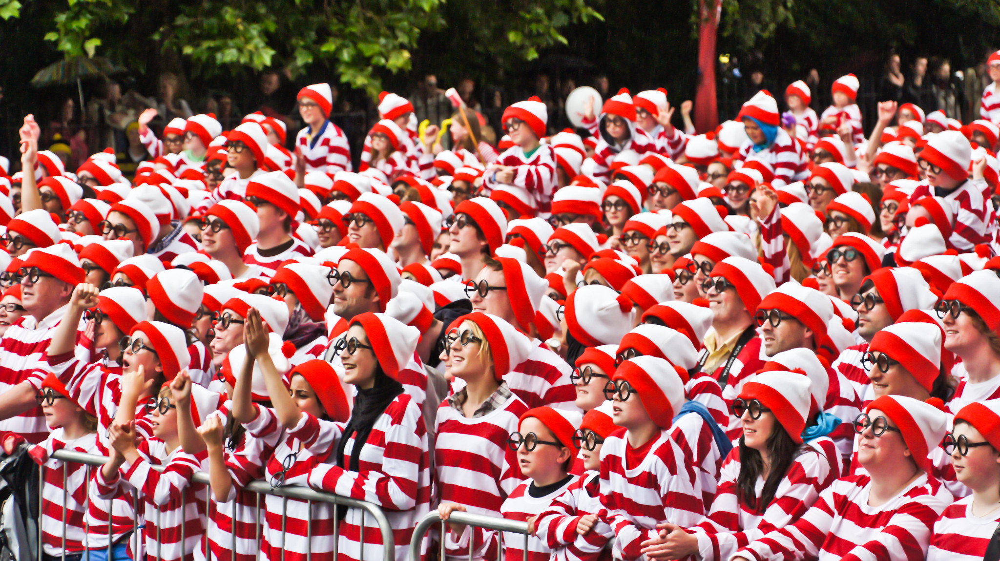

# Des couches entièrement connectées aux convolutions
:label:`sec_why-conv`

À ce jour,
les modèles dont nous avons discuté jusqu'à présent
restent des options appropriées
lorsque nous traitons des données tabulaires.
Par tabulaires, nous entendons que les données se composent
de lignes correspondant à des exemples
et de colonnes correspondant à des caractéristiques.
Avec des données tabulaires, nous pourrions anticiper
que les motifs que nous recherchons pourraient impliquer
des interactions entre les caractéristiques,
mais nous ne supposons aucune structure *a priori*
concernant la manière dont les caractéristiques interagissent.

Parfois, nous manquons véritablement de connaissances pour pouvoir guider la construction d'architectures plus sophistiquées.
Dans ces cas-là, un MLP
peut être le mieux que nous puissions faire.
Cependant, pour des données perceptuelles de grande dimension,
de tels réseaux sans structure peuvent devenir difficiles à gérer.

Par exemple, revenons à notre exemple courant
consistant à distinguer les chats des chiens.
Supposons que nous fassions un travail minutieux de collecte de données,
en collectant un jeu de données annoté de photographies d'un mégapixel.
Cela signifie que chaque entrée du réseau possède un million de dimensions.
Même une réduction agressive à mille dimensions cachées
nécessiterait une couche entièrement connectée
caractérisée par $10^6 \times 10^3 = 10^9$ paramètres.
À moins d'avoir beaucoup de GPU, un talent
pour l'optimisation distribuée,
et une patience extraordinaire,
l'apprentissage des paramètres de ce réseau
pourrait s'avérer irréalisable.

Un lecteur attentif pourrait s'opposer à cet argument
au motif qu'une résolution d'un mégapixel n'est peut-être pas nécessaire.
Cependant, bien que nous puissions peut-être
nous contenter de cent mille pixels,
notre couche cachée de taille 1000 sous-estime grossièrement
le nombre d'unités cachées qu'il faut
pour apprendre de bonnes représentations d'images,
de sorte qu'un système pratique nécessitera toujours des milliards de paramètres.
De plus, l'apprentissage d'un classificateur en ajustant autant de paramètres
pourrait nécessiter la collecte d'un ensemble de données énorme.
Et pourtant, aujourd'hui, les humains comme les ordinateurs sont capables
de distinguer assez bien les chats des chiens,
ce qui semble contredire ces intuitions.
C'est parce que les images présentent une structure riche
qui peut être exploitée par les humains
et les modèles d'apprentissage automatique.
Les réseaux de neurones convolutifs (CNN) sont une manière créative
que l'apprentissage automatique a adoptée pour exploiter
certaines des structures connues dans les images naturelles.

## Invariance

Imaginez que nous voulions détecter un objet dans une image.
Il semble raisonnable que la méthode que nous utilisons
pour reconnaître les objets ne soit pas trop préoccupée
par l'emplacement précis de l'objet dans l'image.
Idéalement, notre système devrait exploiter cette connaissance.
Les cochons ne volent généralement pas et les avions ne nagent généralement pas.
Néanmoins, nous devrions toujours reconnaître
un cochon s'il apparaissait en haut de l'image.
Nous pouvons nous inspirer ici
du jeu pour enfants « Où est Charlie »
(qui a lui-même inspiré de nombreuses imitations réelles, comme celle illustrée dans la :numref:`img_waldo`).
Le jeu consiste en un certain nombre de scènes chaotiques
débordantes d'activités.
Charlie apparaît quelque part dans chacune,
généralement tapi dans un endroit improbable.
Le but du lecteur est de le localiser.
Malgré sa tenue caractéristique,
cela peut être étonnamment difficile,
en raison du grand nombre de distractions.
Cependant, *ce à quoi ressemble Charlie*
ne dépend pas de *l'endroit où se trouve Charlie*.
Nous pourrions balayer l'image avec un détecteur de Charlie
qui pourrait attribuer un score à chaque patch,
indiquant la probabilité que le patch contienne Charlie. 
En fait, de nombreux algorithmes de détection d'objets et de segmentation 
sont basés sur cette approche :cite:`Long.Shelhamer.Darrell.2015`. 
Les CNN systématisent cette idée d'*invariance spatiale*,
l'exploitant pour apprendre des représentations utiles
avec moins de paramètres.

:width:`400px`
:label:`img_waldo`

Nous pouvons maintenant rendre ces intuitions plus concrètes 
en énumérant quelques desiderata pour guider notre conception
d'une architecture de réseau de neurones adaptée à la vision par ordinateur :

1. Dans les premières couches, notre réseau
   devrait répondre de la même manière au même patch,
   quel que soit l'endroit où il apparaît dans l'image. Ce principe est appelé *invariance par translation* (ou *équivariance par translation*).
1. Les premières couches du réseau devraient se concentrer sur les régions locales,
   sans tenir compte du contenu de l'image dans les régions éloignées. C'est le principe de *localité*.
   À terme, ces représentations locales peuvent être agrégées
   pour faire des prédictions au niveau de l'image entière.
1. Au fur et à mesure que nous avançons, les couches plus profondes devraient être capables de capturer des caractéristiques de l'image
   à plus longue portée, d'une manière similaire à la vision de haut niveau dans la nature. 

Voyons comment cela se traduit en mathématiques.

## Contraindre le MLP

Pour commencer, nous pouvons considérer un MLP
avec des images bidimensionnelles $\mathbf{X}$ comme entrées
et leurs représentations cachées immédiates
$\mathbf{H}$ représentées de manière similaire par des matrices (ce sont des tenseurs bidimensionnels dans le code), où $\mathbf{X}$ et $\mathbf{H}$ ont la même forme.
Réfléchissez-y bien.
Nous imaginons maintenant que non seulement les entrées mais
aussi les représentations cachées possèdent une structure spatiale.

Soient $[\mathbf{X}]_{i, j}$ et $[\mathbf{H}]_{i, j}$ le pixel
à l'emplacement $(i,j)$
dans l'image d'entrée et la représentation cachée, respectivement.
Par conséquent, pour que chacune des unités cachées
reçoive une entrée de chacun des pixels d'entrée,
nous passerions de l'utilisation de matrices de poids
(comme nous l'avons fait précédemment dans les MLP)
à la représentation de nos paramètres
sous forme de tenseurs de poids de quatrième ordre $\mathsf{W}$.
Supposons que $\mathbf{U}$ contienne des biais,
nous pourrions exprimer formellement la couche entièrement connectée comme

$$\begin{aligned} \left[\mathbf{H}\right]_{i, j} &= [\mathbf{U}]_{i, j} + \sum_k \sum_l[\mathsf{W}]_{i, j, k, l}  [\mathbf{X}]_{k, l}\\ &=  [\mathbf{U}]_{i, j} +
\sum_a \sum_b [\mathsf{V}]_{i, j, a, b}  [\mathbf{X}]_{i+a, j+b}.\end{aligned}$$

Le passage de $\mathsf{W}$ à $\mathsf{V}$ est purement cosmétique pour l'instant
puisqu'il existe une correspondance biunivoque
entre les coefficients des deux tenseurs de quatrième ordre.
Nous réindexons simplement les indices $(k, l)$
de sorte que $k = i+a$ et $l = j+b$.
En d'autres termes, nous posons $[\mathsf{V}]_{i, j, a, b} = [\mathsf{W}]_{i, j, i+a, j+b}.$
Les indices $a$ et $b$ parcourent des décalages positifs et négatifs,
couvrant l'image entière.
Pour tout emplacement donné ($i$, $j$) dans la représentation cachée $[\mathbf{H}]_{i, j}$,
nous calculons sa valeur en sommant sur les pixels de $x$,
centrés autour de $(i, j)$ et pondérés par $[\mathsf{V}]_{i, j, a, b}$. Avant de continuer, considérons le nombre total de paramètres requis pour une *seule* couche dans cette paramétrisation : une image de $1000 \times 1000$ (1 mégapixel) est mise en correspondance avec une représentation cachée de $1000 \times 1000$. Cela nécessite $10^{12}$ paramètres, bien au-delà de ce que les ordinateurs peuvent actuellement gérer.  

### Invariance par translation

Invoquons maintenant le premier principe
établi ci-dessus : l'invariance par translation :cite:`Zhang.ea.1988`.
Cela implique qu'un décalage de l'entrée $\mathbf{X}$
devrait simplement conduire à un décalage de la représentation cachée $\mathbf{H}$.
Ceci n'est possible que si $\mathsf{V}$ et $\mathbf{U}$ ne dépendent pas réellement de $(i, j)$. À ce titre,
nous avons $[\mathsf{V}]_{i, j, a, b} = [\mathbf{V}]_{a, b}$ et $\mathbf{U}$ est une constante, disons $u$.
En conséquence, nous pouvons simplifier la définition de $\mathbf{H}$ :

$$[\mathbf{H}]_{i, j} = u + \sum_a\sum_b [\mathbf{V}]_{a, b}  [\mathbf{X}]_{i+a, j+b}.$$

C'est une *convolution* !
Nous pondérons effectivement les pixels en $(i+a, j+b)$
au voisinage de l'emplacement $(i, j)$ avec les coefficients $[\mathbf{V}]_{a, b}$
pour obtenir la valeur $[\mathbf{H}]_{i, j}$.
Notez que $[\mathbf{V}]_{a, b}$ nécessite beaucoup moins de coefficients que $[\mathsf{V}]_{i, j, a, b}$ puisqu'il
ne dépend plus de l'emplacement dans l'image. Par conséquent, le nombre de paramètres requis n'est plus de $10^{12}$ mais d'un nombre beaucoup plus raisonnable de $4 \times 10^6$ : nous avons toujours la dépendance envers $a, b \in (-1000, 1000)$. En bref, nous avons fait des progrès significatifs. Les réseaux de neurones à retard temporel (TDNN) sont parmi les premiers exemples à exploiter cette idée :cite:`Waibel.Hanazawa.Hinton.ea.1989`.

### Localité

Invoquons maintenant le deuxième principe : la localité.
Comme motivé plus haut, nous pensons que nous ne devrions pas avoir
à regarder très loin de l'emplacement $(i, j)$
afin de glaner des informations pertinentes
pour évaluer ce qui se passe en $[\mathbf{H}]_{i, j}$.
Cela signifie qu'en dehors d'une certaine plage $|a|> \Delta$ ou $|b| > \Delta$,
nous devrions poser $[\mathbf{V}]_{a, b} = 0$.
De manière équivalente, nous pouvons réécrire $[\mathbf{H}]_{i, j}$ comme

$$[\mathbf{H}]_{i, j} = u + \sum_{a = -\Delta}^{\Delta} \sum_{b = -\Delta}^{\Delta} [\mathbf{V}]_{a, b}  [\mathbf{X}]_{i+a, j+b}.$$
:eqlabel:`eq_conv-layer`

Cela réduit le nombre de paramètres de $4 \times 10^6$ à $4 \Delta^2$, où $\Delta$ est généralement inférieur à $10$. À ce titre, nous avons réduit le nombre de paramètres de quatre autres ordres de grandeur. Notez que l' :eqref:`eq_conv-layer` est ce que l'on appelle, en résumé, une *couche convolutive*. 
Les *réseaux de neurones convolutifs* (CNN)
sont une famille spéciale de réseaux de neurones qui contiennent des couches convolutives.
Dans la communauté de recherche en apprentissage profond,
$\mathbf{V}$ est appelé un *noyau de convolution*,
un *filtre*, ou simplement les *poids* de la couche qui sont des paramètres apprenables.

Alors qu'auparavant, nous aurions pu avoir besoin de milliards de paramètres
pour représenter une seule couche dans un réseau de traitement d'images,
nous n'en avons plus besoin que de quelques centaines, sans
modifier la dimensionnalité des entrées
ni des représentations cachées.
Le prix payé pour cette réduction drastique des paramètres
est que nos caractéristiques sont désormais invariantes par translation
et que notre couche ne peut incorporer que des informations locales,
lors de la détermination de la valeur de chaque activation cachée.
Tout apprentissage dépend de l'imposition d'un biais inductif.
Lorsque ce biais concorde avec la réalité,
nous obtenons des modèles économes en échantillons
qui se généralisent bien aux données invisibles.
Mais bien sûr, si ces biais ne concordent pas avec la réalité,
par exemple si les images s'avéraient ne pas être invariantes par translation,
nos modèles pourraient avoir du mal même à s'ajuster à nos données d'entraînement.

Cette réduction spectaculaire des paramètres nous amène à notre dernier desideratum, 
à savoir que les couches plus profondes devraient représenter des aspects plus vastes et plus complexes 
d'une image. Cela peut être réalisé en intercalant des non-linéarités et des couches 
convolutives de manière répétée. 

## Convolutions

Passons brièvement en revue pourquoi l' :eqref:`eq_conv-layer` est appelée une convolution. 
En mathématiques, la *convolution* entre deux fonctions :cite:`Rudin.1973`,
disons $f, g: \mathbb{R}^d \to \mathbb{R}$ est définie comme

$$(f * g)(\mathbf{x}) = \int f(\mathbf{z}) g(\mathbf{x}-\mathbf{z}) d\mathbf{z}.$$

C'est-à-dire que nous mesurons le chevauchement entre $f$ et $g$
lorsqu'une fonction est « inversée » et décalée de $\mathbf{x}$.
Chaque fois que nous avons des objets discrets, l'intégrale se transforme en somme.
Par exemple, pour des vecteurs issus de
l'ensemble des vecteurs de dimension infinie sommables au carré
avec l'indice parcourant $\mathbb{Z}$, nous obtenons la définition suivante :

$$(f * g)(i) = \sum_a f(a) g(i-a).$$

Pour les tenseurs bidimensionnels, nous avons une somme correspondante
avec les indices $(a, b)$ pour $f$ et $(i-a, j-b)$ pour $g$, respectivement :

$$(f * g)(i, j) = \sum_a\sum_b f(a, b) g(i-a, j-b).$$
:eqlabel:`eq_2d-conv-discrete`

Cela ressemble à l' :eqref:`eq_conv-layer`, avec une différence majeure.
Au lieu d'utiliser $(i+a, j+b)$, nous utilisons la différence.
Notez cependant que cette distinction est principalement cosmétique
puisque nous pouvons toujours faire correspondre la notation entre
l' :eqref:`eq_conv-layer` et l' :eqref:`eq_2d-conv-discrete`.
Notre définition originale dans l' :eqref:`eq_conv-layer` décrit plus proprement
une *corrélation croisée*.
Nous y reviendrons dans la section suivante.

## Canaux
:label:`subsec_why-conv-channels`

Revenons à notre détecteur de Charlie, voyons à quoi cela ressemble.
La couche convolutive choisit des fenêtres d'une taille donnée
et pondère les intensités selon le filtre $\mathsf{V}$, comme illustré dans la :numref:`fig_waldo_mask`.
Nous pourrions viser à apprendre un modèle tel que
là où la « charlitude » est la plus élevée,
nous devrions trouver un pic dans les représentations des couches cachées.

:width:`400px`
:label:`fig_waldo_mask`

Il y a juste un problème avec cette approche.
Jusqu'à présent, nous avons allègrement ignoré que les images se composent
de trois canaux : rouge, vert et bleu. 
En somme, les images ne sont pas des objets bidimensionnels
mais plutôt des tenseurs de troisième ordre,
caractérisés par une hauteur, une largeur et un canal,
par exemple avec une forme de $1024 \times 1024 \times 3$ pixels. 
Alors que les deux premiers de ces axes concernent les relations spatiales,
le troisième peut être considéré comme l'attribution
d'une représentation multidimensionnelle à chaque emplacement de pixel.
Nous indexons donc $\mathsf{X}$ comme $[\mathsf{X}]_{i, j, k}$.
Le filtre convolutif doit s'adapter en conséquence.
Au lieu de $[\mathbf{V}]_{a,b}$, nous avons maintenant $[\mathsf{V}]_{a,b,c}$.

De plus, tout comme notre entrée est constituée d'un tenseur de troisième ordre,
il s'avère que c'est une bonne idée de formuler de la même manière
nos représentations cachées sous forme de tenseurs de troisième ordre $\mathsf{H}$.
En d'autres termes, plutôt que d'avoir une seule représentation cachée
correspondant à chaque emplacement spatial,
nous voulons un vecteur entier de représentations cachées
correspondant à chaque emplacement spatial.
On pourrait imaginer les représentations cachées comme comprenant
un certain nombre de grilles bidimensionnelles empilées les unes sur les autres.
Comme pour les entrées, on les appelle parfois des *canaux*.
Elles sont aussi parfois appelées *feature maps* (ou cartes de caractéristiques),
car chacune fournit un ensemble spatialisé
de caractéristiques apprises pour la couche suivante.
Intuitivement, vous pourriez imaginer qu'aux couches inférieures plus proches des entrées,
certains canaux pourraient se spécialiser dans la reconnaissance des bords tandis que
d'autres pourraient reconnaître des textures.

Pour prendre en charge plusieurs canaux à la fois dans les entrées ($\mathsf{X}$) et dans les représentations cachées ($\mathsf{H}$),
nous pouvons ajouter une quatrième coordonnée à $\mathsf{V}$ : $[\mathsf{V}]_{a, b, c, d}$.
En mettant tout cela ensemble, nous avons :

$$[\mathsf{H}]_{i,j,d} = \sum_{a = -\Delta}^{\Delta} \sum_{b = -\Delta}^{\Delta} \sum_c [\mathsf{V}]_{a, b, c, d} [\mathsf{X}]_{i+a, j+b, c},$$
:eqlabel:`eq_conv-layer-channels`

où $d$ indexe les canaux de sortie dans les représentations cachées $\mathsf{H}$. La couche convolutive suivante continuera à prendre un tenseur de troisième ordre, $\mathsf{H}$, comme entrée.
Nous adoptons
l' :eqref:`eq_conv-layer-channels`,
en raison de sa généralité, comme
la définition d'une couche convolutive pour plusieurs canaux, où $\mathsf{V}$ est un noyau ou filtre de la couche.

Il reste encore de nombreuses opérations que nous devons aborder.
Par exemple, nous devons comprendre comment combiner toutes les représentations cachées
en une seule sortie, par exemple, s'il y a un Charlie *n'importe où* dans l'image.
Nous devons également décider comment calculer les choses efficacement,
comment combiner plusieurs couches,
quelles fonctions d'activation sont appropriées,
et comment faire des choix de conception raisonnables
pour produire des réseaux efficaces en pratique.
Nous abordons ces questions dans la suite du chapitre.

## Résumé et discussion

Dans cette section, nous avons dérivé la structure des réseaux de neurones convolutifs à partir de principes fondamentaux. Bien qu'il ne soit pas certain que ce soit la voie empruntée pour l'invention des CNN, il est satisfaisant de savoir qu'ils sont le *bon* choix lors de l'application de principes raisonnables sur le fonctionnement des algorithmes de traitement d'images et de vision par ordinateur, du moins aux niveaux inférieurs. En particulier, l'invariance par translation dans les images implique que tous les patchs d'une image seront traités de la même manière. La localité signifie que seul un petit voisinage de pixels sera utilisé pour calculer les représentations cachées correspondantes. Certaines des premières références aux CNN se présentent sous la forme du Neocognitron :cite:`Fukushima.1982`. 

Un deuxième principe que nous avons rencontré dans notre raisonnement est la manière de réduire le nombre de paramètres dans une classe de fonctions sans limiter son pouvoir expressif, du moins chaque fois que certaines hypothèses sur le modèle sont vérifiées. Nous avons vu une réduction spectaculaire de la complexité suite à cette restriction, transformant des problèmes informatiquement et statistiquement irréalisables en modèles traitables. 

L'ajout de canaux nous a permis de réintroduire une partie de la complexité qui avait été perdue en raison des restrictions imposées au noyau de convolution par la localité et l'invariance par translation. Notez qu'il est tout à fait naturel d'ajouter des canaux autres que le rouge, le vert et le bleu. De nombreuses images satellites, en particulier pour l'agriculture et la météorologie, possèdent des dizaines à des centaines de canaux, 
générant à la place des images hyperspectrales. Elles rapportent des données sur de nombreuses longueurs d'onde différentes. Dans ce qui suit, nous verrons comment utiliser efficacement les convolutions pour manipuler la dimensionnalité des images sur lesquelles elles opèrent, comment passer de représentations basées sur l'emplacement à des représentations basées sur les canaux, et comment gérer efficacement un grand nombre de catégories. 

## Exercices

1. Supposons que la taille du noyau de convolution soit $\Delta = 0$.
   Montrez que dans ce cas, le noyau de convolution
   implémente un MLP indépendamment pour chaque ensemble de canaux. Cela conduit aux architectures Network in Network 
   :cite:`Lin.Chen.Yan.2013`. 
1. Les données audio sont souvent représentées comme une séquence unidimensionnelle. 
    1. Quand pourriez-vous vouloir imposer la localité et l'invariance par translation pour l'audio ? 
    1. Dérivez les opérations de convolution pour l'audio.
    1. Pouvez-vous traiter l'audio en utilisant les mêmes outils que la vision par ordinateur ? Indice : utilisez le spectrogramme.
1. Pourquoi l'invariance par translation pourrait-elle finalement ne pas être une bonne idée ? Donnez un exemple. 
1. Pensez-vous que les couches convolutives pourraient également être applicables aux données textuelles ?
   Quels problèmes pourriez-vous rencontrer avec le langage ?
1. Que se passe-t-il avec les convolutions lorsqu'un objet se trouve à la bordure d'une image ?
1. Prouvez que la convolution est symétrique, c'est-à-dire $f * g = g * f$.

[Discussions](https://discuss.d2l.ai/t/64)
