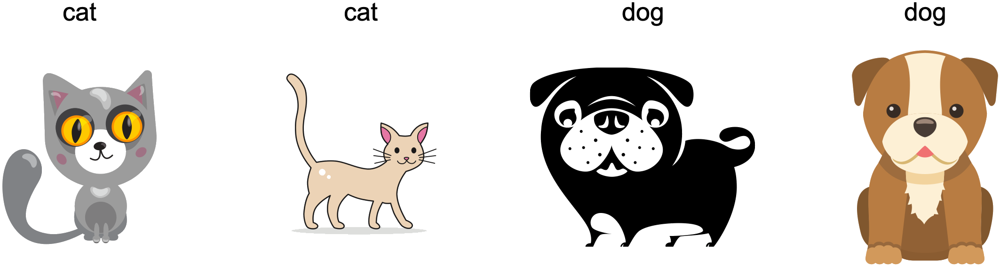

# Environnement et décalage de distribution
:label:`sec_environment-and-distribution-shift`

Dans les sections précédentes, nous avons travaillé sur
un certain nombre d'applications pratiques du machine learning,
en ajustant des modèles à divers ensembles de données.
Pourtant, nous ne nous sommes jamais arrêtés pour contempler
ni d'où provenaient les données en premier lieu
ni ce que nous prévoyons finalement de faire
avec les sorties de nos modèles.
Trop souvent, les développeurs de machine learning
en possession de données se précipitent pour développer des modèles
sans prendre le temps de considérer ces questions fondamentales.

De nombreux déploiements de machine learning ayant échoué
peuvent être attribués à ce manquement.
Parfois, les modèles semblent fonctionner merveilleusement bien
selon la précision de l'ensemble de test,
mais échouent de manière catastrophique lors du déploiement
lorsque la distribution des données se décale soudainement.
Plus insidieusement, c'est parfois le déploiement même d'un modèle
qui peut être le catalyseur perturbant la distribution des données.
Supposons, par exemple, que nous ayons entraîné un modèle
pour prédire qui remboursera un prêt plutôt que de faire défaut,
en découvrant que le choix des chaussures d'un demandeur
était associé au risque de défaut
(les Richelieu indiquent un remboursement, les baskets indiquent un défaut).
Nous pourrions être enclins
par la suite à accorder un prêt
à tout demandeur portant des Richelieu
et à le refuser à tous les demandeurs portant des baskets.

Dans ce cas, notre saut mal réfléchi de la
reconnaissance de formes à la prise de décision
et notre incapacité à examiner de manière critique l'environnement
pourraient avoir des conséquences désastreuses.
Pour commencer, dès que nous commencerions
à prendre des décisions basées sur les chaussures,
les clients s'en rendraient compte et changeraient leur comportement.
Peu de temps après, tous les demandeurs porteraient des Richelieu,
sans aucune amélioration concomitante de leur solvabilité.
Prenez une minute pour digérer cela, car des problèmes similaires abondent
dans de nombreuses applications du machine learning :
en introduisant nos décisions basées sur des modèles dans l'environnement,
nous pourrions casser le modèle.

Bien que nous ne puissions pas traiter ces sujets
de manière exhaustive en une seule section,
notre objectif ici est d'exposer certaines préoccupations courantes,
et de stimuler la pensée critique
nécessaire pour détecter de telles situations tôt,
atténuer les dommages et utiliser le machine learning de manière responsable.
Certaines solutions sont simples
(demander les "bonnes" données),
certaines sont techniquement difficiles
(implémenter un système d'apprentissage par renforcement),
et d'autres exigent que nous sortions du domaine de la
prédiction statistique pour
nous attaquer à des questions philosophiques difficiles
concernant l'application éthique des algorithmes.

## Types de décalage de distribution

Pour commencer, nous restons dans le cadre de la prédiction passive
en considérant les différentes manières dont les distributions de données pourraient se décaler
et ce qui pourrait être fait pour sauver les performances du modèle.
Dans une configuration classique, nous supposons que nos données d'entraînement
ont été échantillonnées à partir d'une certaine distribution $p_S(\mathbf{x},y)$
mais que nos données de test consisteront
en des exemples non étiquetés tirés de
certaines distributions différentes $p_T(\mathbf{x},y)$.
Déjà, nous devons faire face à une réalité déconcertante.
En l'absence de toute hypothèse sur la façon dont $p_S$
et $p_T$ sont liés l'un à l'autre,
apprendre un classifieur robuste est impossible.

Considérons un problème de classification binaire,
où nous souhaitons distinguer les chiens des chats.
Si la distribution peut se décaler de manière arbitraire,
alors notre configuration permet le cas pathologique
dans lequel la distribution sur les entrées reste
constante : $p_S(\mathbf{x}) = p_T(\mathbf{x})$,
mais les étiquettes sont toutes inversées :
$p_S(y \mid \mathbf{x}) = 1 - p_T(y \mid \mathbf{x})$.
En d'autres termes, si Dieu peut soudainement décider
qu'à l'avenir tous les "chats" sont désormais des chiens
et que ce que nous appelions auparavant "chiens" sont désormais des chats --- sans
aucun changement dans la distribution des entrées $p(\mathbf{x})$,
alors nous ne pouvons pas distinguer cette configuration
d'une autre où la distribution n'a pas changé du tout.

Heureusement, sous certaines hypothèses restreintes
sur la façon dont nos données pourraient changer à l'avenir,
des algorithmes fondés peuvent détecter le décalage
et parfois même s'adapter à la volée,
améliorant la précision du classifieur original.

### Décalage de covariables

Parmi les catégories de décalage de distribution,
le décalage de covariables (*covariate shift*) est peut-être le plus largement étudié.
Ici, nous supposons que si la distribution des entrées
peut changer au fil du temps, la fonction d'étiquetage,
c'est-à-dire la distribution conditionnelle
$P(y \mid \mathbf{x})$, ne change pas.
Les statisticiens appellent cela *décalage de covariables*
car le problème provient d'un
décalage dans la distribution des covariables (caractéristiques).
Bien que nous puissions parfois raisonner sur le décalage de distribution
sans invoquer la causalité, nous notons que le décalage de covariables
est l'hypothèse naturelle à invoquer dans les contextes
où nous pensons que $\mathbf{x}$ cause $y$.

Considérons le défi de distinguer les chats et les chiens.
Nos données d'entraînement pourraient consister en des images du type de celles de la :numref:`fig_cat-dog-train`.

:label:`fig_cat-dog-train`

Au moment du test, on nous demande de classifier les images de la :numref:`fig_cat-dog-test`.

:label:`fig_cat-dog-test`

L'ensemble d'entraînement se compose de photos,
tandis que l'ensemble de test ne contient que des dessins animés.
S'entraîner sur un ensemble de données avec des caractéristiques
sensiblement différentes de l'ensemble de test
peut être source de problèmes en l'absence d'un plan cohérent
sur la façon de s'adapter au nouveau domaine.

### Décalage d'étiquettes

Le *décalage d'étiquettes* (*label shift*) décrit le problème inverse.
Ici, nous supposons que la marginale de l'étiquette $P(y)$
peut changer
mais que la distribution conditionnelle de classe
$P(\mathbf{x} \mid y)$ reste fixe à travers les domaines.
Le décalage d'étiquettes est une hypothèse raisonnable à faire
lorsque nous pensons que $y$ cause $\mathbf{x}$.
Par exemple, nous pouvons vouloir prédire des diagnostics
à partir de leurs symptômes (ou d'autres manifestations),
même si la prévalence relative des diagnostics
évolue au fil du temps.
Le décalage d'étiquettes est l'hypothèse appropriée ici
car les maladies causent les symptômes.
Dans certains cas dégénérés, les hypothèses de décalage d'étiquettes
et de décalage de covariables peuvent être valides simultanément.
Par exemple, lorsque l'étiquette est déterministe,
l'hypothèse de décalage de covariables sera satisfaite,
même lorsque $y$ cause $\mathbf{x}$.
Il est intéressant de noter que dans ces cas,
il est souvent avantageux de travailler avec des méthodes
qui découlent de l'hypothèse de décalage d'étiquettes.
C'est parce que ces méthodes ont tendance
à impliquer la manipulation d'objets qui ressemblent à des étiquettes (souvent de faible dimension),
par opposition à des objets qui ressemblent à des entrées,
qui ont tendance à être de grande dimension en deep learning.

### Décalage de concept

Nous pouvons également rencontrer le problème connexe du *décalage de concept* (*concept shift*),
qui survient lorsque les définitions mêmes des étiquettes peuvent changer.
Cela semble bizarre --- un *chat* est un *chat*, non ?
Cependant, d'autres catégories sont sujettes à des changements d'usage au fil du temps.
Les critères de diagnostic des maladies mentales,
ce qui est considéré comme à la mode, et les intitulés de poste,
sont tous sujets à des quantités considérables
de décalage de concept.
Il s'avère que si nous nous déplaçons à travers les États-Unis,
en changeant la source de nos données selon la géographie,
nous trouverons un décalage de concept considérable concernant
la distribution des noms pour les *boissons gazeuses*
comme le montre la :numref:`fig_popvssoda`.

:width:`400px`
:label:`fig_popvssoda`

Si nous devions construire un système de traduction automatique,
la distribution $P(y \mid \mathbf{x})$ pourrait être différente
selon notre emplacement.
Ce problème peut être difficile à repérer.
Nous pourrions espérer exploiter le fait
que le décalage ne se produit que progressivement,
soit dans un sens temporel, soit dans un sens géographique.

## Exemples de décalage de distribution

Avant d'approfondir le formalisme et les algorithmes,
nous pouvons discuter de certaines situations concrètes
où le décalage de covariables ou de concept pourrait ne pas être évident.

### Diagnostics médicaux

Imaginez que vous vouliez concevoir un algorithme pour détecter le cancer.
Vous collectez des données auprès de personnes saines et malades
et vous entraînez votre algorithme.
Il fonctionne bien, vous donne une grande précision
et vous en concluez que vous êtes prêt
pour une carrière réussie dans le diagnostic médical.
*Pas si vite.*

Les distributions qui ont donné naissance aux données d'entraînement
et celles que vous rencontrerez dans la nature pourraient différer considérablement.
C'est ce qui est arrivé à une malheureuse start-up
avec laquelle certains d'entre nous, auteurs, ont travaillé il y a des années.
Ils développaient un test sanguin pour une maladie
qui affecte principalement les hommes âgés
et espéraient l'étudier en utilisant des échantillons de sang
qu'ils avaient collectés auprès de patients.
Cependant, il est considérablement plus difficile
d'obtenir des échantillons de sang d'hommes sains
que de patients malades déjà dans le système.
Pour compenser, la start-up a sollicité
des dons de sang auprès d'étudiants sur un campus universitaire
pour servir de témoins sains dans l'élaboration de leur test.
Ensuite, ils nous ont demandé si nous pouvions les aider
à construire un classifieur pour détecter la maladie.

Comme nous leur avons expliqué,
il serait en effet facile de distinguer
les cohortes saines et malades
avec une précision quasi parfaite.
Cependant, c'est parce que les sujets testés
différaient par l'âge, les niveaux d'hormones,
l'activité physique, le régime alimentaire, la consommation d'alcool,
et bien d'autres facteurs sans rapport avec la maladie.
Il était peu probable que ce soit le cas avec de vrais patients.
En raison de leur procédure d'échantillonnage,
nous pouvions nous attendre à rencontrer un décalage de covariables extrême.
De plus, ce cas était peu susceptible d'être
corrigible via des méthodes conventionnelles.
En bref, ils ont gaspillé une somme d'argent importante.

### Voitures autonomes

Supposons qu'une entreprise veuille exploiter le machine learning
pour développer des voitures autonomes.
Un composant clé ici est un détecteur de bord de route.
Comme les données annotées réelles coûtent cher à obtenir,
ils ont eu l'idée (intelligente et discutable)
d'utiliser des données synthétiques provenant d'un moteur de rendu de jeu
comme données d'entraînement supplémentaires.
Cela a très bien fonctionné sur des "données de test"
tirées du moteur de rendu.
Hélas, à l'intérieur d'une vraie voiture, ce fut un désastre.
Il s'est avéré que le bord de la route avait été rendu
avec une texture très simpliste.
Plus important encore, *tout* le bord de la route avait été rendu
avec la *même* texture et le détecteur de bord de route
a appris cette "caractéristique" très rapidement.

Une chose similaire est arrivée à l'armée américaine
lorsqu'elle a essayé pour la première fois de détecter des chars dans la forêt.
Ils ont pris des photographies aériennes de la forêt sans chars,
puis ont conduit les chars dans la forêt
et ont pris une autre série de photos.
Le classifieur semblait fonctionner *parfaitement*.
Malheureusement, il avait simplement appris
à distinguer les arbres avec des ombres
des arbres sans ombres --- la première série
de photos a été prise tôt le matin,
la seconde série à midi.

### Distributions non stationnaires

Une situation beaucoup plus subtile survient
lorsque la distribution change lentement
(également connue sous le nom de *distribution non stationnaire*)
et que le modèle n'est pas mis à jour de manière adéquate.
Voici quelques cas typiques.

* Nous entraînons un modèle de publicité informatique, puis nous oublions de le mettre à jour fréquemment (par exemple, nous oublions d'incorporer le lancement d'un nouvel appareil obscur appelé iPad).
* Nous construisons un filtre anti-spam. Il fonctionne bien pour détecter tous les spams que nous avons vus jusqu'à présent. Mais ensuite, les spammeurs deviennent plus malins et conçoivent de nouveaux messages qui ne ressemblent à rien de ce que nous avons vu auparavant.
* Nous construisons un système de recommandation de produits. Il fonctionne tout au long de l'hiver, mais continue ensuite de recommander des bonnets de Père Noël bien après Noël.

### Autres anecdotes

* Nous construisons un détecteur de visages. Il fonctionne bien sur tous les bancs d'essai. Malheureusement, il échoue sur les données de test --- les exemples incriminés sont des gros plans où le visage remplit toute l'image (aucune donnée de ce type n'était dans l'ensemble d'entraînement).
* Nous construisons un moteur de recherche Web pour le marché américain et voulons le déployer au Royaume-Uni.
* Nous entraînons un classifieur d'images en compilant un grand ensemble de données où chacune parmi un grand ensemble de classes est représentée de manière égale dans l'ensemble de données, disons 1000 catégories, représentées par 1000 images chacune. Ensuite, nous déployons le système dans le monde réel, où la distribution réelle des étiquettes des photographies est résolument non uniforme.

## Correction du décalage de distribution

Comme nous l'avons vu, il existe de nombreux cas
où les distributions d'entraînement et de test
$P(\mathbf{x}, y)$ sont différentes.
Dans certains cas, nous avons de la chance et les modèles fonctionnent
malgré le décalage de covariables, d'étiquettes ou de concept.
Dans d'autres cas, nous pouvons faire mieux en employant
des stratégies fondées pour faire face au décalage.
Le reste de cette section devient considérablement plus technique.
Le lecteur impatient pourrait passer à la section suivante
car ce matériel n'est pas un prérequis pour les concepts ultérieurs.

### Risque empirique et risque
:label:`subsec_empirical-risk-and-risk`

Réfléchissons d'abord à ce qui se passe exactement
pendant l'entraînement du modèle :
nous itérons sur les caractéristiques et les étiquettes associées
des données d'entraînement
$\{(\mathbf{x}_1, y_1), \ldots, (\mathbf{x}_n, y_n)\}$
et mettons à jour les paramètres d'un modèle $f$ après chaque mini-lot.
Par simplicité, nous ne considérons pas la régularisation,
nous minimisons donc largement la perte sur l'entraînement :

$$\mathop{\mathrm{minimize}}_f \frac{1}{n} \sum_{i=1}^n l(f(\mathbf{x}_i), y_i),$$
:eqlabel:`eq_empirical-risk-min`

où $l$ est la fonction de perte
mesurant "à quel point" la prédiction $f(\mathbf{x}_i)$ est mauvaise étant donné l'étiquette associée $y_i$.
Les statisticiens appellent le terme de la :eqref:`eq_empirical-risk-min` *risque empirique*.
Le *risque empirique* est une perte moyenne sur les données d'entraînement
pour approximer le *risque*,
qui est l'
espérance de la perte sur l'ensemble de la population de données tirées de leur véritable distribution
$p(\mathbf{x},y)$ :

$$E_{p(\mathbf{x}, y)} [l(f(\mathbf{x}), y)] = \int\int l(f(\mathbf{x}), y) p(\mathbf{x}, y) \;d\mathbf{x}dy.$$
:eqlabel:`eq_true-risk`

Cependant, en pratique, nous ne pouvons généralement pas obtenir l'ensemble de la population de données.
Ainsi, la *minimisation du risque empirique*,
qui consiste à minimiser le risque empirique dans la :eqref:`eq_empirical-risk-min`,
est une stratégie pratique pour le machine learning,
dans l'espoir de minimiser
approximativement le risque.

### Correction du décalage de covariables
:label:`subsec_covariate-shift-correction`

Supposons que nous voulions estimer
une certaine dépendance $P(y \mid \mathbf{x})$
pour laquelle nous avons des données étiquetées $(\mathbf{x}_i, y_i)$.
Malheureusement, les observations $\mathbf{x}_i$ sont tirées
d'une certaine *distribution source* $q(\mathbf{x})$
plutôt que de la *distribution cible* $p(\mathbf{x})$.
Heureusement,
l'hypothèse de dépendance signifie
que la distribution conditionnelle ne change pas : $p(y \mid \mathbf{x}) = q(y \mid \mathbf{x})$.
Si la distribution source $q(\mathbf{x})$ est "mauvaise",
nous pouvons corriger cela en utilisant l'identité simple suivante dans le risque :

$$
\begin{aligned}
\int\int l(f(\mathbf{x}), y) p(y \mid \mathbf{x})p(\mathbf{x}) \;d\mathbf{x}dy =
\int\int l(f(\mathbf{x}), y) q(y \mid \mathbf{x})q(\mathbf{x})\frac{p(\mathbf{x})}{q(\mathbf{x})} \;d\mathbf{x}dy.
\end{aligned}
$$

En d'autres termes, nous devons repondérer chaque exemple de données
par le ratio de la
probabilité
qu'il aurait été tiré de la distribution correcte sur celle de la mauvaise distribution :

$$\beta_i \stackrel{\textrm{def}}{=} \frac{p(\mathbf{x}_i)}{q(\mathbf{x}_i)}.$$

En insérant le poids $\beta_i$ pour
chaque exemple de données $(\mathbf{x}_i, y_i)$
nous pouvons entraîner notre modèle en utilisant
la *minimisation pondérée du risque empirique* :

$$\mathop{\mathrm{minimize}}_f \frac{1}{n} \sum_{i=1}^n \beta_i l(f(\mathbf{x}_i), y_i).$$
:eqlabel:`eq_weighted-empirical-risk-min`

Hélas, nous ne connaissons pas ce ratio,
donc avant de pouvoir faire quoi que ce soit d'utile, nous devons l'estimer.
De nombreuses méthodes sont disponibles,
y compris certaines approches sophistiquées fondées sur la théorie des opérateurs
qui tentent de recalibrer directement l'opérateur d'espérance
en utilisant un principe de norme minimale ou d'entropie maximale.
Notez que pour toute approche de ce type, nous avons besoin d'échantillons
tirés des deux distributions --- la "vraie" $p$, par exemple,
par l'accès aux données de test, et celle utilisée
pour générer l'ensemble d'entraînement $q$ (cette dernière est disponible par définition).
Notez cependant que nous n'avons besoin que des caractéristiques $\mathbf{x} \sim p(\mathbf{x})$ ;
nous n'avons pas besoin d'accéder aux étiquettes $y \sim p(y)$.

Dans ce cas, il existe une approche très efficace
qui donnera des résultats presque aussi bons que l'original : à savoir, la régression logistique,
qui est un cas particulier de la régression softmax (voir :numref:`sec_softmax`)
pour la classification binaire.
C'est tout ce qui est nécessaire pour calculer les ratios de probabilité estimés.
Nous apprenons un classifieur pour distinguer
entre les données tirées de $p(\mathbf{x})$
et les données tirées de $q(\mathbf{x})$.
S'il est impossible de distinguer
les deux distributions,
cela signifie que les instances associées
sont également susceptibles de provenir
de l'une ou l'autre de ces deux distributions.
D'un autre côté, toutes les instances
qui peuvent être bien discriminées
doivent être considérablement surpondérées
ou sous-pondérées en conséquence.

Par souci de simplicité, supposons que nous ayons
un nombre égal d'instances provenant des deux distributions
$p(\mathbf{x})$
et $q(\mathbf{x})$, respectivement.
Notons maintenant par $z$ les étiquettes qui valent $1$
pour les données tirées de $p$ et $-1$ pour les données tirées de $q$.
Ensuite, la probabilité dans un ensemble de données mixtes est donnée par

$$P(z=1 \mid \mathbf{x}) = \frac{p(\mathbf{x})}{p(\mathbf{x})+q(\mathbf{x})} \textrm{ et donc } \frac{P(z=1 \mid \mathbf{x})}{P(z=-1 \mid \mathbf{x})} = \frac{p(\mathbf{x})}{q(\mathbf{x})}.$$

Ainsi, si nous utilisons une approche de régression logistique,
où $P(z=1 \mid \mathbf{x})=\frac{1}{1+\exp(-h(\mathbf{x}))}$ ($h$ est une fonction paramétrée),
il s'ensuit que

$$
\beta_i = \frac{1/(1 + \exp(-h(\mathbf{x}_i)))}{\exp(-h(\mathbf{x}_i))/(1 + \exp(-h(\mathbf{x}_i)))} = \exp(h(\mathbf{x}_i)).
$$

En conséquence, nous devons résoudre deux problèmes :
le premier, distinguer les
données tirées des deux distributions,
puis un problème de minimisation pondérée du risque empirique
dans la :eqref:`eq_weighted-empirical-risk-min`
où nous pondérons les termes par $\beta_i$.

Maintenant, nous sommes prêts à décrire un algorithme de correction.
Supposons que nous ayons un ensemble d'entraînement $\{(\mathbf{x}_1, y_1), \ldots, (\mathbf{x}_n, y_n)\}$ et un ensemble de test non étiqueté $\{\mathbf{u}_1, \ldots, \mathbf{u}_m\}$.
Pour le décalage de covariables,
nous supposons que $\mathbf{x}_i$ pour tout $1 \leq i \leq n$ sont tirés d'une certaine distribution source
et que $\mathbf{u}_i$ pour tout $1 \leq i \leq m$
sont tirés de la distribution cible.
Voici un algorithme prototypique
pour corriger le décalage de covariables :

1. Créer un ensemble d'entraînement pour la classification binaire : $\{(\mathbf{x}_1, -1), \ldots, (\mathbf{x}_n, -1), (\mathbf{u}_1, 1), \ldots, (\mathbf{u}_m, 1)\}$.
1. Entraîner un classifieur binaire en utilisant la régression logistique pour obtenir la fonction $h$.
1. Pondérer les données d'entraînement en utilisant $\beta_i = \exp(h(\mathbf{x}_i))$ ou mieux $\beta_i = \min(\exp(h(\mathbf{x}_i)), c)$ pour une certaine constante $c$.
1. Utiliser les poids $\beta_i$ pour l'entraînement sur $\{(\mathbf{x}_1, y_1), \ldots, (\mathbf{x}_n, y_n)\}$ dans la :eqref:`eq_weighted-empirical-risk-min`.

Notez que l'algorithme ci-dessus repose sur une hypothèse cruciale.
Pour que ce schéma fonctionne, nous avons besoin que chaque exemple de données
dans la distribution cible (par exemple, au moment du test)
ait eu une probabilité non nulle de se produire au moment de l'entraînement.
Si nous trouvons un point où $p(\mathbf{x}) > 0$ mais $q(\mathbf{x}) = 0$,
alors le poids d'importance correspondant devrait être l'infini.

### Correction du décalage d'étiquettes

Supposons que nous ayons affaire à une
tâche de classification avec $k$ catégories.
En utilisant la même notation que dans la :numref:`subsec_covariate-shift-correction`,
$q$ et $p$ sont respectivement la distribution source (par exemple, au moment de l'entraînement) et la distribution cible (par exemple, au moment du test).
Supposons que la distribution des étiquettes change au fil du temps :
$q(y) \neq p(y)$, mais que la distribution conditionnelle de classe
reste la même : $q(\mathbf{x} \mid y)=p(\mathbf{x} \mid y)$.
Si la distribution source $q(y)$ est "mauvaise",
nous pouvons corriger cela
selon
l'identité suivante dans le risque
telle que définie dans
la :eqref:`eq_true-risk` :

$$
\begin{aligned}
\int\int l(f(\mathbf{x}), y) p(\mathbf{x} \mid y)p(y) \;d\mathbf{x}dy =
\int\int l(f(\mathbf{x}), y) q(\mathbf{x} \mid y)q(y)\frac{p(y)}{q(y)} \;d\mathbf{x}dy.
\end{aligned}
$$

Ici, nos poids d'importance correspondront aux
ratios de vraisemblance des étiquettes :

$$\beta_i \stackrel{\textrm{def}}{=} \frac{p(y_i)}{q(y_i)}.$$

Une bonne chose à propos du décalage d'étiquettes est que
si nous avons un modèle raisonnablement bon
sur la distribution source,
alors nous pouvons obtenir des estimations cohérentes de ces poids
sans jamais avoir à traiter avec la dimension ambiante.
En deep learning, les entrées ont tendance
à être des objets de grande dimension comme des images,
tandis que les étiquettes sont souvent des objets plus simples comme des catégories.

Pour estimer la distribution des étiquettes cibles,
nous prenons d'abord notre classifieur standard raisonnablement bon
(généralement entraîné sur les données d'entraînement)
et calculons sa matrice de "confusion" en utilisant l'ensemble de validation
(également issu de la distribution d'entraînement).
La *matrice de confusion*, $\mathbf{C}$, est simplement une matrice $k \times k$,
où chaque colonne correspond à la catégorie d'étiquette (vérité terrain)
et chaque ligne correspond à la catégorie prédite par notre modèle.
La valeur de chaque cellule $c_{ij}$ est la fraction des prédictions totales sur l'ensemble de validation
où la véritable étiquette était $j$ et notre modèle a prédit $i$.

Maintenant, nous ne pouvons pas calculer la matrice de confusion
directement sur les données cibles
car nous ne voyons pas les étiquettes pour les exemples
que nous rencontrons dans la nature,
à moins d'investir dans un pipeline d'annotation complexe en temps réel.
Ce que nous pouvons faire, cependant, est de faire la moyenne de toutes les prédictions de notre modèle
au moment du test, produisant les sorties moyennes du modèle $\mu(\hat{\mathbf{y}}) \in \mathbb{R}^k$,
où l'élément $i^\textrm{ème}$ $\mu(\hat{y}_i)$
est la fraction des prédictions totales sur l'ensemble de test
où notre modèle a prédit $i$.

Il s'avère que sous certaines conditions légères --- si
notre classifieur était raisonnablement précis au départ,
et si les données cibles ne contiennent que des catégories
que nous avons déjà vues,
et si l'hypothèse de décalage d'étiquettes est vérifiée au départ
(l'hypothèse la plus forte ici) --- nous pouvons estimer la distribution des étiquettes de l'ensemble de test
en résolvant un système linéaire simple

$$\mathbf{C} p(\mathbf{y}) = \mu(\hat{\mathbf{y}}),$$

car en tant qu'estimation $\sum_{j=1}^k c_{ij} p(y_j) = \mu(\hat{y}_i)$ est vérifié pour tout $1 \leq i \leq k$,
où $p(y_j)$ est l'élément $j^\textrm{ème}$ du vecteur de distribution d'étiquettes de dimension $k$ $p(\mathbf{y})$.
Si notre classifieur est suffisamment précis au départ,
alors la matrice de confusion $\mathbf{C}$ sera inversible,
et nous obtenons une solution $p(\mathbf{y}) = \mathbf{C}^{-1} \mu(\hat{\mathbf{y}})$.

Comme nous observons les étiquettes sur les données sources,
il est facile d'estimer la distribution $q(y)$.
Ensuite, pour tout exemple d'entraînement $i$ avec l'étiquette $y_i$,
nous pouvons prendre le ratio de notre estimation $p(y_i)/q(y_i)$
pour calculer le poids $\beta_i$,
et l'insérer dans la minimisation pondérée du risque empirique
dans la :eqref:`eq_weighted-empirical-risk-min`.

### Correction du décalage de concept

Le décalage de concept est beaucoup plus difficile à corriger de manière rigoureuse.
Par exemple, dans une situation où soudainement le problème change
de la distinction entre chats et chiens à celle
entre animaux blancs et noirs,
il sera déraisonnable de supposer
que nous pouvons faire beaucoup mieux que de simplement collecter de nouvelles étiquettes
et de nous entraîner à partir de zéro.
Heureusement, en pratique, de tels décalages extrêmes sont rares.
Au lieu de cela, ce qui se passe généralement, c'est que la tâche continue de changer lentement.
Pour rendre les choses plus concrètes, voici quelques exemples :

* En publicité informatique, de nouveaux produits sont lancés,
les anciens produits deviennent moins populaires. Cela signifie que la distribution sur les publicités et leur popularité change progressivement et tout prédicteur de taux de clics doit changer progressivement avec elle.
* Les lentilles des caméras de circulation se dégradent progressivement en raison de l'usure environnementale, affectant progressivement la qualité de l'image.
* Le contenu des actualités change progressivement (c'est-à-dire que la plupart des actualités restent inchangées mais que de nouvelles histoires apparaissent).

Dans de tels cas, nous pouvons utiliser la même approche que celle utilisée pour entraîner les réseaux afin de les adapter au changement des données. En d'autres termes, nous utilisons les poids existants du réseau et effectuons simplement quelques étapes de mise à jour avec les nouvelles données plutôt que de nous entraîner à partir de zéro.

## Une taxonomie des problèmes d'apprentissage

Armés des connaissances sur la façon de gérer les changements de distributions, nous pouvons maintenant considérer certains autres aspects de la formulation des problèmes de machine learning.

### Apprentissage par lots

Dans l'*apprentissage par lots* (*batch learning*), nous avons accès aux caractéristiques d'entraînement et aux étiquettes $\{(\mathbf{x}_1, y_1), \ldots, (\mathbf{x}_n, y_n)\}$, que nous utilisons pour entraîner un modèle $f(\mathbf{x})$. Plus tard, nous déployons ce modèle pour noter de nouvelles données $(\mathbf{x}, y)$ tirées de la même distribution. C'est l'hypothèse par défaut pour tous les problèmes dont nous discutons ici. Par exemple, nous pourrions entraîner un détecteur de chats basé sur de nombreuses photos de chats et de chiens. Une fois que nous l'avons entraîné, nous l'expédions dans le cadre d'un système de vision par ordinateur intelligent pour chatière qui ne laisse entrer que les chats. Celui-ci est ensuite installé chez un client et n'est plus jamais mis à jour (sauf circonstances extrêmes).

### Apprentissage en ligne

Imaginez maintenant que les données $(\mathbf{x}_i, y_i)$ arrivent un échantillon à la fois. Plus précisément, supposons que nous observions d'abord $\mathbf{x}_i$, puis que nous devions proposer une estimation $f(\mathbf{x}_i)$. Ce n'est qu'une fois que nous l'avons fait que nous observons $y_i$ et recevons ainsi une récompense ou subissons une perte, compte tenu de notre décision.
De nombreux problèmes réels entrent dans cette catégorie. Par exemple, nous devons prédire le prix de l'action de demain, ce qui nous permet de négocier sur la base de cette estimation et à la fin de la journée nous découvrons si notre estimation nous a permis de réaliser un profit. En d'autres termes, dans l'*apprentissage en ligne* (*online learning*), nous avons le cycle suivant où nous améliorons continuellement notre modèle au fur et à mesure de nouvelles observations :

$$\begin{aligned}&\textrm{modèle } f_t \longrightarrow \textrm{données }  \mathbf{x}_t \longrightarrow \textrm{estimation } f_t(\mathbf{x}_t) \longrightarrow\\ \textrm{obs}&\textrm{ervation } y_t \longrightarrow \textrm{perte } l(y_t, f_t(\mathbf{x}_t)) \longrightarrow \textrm{modèle } f_{t+1}\end{aligned}$$

### Bandits

Les *bandits* sont un cas particulier du problème ci-dessus. Alors que dans la plupart des problèmes d'apprentissage nous avons une fonction $f$ paramétrée de manière continue dont nous voulons apprendre les paramètres (par exemple, un réseau profond), dans un problème de *bandit* nous n'avons qu'un nombre fini de bras que nous pouvons tirer, c'est-à-dire un nombre fini d'actions que nous pouvons entreprendre. Il n'est pas très surprenant que pour ce problème plus simple, des garanties théoriques plus fortes en termes d'optimalité puissent être obtenues. Nous le listons principalement car ce problème est souvent (de manière confuse) traité comme s'il s'agissait d'un cadre d'apprentissage distinct.

### Contrôle

Dans de nombreux cas, l'environnement se souvient de ce que nous avons fait. Pas nécessairement de manière adverse, mais il s'en souviendra simplement et la réponse dépendra de ce qui s'est passé auparavant. Par exemple, un contrôleur de chaudière à café observera différentes températures selon qu'il chauffait la chaudière précédemment. Les algorithmes de contrôle PID (proportionnel-intégral-dérivé) sont un choix populaire dans ce domaine.
De même, le comportement d'un utilisateur sur un site d'actualités dépendra de ce que nous lui avons montré précédemment (par exemple, il ne lira la plupart des nouvelles qu'une seule fois). De nombreux algorithmes de ce type forment un modèle de l'environnement dans lequel ils agissent afin de faire paraître leurs décisions moins aléatoires.
Récemment,
la théorie du contrôle (par exemple, les variantes PID) a également été utilisée
pour ajuster automatiquement les hyperparamètres
afin d'obtenir un meilleur désenchevêtrement et une meilleure qualité de reconstruction,
et d'améliorer la diversité du texte généré et la qualité de reconstruction des images générées :cite:`Shao.Yao.Sun.ea.2020`.

### Apprentissage par renforcement

Dans le cas plus général d'un environnement avec mémoire, nous pouvons rencontrer des situations où l'environnement essaie de coopérer avec nous (jeux coopératifs, en particulier pour les jeux à somme non nulle), ou d'autres où l'environnement essaiera de gagner. Les échecs, le Go, le Backgammon ou StarCraft sont quelques-uns des cas de l'*apprentissage par renforcement*. De même, nous pourrions vouloir construire un bon contrôleur pour les voitures autonomes. Les autres voitures sont susceptibles de répondre au style de conduite de la voiture autonome de manière non triviale, par exemple, en essayant de l'éviter, en essayant de provoquer un accident ou en essayant de coopérer avec elle.

### Prise en compte de l'environnement

Une distinction clé entre les différentes situations ci-dessus est qu'une stratégie qui aurait pu fonctionner tout au long dans le cas d'un environnement stationnaire, pourrait ne pas fonctionner tout au long dans un environnement qui peut s'adapter. Par exemple, une opportunité d'arbitrage découverte par un trader est susceptible de disparaître une fois qu'elle est exploitée. La vitesse et la manière dont l'environnement change déterminent dans une large mesure le type d'algorithmes que nous pouvons mettre en œuvre. Par exemple, si nous savons que les choses ne peuvent changer que lentement, nous pouvons forcer toute estimation à ne changer que lentement également. Si nous savons que l'environnement peut changer instantanément, mais seulement très rarement, nous pouvons en tenir compte. Ces types de connaissances sont cruciaux pour l'aspirant data scientist dans la gestion du décalage de concept, c'est-à-dire lorsque le problème qui est résolu peut changer au fil du temps.

## Équité, responsabilité et transparence dans le machine learning

Enfin, il est important de se rappeler
que lorsque vous déployez des systèmes de machine learning,
vous ne vous contentez pas d'optimiser un modèle prédictif --- vous
fournissez généralement un outil qui sera
utilisé pour automatiser (partiellement ou totalement) des décisions.
Ces systèmes techniques peuvent avoir un impact sur la vie
des individus qui sont assujettis aux décisions qui en résultent.
Le passage de la considération des prédictions à la prise de décisions
soulève non seulement de nouvelles questions techniques,
mais aussi une multitude de questions éthiques
qui doivent être soigneusement examinées.
Si nous déployons un système de diagnostic médical,
nous devons savoir pour quelles populations
il peut fonctionner et pour lesquelles il ne le peut pas.
Négliger les risques prévisibles pour le bien-être d'une
sous-population pourrait nous amener à administrer des soins inférieurs.
De plus, une fois que nous envisageons des systèmes de prise de décision,
nous devons prendre du recul et reconsidérer la manière dont nous évaluons notre technologie.
Entre autres conséquences de ce changement de portée,
nous constaterons que la *précision* est rarement la bonne mesure.
Par exemple, lors de la traduction des prédictions en actions,
nous voudrons souvent prendre en compte
la sensibilité potentielle au coût des erreurs de diverses manières.
Si une façon de mal classer une image
pouvait être perçue comme un affront racial,
alors qu'une mauvaise classification dans une catégorie différente
serait inoffensive, alors nous pourrions vouloir ajuster
nos seuils en conséquence, en tenant compte des valeurs sociétales
dans la conception du protocole de prise de décision.
Nous voulons également faire attention à la manière dont
les systèmes de prédiction peuvent conduire à des boucles de rétroaction.
Par exemple, considérons les systèmes de police prédictive,
qui affectent des patrouilleurs
à des zones où la criminalité prévue est élevée.
Il est facile de voir comment un schéma inquiétant peut émerger :

 1. Les quartiers où la criminalité est plus élevée bénéficient de plus de patrouilles.
 1. Par conséquent, davantage de crimes sont découverts dans ces quartiers, entrant dans les données d'entraînement disponibles pour les itérations futures.
 1. Exposé à davantage de cas positifs, le modèle prédit encore plus de criminalité dans ces quartiers.
 1. Lors de l'itération suivante, le modèle mis à jour cible encore plus lourdement le même quartier, ce qui conduit à encore plus de crimes découverts, etc.

Souvent, les divers mécanismes par lesquels
les prédictions d'un modèle deviennent couplées à ses données d'entraînement
ne sont pas pris en compte dans le processus de modélisation.
Cela peut conduire à ce que les chercheurs appellent des *boucles de rétroaction emballées* (*runaway feedback loops*).
De plus, nous voulons faire attention à
si nous abordons le bon problème en premier lieu.
Les algorithmes prédictifs jouent désormais un rôle démesuré
dans la médiation de la diffusion de l'information.
Les nouvelles qu'un individu rencontre devraient-elles
être déterminées par l'ensemble des pages Facebook qu'il a *Aimées* ?
Ce ne sont là que quelques-uns des nombreux dilemmes éthiques pressants
que vous pourriez rencontrer au cours d'une carrière en machine learning.

## Résumé

Dans de nombreux cas, les ensembles d'entraînement et de test ne proviennent pas de la même distribution. C'est ce qu'on appelle le décalage de distribution.
Le risque est l'espérance de la perte sur l'ensemble de la population de données tirées de leur véritable distribution. Cependant, cette population entière est généralement indisponible. Le risque empirique est une perte moyenne sur les données d'entraînement pour approximer le risque. En pratique, nous effectuons une minimisation du risque empirique.

Sous les hypothèses correspondantes, le décalage de covariables et d'étiquettes peut être détecté et corrigé au moment du test. Le fait de ne pas tenir compte de ce biais peut devenir problématique au moment du test.
Dans certains cas, l'environnement peut se souvenir d'actions automatisées et répondre de manière surprenante. Nous devons tenir compte de cette possibilité lors de la construction de modèles et continuer à surveiller les systèmes en direct, en restant ouverts à la possibilité que nos modèles et l'environnement s'enchevêtrent de manière imprévue.

## Exercices

1. Que pourrait-il se passer lorsque nous modifions le comportement d'un moteur de recherche ? Que pourraient faire les utilisateurs ? Qu'en est-il des annonceurs ?
1. Implémentez un détecteur de décalage de covariables. Indice : construisez un classifieur.
1. Implémentez un correcteur de décalage de covariables.
1. Outre le décalage de distribution, qu'est-ce qui pourrait affecter la manière dont le risque empirique approximatif le risque ?

[Discussions](https://discuss.d2l.ai/t/105)
