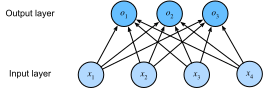

# Régression Softmax
:label:`sec_softmax`

Dans la :numref:`sec_linear_regression`, nous avons introduit la régression linéaire,
en travaillant sur des implémentations à partir de zéro dans la :numref:`sec_linear_scratch`
et en utilisant à nouveau les API de haut niveau d'un framework de deep learning
dans la :numref:`sec_linear_concise` pour faire le gros du travail.

La régression est l'outil que nous utilisons lorsque
nous voulons répondre à des questions du type *combien ?*.
Si vous voulez prédire le montant en dollars (prix)
auquel une maison sera vendue,
ou le nombre de victoires qu'une équipe de baseball pourrait remporter,
ou le nombre de jours qu'un patient
restera hospitalisé avant d'être libéré,
alors vous recherchez probablement un modèle de régression.
Cependant, même au sein des modèles de régression,
il existe des distinctions importantes.
Par exemple, le prix d'une maison
ne sera jamais négatif et les changements pourraient souvent être *relatifs* à son prix de base.
À ce titre, il pourrait être plus efficace d'effectuer une régression
sur le logarithme du prix.
De même, le nombre de jours qu'un patient passe à l'hôpital
est une variable aléatoire *discrète non négative*.
À ce titre, les moindres carrés moyens pourraient ne pas être une approche idéale non plus.
Ce type de modélisation du temps jusqu'à l'événement
s'accompagne d'une foule d'autres complications qui sont traitées
dans un sous-domaine spécialisé appelé *modélisation de survie*.

Le but ici n'est pas de vous submerger, mais juste
de vous faire savoir qu'il y a bien plus dans l'estimation
que la simple minimisation des erreurs quadratiques.
Et plus largement, il y a bien plus dans l'apprentissage supervisé que la régression.
Dans cette section, nous nous concentrons sur les problèmes de *classification*
où nous laissons de côté les questions du type *combien ?*
pour nous concentrer sur les questions du type *quelle catégorie ?*.

* Cet e-mail appartient-il au dossier spam ou à la boîte de réception ?
* Ce client est-il plus susceptible de s'abonner
  ou de ne pas s'abonner à un service d'abonnement ?
* Cette image représente-t-elle un âne, un chien, un chat ou un coq ?
* Quel film Aston est-il le plus susceptible de regarder ensuite ?
* Quelle section du livre allez-vous lire ensuite ?

Familièrement, les praticiens de l'apprentissage automatique
surchargent le mot *classification*
pour décrire deux problèmes subtilement différents :
(i) ceux où nous ne sommes intéressés que par
des affectations strictes d'exemples à des catégories (classes) ;
et (ii) ceux où nous souhaitons faire des affectations souples,
c'est-à-dire évaluer la probabilité que chaque catégorie s'applique.
La distinction a tendance à s'estomper, en partie,
parce que souvent, même lorsque nous ne nous soucions que des affectations strictes,
nous utilisons toujours des modèles qui font des affectations souples.

De plus, il existe des cas où plus d'une étiquette peut être vraie.
Par exemple, un article d'actualité peut couvrir simultanément
les sujets du divertissement, des affaires et des vols spatiaux,
mais pas les sujets de la médecine ou des sports.
Ainsi, le classer dans l'une des catégories ci-dessus
seule ne serait pas très utile.
Ce problème est communément appelé [classification multi-étiquettes](https://en.wikipedia.org/wiki/Multi-label_classification).
Voir :citet:`Tsoumakas.Katakis.2007` pour un aperçu
et :citet:`Huang.Xu.Yu.2015`
pour un algorithme efficace lors du marquage d'images.

## Classification
:label:`subsec_classification-problem`

Pour commencer, commençons par
un problème simple de classification d'images.
Ici, chaque entrée consiste en une image en niveaux de gris de $2\times2$.
Nous pouvons représenter chaque valeur de pixel par un seul scalaire,
ce qui nous donne quatre caractéristiques $x_1, x_2, x_3, x_4$.
De plus, supposons que chaque image appartienne à l'une
des catégories "chat", "poulet" et "chien".

Ensuite, nous devons choisir comment représenter les étiquettes.
Nous avons deux choix évidents.
L'impulsion la plus naturelle serait peut-être
de choisir $y \in \{1, 2, 3\}$,
où les entiers représentent respectivement
$\{\textrm{chien}, \textrm{chat}, \textrm{poulet}\}$.
C'est un excellent moyen de *stocker* de telles informations sur un ordinateur.
Si les catégories présentaient un ordre naturel entre elles,
par exemple si nous essayions de prédire
$\{\textrm{bébé}, \textrm{enfant en bas âge}, \textrm{adolescent}, \textrm{jeune adulte}, \textrm{adulte}, \textrm{personne âgée}\}$,
alors il pourrait même être judicieux de formuler cela comme
un problème de [régression ordinale](https://en.wikipedia.org/wiki/Ordinal_regression)
et de conserver les étiquettes dans ce format.
Voir :citet:`Moon.Smola.Chang.ea.2010` pour un aperçu
des différents types de fonctions de perte de classement
et :citet:`Beutel.Murray.Faloutsos.ea.2014` pour une approche bayésienne
qui traite les réponses avec plus d'un mode.

En général, les problèmes de classification ne s'accompagnent pas
d'ordonnancements naturels entre les classes.
Heureusement, les statisticiens ont inventé il y a longtemps un moyen simple
de représenter les données catégorielles : l'*encodage one-hot*.
Un encodage one-hot est un vecteur
comportant autant de composantes que de catégories.
La composante correspondant à la catégorie d'une instance particulière est fixée à 1
et toutes les autres composantes sont fixées à 0.
Dans notre cas, une étiquette $y$ serait un vecteur tridimensionnel,
avec $(1, 0, 0)$ correspondant à "chat", $(0, 1, 0)$ à "poulet",
et $(0, 0, 1)$ à "chien" :

$$y \in \{(1, 0, 0), (0, 1, 0), (0, 0, 1)\}.$$

### Modèle linéaire

Afin d'estimer les probabilités conditionnelles
associées à toutes les classes possibles,
nous avons besoin d'un modèle à sorties multiples, une par classe.
Pour traiter la classification avec des modèles linéaires,
nous aurons besoin d'autant de fonctions affines que de sorties.
Strictement parlant, nous en avons besoin d'une de moins,
puisque la catégorie finale doit être la différence
entre $1$ et la somme des autres catégories,
mais pour des raisons de symétrie,
nous utilisons une paramétrisation légèrement redondante.
Chaque sortie correspond à sa propre fonction affine.
Dans notre cas, comme nous avons 4 caractéristiques et 3 catégories de sortie possibles,
nous avons besoin de 12 scalaires pour représenter les poids ($w$ avec indices),
et de 3 scalaires pour représenter les biais ($b$ avec indices). Cela donne :

$$
\begin{aligned}
o_1 &= x_1 w_{11} + x_2 w_{12} + x_3 w_{13} + x_4 w_{14} + b_1,\\
o_2 &= x_1 w_{21} + x_2 w_{22} + x_3 w_{23} + x_4 w_{24} + b_2,\\
o_3 &= x_1 w_{31} + x_2 w_{32} + x_3 w_{33} + x_4 w_{34} + b_3.
\end{aligned}
$$

Le diagramme du réseau neuronal correspondant
est illustré dans la :numref:`fig_softmaxreg`.
Tout comme dans la régression linéaire,
nous utilisons un réseau neuronal à une seule couche.
Et puisque le calcul de chaque sortie, $o_1, o_2$, et $o_3$,
dépend de chaque entrée, $x_1, x_2, x_3$, et $x_4$,
la couche de sortie peut également être décrite comme une *couche entièrement connectée*.

:label:`fig_softmaxreg`

Pour une notation plus concise, nous utilisons des vecteurs et des matrices :
$\mathbf{o} = \mathbf{W} \mathbf{x} + \mathbf{b}$ est
bien mieux adapté aux mathématiques et au code.
Notez que nous avons rassemblé tous nos poids dans une matrice $3 \times 4$ et tous les biais
$\mathbf{b} \in \mathbb{R}^3$ dans un vecteur.

### Le Softmax
:label:`subsec_softmax_operation`

En supposant une fonction de perte appropriée,
nous pourrions essayer, directement, de minimiser la différence
entre $\mathbf{o}$ et les étiquettes $\mathbf{y}$.
Bien qu'il s'avère que traiter la classification
comme un problème de régression à valeurs vectorielles fonctionne étonnamment bien,
cela reste néanmoins insatisfaisant pour les raisons suivantes :

* Il n'y a aucune garantie que la somme des sorties $o_i$ soit égale à $1$ comme nous l'attendons des probabilités.
* Il n'y a aucune garantie que les sorties $o_i$ soient même non négatives, même si la somme de leurs sorties est égale à $1$, ou qu'elles ne dépassent pas $1$.

Ces deux aspects rendent le problème d'estimation difficile à résoudre
et la solution très sensible aux valeurs aberrantes.
Par exemple, si nous supposons qu'il
existe une dépendance linéaire positive
entre le nombre de chambres et la probabilité
que quelqu'un achète une maison,
la probabilité pourrait dépasser $1$
lorsqu'il s'agit d'acheter un manoir !
À ce titre, nous avons besoin d'un mécanisme pour "écraser" les sorties.

Il existe de nombreuses façons d'atteindre cet objectif.
Par exemple, nous pourrions supposer que les sorties
$\mathbf{o}$ sont des versions corrompues de $\mathbf{y}$,
où la corruption se produit par l'ajout d'un bruit $\boldsymbol{\epsilon}$
tiré d'une distribution normale.
En d'autres termes, $\mathbf{y} = \mathbf{o} + \boldsymbol{\epsilon}$,
où $\epsilon_i \sim \mathcal{N}(0, \sigma^2)$.
C'est ce qu'on appelle le [modèle probit](https://en.wikipedia.org/wiki/Probit_model),
introduit pour la première fois par :citet:`Fechner.1860`.
Bien qu'attrayant, il ne fonctionne pas aussi bien
et ne conduit pas à un problème d'optimisation particulièrement agréable,
comparé au softmax.

Une autre façon d'atteindre cet objectif
(et d'assurer la non-négativité) est d'utiliser
une fonction exponentielle $P(y = i) \propto \exp o_i$.
Cela satisfait en effet l'exigence
que la probabilité conditionnelle de la classe
augmente avec l'augmentation de $o_i$, elle est monotone,
et toutes les probabilités sont non négatives.
Nous pouvons ensuite transformer ces valeurs pour qu'elles s'additionnent à $1$
en divisant chacune par leur somme.
Ce processus est appelé *normalisation*.
La combinaison de ces deux éléments
nous donne la fonction *softmax* :

$$\hat{\mathbf{y}} = \mathrm{softmax}(\mathbf{o}) \quad \textrm{où}\quad \hat{y}_i = \frac{\exp(o_i)}{\sum_j \exp(o_j)}.$$
:eqlabel:`eq_softmax_y_and_o`

Notez que la coordonnée la plus grande de $\mathbf{o}$
correspond à la classe la plus probable selon $\hat{\mathbf{y}}$.
De plus, parce que l'opération softmax
préserve l'ordre de ses arguments,
nous n'avons pas besoin de calculer le softmax
pour déterminer quelle classe s'est vu attribuer la probabilité la plus élevée. Ainsi,

$$
\operatorname*{argmax}_j \hat y_j = \operatorname*{argmax}_j o_j.
$$

L'idée d'un softmax remonte à :citet:`Gibbs.1902`,
qui a adapté des idées de la physique.
Remontant encore plus loin, Boltzmann,
le père de la physique statistique moderne,
a utilisé cette astuce pour modéliser une distribution
sur les états d'énergie dans les molécules de gaz.
En particulier, il a découvert que la prévalence
d'un état d'énergie dans un ensemble thermodynamique,
tel que les molécules d'un gaz,
est proportionnelle à $\exp(-E/kT)$.
Ici, $E$ est l'énergie d'un état,
$T$ est la température et $k$ est la constante de Boltzmann.
Lorsque les statisticiens parlent d'augmenter ou de diminuer
la « température » d'un système statistique,
ils font référence au changement de $T$
afin de favoriser les états d'énergie plus bas ou plus élevés.
Suivant l'idée de Gibbs, l'énergie équivaut à l'erreur.
Les modèles basés sur l'énergie :cite:`Ranzato.Boureau.Chopra.ea.2007`
utilisent ce point de vue pour décrire
des problèmes de deep learning.

### Vectorisation
:label:`subsec_softmax_vectorization`

Pour améliorer l'efficacité informatique,
nous vectorisons les calculs en minibatches de données.
Supposons que l'on nous donne un minibatch $\mathbf{X} \in \mathbb{R}^{n \times d}$
de $n$ exemples de dimensionnalité (nombre d'entrées) $d$.
De plus, supposons que nous ayons $q$ catégories en sortie.
Alors les poids satisfont $\mathbf{W} \in \mathbb{R}^{d \times q}$
et le biais satisfait $\mathbf{b} \in \mathbb{R}^{1\times q}$.

$$ \begin{aligned} \mathbf{O} &= \mathbf{X} \mathbf{W} + \mathbf{b}, \\ \hat{\mathbf{Y}} & = \mathrm{softmax}(\mathbf{O}). \end{aligned} $$
:eqlabel:`eq_minibatch_softmax_reg`

Cela accélère l'opération dominante en
un produit matrice-matrice $\mathbf{X} \mathbf{W}$.
De plus, comme chaque ligne de $\mathbf{X}$ représente un exemple de données,
l'opération softmax elle-même peut être calculée *par ligne* :
pour chaque ligne de $\mathbf{O}$, calculez l'exponentielle de toutes les entrées
puis normalisez-les par la somme.
Notez cependant qu'il faut veiller
à éviter de calculer l'exponentielle et de prendre le logarithme de grands nombres,
car cela peut provoquer un dépassement de capacité numérique (overflow) ou un soupassement (underflow).
Les frameworks de deep learning s'en occupent automatiquement.

## Fonction de perte
:label:`subsec_softmax-regression-loss-func`

Maintenant que nous avons une correspondance entre les caractéristiques $\mathbf{x}$
et les probabilités $\mathbf{\hat{y}}$,
nous avons besoin d'un moyen d'optimiser la précision de cette correspondance.
Nous nous appuierons sur l'estimation du maximum de vraisemblance,
la méthode même que nous avons rencontrée
lorsque nous avons fourni une justification probabiliste
pour la perte d'erreur quadratique moyenne dans la
:numref:`subsec_normal_distribution_and_squared_loss`.

### Log-vraisemblance

La fonction softmax nous donne un vecteur $\hat{\mathbf{y}}$,
que nous pouvons interpréter comme les probabilités conditionnelles (estimées)
de chaque classe, étant donné n'importe quelle entrée $\mathbf{x}$,
telle que $\hat{y}_1$ = $P(y=\textrm{chat} \mid \mathbf{x})$.
Dans ce qui suit, nous supposons que pour un ensemble de données
avec des caractéristiques $\mathbf{X}$, les étiquettes $\mathbf{Y}$
sont représentées à l'aide d'un vecteur d'étiquette d'encodage one-hot.
Nous pouvons comparer les estimations avec la réalité
en vérifiant la probabilité des classes réelles
selon notre modèle, étant donné les caractéristiques :

$$
P(\mathbf{Y} \mid \mathbf{X}) = \prod_{i=1}^n P(\mathbf{y}^{(i)} \mid \mathbf{x}^{(i)}).
$$

Nous sommes autorisés à utiliser la factorisation
puisque nous supposons que chaque étiquette est tirée indépendamment
de sa distribution respective $P(\mathbf{y}\mid\mathbf{x}^{(i)})$.
Comme maximiser le produit des termes est délicat,
nous prenons le logarithme négatif pour obtenir le problème équivalent
de minimiser la log-vraisemblance négative :

$$
-\log P(\mathbf{Y} \mid \mathbf{X}) = \sum_{i=1}^n -\log P(\mathbf{y}^{(i)} \mid \mathbf{x}^{(i)})
= \sum_{i=1}^n l(\mathbf{y}^{(i)}, \hat{\mathbf{y}}^{(i)}),
$$

où pour toute paire d'étiquette $\mathbf{y}$
et de prédiction de modèle $\hat{\mathbf{y}}$
sur $q$ classes, la fonction de perte $l$ est

$$ l(\mathbf{y}, \hat{\mathbf{y}}) = - \sum_{j=1}^q y_j \log \hat{y}_j. $$
:eqlabel:`eq_l_cross_entropy`

Pour des raisons expliquées plus tard,
la fonction de perte dans l'équ. :eqref:`eq_l_cross_entropy`
est communément appelée *perte d'entropie croisée*.
Puisque $\mathbf{y}$ est un vecteur one-hot de longueur $q$,
la somme sur toutes ses coordonnées $j$ s'annule pour tous les termes sauf un.
Notez que la perte $l(\mathbf{y}, \hat{\mathbf{y}})$
est bornée inférieurement par $0$
chaque fois que $\hat{\mathbf{y}}$ est un vecteur de probabilité :
aucune entrée n'est supérieure à $1$,
par conséquent leur logarithme négatif ne peut être inférieur à $0$ ;
$l(\mathbf{y}, \hat{\mathbf{y}}) = 0$ seulement si nous prédisons
l'étiquette réelle avec *certitude*.
Cela ne peut jamais arriver pour un réglage fini des poids
car amener une sortie softmax vers $1$
nécessite d'amener l'entrée correspondante $o_i$ vers l'infini
(ou toutes les autres sorties $o_j$ pour $j \neq i$ vers l'infini négatif).
Même si notre modèle pouvait attribuer une probabilité de sortie de $0$,
toute erreur commise lors de l'attribution d'une confiance aussi élevée
entraînerait une perte infinie ($-\log 0 = \infty$).

### Softmax et perte d'entropie croisée
:label:`subsec_softmax_and_derivatives`

Puisque la fonction softmax
et la perte d'entropie croisée correspondante sont si courantes,
il vaut la peine de mieux comprendre comment elles sont calculées.
En injectant l'équ. :eqref:`eq_softmax_y_and_o` dans la définition de la perte
dans l'équ. :eqref:`eq_l_cross_entropy`
et en utilisant la définition du softmax, nous obtenons

$$
\begin{aligned}
l(\mathbf{y}, \hat{\mathbf{y}}) &=  - \sum_{j=1}^q y_j \log \frac{\exp(o_j)}{\sum_{k=1}^q \exp(o_k)} \\
&= \sum_{j=1}^q y_j \log \sum_{k=1}^q \exp(o_k) - \sum_{j=1}^q y_j o_j \\
&= \log \sum_{k=1}^q \exp(o_k) - \sum_{j=1}^q y_j o_j.
\end{aligned}
$$

Pour mieux comprendre ce qui se passe,
considérons la dérivée par rapport à n'importe quel logit $o_j$. Nous obtenons

$$
\partial_{o_j} l(\mathbf{y}, \hat{\mathbf{y}}) = \frac{\exp(o_j)}{\sum_{k=1}^q \exp(o_k)} - y_j = \mathrm{softmax}(\mathbf{o})_j - y_j.
$$

En d'autres termes, la dérivée est la différence
entre la probabilité attribuée par notre modèle,
telle qu'exprimée par l'opération softmax,
et ce qui s'est réellement passé, tel qu'exprimé
par les éléments du vecteur d'étiquettes one-hot.
En ce sens, c'est très similaire
à ce que nous avons vu en régression,
où le gradient était la différence
entre l'observation $y$ et l'estimation $\hat{y}$.
Ce n'est pas une coïncidence.
Dans tout modèle de famille exponentielle,
les gradients de la log-vraisemblance sont donnés précisément par ce terme.
Ce fait facilite le calcul des gradients en pratique.

Considérons maintenant le cas où nous observons non seulement un seul résultat,
mais une distribution entière de résultats.
Nous pouvons utiliser la même représentation qu'auparavant pour l'étiquette $\mathbf{y}$.
La seule différence est qu'au lieu
d'un vecteur ne contenant que des entrées binaires,
disons $(0, 0, 1)$, nous avons maintenant un vecteur de probabilité générique,
disons $(0,1, 0,2, 0,7)$.
Les mathématiques que nous avons utilisées précédemment pour définir la perte $l$
dans l'équ. :eqref:`eq_l_cross_entropy`
fonctionnent toujours bien,
seulement l'interprétation est légèrement plus générale.
C'est la valeur attendue de la perte pour une distribution sur les étiquettes.
Cette perte est appelée *perte d'entropie croisée* et c'est
l'une des pertes les plus couramment utilisées pour les problèmes de classification.
Nous pouvons démystifier ce nom en introduisant juste les bases de la théorie de l'information.
En un mot, elle mesure le nombre de bits nécessaires pour coder ce que nous voyons, $\mathbf{y}$,
par rapport à ce que nous prédisons qu'il devrait se passer, $\hat{\mathbf{y}}$.
Nous en fournissons une explication très basique dans ce qui suit. Pour plus de
détails sur la théorie de l'information, voir
:citet:`Cover.Thomas.1999` ou :citet:`mackay2003information`.

## Bases de la théorie de l'information
:label:`subsec_info_theory_basics`

De nombreux articles de deep learning utilisent l'intuition et des termes issus de la théorie de l'information.
Pour leur donner un sens, nous avons besoin d'un langage commun.
Ceci est un guide de survie.
La *théorie de l'information* traite du problème
du codage, du décodage, de la transmission
et de la manipulation de l'information (également appelée données).

### Entropie

L'idée centrale de la théorie de l'information est de quantifier la
quantité d'information contenue dans les données.
Cela impose une limite à notre capacité à compresser les données.
Pour une distribution $P$, son *entropie*, $H[P]$, est définie comme :

$$H[P] = \sum_j - P(j) \log P(j).$$
:eqlabel:`eq_softmax_reg_entropy`

L'un des théorèmes fondamentaux de la théorie de l'information stipule
qu'afin de coder des données tirées aléatoirement de la distribution $P$,
nous avons besoin d'au moins $H[P]$ « nats » pour les coder :cite:`Shannon.1948`.
Si vous vous demandez ce qu'est un « nat », c'est l'équivalent du bit
mais en utilisant un code de base $e$ plutôt qu'un code de base 2.
Ainsi, un nat vaut $\frac{1}{\log(2)} \approx 1,44$ bit.

### Surprise

Vous vous demandez peut-être ce que la compression a à voir avec la prédiction.
Imaginez que nous ayons un flux de données que nous voulons compresser.
S'il nous est toujours facile de prédire le jeton suivant,
alors ces données sont faciles à compresser.
Prenez l'exemple extrême où chaque jeton du flux
prend toujours la même valeur.
C'est un flux de données très ennuyeux !
Et non seulement il est ennuyeux, mais il est aussi facile à prédire.
Parce que les jetons sont toujours les mêmes,
nous n'avons à transmettre aucune information
pour communiquer le contenu du flux.
Facile à prédire, facile à compresser.

Cependant, si nous ne pouvons pas prédire parfaitement chaque événement,
alors nous pourrions parfois être surpris.
Notre surprise est plus grande lorsqu'un événement se voit attribuer une probabilité plus faible.
Claude Shannon a retenu $\log \frac{1}{P(j)} = -\log P(j)$
pour quantifier la *surprise* de quelqu'un à l'observation d'un événement $j$
lui ayant attribué une probabilité (subjective) $P(j)$.
L'entropie définie dans l'équ. :eqref:`eq_softmax_reg_entropy`
est alors la *surprise attendue*
lorsque l'on a attribué les probabilités correctes
qui correspondent véritablement au processus de génération de données.

### L'entropie croisée revisitée

Donc, si l'entropie est le niveau de surprise ressenti
par quelqu'un qui connaît la vraie probabilité,
alors vous vous demandez peut-être, qu'est-ce que l'entropie croisée ?
L'entropie croisée *de* $P$ *vers* $Q$, notée $H(P, Q)$,
est la surprise attendue d'un observateur ayant des probabilités subjectives $Q$
en voyant des données qui ont été réellement générées selon les probabilités $P$.
Ceci est donné par $H(P, Q) \stackrel{\textrm{def}}{=} \sum_j - P(j) \log Q(j)$.
L'entropie croisée la plus basse possible est atteinte lorsque $P=Q$.
Dans ce cas, l'entropie croisée de $P$ vers $Q$ est $H(P, P)= H(P)$.

En résumé, nous pouvons penser à l'objectif de classification par entropie croisée
de deux manières : (i) comme maximisant la vraisemblance des données observées ;
et (ii) comme minimisant notre surprise (et donc le nombre de bits)
nécessaire pour communiquer les étiquettes.

## Résumé et discussion

Dans cette section, nous avons rencontré la première fonction de perte non triviale,
nous permettant d'optimiser sur des espaces de sortie *discrets*.
La clé de sa conception était que nous avons adopté une approche probabiliste,
traitant les catégories discrètes comme des instances de tirages à partir d'une distribution de probabilité.
Comme effet secondaire, nous avons rencontré le softmax,
une fonction d'activation pratique qui transforme
les sorties d'une couche de réseau neuronal ordinaire
en distributions de probabilité discrètes valides.
Nous avons vu que la dérivée de la perte d'entropie croisée
lorsqu'elle est combinée avec le softmax
se comporte de manière très similaire
à la dérivée de l'erreur quadratique ;
notamment en prenant la différence entre
le comportement attendu et sa prédiction.
Et, bien que nous n'ayons pu qu'en
effleurer la surface,
nous avons rencontré des liens passionnants
avec la physique statistique et la théorie de l'information.

Bien que cela suffise à vous mettre sur la voie,
et, espérons-le, à vous mettre en appétit,
nous n'avons guère approfondi le sujet ici.
Entre autres choses, nous avons passé sous silence les considérations informatiques.
Plus précisément, pour toute couche entièrement connectée avec $d$ entrées et $q$ sorties,
la paramétrisation et le coût de calcul sont $\mathcal{O}(dq)$,
ce qui peut être prohibitif en pratique.
Heureusement, ce coût de transformation de $d$ entrées en $q$ sorties
peut être réduit grâce à l'approximation et à la compression.
Par exemple, Deep Fried Convnets :cite:`Yang.Moczulski.Denil.ea.2015`
utilise une combinaison de permutations,
de transformées de Fourier et de mise à l'échelle
pour réduire le coût de quadratique à log-linéaire.
Des techniques similaires fonctionnent pour des approximations de matrices
structurelles plus avancées :cite:`sindhwani2015structured`.
Enfin, nous pouvons utiliser des décompositions de type quaternion
pour réduire le coût à $\mathcal{O}(\frac{dq}{n})$,
là encore si nous sommes prêts à échanger une petite quantité de précision
contre un coût de calcul et de stockage :cite:`Zhang.Tay.Zhang.ea.2021`
basé sur un facteur de compression $n$.
Il s'agit d'un domaine de recherche actif.
Ce qui rend la tâche difficile, c'est que
nous ne cherchons pas nécessairement
la représentation la plus compacte
ou le plus petit nombre d'opérations en virgule flottante,
mais plutôt la solution
qui peut être exécutée le plus efficacement sur les GPU modernes.

## Exercices

1. Nous pouvons explorer plus en profondeur le lien entre les familles exponentielles et le softmax.
    1. Calculez la dérivée seconde de la perte d'entropie croisée $l(\mathbf{y},\hat{\mathbf{y}})$ pour le softmax.
    1. Calculez la variance de la distribution donnée par $\mathrm{softmax}(\mathbf{o})$ et montrez qu'elle correspond à la dérivée seconde calculée ci-dessus.
1. Supposons que nous ayons trois classes qui se produisent avec une probabilité égale, c'est-à-dire que le vecteur de probabilité est $(\frac{1}{3}, \frac{1}{3}, \frac{1}{3})$.
    1. Quel est le problème si nous essayons de concevoir un code binaire pour cela ?
    1. Pouvez-vous concevoir un meilleur code ? Indice : que se passe-t-il si nous essayons de coder deux observations indépendantes ? Et si nous codons $n$ observations conjointement ?
1. Lors du codage de signaux transmis sur un fil physique, les ingénieurs n'utilisent pas toujours des codes binaires. Par exemple, [PAM-3](https://en.wikipedia.org/wiki/Ternary_signal) utilise trois niveaux de signal $\{-1, 0, 1\}$ par opposition à deux niveaux $\{0, 1\}$. De combien d'unités ternaires avez-vous besoin pour transmettre un entier dans la plage $\{0, \ldots, 7\}$ ? Pourquoi cela pourrait-il être une meilleure idée en termes d'électronique ?
1. Le [modèle de Bradley-Terry](https://en.wikipedia.org/wiki/Bradley%E2%80%93Terry_model) utilise
un modèle logistique pour capturer les préférences. Pour qu'un utilisateur choisisse entre des pommes et des oranges, on
suppose des scores $o_{\textrm{pomme}}$ et $o_{\textrm{orange}}$. Nos exigences sont que des scores plus élevés doivent conduire à une probabilité plus élevée de choisir l'article associé et que
l'article ayant le score le plus élevé est le plus susceptible d'être choisi :cite:`Bradley.Terry.1952`.
    1. Prouvez que le softmax satisfait à cette exigence.
    1. Que se passe-t-il si vous voulez autoriser une option par défaut consistant à ne choisir ni pommes ni oranges ? Indice : l'utilisateur a maintenant trois choix.
1. Le softmax tire son nom du mappage suivant : $\textrm{RealSoftMax}(a, b) = \log (\exp(a) + \exp(b))$.
    1. Prouvez que $\textrm{RealSoftMax}(a, b) > \mathrm{max}(a, b)$.
    1. Jusqu'à quel point pouvez-vous réduire la différence entre les deux fonctions ? Indice : sans perte de
    généralité, vous pouvez fixer $b = 0$ et $a \geq b$.
    1. Prouvez que cela est vrai pour $\lambda^{-1} \textrm{RealSoftMax}(\lambda a, \lambda b)$, à condition que $\lambda > 0$.
    1. Montrez que pour $\lambda \to \infty$, nous avons $\lambda^{-1} \textrm{RealSoftMax}(\lambda a, \lambda b) \to \mathrm{max}(a, b)$.
    1. Construisez une fonction softmin analogue.
    1. Étendez cela à plus de deux nombres.
1. La fonction $g(\mathbf{x}) \stackrel{\textrm{def}}{=} \log \sum_i \exp x_i$ est parfois aussi appelée [fonction de partition logarithmique](https://en.wikipedia.org/wiki/Partition_function_(mathematics)).
    1. Prouvez que la fonction est convexe. Indice : pour ce faire, utilisez le fait que la dérivée première correspond aux probabilités de la fonction softmax et montrez que la dérivée seconde est la variance.
    1. Montrez que $g$ est invariante par translation, c'est-à-dire $g(\mathbf{x} + b) = g(\mathbf{x})$.
    1. Que se passe-t-il si certaines coordonnées $x_i$ sont très grandes ? Que se passe-t-il si elles sont toutes très petites ?
    1. Montrez que si nous choisissons $b = \mathrm{max}_i x_i$, nous obtenons une implémentation numériquement stable.
1. Supposons que nous ayons une certaine distribution de probabilité $P$. Supposons que nous choisissions une autre distribution $Q$ avec $Q(i) \propto P(i)^\alpha$ pour $\alpha > 0$.
    1. Quel choix de $\alpha$ correspond au doublement de la température ? Quel choix correspond à sa réduction de moitié ?
    1. Que se passe-t-il si on laisse la température approcher $0$ ?
    1. Que se passe-t-il si on laisse la température approcher $\infty$ ?

[Discussions](https://discuss.d2l.ai/t/46)
