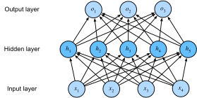

```{.python .input}
%load_ext d2lbook.tab
tab.interact_select(['mxnet', 'pytorch', 'tensorflow', 'jax'])
```

# Perceptrons multicouches
:label:`sec_mlp`

Dans la :numref:`sec_softmax`, nous avons introduit
la régression softmax,
en implémentant l'algorithme à partir de zéro
(:numref:`sec_softmax_scratch`) et en utilisant des API de haut niveau
(:numref:`sec_softmax_concise`). Cela nous a permis d'entraîner
des classifieurs capables de reconnaître
10 catégories de vêtements à partir d'images de basse résolution.
En chemin, nous avons appris à manipuler les données,
à transformer nos sorties en une distribution de probabilité valide,
à appliquer une fonction de perte appropriée,
et à la minimiser par rapport aux paramètres de notre modèle.
Maintenant que nous maîtrisons ces mécanismes
dans le contexte de modèles linéaires simples,
nous pouvons lancer notre exploration des réseaux de neurones profonds,
la classe de modèles comparativement riche
qui intéresse principalement ce livre.

```{.python .input}
%%tab mxnet
%matplotlib inline
from d2l import mxnet as d2l
from mxnet import autograd, np, npx
npx.set_np()
```

```{.python .input}
%%tab pytorch
%matplotlib inline
from d2l import torch as d2l
import torch
```

```{.python .input}
%%tab tensorflow
%matplotlib inline
from d2l import tensorflow as d2l
import tensorflow as tf
```

```{.python .input}
%%tab jax
%matplotlib inline
from d2l import jax as d2l
import jax
from jax import numpy as jnp
from jax import grad, vmap
```

## Couches cachées

Nous avons décrit les transformations affines dans la
:numref:`subsec_linear_model` comme
des transformations linéaires avec un biais ajouté.
Pour commencer, rappelez-vous l'architecture du modèle
correspondant à notre exemple de régression softmax,
illustrée dans la :numref:`fig_softmaxreg`.
Ce modèle projette les entrées directement vers les sorties
via une seule transformation affine,
suivie d'une opération softmax.
Si nos étiquettes étaient réellement liées
aux données d'entrée par une simple transformation affine,
alors cette approche serait suffisante.
Cependant, la linéarité (dans les transformations affines) est une hypothèse *forte*.

### Limites des modèles linéaires

Par exemple, la linéarité implique l'hypothèse *plus faible*
de *monotonie*, c'est-à-dire
que toute augmentation de notre caractéristique doit
soit toujours provoquer une augmentation de la sortie de notre modèle
(si le poids correspondant est positif),
soit toujours provoquer une baisse de la sortie de notre modèle
(si le poids correspondant est négatif).
Parfois, cela a du sens.
Par exemple, si nous essayions de prédire
si un individu remboursera un prêt,
nous pourrions raisonnablement supposer que toutes choses étant égales par ailleurs,
un demandeur ayant un revenu plus élevé
serait toujours plus susceptible de rembourser
qu'un demandeur ayant un revenu plus faible.
Bien que monotone, cette relation n'est probablement
pas associée linéairement à la probabilité de
remboursement. Une augmentation du revenu de 0 \$ à 50 000 \$
correspond probablement à une augmentation plus importante
de la probabilité de remboursement
qu'une augmentation de 1 million \$ à 1,05 million \$.
Une façon de gérer cela pourrait être de post-traiter notre résultat
de telle sorte que la linéarité devienne plus plausible,
en utilisant l'application logistique (et donc le logarithme de la probabilité du résultat).

Notez que nous pouvons facilement trouver des exemples
qui violent la monotonie.
Supposons par exemple que nous voulions prédire la santé en fonction
de la température corporelle.
Pour les individus ayant une température corporelle normale
supérieure à 37°C (98,6°F),
des températures plus élevées indiquent un risque plus important.
Cependant, si la température corporelle descend
en dessous de 37°C, des températures plus basses indiquent un risque plus important !
Là encore, nous pourrions résoudre le problème
avec un prétraitement astucieux, tel que l'utilisation de la distance par rapport à 37°C
comme caractéristique.


But what about classifying images of cats and dogs?
Should increasing the intensity
of the pixel at location (13, 17)
always increase (or always decrease)
the likelihood that the image depicts a dog?
Reliance on a linear model corresponds to the implicit
assumption that the only requirement
for differentiating cats and dogs is to assess
the brightness of individual pixels.
This approach is doomed to fail in a world
where inverting an image preserves the category.

Et pourtant, malgré l'absurdité apparente de la linéarité ici,
comparé à nos exemples précédents,
il est moins évident que nous pourrions résoudre le problème
avec un simple correctif de prétraitement.
En effet, l'importance de n'importe quel pixel
dépend de manières complexes de son contexte
(les valeurs des pixels environnants).
Bien qu'il puisse exister une représentation de nos données
qui prendrait en compte
les interactions pertinentes entre nos caractéristiques,
sur laquelle un modèle linéaire serait approprié,
nous ne savons tout simplement pas comment la calculer à la main.
Avec les réseaux de neurones profonds, nous utilisons des données d'observation
pour apprendre conjointement à la fois une représentation via des couches cachées
et un prédicteur linéaire qui agit sur cette représentation.

Ce problème de non-linéarité est étudié depuis au moins un
siècle :cite:`Fisher.1928`. Par exemple, les arbres de décision
sous leur forme la plus basique utilisent une séquence de décisions binaires pour
décider de l'appartenance à une classe :cite:`quinlan2014c4`. De même, les
méthodes à noyau ont été utilisées pendant de nombreuses décennies pour modéliser des dépendances non linéaires
:cite:`Aronszajn.1950`. Cela a trouvé son chemin dans
les modèles de splines non paramétriques :cite:`Wahba.1990` et les méthodes à noyau
:cite:`Scholkopf.Smola.2002`. C'est aussi quelque chose que le cerveau résout
tout naturellement. Après tout, les neurones alimentent d'autres neurones qui,
à leur tour, alimentent à nouveau d'autres neurones :cite:`Cajal.Azoulay.1894`.
Par conséquent, nous avons une séquence de transformations relativement simples.

### Intégration de couches cachées

Nous pouvons surmonter les limites des modèles linéaires
en incorporant une ou plusieurs couches cachées.
La façon la plus simple de le faire est d'empiler
de nombreuses couches entièrement connectées les unes sur les autres.
Chaque couche alimente la couche supérieure,
jusqu'à ce que nous générions des sorties.
Nous pouvons considérer les premières $L-1$ couches
comme notre représentation et la couche finale
comme notre prédicteur linéaire.
Cette architecture est couramment appelée
un *perceptron multicouche*,
souvent abrégé en *MLP* (:numref:`fig_mlp`).


:label:`fig_mlp`

Ce MLP a quatre entrées, trois sorties,
et sa couche cachée contient cinq unités cachées.
Étant donné que la couche d'entrée n'implique aucun calcul,
produire des sorties avec ce réseau
nécessite d'implémenter les calculs
pour les couches cachée et de sortie ;
ainsi, le nombre de couches dans ce MLP est de deux.
Notez que les deux couches sont entièrement connectées.
Chaque entrée influence chaque neurone de la couche cachée,
et chacun d'entre eux influence à son tour
chaque neurone de la couche de sortie. Hélas, nous n'en sommes pas encore tout à fait
à la fin.

### De linéaire à non linéaire

Comme précédemment, nous notons par la matrice $\mathbf{X} \in \mathbb{R}^{n \times d}$
un minibatch de $n$ exemples où chaque exemple a $d$ entrées (caractéristiques).
Pour un MLP à une couche cachée dont la couche cachée a $h$ unités cachées,
nous notons par $\mathbf{H} \in \mathbb{R}^{n \times h}$
les sorties de la couche cachée, qui sont des
*représentations cachées*.
Étant donné que les couches cachée et de sortie sont toutes deux entièrement connectées,
nous avons des poids de couche cachée $\mathbf{W}^{(1)} \in \mathbb{R}^{d \times h}$ et des biais $\mathbf{b}^{(1)} \in \mathbb{R}^{1 \times h}$
et des poids de couche de sortie $\mathbf{W}^{(2)} \in \mathbb{R}^{h \times q}$ et des biais $\mathbf{b}^{(2)} \in \mathbb{R}^{1 \times q}$.
Cela nous permet de calculer les sorties $\mathbf{O} \in \mathbb{R}^{n \times q}$
du MLP à une couche cachée comme suit :

$$
\begin{aligned}
    \mathbf{H} & = \mathbf{X} \mathbf{W}^{(1)} + \mathbf{b}^{(1)}, \\
    \mathbf{O} & = \mathbf{H}\mathbf{W}^{(2)} + \mathbf{b}^{(2)}.
\end{aligned}
$$

Notez qu'après avoir ajouté la couche cachée,
notre modèle nous oblige désormais à suivre et à mettre à jour
des ensembles supplémentaires de paramètres.
Alors, qu'avons-nous gagné en échange ?
Vous pourriez être surpris de découvrir
que --- dans le modèle défini ci-dessus --- *nous
ne gagnons rien pour nos efforts* !
La raison est évidente.
Les unités cachées ci-dessus sont données par
une fonction affine des entrées,
et les sorties (pré-softmax) ne sont
qu'une fonction affine des unités cachées.
Une fonction affine d'une fonction affine
est elle-même une fonction affine.
De plus, notre modèle linéaire était déjà
capable de représenter n'importe quelle fonction affine.

Pour voir cela formellement, nous pouvons simplement condenser la couche cachée dans la définition ci-dessus,
donnant un modèle à couche unique équivalent avec les paramètres
$\mathbf{W} = \mathbf{W}^{(1)}\mathbf{W}^{(2)}$ et $\mathbf{b} = \mathbf{b}^{(1)} \mathbf{W}^{(2)} + \mathbf{b}^{(2)}$ :

$$
\mathbf{O} = (\mathbf{X} \mathbf{W}^{(1)} + \mathbf{b}^{(1)})\mathbf{W}^{(2)} + \mathbf{b}^{(2)} = \mathbf{X} \mathbf{W}^{(1)}\mathbf{W}^{(2)} + \mathbf{b}^{(1)} \mathbf{W}^{(2)} + \mathbf{b}^{(2)} = \mathbf{X} \mathbf{W} + \mathbf{b}.
$$

Afin de réaliser le potentiel des architectures multicouches,
nous avons besoin d'un ingrédient clé supplémentaire : une
*fonction d'activation* non linéaire $\sigma$
à appliquer à chaque unité cachée
suite à la transformation affine. Par exemple, un choix
populaire est la fonction d'activation ReLU (unité linéaire rectifiée) :cite:`Nair.Hinton.2010`
$\sigma(x) = \mathrm{max}(0, x)$ opérant sur ses arguments élément par élément.
Les sorties des fonctions d'activation $\sigma(\cdot)$
sont appelées *activations*.
En général, avec les fonctions d'activation en place,
il n'est plus possible de condenser notre MLP en un modèle linéaire :

$$
\begin{aligned}
    \mathbf{H} & = \sigma(\mathbf{X} \mathbf{W}^{(1)} + \mathbf{b}^{(1)}), \\
    \mathbf{O} & = \mathbf{H}\mathbf{W}^{(2)} + \mathbf{b}^{(2)}.\\
\end{aligned}
$$

Étant donné que chaque ligne de $\mathbf{X}$ correspond à un exemple du minibatch,
avec un certain abus de notation, nous définissons la non-linéarité
$\sigma$ pour s'appliquer à ses entrées ligne par ligne,
c'est-à-dire un exemple à la fois.
Notez que nous avons utilisé la même notation pour softmax
lorsque nous avons désigné une opération ligne par ligne dans la :numref:`subsec_softmax_vectorization`.
Très fréquemment, les fonctions d'activation que nous utilisons s'appliquent non seulement par ligne mais aussi
élément par élément. Cela signifie qu'après avoir calculé la partie linéaire de la couche,
nous pouvons calculer chaque activation
sans regarder les valeurs prises par les autres unités cachées.

Pour construire des MLP plus généraux, nous pouvons continuer à empiler
de telles couches cachées,
par exemple $\mathbf{H}^{(1)} = \sigma_1(\mathbf{X} \mathbf{W}^{(1)} + \mathbf{b}^{(1)})$
et $\mathbf{H}^{(2)} = \sigma_2(\mathbf{H}^{(1)} \mathbf{W}^{(2)} + \mathbf{b}^{(2)})$,
les unes sur les autres, produisant des modèles de plus en plus expressifs.

### Approximateurs universels

Nous savons que le cerveau est capable d'analyses statistiques très sophistiquées. À ce titre,
il vaut la peine de se demander *jusqu'à quel point* un réseau profond pourrait être puissant. Cette question
a reçu plusieurs réponses, par exemple dans :citet:`Cybenko.1989` dans le contexte
des MLP, et dans :citet:`micchelli1984interpolation` dans le contexte des espaces de Hilbert à noyau
reproduisant d'une manière qui pourrait être vue comme des réseaux à fonctions de base radiale (RBF) avec une seule couche cachée.
Ces résultats (et d'autres résultats connexes) suggèrent que même avec un réseau à une seule couche cachée,
moyennant suffisamment de nœuds (éventuellement un nombre absurde),
et le bon ensemble de poids,
nous pouvons modéliser n'importe quelle fonction.
Apprendre réellement cette fonction est cependant la partie difficile.
Vous pourriez considérer votre réseau de neurones
comme étant un peu comme le langage de programmation C.
Le langage, comme tout autre langage moderne,
est capable d'exprimer n'importe quel programme calculable.
Mais concevoir réellement un programme
qui répond à vos spécifications est la partie difficile.

De plus, ce n'est pas parce qu'un réseau à une seule couche cachée
*peut* apprendre n'importe quelle fonction
ne signifie pas que vous devriez essayer
de résoudre tous vos problèmes
avec un tel réseau. En fait, dans ce cas, les méthodes à noyau
sont bien plus efficaces, car elles sont capables de résoudre le problème
*exactement* même dans des espaces de dimension infinie :cite:`Kimeldorf.Wahba.1971,Scholkopf.Herbrich.Smola.2001`.
En fait, nous pouvons approximer de nombreuses fonctions
de manière beaucoup plus compacte en utilisant des réseaux plus profonds (plutôt que plus larges) :cite:`Simonyan.Zisserman.2014`.
Nous aborderons des arguments plus rigoureux dans les chapitres suivants.


## Fonctions d'activation
:label:`subsec_activation-functions`

Les fonctions d'activation décident si un neurone doit être activé ou non en
calculant la somme pondérée et en y ajoutant ensuite un biais.
Ce sont des opérateurs dérivables permettant de transformer les signaux d'entrée en sorties,
tandis que la plupart d'entre eux ajoutent de la non-linéarité.
Étant donné que les fonctions d'activation sont fondamentales pour l'apprentissage profond,
(**passons brièvement en revue certaines des plus courantes**).

### Fonction ReLU

Le choix le plus populaire,
en raison à la fois de la simplicité d'implémentation et de
ses bonnes performances sur une variété de tâches prédictives,
est l'*unité linéaire rectifiée* (*ReLU*) :cite:`Nair.Hinton.2010`.
[**ReLU fournit une transformation non linéaire très simple**].
Étant donné un élément $x$, la fonction est définie
comme le maximum de cet élément et de 0 :

$$\operatorname{ReLU}(x) = \max(x, 0).$$

Informellement, la fonction ReLU ne conserve que les éléments positifs
et écarte tous les éléments négatifs
en fixant les activations correspondantes à 0.
Pour acquérir une certaine intuition, nous pouvons tracer la fonction.
Comme vous pouvez le voir, la fonction d'activation est linéaire par morceaux.

```{.python .input}
%%tab mxnet
x = np.arange(-8.0, 8.0, 0.1)
x.attach_grad()
with autograd.record():
    y = npx.relu(x)
d2l.plot(x, y, 'x', 'relu(x)', figsize=(5, 2.5))
```

```{.python .input}
%%tab pytorch
x = torch.arange(-8.0, 8.0, 0.1, requires_grad=True)
y = torch.relu(x)
d2l.plot(x.detach(), y.detach(), 'x', 'relu(x)', figsize=(5, 2.5))
```

```{.python .input}
%%tab tensorflow
x = tf.Variable(tf.range(-8.0, 8.0, 0.1), dtype=tf.float32)
y = tf.nn.relu(x)
d2l.plot(x.numpy(), y.numpy(), 'x', 'relu(x)', figsize=(5, 2.5))
```

```{.python .input}
%%tab jax
x = jnp.arange(-8.0, 8.0, 0.1)
y = jax.nn.relu(x)
d2l.plot(x, y, 'x', 'relu(x)', figsize=(5, 2.5))
```

Lorsque l'entrée est négative,
la dérivée de la fonction ReLU est 0,
et lorsque l'entrée est positive,
la dérivée de la fonction ReLU est 1.
Notez que la fonction ReLU n'est pas dérivable
lorsque l'entrée prend une valeur précisément égale à 0.
Dans ces cas, nous utilisons par défaut la dérivée à gauche
et disons que la dérivée est 0 lorsque l'entrée est 0.
Nous pouvons nous en sortir car
l'entrée peut ne jamais être réellement nulle (les mathématiciens
diraient qu'elle n'est pas dérivable sur un ensemble de mesure nulle).
Un vieil adage dit que si des conditions aux limites subtiles comptent,
nous faisons probablement des mathématiques (*réelles*), pas de l'ingénierie.
Cette sagesse conventionnelle peut s'appliquer ici, ou du moins, le fait que
nous n'effectuons pas d'optimisation sous contraintes :cite:`Mangasarian.1965,Rockafellar.1970`.
Nous traçons la dérivée de la fonction ReLU ci-dessous.

```{.python .input}
%%tab mxnet
y.backward()
d2l.plot(x, x.grad, 'x', 'grad of relu', figsize=(5, 2.5))
```

```{.python .input}
%%tab pytorch
y.backward(torch.ones_like(x), retain_graph=True)
d2l.plot(x.detach(), x.grad, 'x', 'grad of relu', figsize=(5, 2.5))
```

```{.python .input}
%%tab tensorflow
with tf.GradientTape() as t:
    y = tf.nn.relu(x)
d2l.plot(x.numpy(), t.gradient(y, x).numpy(), 'x', 'grad of relu',
         figsize=(5, 2.5))
```

```{.python .input}
%%tab jax
grad_relu = vmap(grad(jax.nn.relu))
d2l.plot(x, grad_relu(x), 'x', 'grad of relu', figsize=(5, 2.5))
```

La raison de l'utilisation de ReLU est que
ses dérivées se comportent particulièrement bien :
soit elles s'annulent, soit elles laissent simplement passer l'argument.
Cela rend l'optimisation plus stable
et a atténué le problème bien documenté
de la disparition des gradients qui affectait
les versions précédentes des réseaux de neurones (plus d'informations à ce sujet plus tard).

Notez qu'il existe de nombreuses variantes de la fonction ReLU,
notamment la fonction *ReLU paramétrée* (*pReLU*) :cite:`He.Zhang.Ren.ea.2015`.
Cette variante ajoute un terme linéaire à ReLU,
de sorte que certaines informations passent encore,
même lorsque l'argument est négatif :

$$\operatorname{pReLU}(x) = \max(0, x) + \alpha \min(0, x).$$

### Fonction sigmoïde

[**La *fonction sigmoïde* transforme ces entrées**]
dont les valeurs se situent dans le domaine $\mathbb{R}$,
(**en sorties qui se situent sur l'intervalle (0, 1).**)
Pour cette raison, la sigmoïde est
souvent appelée une *fonction d'écrasement* :
elle écrase n'importe quelle entrée dans la plage (-inf, inf)
en une valeur dans la plage (0, 1) :

$$\operatorname{sigmoid}(x) = \frac{1}{1 + \exp(-x)}.$$

Dans les premiers réseaux de neurones, les scientifiques
s'intéressaient à la modélisation des neurones biologiques
qui soit *s'activent*, soit *ne s'activent pas*.
Ainsi, les pionniers de ce domaine,
remontant jusqu'à McCulloch et Pitts,
les inventeurs du neurone artificiel,
se sont concentrés sur les unités à seuillage :cite:`McCulloch.Pitts.1943`.
Une activation par seuillage prend la valeur 0
lorsque son entrée est inférieure à un certain seuil
et la valeur 1 lorsque l'entrée dépasse le seuil.

Lorsque l'attention s'est portée sur l'apprentissage basé sur le gradient,
la fonction sigmoïde était un choix naturel
car il s'agit d'une approximation lisse et dérivable
d'une unité à seuillage.
Les sigmoïdes sont encore largement utilisées comme
fonctions d'activation sur les unités de sortie
lorsque nous voulons interpréter les sorties comme des probabilités
pour des problèmes de classification binaire : vous pouvez considérer la sigmoïde comme un cas particulier de la softmax.
Cependant, la sigmoïde a été largement remplacée
par la ReLU, plus simple et plus facile à entraîner,
pour la plupart des utilisations dans les couches cachées. Cela est dû en grande partie
au fait que la sigmoïde pose des défis pour l'optimisation
:cite:`LeCun.Bottou.Orr.ea.1998` étant donné que son gradient s'annule pour les arguments positifs *et* négatifs de grande valeur.
Cela peut conduire à des plateaux dont il est difficile de s'échapper.
Néanmoins, les sigmoïdes sont importantes. Dans les chapitres ultérieurs (par exemple, :numref:`sec_lstm`) sur les réseaux de neurones récurrents,
nous décrirons des architectures qui exploitent les unités sigmoïdes
pour contrôler le flux d'informations à travers le temps.

Ci-dessous, nous traçons la fonction sigmoïde.
Notez que lorsque l'entrée est proche de 0,
la fonction sigmoïde s'approche
d'une transformation linéaire.

```{.python .input}
%%tab mxnet
with autograd.record():
    y = npx.sigmoid(x)
d2l.plot(x, y, 'x', 'sigmoid(x)', figsize=(5, 2.5))
```

```{.python .input}
%%tab pytorch
y = torch.sigmoid(x)
d2l.plot(x.detach(), y.detach(), 'x', 'sigmoid(x)', figsize=(5, 2.5))
```

```{.python .input}
%%tab tensorflow
y = tf.nn.sigmoid(x)
d2l.plot(x.numpy(), y.numpy(), 'x', 'sigmoid(x)', figsize=(5, 2.5))
```

```{.python .input}
%%tab jax
y = jax.nn.sigmoid(x)
d2l.plot(x, y, 'x', 'sigmoid(x)', figsize=(5, 2.5))
```

La dérivée de la fonction sigmoïde est donnée par l'équation suivante :

$$\frac{d}{dx} \operatorname{sigmoid}(x) = \frac{\exp(-x)}{(1 + \exp(-x))^2} = \operatorname{sigmoid}(x)\left(1-\operatorname{sigmoid}(x)\right).$$


La dérivée de la fonction sigmoïde est tracée ci-dessous.
Notez que lorsque l'entrée est 0,
la dérivée de la fonction sigmoïde
atteint un maximum de 0,25.
À mesure que l'entrée s'éloigne de 0 dans l'une ou l'autre direction,
la dérivée s'approche de 0.

```{.python .input}
%%tab mxnet
y.backward()
d2l.plot(x, x.grad, 'x', 'grad of sigmoid', figsize=(5, 2.5))
```

```{.python .input}
%%tab pytorch
# Clear out previous gradients
x.grad.data.zero_()
y.backward(torch.ones_like(x),retain_graph=True)
d2l.plot(x.detach(), x.grad, 'x', 'grad of sigmoid', figsize=(5, 2.5))
```

```{.python .input}
%%tab tensorflow
with tf.GradientTape() as t:
    y = tf.nn.sigmoid(x)
d2l.plot(x.numpy(), t.gradient(y, x).numpy(), 'x', 'grad of sigmoid',
         figsize=(5, 2.5))
```

```{.python .input}
%%tab jax
grad_sigmoid = vmap(grad(jax.nn.sigmoid))
d2l.plot(x, grad_sigmoid(x), 'x', 'grad of sigmoid', figsize=(5, 2.5))
```

### Fonction Tanh
:label:`subsec_tanh`

Comme la fonction sigmoïde, [**la fonction tanh (tangente hyperbolique)
écrase également ses entrées**],
en les transformant en éléments sur l'intervalle (**entre $-1$ et $1$**) :

$$\operatorname{tanh}(x) = \frac{1 - \exp(-2x)}{1 + \exp(-2x)}.$$

Nous traçons la fonction tanh ci-dessous. Notez que lorsque l'entrée approche de 0, la fonction tanh se rapproche d'une transformation linéaire. Bien que la forme de la fonction soit similaire à celle de la fonction sigmoïde, la fonction tanh présente une symétrie ponctuelle par rapport à l'origine du système de coordonnées :cite:`Kalman.Kwasny.1992`.

```{.python .input}
%%tab mxnet
with autograd.record():
    y = np.tanh(x)
d2l.plot(x, y, 'x', 'tanh(x)', figsize=(5, 2.5))
```

```{.python .input}
%%tab pytorch
y = torch.tanh(x)
d2l.plot(x.detach(), y.detach(), 'x', 'tanh(x)', figsize=(5, 2.5))
```

```{.python .input}
%%tab tensorflow
y = tf.nn.tanh(x)
d2l.plot(x.numpy(), y.numpy(), 'x', 'tanh(x)', figsize=(5, 2.5))
```

```{.python .input}
%%tab jax
y = jax.nn.tanh(x)
d2l.plot(x, y, 'x', 'tanh(x)', figsize=(5, 2.5))
```

La dérivée de la fonction tanh est :

$$\frac{d}{dx} \operatorname{tanh}(x) = 1 - \operatorname{tanh}^2(x).$$

Elle est tracée ci-dessous.
À mesure que l'entrée approche de 0,
la dérivée de la fonction tanh s'approche d'un maximum de 1.
Et comme nous l'avons vu avec la fonction sigmoïde,
à mesure que l'entrée s'éloigne de 0 dans l'une ou l'autre direction,
la dérivée de la fonction tanh s'approche de 0.

```{.python .input}
%%tab mxnet
y.backward()
d2l.plot(x, x.grad, 'x', 'grad of tanh', figsize=(5, 2.5))
```

```{.python .input}
%%tab pytorch
# Clear out previous gradients
x.grad.data.zero_()
y.backward(torch.ones_like(x),retain_graph=True)
d2l.plot(x.detach(), x.grad, 'x', 'grad of tanh', figsize=(5, 2.5))
```

```{.python .input}
%%tab tensorflow
with tf.GradientTape() as t:
    y = tf.nn.tanh(x)
d2l.plot(x.numpy(), t.gradient(y, x).numpy(), 'x', 'grad of tanh',
         figsize=(5, 2.5))
```

```{.python .input}
%%tab jax
grad_tanh = vmap(grad(jax.nn.tanh))
d2l.plot(x, grad_tanh(x), 'x', 'grad of tanh', figsize=(5, 2.5))
```

## Résumé et discussion

Nous savons maintenant comment incorporer des non-linéarités
pour construire des architectures de réseaux de neurones multicouches expressives.
Soit dit en passant, vos connaissances vous permettent déjà
de maîtriser une boîte à outils similaire
à celle d'un praticien vers 1990.
D'une certaine manière, vous avez un avantage
sur quiconque travaillait à l'époque,
car vous pouvez exploiter de puissants
frameworks d'apprentissage profond open-source
pour construire des modèles rapidement, en utilisant seulement quelques lignes de code.
Auparavant, l'entraînement de ces réseaux
obligeait les chercheurs à coder explicitement les couches et les dérivées
en C, Fortran ou même Lisp (dans le cas de LeNet).

Un avantage secondaire est que ReLU est nettement plus propice à
l'optimisation que la fonction sigmoïde ou tanh. On pourrait soutenir
que ce fut l'une des innovations clés qui ont aidé à la résurgence
de l'apprentissage profond au cours de la dernière décennie. Notez cependant que la recherche sur
les fonctions d'activation ne s'est pas arrêtée.
Par exemple, 
la fonction d'activation GELU (unité linéaire d'erreur gaussienne)
$x \Phi(x)$ de :citet:`Hendrycks.Gimpel.2016` ($\Phi(x)$
est la fonction de répartition gaussienne standard) 
et
la fonction d'activation Swish
$\sigma(x) = x \operatorname{sigmoid}(\beta x)$ telle que proposée dans :citet:`Ramachandran.Zoph.Le.2017` peuvent donner une meilleure précision
dans de nombreux cas.

## Exercices

1. Montrez que l'ajout de couches à un réseau profond *linéaire*, c'est-à-dire un réseau sans
   non-linéarité $\sigma$, ne peut jamais augmenter la puissance expressive du réseau.
   Donnez un exemple où cela la réduit activement.
1. Calculez la dérivée de la fonction d'activation pReLU.
1. Calculez la dérivée de la fonction d'activation Swish $x \operatorname{sigmoid}(\beta x)$.
1. Montrez qu'un MLP utilisant uniquement ReLU (ou pReLU) construit une
   fonction linéaire continue par morceaux.
1. Sigmoïde et tanh sont très similaires.
    1. Montrez que $\operatorname{tanh}(x) + 1 = 2 \operatorname{sigmoid}(2x)$.
    1. Prouvez que les classes de fonctions paramétrées par les deux non-linéarités sont identiques. Indice : les couches affines ont aussi des termes de biais.
1. Supposons que nous ayons une non-linéarité qui s'applique à un minibatch à la fois, comme la normalisation par lots :cite:`Ioffe.Szegedy.2015`. Quels types de problèmes vous attendez-vous à ce que cela cause ?
1. Fournissez un exemple où les gradients disparaissent pour la fonction d'activation sigmoïde.

:begin_tab:`mxnet`
[Discussions](https://discuss.d2l.ai/t/90)
:end_tab:

:begin_tab:`pytorch`
[Discussions](https://discuss.d2l.ai/t/91)
:end_tab:

:begin_tab:`tensorflow`
[Discussions](https://discuss.d2l.ai/t/226)
:end_tab:

:begin_tab:`jax`
[Discussions](https://discuss.d2l.ai/t/17984)
:end_tab:
