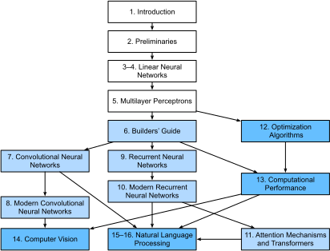

# Préface

Il y a seulement quelques années, il n'y avait pas de légions de chercheurs en apprentissage profond
développant des produits et services intelligents au sein des grandes entreprises et des startups.
Quand nous sommes entrés dans ce domaine, l'apprentissage automatique (*machine learning*)
ne faisait pas la une des journaux quotidiens.
Nos parents n'avaient aucune idée de ce qu'était l'apprentissage automatique,
et encore moins pourquoi nous pourrions le préférer à une carrière en médecine ou en droit.
L'apprentissage automatique était une discipline académique théorique
dont l'importance industrielle était limitée
à un ensemble étroit d'applications réelles,
notamment la reconnaissance vocale et la vision par ordinateur.
De plus, beaucoup de ces applications
nécessitaient tellement de connaissances du domaine
qu'elles étaient souvent considérées comme des domaines entièrement distincts
pour lesquels l'apprentissage automatique n'était qu'un petit composant.
À cette époque, les réseaux de neurones --- les
prédécesseurs des méthodes d'apprentissage profond
sur lesquelles nous nous concentrons dans ce livre --- étaient
généralement considérés comme démodés.

Pourtant, en seulement quelques années, l'apprentissage profond a pris le monde par surprise,
entraînant des progrès rapides dans des domaines aussi divers
que la vision par ordinateur, le traitement du langage naturel,
la reconnaissance automatique de la parole, l'apprentissage par renforcement
et l'informatique biomédicale.
De plus, le succès de l'apprentissage profond
dans tant de tâches d'intérêt pratique
a même catalysé des développements
en apprentissage automatique théorique et en statistiques.
Grâce à ces avancées,
nous pouvons maintenant construire des voitures qui se conduisent elles-mêmes
avec plus d'autonomie que jamais auparavant
(bien que moins d'autonomie que ce que certaines entreprises voudraient vous faire croire),
des systèmes de dialogue qui déboguent le code en posant des questions de clarification,
et des agents logiciels battant les meilleurs joueurs humains du monde à des jeux de société comme le Go, un exploit que l'on pensait autrefois à des décennies de distance.
Déjà, ces outils exercent une influence de plus en plus large sur l'industrie et la société,
changeant la façon dont les films sont réalisés, les maladies sont diagnostiquées,
et jouant un rôle croissant dans les sciences fondamentales --- de l'astrophysique à la modélisation du climat, en passant par la prévision météorologique et la biomédecine.


## À propos de ce livre

Ce livre représente notre tentative de rendre l'apprentissage profond accessible,
en vous enseignant les *concepts*, le *contexte* et le *code*.

### Un support unique combinant code, mathématiques et HTML

Pour que toute technologie informatique atteigne son plein impact,
elle doit être bien comprise, bien documentée et soutenue par des
outils matures et bien entretenus.
Les idées clés doivent être clairement distillées,
minimisant le temps d'apprentissage nécessaire
pour mettre à jour les nouveaux praticiens.
Les bibliothèques matures devraient automatiser les tâches courantes,
et le code d'exemple devrait faciliter pour les praticiens
la modification, l'application et l'extension d'applications courantes pour répondre à leurs besoins.


À titre d'exemple, prenez les applications web dynamiques.
Malgré un grand nombre d'entreprises, telles qu'Amazon,
développant des applications web basées sur des bases de données avec succès dans les années 1990,
le potentiel de cette technologie pour aider les entrepreneurs créatifs
n'a été réalisé à un degré bien plus élevé qu'au cours des dix dernières années,
en partie grâce au développement de frameworks puissants et bien documentés.


Tester le potentiel de l'apprentissage profond présente des défis uniques
car toute application unique rassemble diverses disciplines.
Appliquer l'apprentissage profond nécessite de comprendre simultanément :
(i) les motivations pour formuler un problème d'une manière particulière ;
(ii) la forme mathématique d'un modèle donné ;
(iii) les algorithmes d'optimisation pour ajuster les modèles aux données ;
(iv) les principes statistiques qui nous indiquent
quand nous devrions nous attendre à ce que nos modèles
généralisent à des données non vues
et les méthodes pratiques pour certifier
qu'ils ont, en fait, généralisé ;
et (v) les techniques d'ingénierie
requises pour entraîner les modèles efficacement,
en naviguant les pièges du calcul numérique
et en tirant le meilleur parti du matériel disponible.
Enseigner les compétences de pensée critique
requises pour formuler des problèmes,
les mathématiques pour les résoudre,
et les outils logiciels pour implémenter ces solutions
tout en un seul endroit présente des défis formidables.
Notre objectif dans ce livre est de présenter une ressource unifiée
pour mettre à niveau les futurs praticiens.

Quand nous avons commencé ce projet de livre,
il n'y avait pas de ressources qui simultanément :
(i) restaient à jour ;
(ii) couvraient l'étendue des pratiques modernes de l'apprentissage automatique
avec une profondeur technique suffisante ;
et (iii) entrelaçaient une exposition de
la qualité que l'on attend d'un manuel scolaire
avec le code propre et exécutable
que l'on attend d'un tutoriel pratique.
Nous avons trouvé de nombreux exemples de code illustrant
comment utiliser un framework d'apprentissage profond donné
(par exemple, comment faire du calcul numérique de base avec des matrices dans TensorFlow)
ou pour implémenter des techniques particulières
(par exemple, des extraits de code pour LeNet, AlexNet, ResNet, etc.)
éparpillés à travers divers articles de blog et dépôts GitHub.
Cependant, ces exemples se concentraient typiquement sur
*comment* implémenter une approche donnée,
mais omettaient la discussion sur
*pourquoi* certaines décisions algorithmiques sont prises.
Alors que certaines ressources interactives
sont apparues sporadiquement
pour aborder un sujet particulier,
par exemple, les articles de blog engageants
publiés sur le site [Distill](http://distill.pub), ou des blogs personnels,
ils ne couvraient que des sujets choisis en apprentissage profond,
et manquaient souvent de code associé.
D'un autre côté, alors que plusieurs manuels d'apprentissage profond
ont émergé --- par exemple, :citet:`Goodfellow.Bengio.Courville.2016`,
qui propose une étude complète
sur les bases de l'apprentissage profond --- ces
ressources ne marient pas les descriptions
aux réalisations des concepts en code,
laissant parfois les lecteurs désemparés
quant à la manière de les implémenter.
De plus, trop de ressources
sont cachées derrière les murs de paiement
des fournisseurs de cours commerciaux.

Nous avons entrepris de créer une ressource qui pourrait :
(i) être librement disponible pour tout le monde ;
(ii) offrir une profondeur technique suffisante
pour fournir un point de départ sur le chemin
de devenir réellement un chercheur en apprentissage automatique appliqué ;
(iii) inclure du code exécutable, montrant aux lecteurs
*comment* résoudre des problèmes en pratique ;
(iv) permettre des mises à jour rapides, à la fois par nous
et aussi par la communauté au sens large ;
et (v) être complétée par un [forum](https://discuss.d2l.ai/c/5)
pour une discussion interactive des détails techniques et pour répondre aux questions.

Ces objectifs étaient souvent en conflit.
Les équations, théorèmes et citations
sont mieux gérés et mis en page en LaTeX.
Le code est mieux décrit en Python.
Et les pages web sont natives en HTML et JavaScript.
De plus, nous voulons que le contenu soit
accessible à la fois comme code exécutable, comme livre physique,
comme PDF téléchargeable, et sur Internet comme site web.
Aucun flux de travail ne semblait adapté à ces exigences,
nous avons donc décidé d'assembler le nôtre (:numref:`sec_how_to_contribute`).
Nous avons opté pour GitHub pour partager les sources
et faciliter les contributions de la communauté ;
les notebooks Jupyter pour mélanger code, équations et texte ;
Sphinx comme moteur de rendu ;
et Discourse comme plateforme de discussion.
Bien que notre système ne soit pas parfait,
ces choix constituent un compromis
entre les préoccupations concurrentes.
Nous pensons que *Dive into Deep Learning*
pourrait être le premier livre publié
en utilisant un tel flux de travail intégré.


### Apprendre par la pratique

De nombreux manuels présentent les concepts successivement,
couvrant chacun avec des détails exhaustifs.
Par exemple,
l'excellent manuel de
:citet:`Bishop.2006`
enseigne chaque sujet si minutieusement
que parvenir au chapitre
sur la régression linéaire nécessite
une quantité de travail non triviale.
Alors que les experts adorent ce livre
précisément pour sa rigueur,
pour les vrais débutants, cette propriété limite
son utilité en tant que texte d'introduction.

Dans ce livre, nous enseignons la plupart des concepts *juste à temps*.
En d'autres termes, vous apprendrez les concepts au moment même
où ils sont nécessaires pour accomplir une fin pratique.
Bien que nous prenions un peu de temps au début pour enseigner
les préliminaires fondamentaux, comme l'algèbre linéaire et les probabilités,
nous voulons que vous goûtiez à la satisfaction d'entraîner votre premier modèle
avant de vous soucier de concepts plus ésotériques.

Mis à part quelques notebooks préliminaires qui fournissent un cours intensif
sur les bases mathématiques,
chaque chapitre suivant introduit à la fois un nombre raisonnable de nouveaux concepts
et fournit plusieurs exemples de travail autonomes, utilisant des jeux de données réels.
Cela a présenté un défi organisationnel.
Certains modèles pourraient logiquement être regroupés dans un seul notebook.
Et certaines idées pourraient être mieux enseignées
en exécutant plusieurs modèles successivement.
En revanche, il y a un grand avantage à adhérer
à une politique d'*un exemple de travail, un notebook* :
cela rend aussi facile que possible pour vous de
lancer vos propres projets de recherche en exploitant notre code.
Copiez simplement un notebook et commencez à le modifier.

Tout au long, nous entrelaçons le code exécutable
avec le matériel contextuel selon les besoins.
En général, nous penchons du côté de rendre les outils
disponibles avant de les expliquer complètement
(souvent en complétant le contexte plus tard).
Par exemple, nous pourrions utiliser la *descente de gradient stochastique*
avant d'expliquer pourquoi elle est utile
ou d'offrir une intuition sur la raison pour laquelle elle fonctionne.
Cela aide à donner aux praticiens les munitions nécessaires
pour résoudre les problèmes rapidement,
au prix de demander au lecteur
de nous faire confiance pour certaines décisions éditoriales.

Ce livre enseigne les concepts de l'apprentissage profond à partir de zéro.
Parfois, nous plongeons dans des détails fins sur des modèles
qui seraient typiquement cachés aux utilisateurs
par les frameworks d'apprentissage profond modernes.
Cela se produit particulièrement dans les tutoriels de base,
où nous voulons que vous compreniez tout
ce qui se passe dans une couche ou un optimiseur donné.
Dans ces cas, nous présentons souvent
deux versions de l'exemple :
une où nous implémentons tout à partir de zéro,
en nous appuyant uniquement sur des fonctionnalités de type NumPy
et la différenciation automatique,
et un exemple plus pratique,
où nous écrivons un code succinct
en utilisant les API de haut niveau des frameworks d'apprentissage profond.
Après avoir expliqué comment un composant fonctionne,
nous nous appuyons sur l'API de haut niveau dans les tutoriels suivants.


### Contenu et structure

Le livre peut être divisé en environ trois parties,
traitant des préliminaires,
des techniques d'apprentissage profond,
et des sujets avancés
axés sur les systèmes réels
et les applications (:numref:`fig_book_org`).


:label:`fig_book_org`


* **Partie 1 : Bases et préliminaires**.
Le :numref:`chap_introduction` est
une introduction à l'apprentissage profond.
Ensuite, dans le :numref:`chap_preliminaries`,
nous vous mettons rapidement à niveau
sur les prérequis nécessaires
pour l'apprentissage profond pratique,
comme la façon de stocker et de manipuler les données,
et comment appliquer diverses opérations numériques
basées sur des concepts élémentaires de l'algèbre linéaire,
du calcul et des probabilités.
Le :numref:`chap_regression` et le :numref:`chap_perceptrons`
couvrent les concepts et techniques les plus fondamentaux de l'apprentissage profond,
y compris la régression et la classification ;
les modèles linéaires ; les perceptrons multicouches ;
et le surapprentissage et la régularisation.

* **Partie 2 : Techniques modernes d'apprentissage profond**.
Le :numref:`chap_computation` décrit
les principaux composants computationnels
des systèmes d'apprentissage profond
et pose les jalons
pour nos implémentations ultérieures
de modèles plus complexes.
Ensuite, le :numref:`chap_cnn` et le :numref:`chap_modern_cnn`
présentent les réseaux de neurones convolutionnels (CNN),
des outils puissants qui forment l'épine dorsale
de la plupart des systèmes de vision par ordinateur modernes.
De même, le :numref:`chap_rnn` et le :numref:`chap_modern_rnn`
introduisent les réseaux de neurones récurrents (RNN),
des modèles qui exploitent la structure séquentielle (par exemple, temporelle)
dans les données et sont couramment utilisés
pour le traitement du langage naturel
et la prédiction de séries chronologiques.
Dans le :numref:`chap_attention-and-transformers`,
nous décrivons une classe relativement nouvelle de modèles,
basés sur les mécanismes dits d'*attention*,
qui ont détrôné les RNN comme architecture dominante
pour la plupart des tâches de traitement du langage naturel.
Ces sections vous mettront à jour
sur les outils les plus puissants et les plus généraux
qui sont largement utilisés par les praticiens de l'apprentissage profond.

* **Partie 3 : Évolutivité, efficacité et applications** (disponible [en ligne](https://d2l.ai)).
Dans le Chapitre 12,
nous discutons de plusieurs algorithmes d'optimisation courants
utilisés pour entraîner des modèles d'apprentissage profond.
Ensuite, dans le Chapitre 13,
nous examinons plusieurs facteurs clés
qui influencent les performances computationnelles
du code d'apprentissage profond.
Ensuite, dans le Chapitre 14,
nous illustrons les principales applications
de l'apprentissage profond en vision par ordinateur.
Enfin, dans le Chapitre 15 et le Chapitre 16,
nous démontrons comment pré-entraîner des modèles de représentation du langage
et les appliquer à des tâches de traitement du langage naturel.


### Code
:label:`sec_code`

La plupart des sections de ce livre comportent du code exécutable.
Nous pensons que certaines intuitions se développent mieux
via des essais et erreurs,
en peaufinant le code par petites touches et en observant les résultats.
Idéalement, une théorie mathématique élégante pourrait nous dire
précisément comment ajuster notre code pour obtenir un résultat souhaité.
Cependant, les praticiens de l'apprentissage profond aujourd'hui
doivent souvent s'aventurer là où aucune théorie solide ne fournit de guide.
Malgré nos meilleures tentatives, les explications formelles
de l'efficacité de diverses techniques
font encore défaut, pour diverses raisons : les mathématiques pour caractériser ces modèles
peuvent être très difficiles ;
l'explication dépend probablement de propriétés
des données qui manquent actuellement de définitions claires ;
et les recherches sérieuses sur ces sujets
n'ont commencé que récemment à s'intensifier.
Nous espérons qu'à mesure que la théorie de l'apprentissage profond progresse,
chaque future édition de ce livre fournira des informations
qui éclipseront celles actuellement disponibles.

Pour éviter les répétitions inutiles, nous capturons
certaines de nos fonctions et classes les plus fréquemment importées et utilisées
dans le package `d2l`.
Tout au long, nous marquons les blocs de code
(tels que les fonctions, les classes,
ou les collections de déclarations d'importation) avec `#@save`
pour indiquer qu'ils seront accessibles plus tard
via le package `d2l`.
Nous proposons un aperçu détaillé
de ces classes et fonctions dans la :numref:`sec_d2l`.
Le package `d2l` est léger et ne nécessite
que les dépendances suivantes :

```{.python .input}
#@tab all
#@save
import inspect
import collections
from collections import defaultdict
from IPython import display
import math
from matplotlib import pyplot as plt
from matplotlib_inline import backend_inline
import os
import pandas as pd
import random
import re
import shutil
import sys
import tarfile
import time
import requests
import zipfile
import hashlib
d2l = sys.modules[__name__]
```

:begin_tab:`mxnet`
La plupart du code de ce livre est basé sur Apache MXNet,
un framework open-source pour l'apprentissage profond
qui est le choix préféré
d'AWS (Amazon Web Services),
ainsi que de nombreuses universités et entreprises.
Tout le code de ce livre a passé les tests
sous la version la plus récente de MXNet.
Cependant, en raison du développement rapide de l'apprentissage profond,
certains codes *dans l'édition imprimée*
pourraient ne pas fonctionner correctement dans les futures versions de MXNet.
Nous prévoyons de maintenir la version en ligne à jour.
Si vous rencontrez des problèmes,
veuillez consulter le :ref:`chap_installation`
pour mettre à jour votre code et votre environnement d'exécution.
Voici la liste des dépendances dans notre implémentation MXNet.
:end_tab:

:begin_tab:`pytorch`
La plupart du code de ce livre est basé sur PyTorch,
un framework open-source populaire
qui a été adopté avec enthousiasme
par la communauté des chercheurs en apprentissage profond.
Tout le code de ce livre a passé les tests
sous la dernière version stable de PyTorch.
Cependant, en raison du développement rapide de l'apprentissage profond,
certains codes *dans l'édition imprimée*
pourraient ne pas fonctionner correctement dans les futures versions de PyTorch.
Nous prévoyons de maintenir la version en ligne à jour.
Si vous rencontrez des problèmes,
veuillez consulter le :ref:`chap_installation`
pour mettre à jour votre code et votre environnement d'exécution.
Voici la liste des dépendances dans notre implémentation PyTorch.
:end_tab:

:begin_tab:`tensorflow`
La plupart du code de ce livre est basé sur TensorFlow,
un framework open-source pour l'apprentissage profond
qui est largement adopté dans l'industrie
et populaire parmi les chercheurs.
Tout le code de ce livre a passé les tests
sous la dernière version stable de TensorFlow.
Cependant, en raison du développement rapide de l'apprentissage profond,
certains codes *dans l'édition imprimée*
pourraient ne pas fonctionner correctement dans les futures versions de TensorFlow.
Nous prévoyons de maintenir la version en ligne à jour.
Si vous rencontrez des problèmes,
veuillez consulter le :ref:`chap_installation`
pour mettre à jour votre code et votre environnement d'exécution.
Voici la liste des dépendances dans notre implémentation TensorFlow.
:end_tab:

:begin_tab:`jax`
La plupart du code de ce livre est basé sur Jax,
un framework open-source permettant des transformations de fonctions
composables telles que la différenciation de fonctions
Python et NumPy arbitraires, ainsi que la compilation JIT,
la vectorisation et bien plus encore ! Il devient populaire dans
l'espace de recherche en apprentissage automatique et possède une
API de type NumPy facile à apprendre. En fait, JAX essaie
d'atteindre une parité 1:1 avec NumPy, donc changer votre
code pourrait être aussi simple que de changer une seule déclaration d'importation !
Cependant, en raison du développement rapide de l'apprentissage profond,
certains codes *dans l'édition imprimée*
pourraient ne pas fonctionner correctement dans les futures versions de Jax.
Nous prévoyons de maintenir la version en ligne à jour.
Si vous rencontrez des problèmes,
veuillez consulter le :ref:`chap_installation`
pour mettre à jour votre code et votre environnement d'exécution.
Voici la liste des dépendances dans notre implémentation JAX.
:end_tab:

```{.python .input}
#@tab mxnet
#@save
from mxnet import autograd, context, gluon, image, init, np, npx
from mxnet.gluon import nn, rnn
```

```{.python .input}
#@tab pytorch
#@save
import numpy as np
import torch
import torchvision
from torch import nn
from torch.nn import functional as F
from torchvision import transforms
from PIL import Image
from scipy.spatial import distance_matrix
```

```{.python .input}
#@tab tensorflow
#@save
import numpy as np
import tensorflow as tf
```

```{.python .input}
#@tab jax
#@save
from dataclasses import field
from functools import partial
import flax
from flax import linen as nn
from flax.training import train_state
import jax
from jax import numpy as jnp
from jax import grad, vmap
import numpy as np
import optax
import tensorflow as tf
import tensorflow_datasets as tfds
from types import FunctionType
from typing import Any
```

### Public cible

Ce livre est destiné aux étudiants (en licence ou master),
aux ingénieurs et aux chercheurs qui souhaitent acquérir une solide maîtrise
des techniques pratiques de l'apprentissage profond.
Parce que nous expliquons chaque concept à partir de zéro,
aucun bagage préalable en apprentissage profond ou en apprentissage automatique n'est requis.
Expliquer complètement les méthodes de l'apprentissage profond
nécessite quelques mathématiques et de la programmation,
mais nous supposerons seulement que vous disposez de quelques bases,
notamment des notions modestes d'algèbre linéaire,
de calcul, de probabilités et de programmation en Python.
Juste au cas où vous auriez oublié quelque chose,
l'[Annexe en ligne](https://d2l.ai/chapter_appendix-mathematics-for-deep-learning/index.html) fournit un rappel
sur la plupart des mathématiques
que vous trouverez dans ce livre.
Généralement, nous donnerons la priorité à
l'intuition et aux idées
plutôt qu'à la rigueur mathématique.
Si vous souhaitez étendre ces fondements
au-delà des prérequis pour comprendre notre livre,
nous recommandons avec plaisir d'autres ressources formidables :
*Linear Analysis* par :citet:`Bollobas.1999`
couvre l'algèbre linéaire et l'analyse fonctionnelle de manière très approfondie.
*All of Statistics* :cite:`Wasserman.2013`
fournit une merveilleuse introduction aux statistiques.
Les [livres](https://www.amazon.com/Introduction-Probability-Chapman-Statistical-Science/dp/1138369918)
et [cours](https://projects.iq.harvard.edu/stat110/home) de Joe Blitzstein
sur les probabilités et l'inférence sont des joyaux pédagogiques.
Et si vous n'avez jamais utilisé Python auparavant,
vous voudrez peut-être parcourir ce [tutoriel Python](http://learnpython.org/).


### Notebooks, site web, GitHub et forum

Tous nos notebooks peuvent être téléchargés
depuis le [site web D2L.ai](https://d2l.ai)
et depuis [GitHub](https://github.com/d2l-ai/d2l-en).
Associé à ce livre, nous avons lancé un forum de discussion
sur [discuss.d2l.ai](https://discuss.d2l.ai/c/5).
Chaque fois que vous avez des questions sur une section du livre,
vous pouvez trouver un lien vers la page de discussion associée
à la fin de chaque notebook.


## Remerciements

Nous sommes redevables aux centaines de contributeurs pour les versions
anglaise et chinoise.
Ils ont aidé à améliorer le contenu et ont offert des retours précieux.
Ce livre a été initialement implémenté avec MXNet comme framework principal.
Nous remercions Anirudh Dagar et Yuan Tang pour avoir adapté une grande partie du code MXNet précédent en implémentations PyTorch et TensorFlow, respectivement.
Depuis juillet 2021, nous avons repensé et réimplémenté ce livre en PyTorch, MXNet et TensorFlow, en choisissant PyTorch comme framework principal.
Nous remercions Anirudh Dagar pour avoir adapté une grande partie du code PyTorch plus récent en implémentations JAX.
Nous remercions Gaosheng Wu, Liujun Hu, Ge Zhang et Jiehang Xie de Baidu pour avoir adapté une grande partie du code PyTorch plus récent en implémentations PaddlePaddle dans la version chinoise.
Nous remercions Shuai Zhang pour l'intégration du style LaTeX de la presse dans la construction du PDF.

Sur GitHub, nous remercions chaque contributeur de cette version anglaise
pour l'avoir rendue meilleure pour tout le monde.
Leurs identifiants GitHub ou noms sont (sans ordre particulier) :
alxnorden, avinashingit, bowen0701, brettkoonce, Chaitanya Prakash Bapat,
cryptonaut, Davide Fiocco, edgarroman, gkutiel, John Mitro, Liang Pu,
Rahul Agarwal, Mohamed Ali Jamaoui, Michael (Stu) Stewart, Mike Müller,
NRauschmayr, Prakhar Srivastav, sad-, sfermigier, Sheng Zha, sundeepteki,
topecongiro, tpdi, vermicelli, Vishaal Kapoor, Vishwesh Ravi Shrimali, YaYaB, Yuhong Chen,
Evgeniy Smirnov, lgov, Simon Corston-Oliver, Igor Dzreyev, Ha Nguyen, pmuens,
Andrei Lukovenko, senorcinco, vfdev-5, dsweet, Mohammad Mahdi Rahimi, Abhishek Gupta,
uwsd, DomKM, Lisa Oakley, Bowen Li, Aarush Ahuja, Prasanth Buddareddygari, brianhendee,
mani2106, mtn, lkevinzc, caojilin, Lakshya, Fiete Lüer, Surbhi Vijayvargeeya,
Muhyun Kim, dennismalmgren, adursun, Anirudh Dagar, liqingnz, Pedro Larroy,
lgov, ati-ozgur, Jun Wu, Matthias Blume, Lin Yuan, geogunow, Josh Gardner,
Maximilian Böther, Rakib Islam, Leonard Lausen, Abhinav Upadhyay, rongruosong,
Steve Sedlmeyer, Ruslan Baratov, Rafael Schlatter, liusy182, Giannis Pappas,
ati-ozgur, qbaza, dchoi77, Adam Gerson, Phuc Le, Mark Atwood, christabella, vn09,
Haibin Lin, jjangga0214, RichyChen, noelo, hansent, Giel Dops, dvincent1337, WhiteD3vil,
Peter Kulits, codypenta, joseppinilla, ahmaurya, karolszk, heytitle, Peter Goetz, rigtorp,
Tiep Vu, sfilip, mlxd, Kale-ab Tessera, Sanjar Adilov, MatteoFerrara, hsneto,
Katarzyna Biesialska, Gregory Bruss, Duy–Thanh Doan, paulaurel, graytowne, Duc Pham,
sl7423, Jaedong Hwang, Yida Wang, cys4, clhm, Jean Kaddour, austinmw, trebeljahr, tbaums,
Cuong V. Nguyen, pavelkomarov, vzlamal, NotAnotherSystem, J-Arun-Mani, jancio, eldarkurtic,
the-great-shazbot, doctorcolossus, gducharme, cclauss, Daniel-Mietchen, hoonose, biagiom,
abhinavsp0730, jonathanhrandall, ysraell, Nodar Okroshiashvili, UgurKap, Jiyang Kang,
StevenJokes, Tomer Kaftan, liweiwp, netyster, ypandya, NishantTharani, heiligerl, SportsTHU,
Hoa Nguyen, manuel-arno-korfmann-webentwicklung, aterzis-personal, nxby, Xiaoting He, Josiah Yoder,
mathresearch, mzz2017, jroberayalas, iluu, ghejc, BSharmi, vkramdev, simonwardjones, LakshKD,
TalNeoran, djliden, Nikhil95, Oren Barkan, guoweis, haozhu233, pratikhack, Yue Ying, tayfununal,
steinsag, charleybeller, Andrew Lumsdaine, Jiekui Zhang, Deepak Pathak, Florian Donhauser, Tim Gates,
Adriaan Tijsseling, Ron Medina, Gaurav Saha, Murat Semerci, Lei Mao, Levi McClenny, Joshua Broyde,
jake221, jonbally, zyhazwraith, Brian Pulfer, Nick Tomasino, Lefan Zhang, Hongshen Yang, Vinney Cavallo,
yuntai, Yuanxiang Zhu, amarazov, pasricha, Ben Greenawald, Shivam Upadhyay, Quanshangze Du, Biswajit Sahoo,
Parthe Pandit, Ishan Kumar, HomunculusK, Lane Schwartz, varadgunjal, Jason Wiener, Armin Gholampoor,
Shreshtha13, eigen-arnav, Hyeonggyu Kim, EmilyOng, Bálint Mucsányi, Chase DuBois, Juntian Tao,
Wenxiang Xu, Lifu Huang, filevich, quake2005, nils-werner, Yiming Li, Marsel Khisamutdinov,
Francesco "Fuma" Fumagalli, Peilin Sun, Vincent Gurgul, qingfengtommy, Janmey Shukla, Mo Shan,
Kaan Sancak, regob, AlexSauer, Gopalakrishna Ramachandra, Tobias Uelwer, Chao Wang, Tian Cao,
Nicolas Corthorn, akash5474, kxxt, zxydi1992, Jacob Britton, Shuangchi He, zhmou, krahets, Jie-Han Chen,
Atishay Garg, Marcel Flygare, adtygan, Nik Vaessen, bolded, Louis Schlessinger, Balaji Varatharajan,
atgctg, Kaixin Li, Victor Barbaros, Riccardo Musto, Elizabeth Ho, azimjonn, Guilherme Miotto, Alessandro Finamore,
Joji Joseph, Anthony Biel, Zeming Zhao, shjustinbaek, gab-chen, nantekoto, Yutaro Nishiyama, Oren Amsalem,
Tian-MaoMao, Amin Allahyar, Gijs van Tulder, Mikhail Berkov, iamorphen, Matthew Caseres, Andrew Walsh,
pggPL, RohanKarthikeyan, Ryan Choi, and Likun Lei.

Nous remercions Amazon Web Services, en particulier Wen-Ming Ye, George Karypis, Swami Sivasubramanian, Peter DeSantis, Adam Selipsky
et Andrew Jassy pour leur soutien généreux dans la rédaction de ce livre.
Sans le temps disponible, les ressources, les discussions avec les collègues
et les encouragements continus, ce livre n'aurait pas vu le jour.
Pendant la préparation du livre pour la publication,
Cambridge University Press a offert un excellent soutien.
Nous remercions notre éditeur David Tranah
pour son aide et son professionnalisme.


## Résumé

L'apprentissage profond a révolutionné la reconnaissance de formes,
introduisant une technologie qui alimente désormais un large éventail de technologies,
dans des domaines aussi divers que la vision par ordinateur,
le traitement du langage naturel
et la reconnaissance automatique de la parole.
Pour appliquer avec succès l'apprentissage profond,
vous devez comprendre comment formuler un problème,
les mathématiques de base de la modélisation,
les algorithmes pour ajuster vos modèles aux données,
et les techniques d'ingénierie pour tout implémenter.
Ce livre présente une ressource complète,
comprenant de la prose, des figures, des mathématiques et du code, le tout en un seul endroit.


## Exercices

1. Créez un compte sur le forum de discussion de ce livre [discuss.d2l.ai](https://discuss.d2l.ai/).
1. Installez Python sur votre ordinateur.
1. Suivez les liens en bas de section vers le forum, où vous pourrez chercher de l'aide, discuter du livre et trouver des réponses à vos questions en échangeant avec les auteurs et la communauté au sens large.

:begin_tab:`mxnet`
[Discussions](https://discuss.d2l.ai/t/18)
:end_tab:

:begin_tab:`pytorch`
[Discussions](https://discuss.d2l.ai/t/20)
:end_tab:

:begin_tab:`tensorflow`
[Discussions](https://discuss.d2l.ai/t/186)
:end_tab:

:begin_tab:`jax`
[Discussions](https://discuss.d2l.ai/t/17963)
:end_tab:
