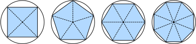

```{.python .input}
%load_ext d2lbook.tab
tab.interact_select(['mxnet', 'pytorch', 'tensorflow', 'jax'])
```

# Calcul
:label:`sec_calculus`

Pendant longtemps, la manière de calculer 
l'aire d'un cercle est restée un mystère.
Puis, dans la Grèce antique, le mathématicien Archimède
a eu l'idée ingénieuse d'inscrire 
une série de polygones avec un nombre croissant de sommets
à l'intérieur d'un cercle
(:numref:`fig_circle_area`). 
Pour un polygone à $n$ sommets,
nous obtenons $n$ triangles.
La hauteur de chaque triangle se rapproche du rayon $r$ 
à mesure que nous divisons le cercle plus finement. 
En même temps, sa base se rapproche de $2 \pi r/n$, 
car le rapport entre l'arc et la sécante tend vers 1 
pour un grand nombre de sommets. 
Ainsi, l'aire du polygone se rapproche de
$n \cdot r \cdot \frac{1}{2} (2 \pi r/n) = \pi r^2$.


:label:`fig_circle_area`

Cette procédure de limite est à la base du 
*calcul différentiel* et du *calcul intégral*. 
Le premier peut nous dire comment augmenter
ou diminuer la valeur d'une fonction en
manipulant ses arguments. 
Cela s'avère utile pour les *problèmes d'optimisation*
que nous rencontrons en apprentissage profond (deep learning),
où nous mettons à jour nos paramètres de manière répétée 
afin de réduire la fonction de perte.
L'optimisation traite de la manière d'ajuster nos modèles aux données d'entraînement,
et le calcul en est le prérequis indispensable.
Cependant, n'oubliez pas que notre objectif ultime
est d'obtenir de bons résultats sur des données *jamais vues auparavant*.
Ce problème est appelé *généralisation*
et sera l'un des thèmes centraux des autres chapitres.

```{.python .input}
%%tab mxnet
%matplotlib inline
from d2l import mxnet as d2l
from matplotlib_inline import backend_inline
from mxnet import np, npx
npx.set_np()
```

```{.python .input}
%%tab pytorch
%matplotlib inline
from d2l import torch as d2l
from matplotlib_inline import backend_inline
import numpy as np
```

```{.python .input}
%%tab tensorflow
%matplotlib inline
from d2l import tensorflow as d2l
from matplotlib_inline import backend_inline
import numpy as np
```

```{.python .input}
%%tab jax
%matplotlib inline
from d2l import jax as d2l
from matplotlib_inline import backend_inline
import numpy as np
```

## Dérivées et différentiation

Pour faire simple, une *dérivée* est le taux de variation
d'une fonction par rapport aux variations de ses arguments.
Les dérivées peuvent nous dire à quelle vitesse une fonction de perte
augmenterait ou diminuerait si nous devions 
*augmenter* ou *diminuer* chaque paramètre
d'une quantité infinitésimale.
Formellement, pour les fonctions $f: \mathbb{R} \rightarrow \mathbb{R}$,
qui transforment des scalaires en scalaires,
[**la *dérivée* de $f$ en un point $x$ est définie comme**]

(**$$f'(x) = \lim_{h \rightarrow 0} \frac{f(x+h) - f(x)}{h}.$$**)
:eqlabel:`eq_derivative`

Ce terme du côté droit est appelé une *limite* 
et il nous indique ce qui arrive 
à la valeur d'une expression
lorsqu'une variable spécifiée 
se rapproche d'une valeur particulière.
Cette limite nous indique vers quoi 
converge le rapport entre une perturbation $h$
et la variation de la valeur de la fonction 
$f(x + h) - f(x)$ à mesure que nous réduisons 
sa taille vers zéro.

Lorsque $f'(x)$ existe, on dit que $f$ est 
*dérivable* en $x$ ;
et lorsque $f'(x)$ existe pour tous les $x$
d'un ensemble, par exemple l'intervalle $[a,b]$, 
nous disons que $f$ est dérivable sur cet ensemble.
Toutes les fonctions ne sont pas dérivables,
y compris beaucoup de celles que nous souhaitons optimiser,
comme la précision (accuracy) et l'aire sous la courbe
caractéristique d'efficacité du récepteur (AUC).
Cependant, comme le calcul de la dérivée de la perte 
est une étape cruciale dans presque tous les 
algorithmes d'entraînement des réseaux de neurones profonds,
nous optimisons souvent un *substitut* (surrogate) dérivable à la place.


Nous pouvons interpréter la dérivée 
$f'(x)$
comme le taux de variation *instantané* 
de $f(x)$ par rapport à $x$.
Développons un peu d'intuition avec un exemple.
(**Définissons $u = f(x) = 3x^2-4x$.**)

```{.python .input}
%%tab mxnet
def f(x):
    return 3 * x ** 2 - 4 * x
```

```{.python .input}
%%tab pytorch
def f(x):
    return 3 * x ** 2 - 4 * x
```

```{.python .input}
%%tab tensorflow
def f(x):
    return 3 * x ** 2 - 4 * x
```

```{.python .input}
%%tab jax
def f(x):
    return 3 * x ** 2 - 4 * x
```

[**En fixant $x=1$, nous voyons que $\frac{f(x+h) - f(x)}{h}$**] (**se rapproche de $2$
à mesure que $h$ se rapproche de $0$.**)
Bien que cette expérience manque 
la rigueur d'une preuve mathématique,
nous pouvons rapidement voir qu'en effet $f'(1) = 2$.

```{.python .input}
%%tab all
for h in 10.0**np.arange(-1, -6, -1):
    print(f'h={h:.5f}, numerical limit={(f(1+h)-f(1))/h:.5f}')
```

Il existe plusieurs conventions de notation équivalentes pour les dérivées.
Étant donné $y = f(x)$, les expressions suivantes sont équivalentes :

$$f'(x) = y' = \frac{dy}{dx} = \frac{df}{dx} = \frac{d}{dx} f(x) = Df(x) = D_x f(x),$$

où les symboles $\frac{d}{dx}$ et $D$ sont des *opérateurs de différentiation*.
Ci-dessous, nous présentons les dérivées de quelques fonctions courantes :

$$\begin{aligned} \frac{d}{dx} C & = 0 && \textrm{pour toute constante $C$} \\ \frac{d}{dx} x^n & = n x^{n-1} && \textrm{pour } n \neq 0 \\ \frac{d}{dx} e^x & = e^x \\ \frac{d}{dx} \ln x & = x^{-1}. \end{aligned}$$

Les fonctions composées à partir de fonctions dérivables 
sont souvent elles-mêmes dérivables.
Les règles suivantes sont utiles 
pour travailler avec des compositions 
de n'importe quelles fonctions dérivables 
$f$ and $g$, et une constante $C$.

$$\begin{aligned} \frac{d}{dx} [C f(x)] & = C \frac{d}{dx} f(x) && \textrm{Règle du multiple constant} \\ \frac{d}{dx} [f(x) + g(x)] & = \frac{d}{dx} f(x) + \frac{d}{dx} g(x) && \textrm{Règle de la somme} \\ \frac{d}{dx} [f(x) g(x)] & = f(x) \frac{d}{dx} g(x) + g(x) \frac{d}{dx} f(x) && \textrm{Règle du produit} \\ \frac{d}{dx} \frac{f(x)}{g(x)} & = \frac{g(x) \frac{d}{dx} f(x) - f(x) \frac{d}{dx} g(x)}{g^2(x)} && \textrm{Règle du quotient} \end{aligned}$$

En utilisant cela, nous pouvons appliquer les règles 
pour trouver la dérivée de $3 x^2 - 4x$ via

$$\frac{d}{dx} [3 x^2 - 4x] = 3 \frac{d}{dx} x^2 - 4 \frac{d}{dx} x = 6x - 4.$$

En remplaçant $x = 1$, on voit qu'en effet, 
la dérivée est égale à $2$ à cet endroit. 
Notez que les dérivées nous indiquent 
la *pente* d'une fonction 
à un endroit particulier.  

## Utilitaires de visualisation

[**Nous pouvons visualiser les pentes des fonctions à l'aide de la bibliothèque `matplotlib`**].
Nous devons définir quelques fonctions. 
Comme son nom l'indique, `use_svg_display` 
indique à `matplotlib` de produire des graphiques 
au format SVG pour des images plus nettes. 
Le commentaire `#@save` est un modificateur spécial 
qui nous permet de sauvegarder n'importe quelle fonction, 
classe ou autre bloc de code dans le package `d2l` 
afin que nous puissions l'invoquer plus tard 
sans répéter le code, 
par exemple via `d2l.use_svg_display()`.

```{.python .input}
%%tab all
def use_svg_display():  #@save
    """Use the svg format to display a plot in Jupyter."""
    backend_inline.set_matplotlib_formats('svg')
```

Pratiquement, nous pouvons définir les dimensions des figures avec `set_figsize`. 
Comme l'instruction d'importation `from matplotlib import pyplot as plt` 
a été marquée par `#@save` dans le package `d2l`, nous pouvons appeler `d2l.plt`.

```{.python .input}
%%tab all
def set_figsize(figsize=(3.5, 2.5)):  #@save
    """Set the figure size for matplotlib."""
    use_svg_display()
    d2l.plt.rcParams['figure.figsize'] = figsize
```

La fonction `set_axes` permet d'associer des propriétés 
aux axes, notamment les étiquettes, les plages 
et les échelles.

```{.python .input}
%%tab all
#@save
def set_axes(axes, xlabel, ylabel, xlim, ylim, xscale, yscale, legend):
    """Set the axes for matplotlib."""
    axes.set_xlabel(xlabel), axes.set_ylabel(ylabel)
    axes.set_xscale(xscale), axes.set_yscale(yscale)
    axes.set_xlim(xlim),     axes.set_ylim(ylim)
    if legend:
        axes.legend(legend)
    axes.grid()
```

Avec ces trois fonctions, nous pouvons définir une fonction `plot` 
pour superposer plusieurs courbes. 
Une grande partie du code ici consiste simplement à s'assurer 
que les tailles et les formes des entrées correspondent.

```{.python .input}
%%tab all
#@save
def plot(X, Y=None, xlabel=None, ylabel=None, legend=[], xlim=None,
         ylim=None, xscale='linear', yscale='linear',
         fmts=('-', 'm--', 'g-.', 'r:'), figsize=(3.5, 2.5), axes=None):
    """Plot data points."""

    def has_one_axis(X):  # True if X (tensor or list) has 1 axis
        return (hasattr(X, "ndim") and X.ndim == 1 or isinstance(X, list)
                and not hasattr(X[0], "__len__"))
    
    if has_one_axis(X): X = [X]
    if Y is None:
        X, Y = [[]] * len(X), X
    elif has_one_axis(Y):
        Y = [Y]
    if len(X) != len(Y):
        X = X * len(Y)
        
    set_figsize(figsize)
    if axes is None:
        axes = d2l.plt.gca()
    axes.cla()
    for x, y, fmt in zip(X, Y, fmts):
        axes.plot(x,y,fmt) if len(x) else axes.plot(y,fmt)
    set_axes(axes, xlabel, ylabel, xlim, ylim, xscale, yscale, legend)
```

Maintenant, nous pouvons [**tracer la fonction $u = f(x)$ et sa ligne tangente $y = 2x - 3$ en $x=1$**],
où le coefficient $2$ est la pente de la ligne tangente.

```{.python .input}
%%tab all
x = np.arange(0, 3, 0.1)
plot(x, [f(x), 2 * x - 3], 'x', 'f(x)', legend=['f(x)', 'Tangent line (x=1)'])
```

## Dérivées partielles et gradients
:label:`subsec_calculus-grad`

Jusqu'à présent, nous avons différencié 
des fonctions d'une seule variable. 
En apprentissage profond, nous devons également travailler 
avec des fonctions de *plusieurs* variables. 
Nous introduisons brièvement les notions de dérivée 
qui s'appliquent à ces fonctions *multivariées*.


Soit $y = f(x_1, x_2, \ldots, x_n)$ une fonction à $n$ variables. 
La *dérivée partielle* de $y$ 
par rapport à son $i$-ième paramètre $x_i$ est

$$ \frac{\partial y}{\partial x_i} = \lim_{h \rightarrow 0} \frac{f(x_1, \ldots, x_{i-1}, x_i+h, x_{i+1}, \ldots, x_n) - f(x_1, \ldots, x_i, \ldots, x_n)}{h}.$$


Pour calculer $\frac{\partial y}{\partial x_i}$, 
nous pouvons traiter $x_1, \ldots, x_{i-1}, x_{i+1}, \ldots, x_n$ comme des constantes 
et calculer la dérivée de $y$ par rapport à $x_i$.
Les conventions de notation suivantes pour les dérivées partielles 
sont toutes courantes et signifient toutes la même chose :

$$\frac{\partial y}{\partial x_i} = \frac{\partial f}{\partial x_i} = \partial_{x_i} f = \partial_i f = f_{x_i} = f_i = D_i f = D_{x_i} f.$$

Nous pouvons concaténer les dérivées partielles 
d'une fonction multivariée 
par rapport à toutes ses variables 
pour obtenir un vecteur appelé
le *gradient* de la fonction.
Supposons que l'entrée de la fonction 
$f: \mathbb{R}^n \rightarrow \mathbb{R}$ 
soit un vecteur à $n$ dimensions 
$\mathbf{x} = [x_1, x_2, \ldots, x_n]^\top$ 
et que la sortie soit un scalaire. 
Le gradient de la fonction $f$ 
par rapport à $\mathbf{x}$ 
est un vecteur de $n$ dérivées partielles :

$$\nabla_{\mathbf{x}} f(\mathbf{x}) = \left[\partial_{x_1} f(\mathbf{x}), \partial_{x_2} f(\mathbf{x}), \ldots
\partial_{x_n} f(\mathbf{x})\right]^\top.$$ 

Lorsqu'il n'y a pas d'ambiguïté,
$\nabla_{\mathbf{x}} f(\mathbf{x})$ 
est généralement remplacé 
par $\nabla f(\mathbf{x})$.
Les règles suivantes sont utiles 
pour différencier les fonctions multivariées :

* Pour tout $\mathbf{A} \in \mathbb{R}^{m \times n}$ nous avons $\nabla_{\mathbf{x}} \mathbf{A} \mathbf{x} = \mathbf{A}^\top$ et $\nabla_{\mathbf{x}} \mathbf{x}^\top \mathbf{A}  = \mathbf{A}$.
* Pour les matrices carrées $\mathbf{A} \in \mathbb{R}^{n \times n}$ nous avons que $\nabla_{\mathbf{x}} \mathbf{x}^\top \mathbf{A} \mathbf{x}  = (\mathbf{A} + \mathbf{A}^\top)\mathbf{x}$ et en particulier
$\nabla_{\mathbf{x}} \|\mathbf{x} \|^2 = \nabla_{\mathbf{x}} \mathbf{x}^\top \mathbf{x} = 2\mathbf{x}$.

De même, pour toute matrice $\mathbf{X}$, 
nous avons $\nabla_{\mathbf{X}} \|\mathbf{X} \|_\textrm{F}^2 = 2\mathbf{X}$. 


## Règle de la chaîne

En apprentissage profond, les gradients concernés
sont souvent difficiles à calculer
parce que nous travaillons avec 
des fonctions profondément imbriquées 
(de fonctions (de fonctions (de fonctions...))).
Heureusement, la *règle de la chaîne* (ou théorème de composition) s'en occupe. 
Pour revenir aux fonctions d'une seule variable,
supposons que $y = f(g(x))$
et que les fonctions sous-jacentes 
$y=f(u)$ et $u=g(x)$ 
soient toutes deux dérivables.
La règle de la chaîne stipule que 


$$\frac{dy}{dx} = \frac{dy}{du} \frac{du}{dx}.$$


Pour en revenir aux fonctions multivariées,
supposons que $y = f(\mathbf{u})$ ait pour variables
$u_1, u_2, \ldots, u_m$, 
où chaque $u_i = g_i(\mathbf{x})$ 
a pour variables $x_1, x_2, \ldots, x_n$,
c'est-à-dire $\mathbf{u} = g(\mathbf{x})$.
Alors la règle de la chaîne stipule que

$$\frac{\partial y}{\partial x_{i}} = \frac{\partial y}{\partial u_{1}} \frac{\partial u_{1}}{\partial x_{i}} + \frac{\partial y}{\partial u_{2}} \frac{\partial u_{2}}{\partial x_{i}} + \ldots + \frac{\partial y}{\partial u_{m}} \frac{\partial u_{m}}{\partial x_{i}} \ \textrm{ et donc } \ \nabla_{\mathbf{x}} y =  \mathbf{A} \nabla_{\mathbf{u}} y,$$

où $\mathbf{A} \in \mathbb{R}^{n \times m}$ est une *matrice*
qui contient la dérivée du vecteur $\mathbf{u}$
par rapport au vecteur $\mathbf{x}$.
Ainsi, l'évaluation du gradient nécessite 
le calcul d'un produit vecteur-matrice. 
C'est l'une des raisons principales pourquoi l'algèbre linéaire 
est un élément constitutif si essentiel 
dans la construction de systèmes d'apprentissage profond. 


## Discussion

Bien que nous n'ayons fait qu'effleurer la surface d'un sujet profond,
un certain nombre de concepts se précisent déjà : 
premièrement, les règles de composition pour la différentiation
peuvent être appliquées de manière routinière, nous permettant
de calculer les gradients *automatiquement*.
Cette tâche ne requiert aucune créativité et nous
pouvons donc concentrer nos facultés cognitives ailleurs.
Deuxièmement, le calcul des dérivées de fonctions à valeurs vectorielles 
nous oblige à multiplier des matrices au fur et à mesure que nous suivons 
le graphe de dépendance des variables de la sortie vers l'entrée. 
En particulier, ce graphe est parcouru dans une direction *avant* (forward) 
lorsque nous évaluons une fonction 
et dans une direction *arrière* (backward) 
lorsque nous calculons les gradients. 
Les chapitres suivants introduiront formellement la rétropropagation (backpropagation),
une procédure de calcul pour appliquer la règle de la chaîne.

Du point de vue de l'optimisation, les gradients nous permettent 
de déterminer comment déplacer les paramètres d'un modèle
afin de réduire la perte,
et chaque étape des algorithmes d'optimisation utilisés 
tout au long de ce livre nécessitera le calcul du gradient.

## Exercices

1. Jusqu'à présent, nous avons admis les règles des dérivées. 
   En utilisant la définition et les limites, prouvez les propriétés 
   pour (i) $f(x) = c$, (ii) $f(x) = x^n$, (iii) $f(x) = e^x$ et (iv) $f(x) = \log x$.
1. Dans le même esprit, prouvez les règles du produit, de la somme et du quotient à partir des principes de base. 
1. Prouvez que la règle du multiple constant découle d'un cas particulier de la règle du produit. 
1. Calculez la dérivée de $f(x) = x^x$. 
1. Que signifie $f'(x) = 0$ pour un certain $x$ ? 
   Donnez un exemple de fonction $f$ 
   et d'un point $x$ pour lequel cela pourrait être vrai. 
1. Tracez la fonction $y = f(x) = x^3 - \frac{1}{x}$ 
   et tracez sa ligne tangente en $x = 1$.
1. Trouvez le gradient de la fonction 
   $f(\mathbf{x}) = 3x_1^2 + 5e^{x_2}$.
1. Quel est le gradient de la fonction 
   $f(\mathbf{x}) = \|\mathbf{x}\|_2$ ? Que se passe-t-il pour $\mathbf{x} = \mathbf{0}$ ?
1. Pouvez-vous écrire la règle de la chaîne pour le cas 
   où $u = f(x, y, z)$ avec $x = x(a, b)$, $y = y(a, b)$ et $z = z(a, b)$ ?
1. Étant donné une fonction $f(x)$ inversible, 
   calculez la dérivée de son inverse $f^{-1}(x)$. 
   Ici, nous avons $f^{-1}(f(x)) = x$ et inversement $f(f^{-1}(y)) = y$. 
   Indice : utilisez ces propriétés dans votre dérivation. 

:begin_tab:`mxnet`
[Discussions](https://discuss.d2l.ai/t/32)
:end_tab:

:begin_tab:`pytorch`
[Discussions](https://discuss.d2l.ai/t/33)
:end_tab:

:begin_tab:`tensorflow`
[Discussions](https://discuss.d2l.ai/t/197)
:end_tab:

:begin_tab:`jax`
[Discussions](https://discuss.d2l.ai/t/17969)
:end_tab:
