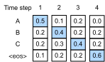
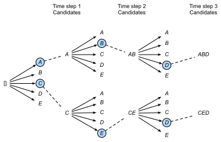

# Recherche en faisceau
:label:`sec_beam-search`

Dans la :numref:`sec_seq2seq`, 
nous avons introduit l'architecture encodeur-décodeur
et les techniques standards pour les entraîner de bout en bout. Cependant, lorsqu'il s'est agi de la prédiction au moment du test,
nous n'avons mentionné que la stratégie *gloutonne* (*greedy*),
où nous sélectionnons à chaque pas de temps 
le jeton ayant la plus haute 
probabilité prédite d'apparaître ensuite, 
jusqu'à ce que, à un certain pas de temps, 
nous prédisions le jeton spécial de fin de séquence « <eos> ».
Dans cette section, nous commencerons 
par formaliser cette stratégie de *recherche gloutonne*
et par identifier certains problèmes 
que les praticiens ont tendance à rencontrer.
Par la suite, nous comparerons cette stratégie
avec deux alternatives :
la *recherche exhaustive* (illustrative mais peu pratique)
et la *recherche en faisceau* (*beam search*, la méthode standard en pratique).

Commençons par établir notre notation mathématique,
en empruntant les conventions de la :numref:`sec_seq2seq`.
À n'importe quel pas de temps $t'$, le décodeur produit des 
prédictions représentant la probabilité 
de chaque jeton du vocabulaire 
apparaissant ensuite dans la séquence 
(la valeur probable de $y_{t'+1}$), 
conditionnée par les jetons précédents
$y_1, \ldots, y_{t'}$ et 
la variable de contexte $\mathbf{c}$,
produite par l'encodeur 
pour représenter la séquence d'entrée.
Pour quantifier le coût de calcul,
notons $\mathcal{Y}$
le vocabulaire de sortie 
(incluant le jeton spécial de fin de séquence « <eos> »).
Spécifions également le nombre maximum de jetons
d'une séquence de sortie par $T'$.
Notre objectif est de rechercher une sortie idéale parmi les 
$\mathcal{O}(\left|\mathcal{Y}\right|^{T'})$
séquences de sortie possibles.
Notez que cela surestime légèrement 
le nombre de sorties distinctes 
car il n'y a pas de jetons suivants
une fois que le jeton « <eos> » apparaît.
Cependant, pour nos besoins, 
ce nombre capture approximativement 
la taille de l'espace de recherche.

## Recherche gloutonne

Considérons la stratégie simple de *recherche gloutonne* de la :numref:`sec_seq2seq`.
Ici, à n'importe quel pas de temps $t'$, 
nous sélectionnons simplement le jeton 
ayant la probabilité conditionnelle la plus élevée
dans $\mathcal{Y}$, c'est-à-dire, 

$$y_{t'} = \operatorname*{argmax}_{y \in \mathcal{Y}} P(y \mid y_1, \ldots, y_{t'-1}, \mathbf{c}).$$

Une fois que notre modèle produit « <eos> » 
(ou que nous atteignons la longueur maximale $T'$),
la séquence de sortie est terminée.

Cette stratégie peut sembler raisonnable, 
et en fait, elle n'est pas si mauvaise !
Compte tenu de sa faible exigence en termes de calcul,
il serait difficile d'obtenir un meilleur rapport performance-coût. 
Cependant, si nous laissons de côté l'efficacité un instant,
il pourrait sembler plus raisonnable de rechercher 
la *séquence la plus probable*, 
et non la séquence de jetons *les plus probables (sélectionnés de manière gloutonne)*.
Il s'avère que ces deux objets peuvent être assez différents. 
La séquence la plus probable est celle qui maximise l'expression
$\prod_{t'=1}^{T'} P(y_{t'} \mid y_1, \ldots, y_{t'-1}, \mathbf{c})$.
Dans notre exemple de traduction automatique,
si le décodeur récupérait véritablement les probabilités
du processus génératif sous-jacent, 
cela nous donnerait la traduction la plus probable.
Malheureusement, il n'y a aucune garantie 
que la recherche gloutonne nous donne cette séquence.

Illustrons cela avec un exemple.
Supposons qu'il y ait quatre jetons 
« A », « B », « C » et « <eos> » dans le dictionnaire de sortie.
Dans la :numref:`fig_s2s-prob1`,
les quatre nombres sous chaque pas de temps représentent
les probabilités conditionnelles de générer respectivement « A », « B », « C » 
et « <eos> », à ce pas de temps.

:label:`fig_s2s-prob1`

À chaque pas de temps, la recherche gloutonne sélectionne 
le jeton ayant la probabilité conditionnelle la plus élevée. 
Par conséquent, la séquence de sortie « A », « B », « C » et « <eos> » 
sera prédite (:numref:`fig_s2s-prob1`). 
La probabilité conditionnelle de cette séquence de sortie
est $0,5 \times 0,4 \times 0,4 \times 0,6 = 0,048$.

Ensuite, regardons un autre exemple dans la :numref:`fig_s2s-prob2`. 
Contrairement à la :numref:`fig_s2s-prob1`, 
au pas de temps 2, nous sélectionnons le jeton « C », 
qui a la *deuxième* probabilité conditionnelle la plus élevée.

:label:`fig_s2s-prob2`

Étant donné que les sous-séquences de sortie aux pas de temps 1 et 2, 
sur lesquelles le pas de temps 3 est basé, 
ont changé de « A » et « B » dans la :numref:`fig_s2s-prob1` 
en « A » et « C » dans la :numref:`fig_s2s-prob2`, 
la probabilité conditionnelle de chaque jeton 
au pas de temps 3 a également changé dans la :numref:`fig_s2s-prob2`. 
Supposons que nous choisissions le jeton « B » au pas de temps 3. 
Maintenant, le pas de temps 4 est conditionné par
la sous-séquence de sortie aux trois premiers pas de temps
« A », « C » et « B », 
qui a changé par rapport à « A », « B » et « C » dans la :numref:`fig_s2s-prob1`. 
Par conséquent, la probabilité conditionnelle de générer 
chaque jeton au pas de temps 4 dans la :numref:`fig_s2s-prob2` 
est également différente de celle de la :numref:`fig_s2s-prob1`. 
En conséquence, la probabilité conditionnelle de la séquence de sortie 
« A », « C », « B » et « <eos> » dans la :numref:`fig_s2s-prob2`
est $0,5 \times 0,3 \times 0,6 \times 0,6 = 0,054$, 
ce qui est supérieur à celle de la recherche gloutonne dans la :numref:`fig_s2s-prob1`. 
Dans cet exemple, la séquence de sortie « A », « B », « C » et « <eos> » 
obtenue par la recherche gloutonne n'est pas optimale.

## Recherche exhaustive

Si l'objectif est d'obtenir la séquence la plus probable, 
nous pouvons envisager d'utiliser la *recherche exhaustive* : 
énumérer toutes les séquences de sortie possibles 
avec leurs probabilités conditionnelles,
puis produire celle qui obtient 
la probabilité prédite la plus élevée.

Bien que cela nous donne certainement ce que nous désirons,
cela se ferait à un coût de calcul prohibitif 
de $\mathcal{O}(\left|\mathcal{Y}\right|^{T'})$,
exponentiel par rapport à la longueur de la séquence et avec une base 
énorme donnée par la taille du vocabulaire.
Par exemple, quand $|\mathcal{Y}|=10000$ et $T'=10$, 
deux petits nombres comparés à ceux des applications réelles, nous devrons évaluer $10000^{10} = 10^{40}$ séquences, ce qui dépasse déjà les capacités de tout ordinateur prévisible.
D'autre part, le coût de calcul de la recherche gloutonne est 
$\mathcal{O}(\left|\mathcal{Y}\right|T')$ : 
miraculeusement bon marché mais loin d'être optimal.
Par exemple, quand $|\mathcal{Y}|=10000$ et $T'=10$, 
nous n'avons besoin d'évaluer que $10000 \times 10 = 10^5$ séquences.

## Recherche en faisceau

Vous pourriez considérer les stratégies de décodage de séquences comme se situant sur un spectre,
la *recherche en faisceau* (*beam search*) constituant un compromis 
entre l'efficacité de la recherche gloutonne
et l'optimalité de la recherche exhaustive.
La version la plus directe de la recherche en faisceau 
est caractérisée par un seul hyperparamètre,
la *taille du faisceau* (*beam size*), $k$.
Expliquons cette terminologie.
Au pas de temps 1, nous sélectionnons les $k$ jetons 
ayant les probabilités prédites les plus élevées.
Chacun d'eux sera le premier jeton de 
$k$ séquences de sortie candidates, respectivement.
À chaque pas de temps suivant, 
sur la base des $k$ séquences de sortie candidates
au pas de temps précédent,
nous continuons à sélectionner $k$ séquences de sortie candidates 
ayant les probabilités prédites les plus élevées 
parmi les $k\left|\mathcal{Y}\right|$ choix possibles.

:label:`fig_beam-search`

La :numref:`fig_beam-search` démontre le 
processus de recherche en faisceau avec un exemple. 
Supposons que le vocabulaire de sortie
ne contienne que cinq éléments : 
$\mathcal{Y} = \{A, B, C, D, E\}$, 
où l'un d'entre eux est « <eos> ». 
Soit la taille du faisceau égale à deux et 
la longueur maximale d'une séquence de sortie égale à trois. 
Au pas de temps 1, 
supposons que les jetons ayant les probabilités conditionnelles 
$P(y_1 \mid \mathbf{c})$ les plus élevées soient $A$ et $C$. 
Au pas de temps 2, pour tout $y_2 \in \mathcal{Y}$, 
nous calculons 

$$\begin{aligned}P(A, y_2 \mid \mathbf{c}) = P(A \mid \mathbf{c})P(y_2 \mid A, \mathbf{c}),\\ P(C, y_2 \mid \mathbf{c}) = P(C \mid \mathbf{c})P(y_2 \mid C, \mathbf{c}),\end{aligned}$$  

et choisissons les deux plus grandes parmi ces dix valeurs, disons
$P(A, B \mid \mathbf{c})$ et $P(C, E \mid \mathbf{c})$.
Puis au pas de temps 3, pour tout $y_3 \in \mathcal{Y}$, nous calculons 

$$\begin{aligned}P(A, B, y_3 \mid \mathbf{c}) = P(A, B \mid \mathbf{c})P(y_3 \mid A, B, \mathbf{c}),\\P(C, E, y_3 \mid \mathbf{c}) = P(C, E \mid \mathbf{c})P(y_3 \mid C, E, \mathbf{c}),\end{aligned}$$ 

et choisissons les deux plus grandes parmi ces dix valeurs, disons 
$P(A, B, D \mid \mathbf{c})$ et $P(C, E, D \mid \mathbf{c})$.
En conséquence, nous obtenons six séquences de sortie candidates : 
(i) $A$ ; (ii) $C$ ; (iii) $A$, $B$ ; (iv) $C$, $E$ ; (v) $A$, $B$, $D$ ; et (vi) $C$, $E$, $D$. 

À la fin, nous obtenons l'ensemble des séquences de sortie candidates finales 
basé sur ces six séquences (par exemple, en supprimant les parties incluant et après « <eos> »).
Ensuite, nous choisissons la séquence de sortie qui maximise le score suivant :

$$ \frac{1}{L^\alpha} \log P(y_1, \ldots, y_{L}\mid \mathbf{c}) = \frac{1}{L^\alpha} \sum_{t'=1}^L \log P(y_{t'} \mid y_1, \ldots, y_{t'-1}, \mathbf{c});$$
:eqlabel:`eq_beam-search-score`

Ici, $L$ est la longueur de la séquence candidate finale 
et $\alpha$ est généralement fixé à 0,75. 
Puisqu'une séquence plus longue a plus de termes logarithmiques 
dans la somme de l' :eqref:`eq_beam-search-score`,
le terme $L^\alpha$ au dénominateur pénalise
les séquences longues.

Le coût de calcul de la recherche en faisceau est $\mathcal{O}(k\left|\mathcal{Y}\right|T')$. 
Ce résultat se situe entre celui de la recherche gloutonne et celui de la recherche exhaustive.
La recherche gloutonne peut être traitée comme un cas particulier de recherche en faisceau 
survenant lorsque la taille du faisceau est fixée à 1.

## Résumé

Les stratégies de recherche de séquence incluent 
la recherche gloutonne, la recherche exhaustive et la recherche en faisceau.
La recherche en faisceau offre un compromis entre précision et 
coût de calcul via le choix flexible de la taille du faisceau.

## Exercices

1. Pouvons-nous traiter la recherche exhaustive comme un type spécial de recherche en faisceau ? Pourquoi ou pourquoi pas ?
1. Appliquez la recherche en faisceau au problème de traduction automatique de la :numref:`sec_seq2seq`. Comment la taille du faisceau affecte-t-elle les résultats de la traduction et la vitesse de prédiction ?
1. Nous avons utilisé la modélisation du langage pour générer du texte suivant des préfixes fournis par l'utilisateur dans la :numref:`sec_rnn-scratch`. Quel genre de stratégie de recherche utilise-t-elle ? Pouvez-vous l'améliorer ?

[Discussions](https://discuss.d2l.ai/t/338)
