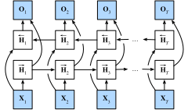

# Réseaux de neurones récurrents bidirectionnels
:label:`sec_bi_rnn`

Jusqu'à présent, notre exemple de travail pour une tâche d'apprentissage de séquences a été la modélisation du langage, où nous cherchons à prédire le prochain jeton à partir de tous les jetons précédents d'une séquence. Dans ce scénario, nous souhaitons uniquement nous baser sur le contexte de gauche, et ainsi le chaînage unidirectionnel d'un RNN standard semble approprié. Cependant, il existe de nombreux autres contextes de tâches d'apprentissage de séquences où il est tout à fait acceptable de baser la prédiction à chaque pas de temps sur les contextes de gauche et de droite. Considérons, par exemple, la détection de catégories grammaticales (part-of-speech). Pourquoi ne devrions-nous pas prendre en compte le contexte dans les deux directions lors de l'évaluation de la catégorie grammaticale associée à un mot donné ?

Une autre tâche courante — souvent utile comme exercice de pré-entraînement avant d'affiner un modèle sur une tâche d'intérêt réelle — consiste à masquer des jetons aléatoires dans un document texte, puis à entraîner un modèle de séquence pour prédire les valeurs des jetons manquants. Notez qu'en fonction de ce qui suit le blanc, la valeur probable du jeton manquant change radicalement :

* Je suis `___`.
* J'ai `___` faim.
* J'ai `___` faim, et je pourrais manger un demi-porc.

Dans la première phrase, « heureux » semble être un candidat probable. Les mots « pas » et « très » semblent plausibles dans la deuxième phrase, mais « pas » semble incompatible avec la troisième phrase.


Heureusement, une technique simple transforme n'importe quel RNN unidirectionnel en un RNN bidirectionnel :cite:`Schuster.Paliwal.1997`. Nous implémentons simplement deux couches de RNN unidirectionnelles chaînées dans des directions opposées et agissant sur la même entrée (:numref:`fig_birnn`). Pour la première couche de RNN, la première entrée est $\mathbf{x}_1$ et la dernière entrée est $\mathbf{x}_T$, mais pour la deuxième couche de RNN, la première entrée est $\mathbf{x}_T$ et la dernière entrée est $\mathbf{x}_1$. Pour produire la sortie de cette couche de RNN bidirectionnelle, nous concaténons simplement les sorties correspondantes des deux couches de RNN unidirectionnelles sous-jacentes.



:label:`fig_birnn`


Formalement, pour tout pas de temps $t$, nous considérons une entrée de minibatch $\mathbf{X}_t \in \mathbb{R}^{n \times d}$ (nombre d'exemples $=n$ ; nombre d'entrées dans chaque exemple $=d$) et soit $\phi$ la fonction d'activation de la couche cachée. Dans l'architecture bidirectionnelle, les états cachés avant et arrière pour ce pas de temps sont respectivement $\overrightarrow{\mathbf{H}}_t  \in \mathbb{R}^{n \times h}$ et $\overleftarrow{\mathbf{H}}_t  \in \mathbb{R}^{n \times h}$, où $h$ est le nombre d'unités cachées. Les mises à jour des états cachés avant et arrière sont les suivantes :


$$
\begin{aligned}
\overrightarrow{\mathbf{H}}_t &= \phi(\mathbf{X}_t \mathbf{W}_{\textrm{xh}}^{(f)} + \overrightarrow{\mathbf{H}}_{t-1} \mathbf{W}_{\textrm{hh}}^{(f)}  + \mathbf{b}_\textrm{h}^{(f)}),\\
\overleftarrow{\mathbf{H}}_t &= \phi(\mathbf{X}_t \mathbf{W}_{\textrm{xh}}^{(b)} + \overleftarrow{\mathbf{H}}_{t+1} \mathbf{W}_{\textrm{hh}}^{(b)}  + \mathbf{b}_\textrm{h}^{(b)}),
\end{aligned}
$$

où les poids $\mathbf{W}_{\textrm{xh}}^{(f)} \in \mathbb{R}^{d \times h}, \mathbf{W}_{\textrm{hh}}^{(f)} \in \mathbb{R}^{h \times h}, \mathbf{W}_{\textrm{xh}}^{(b)} \in \mathbb{R}^{d \times h}, \textrm{ et } \mathbf{W}_{\textrm{hh}}^{(b)} \in \mathbb{R}^{h \times h}$, et les biais $\mathbf{b}_\textrm{h}^{(f)} \in \mathbb{R}^{1 \times h}$ et $\mathbf{b}_\textrm{h}^{(b)} \in \mathbb{R}^{1 \times h}$ sont tous les paramètres du modèle.

Ensuite, nous concaténons les états cachés avant et arrière $\overrightarrow{\mathbf{H}}_t$ et $\overleftarrow{\mathbf{H}}_t$ pour obtenir l'état caché $\mathbf{H}_t \in \mathbb{R}^{n \times 2h}$ à envoyer dans la couche de sortie. Dans les RNN bidirectionnels profonds avec plusieurs couches cachées, ces informations sont transmises comme *entrée* à la couche bidirectionnelle suivante. Enfin, la couche de sortie calcule la sortie $\mathbf{O}_t \in \mathbb{R}^{n \times q}$ (nombre de sorties $=q$) :

$$\mathbf{O}_t = \mathbf{H}_t \mathbf{W}_{\textrm{hq}} + \mathbf{b}_\textrm{q}.$$

Ici, la matrice de poids $\mathbf{W}_{\textrm{hq}} \in \mathbb{R}^{2h \times q}$ et le biais $\mathbf{b}_\textrm{q} \in \mathbb{R}^{1 \times q}$ sont les paramètres du modèle de la couche de sortie. Bien que techniquement, les deux directions puissent avoir des nombres différents d'unités cachées, ce choix de conception est rarement fait en pratique. Nous démontrons maintenant une implémentation simple d'un RNN bidirectionnel.

```{.python .input}
%load_ext d2lbook.tab
tab.interact_select('mxnet', 'pytorch', 'tensorflow', 'jax')
```

```{.python .input}
%%tab mxnet
from d2l import mxnet as d2l
from mxnet import npx, np
from mxnet.gluon import rnn
npx.set_np()
```

```{.python .input}
%%tab pytorch
from d2l import torch as d2l
import torch
from torch import nn
```

```{.python .input}
%%tab tensorflow
from d2l import tensorflow as d2l
import tensorflow as tf
```

```{.python .input}
%%tab jax
from d2l import jax as d2l
from jax import numpy as jnp
```

## Implémentation à partir de zéro

Si nous voulons implémenter un RNN bidirectionnel à partir de zéro, nous pouvons inclure deux instances `RNNScratch` unidirectionnelles avec des paramètres apprenables séparés.

```{.python .input}
%%tab pytorch, mxnet, tensorflow
class BiRNNScratch(d2l.Module):
    def __init__(self, num_inputs, num_hiddens, sigma=0.01):
        super().__init__()
        self.save_hyperparameters()
        self.f_rnn = d2l.RNNScratch(num_inputs, num_hiddens, sigma)
        self.b_rnn = d2l.RNNScratch(num_inputs, num_hiddens, sigma)
        self.num_hiddens *= 2  # The output dimension will be doubled
```

```{.python .input}
%%tab jax
class BiRNNScratch(d2l.Module):
    num_inputs: int
    num_hiddens: int
    sigma: float = 0.01

    def setup(self):
        self.f_rnn = d2l.RNNScratch(num_inputs, num_hiddens, sigma)
        self.b_rnn = d2l.RNNScratch(num_inputs, num_hiddens, sigma)
        self.num_hiddens *= 2  # The output dimension will be doubled
```

Les états des RNN avant et arrière sont mis à jour séparément, tandis que les sorties de ces deux RNN sont concaténées.

```{.python .input}
%%tab all
@d2l.add_to_class(BiRNNScratch)
def forward(self, inputs, Hs=None):
    f_H, b_H = Hs if Hs is not None else (None, None)
    f_outputs, f_H = self.f_rnn(inputs, f_H)
    b_outputs, b_H = self.b_rnn(reversed(inputs), b_H)
    outputs = [d2l.concat((f, b), -1) for f, b in zip(
        f_outputs, reversed(b_outputs))]
    return outputs, (f_H, b_H)
```

## Implémentation concise

:begin_tab:`pytorch, mxnet, tensorflow`
En utilisant les API de haut niveau, nous pouvons implémenter des RNN bidirectionnels de manière plus concise. Nous prenons ici un modèle GRU comme exemple.
:end_tab:

:begin_tab:`jax`
L'API Flax ne propose pas de couches RNN et il n'y a donc pas de notion d'argument `bidirectional`. Il faut inverser manuellement les entrées comme indiqué dans l'implémentation à partir de zéro, si une couche bidirectionnelle est nécessaire.
:end_tab:

```{.python .input}
%%tab mxnet, pytorch
class BiGRU(d2l.RNN):
    def __init__(self, num_inputs, num_hiddens):
        d2l.Module.__init__(self)
        self.save_hyperparameters()
        if tab.selected('mxnet'):
            self.rnn = rnn.GRU(num_hiddens, bidirectional=True)
        if tab.selected('pytorch'):
            self.rnn = nn.GRU(num_inputs, num_hiddens, bidirectional=True)
        self.num_hiddens *= 2
```

## Résumé

Dans les RNN bidirectionnels, l'état caché pour chaque pas de temps est déterminé simultanément par les données avant et après le pas de temps actuel. Les RNN bidirectionnels sont surtout utiles pour l'encodage de séquences et l'estimation d'observations compte tenu d'un contexte bidirectionnel. Les RNN bidirectionnels sont très coûteux à entraîner en raison des longues chaînes de gradients.

## Exercices

1. Si les différentes directions utilisent un nombre différent d'unités cachées, comment la forme de $\mathbf{H}_t$ changera-t-elle ?
1. Concevez un RNN bidirectionnel avec plusieurs couches cachées.
1. La polysémie est courante dans les langues naturelles. Par exemple, le mot anglais « bank » a des significations différentes dans les contextes « I went to the bank to deposit cash » (je suis allé à la banque pour déposer de l'argent) et « I went to the bank to sit down » (je suis allé sur la berge pour m'asseoir). Comment pouvons-nous concevoir un modèle de réseau de neurones tel qu'étant donné une séquence de contexte et un mot, une représentation vectorielle du mot dans le bon contexte soit renvoyée ? Quel type d'architecture neuronale est préférable pour gérer la polysémie ?

:begin_tab:`mxnet`
[Discussions](https://discuss.d2l.ai/t/339)
:end_tab:

:begin_tab:`pytorch`
[Discussions](https://discuss.d2l.ai/t/1059)
:end_tab:

:begin_tab:`jax`
[Discussions](https://discuss.d2l.ai/t/18019)
:end_tab:
