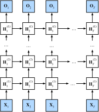

# Réseaux de neurones récurrents profonds

:label:`sec_deep_rnn`

Jusqu'à présent, nous nous sommes concentrés sur la définition de réseaux constitués d'une entrée de séquence, d'une seule couche RNN cachée et d'une couche de sortie. Bien qu'il n'y ait qu'une seule couche cachée entre l'entrée à n'importe quel pas de temps et la sortie correspondante, il y a un sens dans lequel ces réseaux sont profonds. Les entrées du premier pas de temps peuvent influencer les sorties au dernier pas de temps $T$ (souvent des centaines ou des milliers de pas plus tard). Ces entrées passent par $T$ applications de la couche récurrente avant d'atteindre la sortie finale. Cependant, nous souhaitons souvent aussi conserver la capacité d'exprimer des relations complexes entre les entrées à un pas de temps donné et les sorties à ce même pas de temps. Ainsi, nous construisons souvent des RNN qui sont profonds non seulement dans la direction du temps, mais aussi dans la direction de l'entrée vers la sortie. C'est précisément la notion de profondeur que nous avons déjà rencontrée lors de notre développement des MLP et des CNN profonds.


La méthode standard pour construire ce type de RNN profond est d'une simplicité frappante : nous empilons les RNN les uns sur les autres. Étant donné une séquence de longueur $T$, le premier RNN produit une séquence de sorties, également de longueur $T$. Celles-ci constituent à leur tour les entrées de la couche RNN suivante. Dans cette courte section, nous illustrons ce patron de conception et présentons un exemple simple de la façon de coder de tels RNN empilés. Ci-dessous, dans la :numref:`fig_deep_rnn`, nous illustrons un RNN profond avec $L$ couches cachées. Chaque état caché opère sur une entrée séquentielle et produit une sortie séquentielle. De plus, toute cellule RNN (boîte blanche dans la :numref:`fig_deep_rnn`) à chaque pas de temps dépend à la fois de la valeur de la même couche au pas de temps précédent et de la valeur de la couche précédente au même pas de temps. 


:label:`fig_deep_rnn`

Formellement, supposons que nous ayons une entrée de minibatch $\mathbf{X}_t \in \mathbb{R}^{n \times d}$ (nombre d'exemples $=n$ ; nombre d'entrées dans chaque exemple $=d$) au pas de temps $t$. Au même pas de temps, soit l'état caché de la $l$-ième couche cachée ($l=1,\ldots,L$) $\mathbf{H}_t^{(l)} \in \mathbb{R}^{n \times h}$ (nombre d'unités cachées $=h$) et la variable de la couche de sortie $\mathbf{O}_t \in \mathbb{R}^{n \times q}$ (nombre de sorties : $q$). En posant $\mathbf{H}_t^{(0)} = \mathbf{X}_t$, l'état caché de la $l$-ième couche cachée qui utilise la fonction d'activation $\phi_l$ est calculé comme suit :

$$\mathbf{H}_t^{(l)} = \phi_l(\mathbf{H}_t^{(l-1)} \mathbf{W}_{\textrm{xh}}^{(l)} + \mathbf{H}_{t-1}^{(l)} \mathbf{W}_{\textrm{hh}}^{(l)}  + \mathbf{b}_\textrm{h}^{(l)}),$$
:eqlabel:`eq_deep_rnn_H`

où les poids $\mathbf{W}_{\textrm{xh}}^{(l)} \in \mathbb{R}^{h \times h}$ et $\mathbf{W}_{\textrm{hh}}^{(l)} \in \mathbb{R}^{h \times h}$, ainsi que le biais $\mathbf{b}_\textrm{h}^{(l)} \in \mathbb{R}^{1 \times h}$, sont les paramètres du modèle de la $l$-ième couche cachée.

À la fin, le calcul de la couche de sortie n'est basé que sur l'état caché de la dernière couche cachée $L$-ième :

$$\mathbf{O}_t = \mathbf{H}_t^{(L)} \mathbf{W}_{\textrm{hq}} + \mathbf{b}_\textrm{q},$$

où le poids $\mathbf{W}_{\textrm{hq}} \in \mathbb{R}^{h \times q}$ et le biais $\mathbf{b}_\textrm{q} \in \mathbb{R}^{1 \times q}$ sont les paramètres du modèle de la couche de sortie.

Tout comme avec les MLP, le nombre de couches cachées $L$ et le nombre d'unités cachées $h$ sont des hyperparamètres que nous pouvons ajuster. Les largeurs de couches RNN courantes ($h$) se situent dans la plage $(64, 2056)$, et les profondeurs courantes ($L$) se situent dans la plage $(1, 8)$. De plus, nous pouvons facilement obtenir un RNN à portes profond en remplaçant le calcul de l'état caché dans l'équation :eqref:`eq_deep_rnn_H` par celui d'un LSTM ou d'un GRU.

```{.python .input}
%load_ext d2lbook.tab
tab.interact_select('mxnet', 'pytorch', 'tensorflow', 'jax')
```

```{.python .input}
%%tab mxnet
from d2l import mxnet as d2l
from mxnet import np, npx
from mxnet.gluon import rnn
npx.set_np()
```

```{.python .input}
%%tab pytorch
from d2l import torch as d2l
import torch
from torch import nn
```

```{.python .input}
%%tab tensorflow
from d2l import tensorflow as d2l
import tensorflow as tf
```

```{.python .input}
%%tab jax
from d2l import jax as d2l
from flax import linen as nn
import jax
from jax import numpy as jnp
```

## Mise en œuvre à partir de zéro

Pour implémenter un RNN multicouche à partir de zéro, nous pouvons traiter chaque couche comme une instance `RNNScratch` avec ses propres paramètres apprenables.

```{.python .input}
%%tab mxnet, tensorflow
class StackedRNNScratch(d2l.Module):
    def __init__(self, num_inputs, num_hiddens, num_layers, sigma=0.01):
        super().__init__()
        self.save_hyperparameters()
        self.rnns = [d2l.RNNScratch(num_inputs if i==0 else num_hiddens,
                                    num_hiddens, sigma)
                     for i in range(num_layers)]
```

```{.python .input}
%%tab pytorch
class StackedRNNScratch(d2l.Module):
    def __init__(self, num_inputs, num_hiddens, num_layers, sigma=0.01):
        super().__init__()
        self.save_hyperparameters()
        self.rnns = nn.Sequential(*[d2l.RNNScratch(
            num_inputs if i==0 else num_hiddens, num_hiddens, sigma)
                                    for i in range(num_layers)])
```

```{.python .input}
%%tab jax
class StackedRNNScratch(d2l.Module):
    num_inputs: int
    num_hiddens: int
    num_layers: int
    sigma: float = 0.01

    def setup(self):
        self.rnns = [d2l.RNNScratch(self.num_inputs if i==0 else self.num_hiddens,
                                    self.num_hiddens, self.sigma)
                     for i in range(self.num_layers)]
```

Le calcul avant (forward) multicouche effectue simplement le calcul avant couche par couche.

```{.python .input}
%%tab all
@d2l.add_to_class(StackedRNNScratch)
def forward(self, inputs, Hs=None):
    outputs = inputs
    if Hs is None: Hs = [None] * self.num_layers
    for i in range(self.num_layers):
        outputs, Hs[i] = self.rnns[i](outputs, Hs[i])
        outputs = d2l.stack(outputs, 0)
    return outputs, Hs
```

À titre d'exemple, nous entraînons un modèle GRU profond sur le jeu de données *The Time Machine* (identique à celui de la :numref:`sec_rnn-scratch`). Pour simplifier les choses, nous fixons le nombre de couches à 2.

```{.python .input}
%%tab all
data = d2l.TimeMachine(batch_size=1024, num_steps=32)
if tab.selected('mxnet', 'pytorch', 'jax'):
    rnn_block = StackedRNNScratch(num_inputs=len(data.vocab),
                                  num_hiddens=32, num_layers=2)
    model = d2l.RNNLMScratch(rnn_block, vocab_size=len(data.vocab), lr=2)
    trainer = d2l.Trainer(max_epochs=100, gradient_clip_val=1, num_gpus=1)
if tab.selected('tensorflow'):
    with d2l.try_gpu():
        rnn_block = StackedRNNScratch(num_inputs=len(data.vocab),
                                  num_hiddens=32, num_layers=2)
        model = d2l.RNNLMScratch(rnn_block, vocab_size=len(data.vocab), lr=2)
    trainer = d2l.Trainer(max_epochs=100, gradient_clip_val=1)
trainer.fit(model, data)
```

## Mise en œuvre concise

:begin_tab:`pytorch, mxnet, tensorflow`
Heureusement, de nombreux détails logistiques nécessaires pour implémenter plusieurs couches d'un RNN sont facilement disponibles dans les API de haut niveau. Notre mise en œuvre concise utilisera de telles fonctionnalités intégrées. Le code généralise celui que nous avons utilisé précédemment dans la :numref:`sec_gru`, en nous permettant de spécifier explicitement le nombre de couches plutôt que de choisir la valeur par défaut d'une seule couche.
:end_tab:

:begin_tab:`jax`
Flax adopte une approche minimaliste lors de l'implémentation des RNN. La définition du nombre de couches dans un RNN ou sa combinaison avec un dropout n'est pas disponible d'emblée. Notre mise en œuvre concise utilisera toutes les fonctionnalités intégrées et ajoutera les fonctionnalités `num_layers` et `dropout` par-dessus. Le code généralise celui que nous avons utilisé précédemment dans la :numref:`sec_gru`, permettant de spécifier explicitement le nombre de couches plutôt que de choisir la valeur par défaut d'une seule couche.
:end_tab:

```{.python .input}
%%tab mxnet
class GRU(d2l.RNN):  #@save
    """The multilayer GRU model."""
    def __init__(self, num_hiddens, num_layers, dropout=0):
        d2l.Module.__init__(self)
        self.save_hyperparameters()
        self.rnn = rnn.GRU(num_hiddens, num_layers, dropout=dropout)
```

```{.python .input}
%%tab pytorch
class GRU(d2l.RNN):  #@save
    """The multilayer GRU model."""
    def __init__(self, num_inputs, num_hiddens, num_layers, dropout=0):
        d2l.Module.__init__(self)
        self.save_hyperparameters()
        self.rnn = nn.GRU(num_inputs, num_hiddens, num_layers,
                          dropout=dropout)
```

```{.python .input}
%%tab tensorflow
class GRU(d2l.RNN):  #@save
    """The multilayer GRU model."""
    def __init__(self, num_hiddens, num_layers, dropout=0):
        d2l.Module.__init__(self)
        self.save_hyperparameters()
        gru_cells = [tf.keras.layers.GRUCell(num_hiddens, dropout=dropout)
                     for _ in range(num_layers)]
        self.rnn = tf.keras.layers.RNN(gru_cells, return_sequences=True,
                                       return_state=True, time_major=True)

    def forward(self, X, state=None):
        outputs, *state = self.rnn(X, state)
        return outputs, state
```

```{.python .input}
%%tab jax
class GRU(d2l.RNN):  #@save
    """The multilayer GRU model."""
    num_hiddens: int
    num_layers: int
    dropout: float = 0

    @nn.compact
    def __call__(self, X, state=None, training=False):
        outputs = X
        new_state = []
        if state is None:
            batch_size = X.shape[1]
            state = [nn.GRUCell.initialize_carry(jax.random.PRNGKey(0),
                    (batch_size,), self.num_hiddens)] * self.num_layers

        GRU = nn.scan(nn.GRUCell, variable_broadcast="params",
                      in_axes=0, out_axes=0, split_rngs={"params": False})

        # Introduce a dropout layer after every GRU layer except last
        for i in range(self.num_layers - 1):
            layer_i_state, X = GRU()(state[i], outputs)
            new_state.append(layer_i_state)
            X = nn.Dropout(self.dropout, deterministic=not training)(X)

        # Final GRU layer without dropout
        out_state, X = GRU()(state[-1], X)
        new_state.append(out_state)
        return X, jnp.array(new_state)
```

Les décisions architecturales telles que le choix des hyperparamètres sont très similaires à celles de la :numref:`sec_gru`. Nous choisissons le même nombre d'entrées et de sorties que nous avons de jetons distincts, c'est-à-dire `vocab_size`. Le nombre d'unités cachées est toujours de 32. La seule différence est que nous sélectionnons maintenant (**un nombre non trivial de couches cachées en spécifiant la valeur de `num_layers`.**)

```{.python .input}
%%tab mxnet
gru = GRU(num_hiddens=32, num_layers=2)
model = d2l.RNNLM(gru, vocab_size=len(data.vocab), lr=2)

# Running takes > 1h (pending fix from MXNet)
# trainer.fit(model, data)
# model.predict('it has', 20, data.vocab, d2l.try_gpu())
```

```{.python .input}
%%tab pytorch, tensorflow, jax
if tab.selected('tensorflow', 'jax'):
    gru = GRU(num_hiddens=32, num_layers=2)
if tab.selected('pytorch'):
    gru = GRU(num_inputs=len(data.vocab), num_hiddens=32, num_layers=2)
if tab.selected('pytorch', 'jax'):
    model = d2l.RNNLM(gru, vocab_size=len(data.vocab), lr=2)
if tab.selected('tensorflow'):
    with d2l.try_gpu():
        model = d2l.RNNLM(gru, vocab_size=len(data.vocab), lr=2)
trainer.fit(model, data)
```

```{.python .input}
%%tab pytorch
model.predict('it has', 20, data.vocab, d2l.try_gpu())
```

```{.python .input}
%%tab tensorflow
model.predict('it has', 20, data.vocab)
```

```{.python .input}
%%tab jax
model.predict('it has', 20, data.vocab, trainer.state.params)
```

## Résumé

Dans les RNN profonds, les informations de l'état caché sont transmises au pas de temps suivant de la couche actuelle et au pas de temps actuel de la couche suivante. Il existe de nombreuses variantes de RNN profonds, tels que les LSTM, les GRU ou les RNN classiques (*vanilla*). Pratiquement, ces modèles sont tous disponibles en tant que parties des API de haut niveau des frameworks de deep learning. L'initialisation des modèles nécessite de l'attention. Dans l'ensemble, les RNN profonds nécessitent une quantité considérable de travail (comme le taux d'apprentissage et le découpage du gradient) pour assurer une convergence correcte.

## Exercices

1. Remplacez le GRU par un LSTM et comparez la précision et la vitesse d'entraînement.
1. Augmentez les données d'entraînement pour inclure plusieurs livres. Jusqu'où pouvez-vous descendre sur l'échelle de la perplexité ?
1. Souhaitez-vous combiner des sources de différents auteurs lors de la modélisation de texte ? Pourquoi est-ce une bonne idée ? Qu'est-ce qui pourrait mal se passer ?

:begin_tab:`mxnet`
[Discussions](https://discuss.d2l.ai/t/340)
:end_tab:

:begin_tab:`pytorch`
[Discussions](https://discuss.d2l.ai/t/1058)
:end_tab:

:begin_tab:`tensorflow`
[Discussions](https://discuss.d2l.ai/t/3862)
:end_tab:

:begin_tab:`jax`
[Discussions](https://discuss.d2l.ai/t/18018)
:end_tab:
