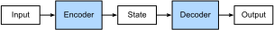

```{.python .input  n=1}
%load_ext d2lbook.tab
tab.interact_select('mxnet', 'pytorch', 'tensorflow', 'jax')
```

# L'architecture encodeur-décodeur
:label:`sec_encoder-decoder`

Dans les problèmes généraux de séquence à séquence
comme la traduction automatique
(:numref:`sec_machine_translation`),
les entrées et les sorties sont de longueurs variables
et ne sont pas alignées.
L'approche standard pour traiter ce type de données
consiste à concevoir une architecture *encodeur-décodeur* (:numref:`fig_encoder_decoder`)
composée de deux éléments majeurs :
un *encodeur* qui prend une séquence de longueur variable en entrée,
et un *décodeur* qui agit comme un modèle de langage conditionnel,
prenant l'entrée encodée
et le contexte de gauche de la séquence cible
pour prédire le jeton suivant dans la séquence cible.



:label:`fig_encoder_decoder`

Prenons l'exemple de la traduction automatique de l'anglais vers le français.
Étant donné une séquence d'entrée en anglais :
« They », « are », « watching », « . »,
cette architecture encodeur-décodeur
encode d'abord l'entrée de longueur variable dans un état,
puis décode cet état
pour générer la séquence traduite,
jeton par jeton, en sortie :
« Ils », « regardent », « . ».
Comme l'architecture encodeur-décodeur
constitue la base de différents modèles de séquence à séquence
dans les sections suivantes,
cette section convertira cette architecture
en une interface qui sera implémentée plus tard.

```{.python .input}
%%tab mxnet
from d2l import mxnet as d2l
from mxnet.gluon import nn
```

```{.python .input}
%%tab pytorch
from d2l import torch as d2l
from torch import nn
```

```{.python .input}
%%tab tensorflow
from d2l import tensorflow as d2l
import tensorflow as tf
```

```{.python .input}
%%tab jax
from d2l import jax as d2l
from flax import linen as nn
```

## (**Encodeur**)

Dans l'interface de l'encodeur,
nous précisons simplement que
l'encodeur prend des séquences de longueur variable comme entrée `X`.
L'implémentation sera fournie
par tout modèle qui hérite de cette classe de base `Encoder`.

```{.python .input}
%%tab mxnet
class Encoder(nn.Block):  #@save
    """The base encoder interface for the encoder--decoder architecture."""
    def __init__(self):
        super().__init__()

    # Later there can be additional arguments (e.g., length excluding padding)
    def forward(self, X, *args):
        raise NotImplementedError
```

```{.python .input}
%%tab pytorch
class Encoder(nn.Module):  #@save
    """The base encoder interface for the encoder--decoder architecture."""
    def __init__(self):
        super().__init__()

    # Later there can be additional arguments (e.g., length excluding padding)
    def forward(self, X, *args):
        raise NotImplementedError
```

```{.python .input}
%%tab tensorflow
class Encoder(tf.keras.layers.Layer):  #@save
    """The base encoder interface for the encoder--decoder architecture."""
    def __init__(self):
        super().__init__()

    # Later there can be additional arguments (e.g., length excluding padding)
    def call(self, X, *args):
        raise NotImplementedError
```

```{.python .input}
%%tab jax
class Encoder(nn.Module):  #@save
    """The base encoder interface for the encoder--decoder architecture."""
    def setup(self):
        raise NotImplementedError

    # Later there can be additional arguments (e.g., length excluding padding)
    def __call__(self, X, *args):
        raise NotImplementedError
```

## [**Décodeur**]

Dans l'interface du décodeur suivante,
nous ajoutons une méthode supplémentaire `init_state`
pour convertir la sortie de l'encodeur (`enc_all_outputs`)
en l'état encodé.
Notez que cette étape
peut nécessiter des entrées supplémentaires,
telles que la longueur valide de l'entrée,
qui a été expliquée
dans la :numref:`sec_machine_translation`.
Pour générer une séquence de longueur variable jeton par jeton,
le décodeur peut mapper à chaque fois une entrée
(par exemple, le jeton généré à l'étape temporelle précédente)
et l'état encodé
en un jeton de sortie à l'étape temporelle actuelle.

```{.python .input}
%%tab mxnet
class Decoder(nn.Block):  #@save
    """The base decoder interface for the encoder--decoder architecture."""
    def __init__(self):
        super().__init__()

    # Later there can be additional arguments (e.g., length excluding padding)
    def init_state(self, enc_all_outputs, *args):
        raise NotImplementedError

    def forward(self, X, state):
        raise NotImplementedError
```

```{.python .input}
%%tab pytorch
class Decoder(nn.Module):  #@save
    """The base decoder interface for the encoder--decoder architecture."""
    def __init__(self):
        super().__init__()

    # Later there can be additional arguments (e.g., length excluding padding)
    def init_state(self, enc_all_outputs, *args):
        raise NotImplementedError

    def forward(self, X, state):
        raise NotImplementedError
```

```{.python .input}
%%tab tensorflow
class Decoder(tf.keras.layers.Layer):  #@save
    """The base decoder interface for the encoder--decoder architecture."""
    def __init__(self):
        super().__init__()

    # Later there can be additional arguments (e.g., length excluding padding)
    def init_state(self, enc_all_outputs, *args):
        raise NotImplementedError

    def call(self, X, state):
        raise NotImplementedError
```

```{.python .input}
%%tab jax
class Decoder(nn.Module):  #@save
    """The base decoder interface for the encoder--decoder architecture."""
    def setup(self):
        raise NotImplementedError

    # Later there can be additional arguments (e.g., length excluding padding)
    def init_state(self, enc_all_outputs, *args):
        raise NotImplementedError

    def __call__(self, X, state):
        raise NotImplementedError
```

## [**Assembler l'encodeur et le décodeur**]

Dans la propagation avant,
la sortie de l'encodeur
est utilisée pour produire l'état encodé,
et cet état sera ensuite utilisé
par le décodeur comme l'une de ses entrées.

```{.python .input}
%%tab mxnet, pytorch
class EncoderDecoder(d2l.Classifier):  #@save
    """The base class for the encoder--decoder architecture."""
    def __init__(self, encoder, decoder):
        super().__init__()
        self.encoder = encoder
        self.decoder = decoder

    def forward(self, enc_X, dec_X, *args):
        enc_all_outputs = self.encoder(enc_X, *args)
        dec_state = self.decoder.init_state(enc_all_outputs, *args)
        # Return decoder output only
        return self.decoder(dec_X, dec_state)[0]
```

```{.python .input}
%%tab tensorflow
class EncoderDecoder(d2l.Classifier):  #@save
    """The base class for the encoder--decoder architecture."""
    def __init__(self, encoder, decoder):
        super().__init__()
        self.encoder = encoder
        self.decoder = decoder

    def call(self, enc_X, dec_X, *args):
        enc_all_outputs = self.encoder(enc_X, *args, training=True)
        dec_state = self.decoder.init_state(enc_all_outputs, *args)
        # Return decoder output only
        return self.decoder(dec_X, dec_state, training=True)[0]
```

```{.python .input}
%%tab jax
class EncoderDecoder(d2l.Classifier):  #@save
    """The base class for the encoder--decoder architecture."""
    encoder: nn.Module
    decoder: nn.Module
    training: bool

    def __call__(self, enc_X, dec_X, *args):
        enc_all_outputs = self.encoder(enc_X, *args, training=self.training)
        dec_state = self.decoder.init_state(enc_all_outputs, *args)
        # Return decoder output only
        return self.decoder(dec_X, dec_state, training=self.training)[0]
```

Dans la section suivante,
nous verrons comment appliquer les RNN pour concevoir
des modèles de séquence à séquence basés sur
cette architecture encodeur-décodeur.


## Résumé

Les architectures encodeur-décodeur
peuvent gérer des entrées et des sorties
composées toutes deux de séquences de longueur variable
et sont donc adaptées aux problèmes de séquence à séquence
tels que la traduction automatique.
L'encodeur prend une séquence de longueur variable en entrée
et la transforme en un état de forme fixe.
Le décodeur mappe l'état encodé de forme fixe
vers une séquence de longueur variable.


## Exercices

1. Supposons que nous utilisions des réseaux de neurones pour implémenter l'architecture encodeur-décodeur. L'encodeur et le décodeur doivent-ils être du même type de réseau de neurones ?
1. Outre la traduction automatique, pouvez-vous penser à une autre application où l'architecture encodeur-décodeur peut être appliquée ?

:begin_tab:`mxnet`
[Discussions](https://discuss.d2l.ai/t/341)
:end_tab:

:begin_tab:`pytorch`
[Discussions](https://discuss.d2l.ai/t/1061)
:end_tab:

:begin_tab:`tensorflow`
[Discussions](https://discuss.d2l.ai/t/3864)
:end_tab:

:begin_tab:`jax`
[Discussions](https://discuss.d2l.ai/t/18021)
:end_tab:
