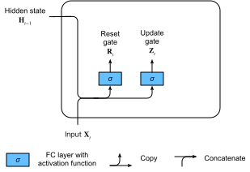
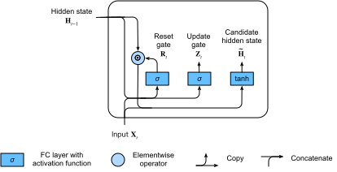
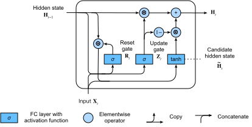

# Unités récurrentes à porte (GRU)
:label:`sec_gru`


Alors que les RNN et particulièrement l'architecture LSTM (:numref:`sec_lstm`)
ont rapidement gagné en popularité au cours des années 2010,
un certain nombre de chercheurs ont commencé à expérimenter
avec des architectures simplifiées dans l'espoir
de conserver l'idée clé de l'incorporation
d'un état interne et de mécanismes de portes multiplicatives
mais dans le but d'accélérer les calculs.
L'unité récurrente à porte (GRU) :cite:`Cho.Van-Merrienboer.Bahdanau.ea.2014`
propose une version simplifiée de la cellule mémoire LSTM
qui atteint souvent des performances comparables
mais avec l'avantage d'être plus rapide
à calculer :cite:`Chung.Gulcehre.Cho.ea.2014`.

```{.python .input  n=5}
%load_ext d2lbook.tab
tab.interact_select(['mxnet', 'pytorch', 'tensorflow', 'jax'])
```

```{.python .input  n=6}
%%tab mxnet
from d2l import mxnet as d2l
from mxnet import np, npx
from mxnet.gluon import rnn
npx.set_np()
```

```{.python .input  n=7}
%%tab pytorch
from d2l import torch as d2l
import torch
from torch import nn
```

```{.python .input  n=8}
%%tab tensorflow
from d2l import tensorflow as d2l
import tensorflow as tf
```

```{.python .input}
%%tab jax
from d2l import jax as d2l
from flax import linen as nn
import jax
from jax import numpy as jnp
```

## Porte de réinitialisation et porte de mise à jour

Ici, les trois portes du LSTM sont remplacées par deux :
la *porte de réinitialisation* (*reset gate*) et la *porte de mise à jour* (*update gate*).
Comme pour les LSTM, ces portes reçoivent des activations sigmoïdes,
forçant leurs valeurs à se situer dans l'intervalle $(0, 1)$.
Intuitivement, la porte de réinitialisation contrôle la part de l'état précédent
que nous souhaitons encore conserver en mémoire.
De même, une porte de mise à jour nous permettrait de contrôler
quelle part du nouvel état est simplement une copie de l'ancien.
La :numref:`fig_gru_1` illustre les entrées des deux portes,
de réinitialisation et de mise à jour, dans un GRU,
étant donnés l'entrée de l'étape temporelle actuelle
et l'état caché de l'étape temporelle précédente.
Les sorties des portes sont données
par deux couches entièrement connectées
avec une fonction d'activation sigmoïde.


:label:`fig_gru_1`

Mathématiquement, pour une étape temporelle $t$ donnée,
supposons que l'entrée est un minilot
$\mathbf{X}_t \in \mathbb{R}^{n \times d}$
(nombre d'exemples $=n$ ; nombre d'entrées $=d$)
et que l'état caché de l'étape temporelle précédente
est $\mathbf{H}_{t-1} \in \mathbb{R}^{n \times h}$
(nombre d'unités cachées $=h$).
Alors la porte de réinitialisation $\mathbf{R}_t \in \mathbb{R}^{n \times h}$
et la porte de mise à jour $\mathbf{Z}_t \in \mathbb{R}^{n \times h}$ sont calculées comme suit :

$$
\begin{aligned}
\mathbf{R}_t = \sigma(\mathbf{X}_t \mathbf{W}_{\textrm{xr}} + \mathbf{H}_{t-1} \mathbf{W}_{\textrm{hr}} + \mathbf{b}_\textrm{r}),\\
\mathbf{Z}_t = \sigma(\mathbf{X}_t \mathbf{W}_{\textrm{xz}} + \mathbf{H}_{t-1} \mathbf{W}_{\textrm{hz}} + \mathbf{b}_\textrm{z}),
\end{aligned}
$$

où $\mathbf{W}_{\textrm{xr}}, \mathbf{W}_{\textrm{xz}} \in \mathbb{R}^{d \times h}$
et $\mathbf{W}_{\textrm{hr}}, \mathbf{W}_{\textrm{hz}} \in \mathbb{R}^{h \times h}$
sont des paramètres de poids et $\mathbf{b}_\textrm{r}, \mathbf{b}_\textrm{z} \in \mathbb{R}^{1 \times h}$
sont des paramètres de biais.


## État caché candidat

Ensuite, nous intégrons la porte de réinitialisation $\mathbf{R}_t$
au mécanisme de mise à jour régulier
de :eqref:`rnn_h_with_state`,
ce qui conduit à l'*état caché candidat* suivant
$\tilde{\mathbf{H}}_t \in \mathbb{R}^{n \times h}$ à l'étape temporelle $t$ :

$$\tilde{\mathbf{H}}_t = \tanh(\mathbf{X}_t \mathbf{W}_{\textrm{xh}} + \left(\mathbf{R}_t \odot \mathbf{H}_{t-1}\right) \mathbf{W}_{\textrm{hh}} + \mathbf{b}_\textrm{h}),$$
:eqlabel:`gru_tilde_H`

où $\mathbf{W}_{\textrm{xh}} \in \mathbb{R}^{d \times h}$ et $\mathbf{W}_{\textrm{hh}} \in \mathbb{R}^{h \times h}$
sont des paramètres de poids,
$\mathbf{b}_\textrm{h} \in \mathbb{R}^{1 \times h}$
est le biais,
et le symbole $\odot$ est l'opérateur du produit de Hadamard (élément par élément).
Ici, nous utilisons une fonction d'activation tanh.

Le résultat est un *candidat*, car nous devons encore
intégrer l'action de la porte de mise à jour.
En comparant avec :eqref:`rnn_h_with_state`,
l'influence des états précédents
peut désormais être réduite grâce à la multiplication élément par élément de
$\mathbf{R}_t$ et $\mathbf{H}_{t-1}$
dans :eqref:`gru_tilde_H`.
Chaque fois que les entrées de la porte de réinitialisation $\mathbf{R}_t$ sont proches de 1,
nous retrouvons un RNN classique comme celui de :eqref:`rnn_h_with_state`.
Pour toutes les entrées de la porte de réinitialisation $\mathbf{R}_t$ qui sont proches de 0,
l'état caché candidat est le résultat d'un MLP avec $\mathbf{X}_t$ en entrée.
Tout état caché préexistant est ainsi *réinitialisé* aux valeurs par défaut.

La :numref:`fig_gru_2` illustre le flux de calcul après l'application de la porte de réinitialisation.


:label:`fig_gru_2`


## État caché

Enfin, nous devons intégrer l'effet de la porte de mise à jour $\mathbf{Z}_t$.
Celle-ci détermine dans quelle mesure le nouvel état caché $\mathbf{H}_t \in \mathbb{R}^{n \times h}$
correspond à l'ancien état $\mathbf{H}_{t-1}$ par rapport à sa ressemblance
avec le nouvel état candidat $\tilde{\mathbf{H}}_t$.
La porte de mise à jour $\mathbf{Z}_t$ peut être utilisée à cette fin,
simplement en prenant des combinaisons convexes élément par élément
de $\mathbf{H}_{t-1}$ et $\tilde{\mathbf{H}}_t$.
Cela conduit à l'équation de mise à jour finale pour le GRU :

$$\mathbf{H}_t = \mathbf{Z}_t \odot \mathbf{H}_{t-1}  + (1 - \mathbf{Z}_t) \odot \tilde{\mathbf{H}}_t.$$


Chaque fois que la porte de mise à jour $\mathbf{Z}_t$ est proche de 1,
nous conservons simplement l'ancien état.
Dans ce cas, les informations provenant de $\mathbf{X}_t$ sont ignorées,
ce qui revient à sauter l'étape temporelle $t$ dans la chaîne de dépendance.
En revanche, chaque fois que $\mathbf{Z}_t$ est proche de 0,
le nouvel état latent $\mathbf{H}_t$ s'approche de l'état latent candidat $\tilde{\mathbf{H}}_t$.
La :numref:`fig_gru_3` montre le flux de calcul une fois la porte de mise à jour en action.


:label:`fig_gru_3`


En résumé, les GRU présentent les deux caractéristiques distinctives suivantes :

* Les portes de réinitialisation aident à capturer les dépendances à court terme dans les séquences.
* Les portes de mise à jour aident à capturer les dépendances à long terme dans les séquences.

## Implémentation à partir de zéro

Pour mieux comprendre le modèle GRU, implémentons-le à partir de zéro.

### (**Initialisation des paramètres du modèle**)

La première étape consiste à initialiser les paramètres du modèle.
Nous tirons les poids d'une distribution gaussienne
avec un écart-type `sigma` et fixons le biais à 0.
L'hyperparamètre `num_hiddens` définit le nombre d'unités cachées.
Nous instancions tous les poids et biais relatifs à la porte de mise à jour,
à la porte de réinitialisation et à l'état caché candidat.

```{.python .input}
%%tab pytorch, mxnet, tensorflow
class GRUScratch(d2l.Module):
    def __init__(self, num_inputs, num_hiddens, sigma=0.01):
        super().__init__()
        self.save_hyperparameters()
        
        if tab.selected('mxnet'):
            init_weight = lambda *shape: d2l.randn(*shape) * sigma
            triple = lambda: (init_weight(num_inputs, num_hiddens),
                              init_weight(num_hiddens, num_hiddens),
                              d2l.zeros(num_hiddens))            
        if tab.selected('pytorch'):
            init_weight = lambda *shape: nn.Parameter(d2l.randn(*shape) * sigma)
            triple = lambda: (init_weight(num_inputs, num_hiddens),
                              init_weight(num_hiddens, num_hiddens),
                              nn.Parameter(d2l.zeros(num_hiddens)))
        if tab.selected('tensorflow'):
            init_weight = lambda *shape: tf.Variable(d2l.normal(shape) * sigma)
            triple = lambda: (init_weight(num_inputs, num_hiddens),
                              init_weight(num_hiddens, num_hiddens),
                              tf.Variable(d2l.zeros(num_hiddens)))            
            
        self.W_xz, self.W_hz, self.b_z = triple()  # Update gate
        self.W_xr, self.W_hr, self.b_r = triple()  # Reset gate
        self.W_xh, self.W_hh, self.b_h = triple()  # Candidate hidden state        
```

```{.python .input}
%%tab jax
class GRUScratch(d2l.Module):
    num_inputs: int
    num_hiddens: int
    sigma: float = 0.01

    def setup(self):
        init_weight = lambda name, shape: self.param(name,
                                                     nn.initializers.normal(self.sigma),
                                                     shape)
        triple = lambda name : (
            init_weight(f'W_x{name}', (self.num_inputs, self.num_hiddens)),
            init_weight(f'W_h{name}', (self.num_hiddens, self.num_hiddens)),
            self.param(f'b_{name}', nn.initializers.zeros, (self.num_hiddens)))

        self.W_xz, self.W_hz, self.b_z = triple('z')  # Update gate
        self.W_xr, self.W_hr, self.b_r = triple('r')  # Reset gate
        self.W_xh, self.W_hh, self.b_h = triple('h')  # Candidate hidden state
```

### Définition du modèle

Nous sommes maintenant prêts à [**définir le calcul de propagation avant du GRU**].
Sa structure est la même que celle de la cellule RNN de base,
à ceci près que les équations de mise à jour sont plus complexes.

```{.python .input}
%%tab pytorch, mxnet, tensorflow
@d2l.add_to_class(GRUScratch)
def forward(self, inputs, H=None):
    if H is None:
        # Initial state with shape: (batch_size, num_hiddens)
        if tab.selected('mxnet'):
            H = d2l.zeros((inputs.shape[1], self.num_hiddens),
                          ctx=inputs.ctx)
        if tab.selected('pytorch'):
            H = d2l.zeros((inputs.shape[1], self.num_hiddens),
                          device=inputs.device)
        if tab.selected('tensorflow'):
            H = d2l.zeros((inputs.shape[1], self.num_hiddens))
    outputs = []
    for X in inputs:
        Z = d2l.sigmoid(d2l.matmul(X, self.W_xz) +
                        d2l.matmul(H, self.W_hz) + self.b_z)
        R = d2l.sigmoid(d2l.matmul(X, self.W_xr) + 
                        d2l.matmul(H, self.W_hr) + self.b_r)
        H_tilde = d2l.tanh(d2l.matmul(X, self.W_xh) + 
                           d2l.matmul(R * H, self.W_hh) + self.b_h)
        H = Z * H + (1 - Z) * H_tilde
        outputs.append(H)
    return outputs, H
```

```{.python .input}
%%tab jax
@d2l.add_to_class(GRUScratch)
def forward(self, inputs, H=None):
    # Use lax.scan primitive instead of looping over the
    # inputs, since scan saves time in jit compilation
    def scan_fn(H, X):
        Z = d2l.sigmoid(d2l.matmul(X, self.W_xz) + d2l.matmul(H, self.W_hz) +
                        self.b_z)
        R = d2l.sigmoid(d2l.matmul(X, self.W_xr) +
                        d2l.matmul(H, self.W_hr) + self.b_r)
        H_tilde = d2l.tanh(d2l.matmul(X, self.W_xh) +
                           d2l.matmul(R * H, self.W_hh) + self.b_h)
        H = Z * H + (1 - Z) * H_tilde
        return H, H  # return carry, y

    if H is None:
        batch_size = inputs.shape[1]
        carry = jnp.zeros((batch_size, self.num_hiddens))
    else:
        carry = H

    # scan takes the scan_fn, initial carry state, xs with leading axis to be scanned
    carry, outputs = jax.lax.scan(scan_fn, carry, inputs)
    return outputs, carry
```

### Entraînement

L'[**entraînement**] d'un modèle de langue sur le jeu de données *The Time Machine*
fonctionne exactement de la même manière que dans la :numref:`sec_rnn-scratch`.

```{.python .input}
%%tab all
data = d2l.TimeMachine(batch_size=1024, num_steps=32)
if tab.selected('mxnet', 'pytorch', 'jax'):
    gru = GRUScratch(num_inputs=len(data.vocab), num_hiddens=32)
    model = d2l.RNNLMScratch(gru, vocab_size=len(data.vocab), lr=4)
    trainer = d2l.Trainer(max_epochs=50, gradient_clip_val=1, num_gpus=1)
if tab.selected('tensorflow'):
    with d2l.try_gpu():
        gru = GRUScratch(num_inputs=len(data.vocab), num_hiddens=32)
        model = d2l.RNNLMScratch(gru, vocab_size=len(data.vocab), lr=4)
    trainer = d2l.Trainer(max_epochs=50, gradient_clip_val=1)
trainer.fit(model, data)
```

## [**Implémentation concise**]

Dans les API de haut niveau, nous pouvons directement instancier un modèle GRU.
Cela encapsule tous les détails de configuration que nous avons explicités ci-dessus.

```{.python .input}
%%tab pytorch, mxnet, tensorflow
class GRU(d2l.RNN):
    def __init__(self, num_inputs, num_hiddens):
        d2l.Module.__init__(self)
        self.save_hyperparameters()
        if tab.selected('mxnet'):
            self.rnn = rnn.GRU(num_hiddens)
        if tab.selected('pytorch'):
            self.rnn = nn.GRU(num_inputs, num_hiddens)
        if tab.selected('tensorflow'):
            self.rnn = tf.keras.layers.GRU(num_hiddens, return_sequences=True, 
                                           return_state=True)
```

```{.python .input}
%%tab jax
class GRU(d2l.RNN):
    num_hiddens: int

    @nn.compact
    def __call__(self, inputs, H=None, training=False):
        if H is None:
            batch_size = inputs.shape[1]
            H = nn.GRUCell.initialize_carry(jax.random.PRNGKey(0),
                                            (batch_size,), self.num_hiddens)

        GRU = nn.scan(nn.GRUCell, variable_broadcast="params",
                      in_axes=0, out_axes=0, split_rngs={"params": False})

        H, outputs = GRU()(H, inputs)
        return outputs, H
```

Le code est nettement plus rapide lors de l'entraînement car il utilise des opérateurs compilés
plutôt que du Python.

```{.python .input}
%%tab all
if tab.selected('mxnet', 'pytorch', 'tensorflow'):
    gru = GRU(num_inputs=len(data.vocab), num_hiddens=32)
if tab.selected('jax'):
    gru = GRU(num_hiddens=32)
if tab.selected('mxnet', 'pytorch', 'jax'):
    model = d2l.RNNLM(gru, vocab_size=len(data.vocab), lr=4)
if tab.selected('tensorflow'):
    with d2l.try_gpu():
        model = d2l.RNNLM(gru, vocab_size=len(data.vocab), lr=4)
trainer.fit(model, data)
```

Après l'entraînement, nous affichons la perplexité sur le jeu d'entraînement
et la séquence prédite suivant le préfixe fourni.

```{.python .input}
%%tab mxnet, pytorch
model.predict('it has', 20, data.vocab, d2l.try_gpu())
```

```{.python .input}
%%tab tensorflow
model.predict('it has', 20, data.vocab)
```

```{.python .input}
%%tab jax
model.predict('it has', 20, data.vocab, trainer.state.params)
```

## Résumé

Comparés aux LSTM, les GRU obtiennent des performances similaires mais ont tendance à être plus légers en termes de calcul.
De manière générale, par rapport aux RNN simples, les RNN à portes, tout comme les LSTM et les GRU,
peuvent mieux capturer les dépendances pour les séquences présentant de grandes distances temporelles.
Les GRU contiennent les RNN de base comme cas extrême chaque fois que la porte de réinitialisation est activée.
Ils peuvent également sauter des sous-séquences en activant la porte de mise à jour.


## Exercices

1. Supposons que nous voulions uniquement utiliser l'entrée à l'étape temporelle $t'$ pour prédire la sortie à l'étape temporelle $t > t'$. Quelles sont les meilleures valeurs pour les portes de réinitialisation et de mise à jour pour chaque étape temporelle ?
1. Ajustez les hyperparamètres et analysez leur influence sur le temps d'exécution, la perplexité et la séquence de sortie.
1. Comparez le temps d'exécution, la perplexité et les chaînes de caractères de sortie pour les implémentations `rnn.RNN` et `rnn.GRU`.
1. Que se passe-t-il si vous n'implémentez que des parties d'un GRU, par exemple avec seulement une porte de réinitialisation ou seulement une porte de mise à jour ?

:begin_tab:`mxnet`
[Discussions](https://discuss.d2l.ai/t/342)
:end_tab:

:begin_tab:`pytorch`
[Discussions](https://discuss.d2l.ai/t/1056)
:end_tab:

:begin_tab:`tensorflow`
[Discussions](https://discuss.d2l.ai/t/3860)
:end_tab:

:begin_tab:`jax`
[Discussions](https://discuss.d2l.ai/t/18017)
:end_tab:
