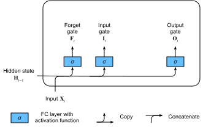
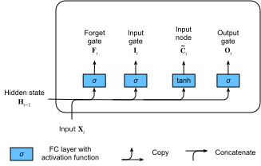
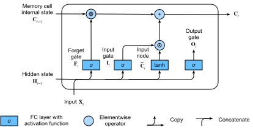
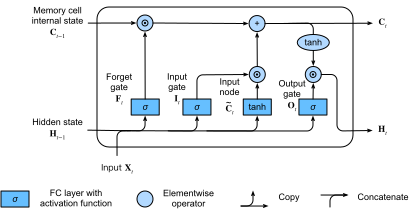

# Long Short-Term Memory (LSTM)
:label:`sec_lstm`


Peu de temps après que les premiers RNN de type Elman aient été entraînés par rétropropagation 
:cite:`elman1990finding`, les problèmes d'apprentissage des dépendances à long terme
(dus à la disparition et à l'explosion du gradient)
sont devenus marquants, Bengio et Hochreiter 
discutant du problème
:cite:`bengio1994learning,Hochreiter.Bengio.Frasconi.ea.2001`.
Hochreiter avait articulé ce problème dès 1991 dans sa thèse de maîtrise,
bien que les résultats n'aient pas été largement connus car la thèse était écrite en allemand.
Alors que l'écrêtage du gradient aide à résoudre l'explosion du gradient, 
la gestion de la disparition du gradient semble nécessiter 
une solution plus élaborée. 
L'une des premières et des plus réussies techniques 
pour traiter la disparition du gradient 
est apparue sous la forme du modèle de mémoire à long et court terme (LSTM) 
grâce à :citet:`Hochreiter.Schmidhuber.1997`. 
Les LSTM ressemblent aux réseaux de neurones récurrents standard,
mais ici chaque nœud récurrent ordinaire
est remplacé par une *cellule de mémoire*.
Chaque cellule de mémoire contient un *état interne*,
c'est-à-dire un nœud avec une arête récurrente auto-connectée de poids fixe 1,
garantissant que le gradient peut traverser de nombreux pas de temps 
sans disparaître ni exploser.

Le terme « long short-term memory » vient de l'intuition suivante.
Les réseaux de neurones récurrents simples 
ont une *mémoire à long terme* sous la forme de poids.
Les poids changent lentement pendant l'entraînement, 
encodant des connaissances générales sur les données.
Ils ont également une *mémoire à court terme*
sous la forme d'activations éphémères,
qui passent de chaque nœud aux nœuds successifs.
Le modèle LSTM introduit un type de stockage intermédiaire via la cellule de mémoire.
Une cellule de mémoire est une unité composite, 
construite à partir de nœuds plus simples 
selon un motif de connectivité spécifique,
avec l'inclusion nouvelle de nœuds multiplicatifs.

```{.python .input}
%load_ext d2lbook.tab
tab.interact_select(['mxnet', 'pytorch', 'tensorflow', 'jax'])
```

```{.python .input}
%%tab mxnet
from d2l import mxnet as d2l
from mxnet import np, npx
from mxnet.gluon import rnn
npx.set_np()
```

```{.python .input}
%%tab pytorch
from d2l import torch as d2l
import torch
from torch import nn
```

```{.python .input}
%%tab tensorflow
from d2l import tensorflow as d2l
import tensorflow as tf
```

```{.python .input}
%%tab jax
from d2l import jax as d2l
from flax import linen as nn
import jax
from jax import numpy as jnp
```

## Cellule de mémoire à portes

Chaque cellule de mémoire est équipée d'un *état interne*
et d'un certain nombre de portes multiplicatives qui déterminent si
(i) une entrée donnée doit impacter l'état interne (la *porte d'entrée*),
(ii) l'état interne doit être vidé à $0$ (la *porte d'oubli*),
et (iii) l'état interne d'un neurone donné 
doit être autorisé à impacter la sortie de la cellule (la *porte de sortie*). 


### État caché à portes

La distinction clé entre les RNN classiques et les LSTM
est que ces derniers prennent en charge la gestion par portes de l'état caché.
Cela signifie que nous avons des mécanismes dédiés pour déterminer
quand un état caché doit être *mis à jour* et
aussi quand il doit être *réinitialisé*.
Ces mécanismes sont appris et ils répondent aux préoccupations énumérées ci-dessus.
Par exemple, si le premier jeton est d'une grande importance,
nous apprendrons à ne pas mettre à jour l'état caché après la première observation.
De même, nous apprendrons à sauter les observations temporaires non pertinentes.
Enfin, nous apprendrons à réinitialiser l'état latent chaque fois que nécessaire.
Nous en discutons en détail ci-dessous.

### Porte d'entrée, porte d'oubli et porte de sortie

Les données alimentant les portes LSTM sont
l'entrée au pas de temps actuel et
l'état caché du pas de temps précédent,
comme illustré dans la :numref:`fig_lstm_0`.
Trois couches entièrement connectées avec des fonctions d'activation sigmoïde
calculent les valeurs des portes d'entrée, d'oubli et de sortie.
En raison de l'activation sigmoïde,
toutes les valeurs des trois portes
sont comprises dans l'intervalle $(0, 1)$.
De plus, nous avons besoin d'un *nœud d'entrée*,
généralement calculé avec une fonction d'activation *tanh*. 
Intérieurement, la *porte d'entrée* détermine quelle part
de la valeur du nœud d'entrée doit être ajoutée 
à l'état interne actuel de la cellule de mémoire.
La *porte d'oubli* détermine s'il faut conserver
la valeur actuelle de la mémoire ou la vider. 
Et la *porte de sortie* détermine si 
la cellule de mémoire doit influencer la sortie
au pas de temps actuel. 



:label:`fig_lstm_0`

Mathématiquement, supposons qu'il y ait $h$ unités cachées, 
la taille du lot est $n$ et le nombre d'entrées est $d$.
Ainsi, l'entrée est $\mathbf{X}_t \in \mathbb{R}^{n \times d}$ 
et l'état caché du pas de temps précédent 
est $\mathbf{H}_{t-1} \in \mathbb{R}^{n \times h}$. 
En correspondance, les portes au pas de temps $t$
sont définies comme suit : la porte d'entrée est $\mathbf{I}_t \in \mathbb{R}^{n \times h}$, 
la porte d'oubli est $\mathbf{F}_t \in \mathbb{R}^{n \times h}$ 
et la porte de sortie est $\mathbf{O}_t \in \mathbb{R}^{n \times h}$. 
Elles sont calculées comme suit :

$$
\begin{aligned}
\mathbf{I}_t &= \sigma(\mathbf{X}_t \mathbf{W}_{\textrm{xi}} + \mathbf{H}_{t-1} \mathbf{W}_{\textrm{hi}} + \mathbf{b}_\textrm{i}),\\
\mathbf{F}_t &= \sigma(\mathbf{X}_t \mathbf{W}_{\textrm{xf}} + \mathbf{H}_{t-1} \mathbf{W}_{\textrm{hf}} + \mathbf{b}_\textrm{f}),\\
\mathbf{O}_t &= \sigma(\mathbf{X}_t \mathbf{W}_{\textrm{xo}} + \mathbf{H}_{t-1} \mathbf{W}_{\textrm{ho}} + \mathbf{b}_\textrm{o}),
\end{aligned}
$$

où $\mathbf{W}_{\textrm{xi}}, \mathbf{W}_{\textrm{xf}}, \mathbf{W}_{\textrm{xo}} \in \mathbb{R}^{d \times h}$ et $\mathbf{W}_{\textrm{hi}}, \mathbf{W}_{\textrm{hf}}, \mathbf{W}_{\textrm{ho}} \in \mathbb{R}^{h \times h}$ sont des paramètres de poids 
et $\mathbf{b}_\textrm{i}, \mathbf{b}_\textrm{f}, \mathbf{b}_\textrm{o} \in \mathbb{R}^{1 \times h}$ sont des paramètres de biais.
Notez que la diffusion (broadcasting, voir la :numref:`subsec_broadcasting`)
est déclenchée lors de la sommation.
Nous utilisons des fonctions sigmoïdes 
(telles qu'introduites dans la :numref:`sec_mlp`) 
pour projeter les valeurs d'entrée dans l'intervalle $(0, 1)$.


### Nœud d'entrée

Ensuite, nous concevons la cellule de mémoire. 
Comme nous n'avons pas encore spécifié l'action des diverses portes, 
nous introduisons d'abord le *nœud d'entrée* 
$\tilde{\mathbf{C}}_t \in \mathbb{R}^{n \times h}$.
Son calcul est similaire à celui des trois portes décrites ci-dessus, 
mais il utilise une fonction $\tanh$ avec une plage de valeurs de $(-1, 1)$ comme fonction d'activation. 
Cela conduit à l'équation suivante au pas de temps $t$ :

$$\tilde{\mathbf{C}}_t = \textrm{tanh}(\mathbf{X}_t \mathbf{W}_{\textrm{xc}} + \mathbf{H}_{t-1} \mathbf{W}_{\textrm{hc}} + \mathbf{b}_\textrm{c}),$$

où $\mathbf{W}_{\textrm{xc}} \in \mathbb{R}^{d \times h}$ et $\mathbf{W}_{\textrm{hc}} \in \mathbb{R}^{h \times h}$ sont des paramètres de poids et $\mathbf{b}_\textrm{c} \in \mathbb{R}^{1 \times h}$ est un paramètre de biais.

Une illustration rapide du nœud d'entrée est présentée dans la :numref:`fig_lstm_1`.


:label:`fig_lstm_1`


### État interne de la cellule de mémoire

Dans les LSTM, la porte d'entrée $\mathbf{I}_t$ régit 
la part des nouvelles données prises en compte via $\tilde{\mathbf{C}}_t$ 
et la porte d'oubli $\mathbf{F}_t$ traite 
la part de l'ancien état interne de la cellule $\mathbf{C}_{t-1} \in \mathbb{R}^{n \times h}$ conservée. 
En utilisant l'opérateur de produit de Hadamard (élément par élément) $\odot$,
nous arrivons à l'équation de mise à jour suivante :

$$\mathbf{C}_t = \mathbf{F}_t \odot \mathbf{C}_{t-1} + \mathbf{I}_t \odot \tilde{\mathbf{C}}_t.$$

Si la porte d'oubli est toujours à 1 et la porte d'entrée toujours à 0, 
l'état interne de la cellule de mémoire $\mathbf{C}_{t-1}$
restera constant éternellement, 
passant inchangé à chaque pas de temps suivant.
Cependant, les portes d'entrée et d'oubli
donnent au modèle la flexibilité de pouvoir apprendre 
quand garder cette valeur inchangée
et quand la perturber en réponse 
aux entrées ultérieures. 
En pratique, cette conception atténue le problème de la disparition du gradient,
ce qui donne des modèles beaucoup plus faciles à entraîner,
en particulier face à des jeux de données avec de grandes longueurs de séquence. 

Nous arrivons ainsi au diagramme de flux de la :numref:`fig_lstm_2`.



:label:`fig_lstm_2`


### État caché

Enfin, nous devons définir comment calculer la sortie
de la cellule de mémoire, c'est-à-dire l'état caché $\mathbf{H}_t \in \mathbb{R}^{n \times h}$, tel qu'il est vu par les autres couches. 
C'est là que la porte de sortie entre en jeu.
Dans les LSTM, nous appliquons d'abord $\tanh$ à l'état interne de la cellule de mémoire
et puis nous appliquons une autre multiplication point à point,
cette fois avec la porte de sortie.
Cela garantit que les valeurs de $\mathbf{H}_t$ 
sont toujours dans l'intervalle $(-1, 1)$ :

$$\mathbf{H}_t = \mathbf{O}_t \odot \tanh(\mathbf{C}_t).$$


Chaque fois que la porte de sortie est proche de 1, 
nous permettons à l'état interne de la cellule de mémoire d'impacter les couches suivantes sans inhibition,
tandis que pour les valeurs de la porte de sortie proches de 0,
nous empêchons la mémoire actuelle d'impacter les autres couches du réseau
au pas de temps actuel. 
Notez qu'une cellule de mémoire peut accumuler des informations 
sur de nombreux pas de temps sans impacter le reste du réseau
(tant que la porte de sortie prend des valeurs proches de 0),
et puis impacter soudainement le réseau à un pas de temps ultérieur
dès que la porte de sortie passe de valeurs proches de 0
à des valeurs proches de 1. La :numref:`fig_lstm_3` présente une illustration graphique du flux de données.


:label:`fig_lstm_3`


## Implémentation à partir de zéro

Implémentons maintenant un LSTM à partir de zéro.
Comme pour les expériences de la :numref:`sec_rnn-scratch`,
nous chargeons d'abord le jeu de données *The Time Machine*.

### [**Initialisation des paramètres du modèle**]

Ensuite, nous devons définir et initialiser les paramètres du modèle. 
Comme précédemment, l'hyperparamètre `num_hiddens` 
dicte le nombre d'unités cachées.
Nous initialisons les poids suivant une distribution gaussienne
avec un écart-type de 0,01, 
et nous fixons les biais à 0.

```{.python .input}
%%tab pytorch, mxnet, tensorflow
class LSTMScratch(d2l.Module):
    def __init__(self, num_inputs, num_hiddens, sigma=0.01):
        super().__init__()
        self.save_hyperparameters()

        if tab.selected('mxnet'):
            init_weight = lambda *shape: d2l.randn(*shape) * sigma
            triple = lambda: (init_weight(num_inputs, num_hiddens),
                              init_weight(num_hiddens, num_hiddens),
                              d2l.zeros(num_hiddens))
        if tab.selected('pytorch'):
            init_weight = lambda *shape: nn.Parameter(d2l.randn(*shape) * sigma)
            triple = lambda: (init_weight(num_inputs, num_hiddens),
                              init_weight(num_hiddens, num_hiddens),
                              nn.Parameter(d2l.zeros(num_hiddens)))
        if tab.selected('tensorflow'):
            init_weight = lambda *shape: tf.Variable(d2l.normal(shape) * sigma)
            triple = lambda: (init_weight(num_inputs, num_hiddens),
                              init_weight(num_hiddens, num_hiddens),
                              tf.Variable(d2l.zeros(num_hiddens)))

        self.W_xi, self.W_hi, self.b_i = triple()  # Input gate
        self.W_xf, self.W_hf, self.b_f = triple()  # Forget gate
        self.W_xo, self.W_ho, self.b_o = triple()  # Output gate
        self.W_xc, self.W_hc, self.b_c = triple()  # Input node
```

```{.python .input}
%%tab jax
class LSTMScratch(d2l.Module):
    num_inputs: int
    num_hiddens: int
    sigma: float = 0.01

    def setup(self):
        init_weight = lambda name, shape: self.param(name,
                                                     nn.initializers.normal(self.sigma),
                                                     shape)
        triple = lambda name : (
            init_weight(f'W_x{name}', (self.num_inputs, self.num_hiddens)),
            init_weight(f'W_h{name}', (self.num_hiddens, self.num_hiddens)),
            self.param(f'b_{name}', nn.initializers.zeros, (self.num_hiddens)))

        self.W_xi, self.W_hi, self.b_i = triple('i')  # Input gate
        self.W_xf, self.W_hf, self.b_f = triple('f')  # Forget gate
        self.W_xo, self.W_ho, self.b_o = triple('o')  # Output gate
        self.W_xc, self.W_hc, self.b_c = triple('c')  # Input node
```

:begin_tab:`pytorch, mxnet, tensorflow`
[**Le modèle réel**] est défini comme décrit ci-dessus,
consistant en trois portes et un nœud d'entrée. 
Notez que seul l'état caché est passé à la couche de sortie.
:end_tab:

:begin_tab:`jax`
[**Le modèle réel**] est défini comme décrit ci-dessus,
consistant en trois portes et un nœud d'entrée. 
Notez que seul l'état caché est passé à la couche de sortie.
Une longue boucle for dans la méthode `forward` entraînera un temps de
compilation JIT extrêmement long pour la première exécution. Pour remédier à cela, au lieu
d'utiliser une boucle for pour mettre à jour l'état à chaque pas de temps,
JAX dispose de la transformation utilitaire `jax.lax.scan` pour obtenir le même comportement.
Elle prend un état initial appelé `carry` et un tableau `inputs` qui
est balayé sur son axe principal. La transformation `scan` renvoie finalement
l'état final et les sorties empilées comme prévu.
:end_tab:

```{.python .input}
%%tab pytorch, mxnet, tensorflow
@d2l.add_to_class(LSTMScratch)
def forward(self, inputs, H_C=None):
    if H_C is None:
        # Initial state with shape: (batch_size, num_hiddens)
        if tab.selected('mxnet'):
            H = d2l.zeros((inputs.shape[1], self.num_hiddens),
                          ctx=inputs.ctx)
            C = d2l.zeros((inputs.shape[1], self.num_hiddens),
                          ctx=inputs.ctx)
        if tab.selected('pytorch'):
            H = d2l.zeros((inputs.shape[1], self.num_hiddens),
                          device=inputs.device)
            C = d2l.zeros((inputs.shape[1], self.num_hiddens),
                          device=inputs.device)
        if tab.selected('tensorflow'):
            H = d2l.zeros((inputs.shape[1], self.num_hiddens))
            C = d2l.zeros((inputs.shape[1], self.num_hiddens))
    else:
        H, C = H_C
    outputs = []
    for X in inputs:
        I = d2l.sigmoid(d2l.matmul(X, self.W_xi) +
                        d2l.matmul(H, self.W_hi) + self.b_i)
        F = d2l.sigmoid(d2l.matmul(X, self.W_xf) +
                        d2l.matmul(H, self.W_hf) + self.b_f)
        O = d2l.sigmoid(d2l.matmul(X, self.W_xo) +
                        d2l.matmul(H, self.W_ho) + self.b_o)
        C_tilde = d2l.tanh(d2l.matmul(X, self.W_xc) +
                           d2l.matmul(H, self.W_hc) + self.b_c)
        C = F * C + I * C_tilde
        H = O * d2l.tanh(C)
        outputs.append(H)
    return outputs, (H, C)
```

```{.python .input}
%%tab jax
@d2l.add_to_class(LSTMScratch)
def forward(self, inputs, H_C=None):
    # Use lax.scan primitive instead of looping over the
    # inputs, since scan saves time in jit compilation.
    def scan_fn(carry, X):
        H, C = carry
        I = d2l.sigmoid(d2l.matmul(X, self.W_xi) + (
            d2l.matmul(H, self.W_hi)) + self.b_i)
        F = d2l.sigmoid(d2l.matmul(X, self.W_xf) +
                        d2l.matmul(H, self.W_hf) + self.b_f)
        O = d2l.sigmoid(d2l.matmul(X, self.W_xo) +
                        d2l.matmul(H, self.W_ho) + self.b_o)
        C_tilde = d2l.tanh(d2l.matmul(X, self.W_xc) +
                           d2l.matmul(H, self.W_hc) + self.b_c)
        C = F * C + I * C_tilde
        H = O * d2l.tanh(C)
        return (H, C), H  # return carry, y

    if H_C is None:
        batch_size = inputs.shape[1]
        carry = jnp.zeros((batch_size, self.num_hiddens)), \
                jnp.zeros((batch_size, self.num_hiddens))
    else:
        carry = H_C

    # scan takes the scan_fn, initial carry state, xs with leading axis to be scanned
    carry, outputs = jax.lax.scan(scan_fn, carry, inputs)
    return outputs, carry
```

### [**Entraînement**] et prédiction

Entraînons un modèle LSTM en instanciant la classe `RNNLMScratch` de la :numref:`sec_rnn-scratch`.

```{.python .input}
%%tab all
data = d2l.TimeMachine(batch_size=1024, num_steps=32)
if tab.selected('mxnet', 'pytorch', 'jax'):
    lstm = LSTMScratch(num_inputs=len(data.vocab), num_hiddens=32)
    model = d2l.RNNLMScratch(lstm, vocab_size=len(data.vocab), lr=4)
    trainer = d2l.Trainer(max_epochs=50, gradient_clip_val=1, num_gpus=1)
if tab.selected('tensorflow'):
    with d2l.try_gpu():
        lstm = LSTMScratch(num_inputs=len(data.vocab), num_hiddens=32)
        model = d2l.RNNLMScratch(lstm, vocab_size=len(data.vocab), lr=4)
    trainer = d2l.Trainer(max_epochs=50, gradient_clip_val=1)
trainer.fit(model, data)
```

## [**Implémentation concise**]

À l'aide d'API de haut niveau,
nous pouvons instancier directement un modèle LSTM.
Cela encapsule tous les détails de configuration 
que nous avons explicités ci-dessus. 
Le code est nettement plus rapide car il utilise 
des opérateurs compilés plutôt que Python
pour de nombreux détails que nous avons détaillés auparavant.

```{.python .input}
%%tab mxnet
class LSTM(d2l.RNN):
    def __init__(self, num_hiddens):
        d2l.Module.__init__(self)
        self.save_hyperparameters()
        self.rnn = rnn.LSTM(num_hiddens)

    def forward(self, inputs, H_C=None):
        if H_C is None: H_C = self.rnn.begin_state(
            inputs.shape[1], ctx=inputs.ctx)
        return self.rnn(inputs, H_C)
```

```{.python .input}
%%tab pytorch
class LSTM(d2l.RNN):
    def __init__(self, num_inputs, num_hiddens):
        d2l.Module.__init__(self)
        self.save_hyperparameters()
        self.rnn = nn.LSTM(num_inputs, num_hiddens)

    def forward(self, inputs, H_C=None):
        return self.rnn(inputs, H_C)
```

```{.python .input}
%%tab tensorflow
class LSTM(d2l.RNN):
    def __init__(self, num_hiddens):
        d2l.Module.__init__(self)
        self.save_hyperparameters()
        self.rnn = tf.keras.layers.LSTM(
                num_hiddens, return_sequences=True,
                return_state=True, time_major=True)

    def forward(self, inputs, H_C=None):
        outputs, *H_C = self.rnn(inputs, H_C)
        return outputs, H_C
```

```{.python .input}
%%tab jax
class LSTM(d2l.RNN):
    num_hiddens: int

    @nn.compact
    def __call__(self, inputs, H_C=None, training=False):
        if H_C is None:
            batch_size = inputs.shape[1]
            H_C = nn.OptimizedLSTMCell.initialize_carry(jax.random.PRNGKey(0),
                                                        (batch_size,),
                                                        self.num_hiddens)

        LSTM = nn.scan(nn.OptimizedLSTMCell, variable_broadcast="params",
                       in_axes=0, out_axes=0, split_rngs={"params": False})

        H_C, outputs = LSTM()(H_C, inputs)
        return outputs, H_C
```

```{.python .input}
%%tab all
if tab.selected('pytorch'):
    lstm = LSTM(num_inputs=len(data.vocab), num_hiddens=32)
if tab.selected('mxnet', 'tensorflow', 'jax'):
    lstm = LSTM(num_hiddens=32)
if tab.selected('mxnet', 'pytorch', 'jax'):
    model = d2l.RNNLM(lstm, vocab_size=len(data.vocab), lr=4)
if tab.selected('tensorflow'):
    with d2l.try_gpu():
        model = d2l.RNNLM(lstm, vocab_size=len(data.vocab), lr=4)
trainer.fit(model, data)
```

```{.python .input}
%%tab mxnet, pytorch
model.predict('it has', 20, data.vocab, d2l.try_gpu())
```

```{.python .input}
%%tab tensorflow
model.predict('it has', 20, data.vocab)
```

```{.python .input}
%%tab jax
model.predict('it has', 20, data.vocab, trainer.state.params)
```

Les LSTM sont le modèle autorégressif à variables latentes prototypique avec un contrôle d'état non trivial.
De nombreuses variantes de celui-ci ont été proposées au fil des ans, par exemple, plusieurs couches, des connexions résiduelles, différents types de régularisation. Cependant, l'entraînement des LSTM et d'autres modèles de séquence (tels que les GRU) est assez coûteux en raison de la dépendance à longue portée de la séquence.
Plus tard, nous rencontrerons des modèles alternatifs tels que les Transformers qui peuvent être utilisés dans certains cas.


## Résumé

Bien que les LSTM aient été publiés en 1997, 
ils ont acquis une grande importance 
avec certaines victoires dans des compétitions de prédiction au milieu des années 2000,
et sont devenus les modèles dominants pour l'apprentissage de séquences de 2011 
jusqu'à l'essor des modèles Transformer, à partir de 2017.
Même les Transformers doivent certaines de leurs idées clés 
aux innovations de conception d'architecture introduites par le LSTM.


Les LSTM ont trois types de portes : 
les portes d'entrée, d'oubli et de sortie 
qui contrôlent le flux d'informations.
La sortie de la couche cachée du LSTM comprend l'état caché et l'état interne de la cellule de mémoire. 
Seul l'état caché est passé dans la couche de sortie tandis que 
l'état interne de la cellule de mémoire reste entièrement interne.
Les LSTM peuvent atténuer la disparition et l'explosion du gradient.


## Exercices

1. Ajustez les hyperparamètres et analysez leur influence sur le temps d'exécution, la perplexité et la séquence de sortie.
1. Comment devriez-vous modifier le modèle pour générer des mots entiers plutôt que de simples séquences de caractères ?
1. Comparez le coût de calcul des GRU, des LSTM et des RNN classiques pour une dimension cachée donnée. Portez une attention particulière au coût d'entraînement et d'inférence.
1. Étant donné que la cellule de mémoire candidate garantit que la plage de valeurs est comprise entre $-1$ et $1$ en utilisant la fonction $\tanh$, pourquoi l'état caché doit-il utiliser à nouveau la fonction $\tanh$ pour garantir que la plage de valeurs de sortie est comprise entre $-1$ et $1$ ?
1. Implémentez un modèle LSTM pour la prédiction de séries temporelles plutôt que pour la prédiction de séquences de caractères.

:begin_tab:`mxnet`
[Discussions](https://discuss.d2l.ai/t/343)
:end_tab:

:begin_tab:`pytorch`
[Discussions](https://discuss.d2l.ai/t/1057)
:end_tab:

:begin_tab:`tensorflow`
[Discussions](https://discuss.d2l.ai/t/3861)
:end_tab:

:begin_tab:`jax`
[Discussions](https://discuss.d2l.ai/t/18016)
:end_tab:
