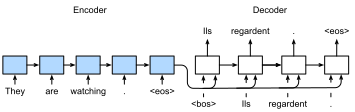
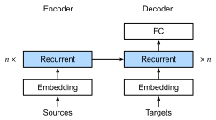
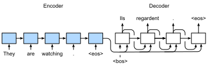

```{.python .input}
%load_ext d2lbook.tab
tab.interact_select('mxnet', 'pytorch', 'tensorflow', 'jax')
```

# Apprentissage séquence à séquence pour la traduction automatique
:label:`sec_seq2seq`

Dans les problèmes dits séquence à séquence tels que la traduction automatique
(comme discuté dans la :numref:`sec_machine_translation`),
où les entrées et les sorties consistent chacune
en des séquences de longueur variable non alignées,
nous nous appuyons généralement sur des architectures encodeur--décodeur
(:numref:`sec_encoder-decoder`).
Dans cette section,
nous démontrerons l'application
d'une architecture encodeur--décodeur,
où l'encodeur et le décodeur
sont tous deux implémentés sous forme de RNN,
pour la tâche de traduction automatique
:cite:`Sutskever.Vinyals.Le.2014,Cho.Van-Merrienboer.Gulcehre.ea.2014`.

Ici, l'encodeur RNN prendra une séquence de longueur variable en entrée
et la transformera en un état caché de forme fixe.
Plus tard, dans le :numref:`chap_attention-and-transformers`,
nous introduirons des mécanismes d'attention,
qui nous permettent d'accéder aux entrées encodées
sans avoir à compresser l'intégralité de l'entrée
en une seule représentation de longueur fixe.

Ensuite, pour générer la séquence de sortie,
un jeton à la fois,
le modèle de décodeur,
composé d'un RNN séparé,
prédira chaque jeton cible successif
étant donné à la fois la séquence d'entrée
et les jetons précédents de la sortie.
Pendant l'entraînement, le décodeur sera généralement
conditionné par les jetons précédents
de l'étiquette officielle de "vérité terrain" (ground truth).
Cependant, au moment du test, nous voudrons conditionner
chaque sortie du décodeur sur les jetons déjà prédits.
Notez que si nous ignorons l'encodeur,
le décodeur dans une architecture séquence à séquence
se comporte exactement comme un modèle de langue normal.
La :numref:`fig_seq2seq` illustre
comment utiliser deux RNN
pour l'apprentissage séquence à séquence
en traduction automatique.



:label:`fig_seq2seq`

Dans la :numref:`fig_seq2seq`,
le jeton spécial "&lt;eos&gt;"
marque la fin de la séquence.
Notre modèle peut s'arrêter de faire des prédictions
une fois que ce jeton est généré.
À l'étape temporelle initiale du décodeur RNN,
il y a deux décisions de conception particulières à connaître :
premièrement, nous commençons chaque entrée avec un jeton spécial
de début de séquence "&lt;bos&gt;".
Deuxièmement, nous pouvons injecter
l'état caché final de l'encodeur
dans le décodeur
à chaque étape temporelle de décodage :cite:`Cho.Van-Merrienboer.Gulcehre.ea.2014`.
Dans d'autres conceptions,
comme celle de :citet:`Sutskever.Vinyals.Le.2014`,
l'état caché final de l'encodeur RNN
est utilisé
pour initialiser l'état caché du décodeur
uniquement à la première étape de décodage.

```{.python .input}
%%tab mxnet
import collections
from d2l import mxnet as d2l
import math
from mxnet import np, npx, init, gluon, autograd
from mxnet.gluon import nn, rnn
npx.set_np()
```

```{.python .input}
%%tab pytorch
import collections
from d2l import torch as d2l
import math
import torch
from torch import nn
from torch.nn import functional as F
```

```{.python .input}
%%tab tensorflow
import collections
from d2l import tensorflow as d2l
import math
import tensorflow as tf
```

```{.python .input}
%%tab jax
import collections
from d2l import jax as d2l
from flax import linen as nn
from functools import partial
import jax
from jax import numpy as jnp
import math
import optax
```

## Teacher Forcing

Bien que l'exécution de l'encodeur sur la séquence d'entrée
soit relativement simple,
la gestion de l'entrée et de la sortie
du décodeur nécessite plus de soin.
L'approche la plus courante est parfois appelée *teacher forcing*.
Ici, la séquence cible originale (étiquettes de jetons)
est injectée dans le décodeur comme entrée.
Plus concrètement,
le jeton spécial de début de séquence
et la séquence cible originale,
à l'exclusion du jeton final,
sont concaténés comme entrée du décodeur,
tandis que la sortie du décodeur (étiquettes pour l'entraînement) est
la séquence cible originale,
décalée d'un jeton :
"&lt;bos&gt;", "Ils", "regardent", "." $\rightarrow$
"Ils", "regardent", ".", "&lt;eos&gt;" (:numref:`fig_seq2seq`).

Notre implémentation dans la
:numref:`subsec_loading-seq-fixed-len`
a préparé les données d'entraînement pour le *teacher forcing*,
où le décalage des jetons pour l'apprentissage auto-supervisé
est similaire à l'entraînement des modèles de langue dans la
:numref:`sec_language-model`.
Une approche alternative consiste à
injecter le jeton *prédit*
de l'étape temporelle précédente
comme entrée actuelle du décodeur.


Dans ce qui suit, nous expliquons plus en détail la conception
illustrée dans la :numref:`fig_seq2seq`.
Nous entraînerons ce modèle pour la traduction automatique
sur le jeu de données anglais--français tel qu'introduit dans la
:numref:`sec_machine_translation`.

## Encodeur

Rappelez-vous que l'encodeur transforme une séquence d'entrée de longueur variable
en une *variable de contexte* de forme fixe $\mathbf{c}$ (voir :numref:`fig_seq2seq`).


Considérons un seul exemple de séquence (taille de lot 1).
Supposons que la séquence d'entrée soit $x_1, \ldots, x_T$,
telle que $x_t$ soit le $t^{\textrm{ème}}$ jeton.
À l'étape temporelle $t$, le RNN transforme
le vecteur de caractéristiques d'entrée $\mathbf{x}_t$ pour $x_t$
et l'état caché $\mathbf{h} _{t-1}$
de l'étape temporelle précédente
en l'état caché actuel $\mathbf{h}_t$.
Nous pouvons utiliser une fonction $f$ pour exprimer
la transformation de la couche récurrente du RNN :

$$\mathbf{h}_t = f(\mathbf{x}_t, \mathbf{h}_{t-1}). $$

En général, l'encodeur transforme
les états cachés à toutes les étapes temporelles
en une variable de contexte via une fonction personnalisée $q$ :

$$\mathbf{c} =  q(\mathbf{h}_1, \ldots, \mathbf{h}_T).$$

Par exemple, dans la :numref:`fig_seq2seq`,
la variable de contexte est simplement l'état caché $\mathbf{h}_T$
correspondant à la représentation de l'encodeur RNN
après avoir traité le jeton final de la séquence d'entrée.

Dans cet exemple, nous avons utilisé un RNN unidirectionnel
pour concevoir l'encodeur,
où l'état caché ne dépend que de la sous-séquence d'entrée
à et avant l'étape temporelle de l'état caché.
Nous pouvons également construire des encodeurs en utilisant des RNN bidirectionnels.
Dans ce cas, un état caché dépend de la sous-séquence avant et après l'étape temporelle
(y compris l'entrée à l'étape temporelle actuelle),
ce qui encode les informations de l'intégralité de la séquence.


Maintenant, [**implémentons l'encodeur RNN**].
Notez que nous utilisons une *couche d'incorporation* (embedding layer)
pour obtenir le vecteur de caractéristiques de chaque jeton de la séquence d'entrée.
Le poids d'une couche d'incorporation est une matrice,
où le nombre de lignes correspond à
la taille du vocabulaire d'entrée (`vocab_size`)
et le nombre de colonnes correspond à
la dimension du vecteur de caractéristiques (`embed_size`).
Pour tout indice de jeton d'entrée $i$,
la couche d'incorporation récupère la $i^{\textrm{ème}}$ ligne
(en partant de 0) de la matrice de poids
pour renvoyer son vecteur de caractéristiques.
Ici, nous implémentons l'encodeur avec un GRU multicouche.

```{.python .input}
%%tab mxnet
class Seq2SeqEncoder(d2l.Encoder):  #@save
    """The RNN encoder for sequence-to-sequence learning."""
    def __init__(self, vocab_size, embed_size, num_hiddens, num_layers,
                 dropout=0):
        super().__init__()
        self.embedding = nn.Embedding(vocab_size, embed_size)
        self.rnn = d2l.GRU(num_hiddens, num_layers, dropout)
        self.initialize(init.Xavier())
            
    def forward(self, X, *args):
        # X shape: (batch_size, num_steps)
        embs = self.embedding(d2l.transpose(X))
        # embs shape: (num_steps, batch_size, embed_size)    
        outputs, state = self.rnn(embs)
        # outputs shape: (num_steps, batch_size, num_hiddens)
        # state shape: (num_layers, batch_size, num_hiddens)
        return outputs, state
```

```{.python .input}
%%tab pytorch
def init_seq2seq(module):  #@save
    """Initialize weights for sequence-to-sequence learning."""
    if type(module) == nn.Linear:
         nn.init.xavier_uniform_(module.weight)
    if type(module) == nn.GRU:
        for param in module._flat_weights_names:
            if "weight" in param:
                nn.init.xavier_uniform_(module._parameters[param])
```

```{.python .input}
%%tab pytorch
class Seq2SeqEncoder(d2l.Encoder):  #@save
    """The RNN encoder for sequence-to-sequence learning."""
    def __init__(self, vocab_size, embed_size, num_hiddens, num_layers,
                 dropout=0):
        super().__init__()
        self.embedding = nn.Embedding(vocab_size, embed_size)
        self.rnn = d2l.GRU(embed_size, num_hiddens, num_layers, dropout)
        self.apply(init_seq2seq)
            
    def forward(self, X, *args):
        # X shape: (batch_size, num_steps)
        embs = self.embedding(d2l.astype(d2l.transpose(X), d2l.int64))
        # embs shape: (num_steps, batch_size, embed_size)
        outputs, state = self.rnn(embs)
        # outputs shape: (num_steps, batch_size, num_hiddens)
        # state shape: (num_layers, batch_size, num_hiddens)
        return outputs, state
```

```{.python .input}
%%tab tensorflow
class Seq2SeqEncoder(d2l.Encoder):  #@save
    """The RNN encoder for sequence-to-sequence learning."""
    def __init__(self, vocab_size, embed_size, num_hiddens, num_layers,
                 dropout=0):
        super().__init__()
        self.embedding = tf.keras.layers.Embedding(vocab_size, embed_size)
        self.rnn = d2l.GRU(num_hiddens, num_layers, dropout)
            
    def call(self, X, *args):
        # X shape: (batch_size, num_steps)
        embs = self.embedding(d2l.transpose(X))
        # embs shape: (num_steps, batch_size, embed_size)    
        outputs, state = self.rnn(embs)
        # outputs shape: (num_steps, batch_size, num_hiddens)
        # state shape: (num_layers, batch_size, num_hiddens)
        return outputs, state
```

```{.python .input}
%%tab jax
class Seq2SeqEncoder(d2l.Encoder):  #@save
    """The RNN encoder for sequence-to-sequence learning."""
    vocab_size: int
    embed_size: int
    num_hiddens: int
    num_layers: int
    dropout: float = 0

    def setup(self):
        self.embedding = nn.Embed(self.vocab_size, self.embed_size)
        self.rnn = d2l.GRU(self.num_hiddens, self.num_layers, self.dropout)

    def __call__(self, X, *args, training=False):
        # X shape: (batch_size, num_steps)
        embs = self.embedding(d2l.astype(d2l.transpose(X), d2l.int32))
        # embs shape: (num_steps, batch_size, embed_size)
        outputs, state = self.rnn(embs, training=training)
        # outputs shape: (num_steps, batch_size, num_hiddens)
        # state shape: (num_layers, batch_size, num_hiddens)
        return outputs, state
```

Utilisons un exemple concret
pour [**illustrer l'implémentation de l'encodeur ci-dessus.**]
Ci-dessous, nous instancions un encodeur GRU à deux couches
dont le nombre d'unités cachées est de 16.
Étant donné un mini-lot d'entrées de séquence `X`
(taille de lot $=4$ ; nombre d'étapes temporelles $=9$),
les états cachés de la couche finale
à toutes les étapes temporelles
(`enc_outputs` renvoyés par les couches récurrentes de l'encodeur)
sont un tenseur de forme
(nombre d'étapes temporelles, taille de lot, nombre d'unités cachées).

```{.python .input}
%%tab all
vocab_size, embed_size, num_hiddens, num_layers = 10, 8, 16, 2
batch_size, num_steps = 4, 9
encoder = Seq2SeqEncoder(vocab_size, embed_size, num_hiddens, num_layers)
X = d2l.zeros((batch_size, num_steps))
if tab.selected('pytorch', 'mxnet', 'tensorflow'):
    enc_outputs, enc_state = encoder(X)
if tab.selected('jax'):
    (enc_outputs, enc_state), _ = encoder.init_with_output(d2l.get_key(), X)

d2l.check_shape(enc_outputs, (num_steps, batch_size, num_hiddens))
```

Puisque nous utilisons un GRU ici,
la forme des états cachés multicouches
à l'étape temporelle finale est
(nombre de couches cachées, taille de lot, nombre d'unités cachées).

```{.python .input}
%%tab all
if tab.selected('mxnet', 'pytorch', 'jax'):
    d2l.check_shape(enc_state, (num_layers, batch_size, num_hiddens))
if tab.selected('tensorflow'):
    d2l.check_len(enc_state, num_layers)
    d2l.check_shape(enc_state[0], (batch_size, num_hiddens))
```

## [**Décodeur**]
:label:`sec_seq2seq_decoder`

Étant donné une séquence de sortie cible $y_1, y_2, \ldots, y_{T'}$
pour chaque étape temporelle $t'$
(nous utilisons $t^\prime$ pour différencier des étapes temporelles de la séquence d'entrée),
le décodeur attribue une probabilité prédite
à chaque jeton possible survenant à l'étape $y_{t'+1}$
conditionnée par les jetons précédents de la cible
$y_1, \ldots, y_{t'}$
et la variable de contexte
$\mathbf{c}$, c'est-à-dire $P(y_{t'+1} \mid y_1, \ldots, y_{t'}, \mathbf{c})$.

Pour prédire le jeton suivant $t^\prime+1$ dans la séquence cible,
le décodeur RNN prend le jeton cible de l'étape précédente $y_{t^\prime}$,
l'état caché du RNN de l'étape temporelle précédente $\mathbf{s}_{t^\prime-1}$
et la variable de contexte $\mathbf{c}$ comme entrée,
et les transforme en l'état caché
$\mathbf{s}_{t^\prime}$ à l'étape temporelle actuelle.
Nous pouvons utiliser une fonction $g$ pour exprimer
la transformation de la couche cachée du décodeur :

$$\mathbf{s}_{t^\prime} = g(y_{t^\prime-1}, \mathbf{c}, \mathbf{s}_{t^\prime-1}).$$
:eqlabel:`eq_seq2seq_s_t`

Après avoir obtenu l'état caché du décodeur,
nous pouvons utiliser une couche de sortie et l'opération softmax
pour calculer la distribution prédictive
$p(y_{t^{\prime}+1} \mid y_1, \ldots, y_{t^\prime}, \mathbf{c})$
sur le jeton de sortie suivant ${t^\prime+1}$.

En suivant la :numref:`fig_seq2seq`,
lors de l'implémentation du décodeur comme suit,
nous utilisons directement l'état caché à l'étape temporelle finale
de l'encodeur
pour initialiser l'état caché du décodeur.
Cela nécessite que l'encodeur RNN et le décodeur RNN
aient le même nombre de couches et d'unités cachées.
Pour incorporer davantage les informations de la séquence d'entrée encodée,
la variable de contexte est concaténée
avec l'entrée du décodeur à toutes les étapes temporelles.
Pour prédire la distribution de probabilité du jeton de sortie,
nous utilisons une couche entièrement connectée
pour transformer l'état caché
à la couche finale du décodeur RNN.

```{.python .input}
%%tab mxnet
class Seq2SeqDecoder(d2l.Decoder):
    """The RNN decoder for sequence to sequence learning."""
    def __init__(self, vocab_size, embed_size, num_hiddens, num_layers,
                 dropout=0):
        super().__init__()
        self.embedding = nn.Embedding(vocab_size, embed_size)
        self.rnn = d2l.GRU(num_hiddens, num_layers, dropout)
        self.dense = nn.Dense(vocab_size, flatten=False)
        self.initialize(init.Xavier())
            
    def init_state(self, enc_all_outputs, *args):
        return enc_all_outputs 

    def forward(self, X, state):
        # X shape: (batch_size, num_steps)
        # embs shape: (num_steps, batch_size, embed_size)
        embs = self.embedding(d2l.transpose(X))
        enc_output, hidden_state = state
        # context shape: (batch_size, num_hiddens)
        context = enc_output[-1]
        # Broadcast context to (num_steps, batch_size, num_hiddens)
        context = np.tile(context, (embs.shape[0], 1, 1))
        # Concat at the feature dimension
        embs_and_context = d2l.concat((embs, context), -1)
        outputs, hidden_state = self.rnn(embs_and_context, hidden_state)
        outputs = d2l.swapaxes(self.dense(outputs), 0, 1)
        # outputs shape: (batch_size, num_steps, vocab_size)
        # hidden_state shape: (num_layers, batch_size, num_hiddens)
        return outputs, [enc_output, hidden_state]
```

```{.python .input}
%%tab pytorch
class Seq2SeqDecoder(d2l.Decoder):
    """The RNN decoder for sequence to sequence learning."""
    def __init__(self, vocab_size, embed_size, num_hiddens, num_layers,
                 dropout=0):
        super().__init__()
        self.embedding = nn.Embedding(vocab_size, embed_size)
        self.rnn = d2l.GRU(embed_size+num_hiddens, num_hiddens,
                           num_layers, dropout)
        self.dense = nn.LazyLinear(vocab_size)
        self.apply(init_seq2seq)
            
    def init_state(self, enc_all_outputs, *args):
        return enc_all_outputs

    def forward(self, X, state):
        # X shape: (batch_size, num_steps)
        # embs shape: (num_steps, batch_size, embed_size)
        embs = self.embedding(d2l.astype(d2l.transpose(X), d2l.int32))
        enc_output, hidden_state = state
        # context shape: (batch_size, num_hiddens)
        context = enc_output[-1]
        # Broadcast context to (num_steps, batch_size, num_hiddens)
        context = context.repeat(embs.shape[0], 1, 1)
        # Concat at the feature dimension
        embs_and_context = d2l.concat((embs, context), -1)
        outputs, hidden_state = self.rnn(embs_and_context, hidden_state)
        outputs = d2l.swapaxes(self.dense(outputs), 0, 1)
        # outputs shape: (batch_size, num_steps, vocab_size)
        # hidden_state shape: (num_layers, batch_size, num_hiddens)
        return outputs, [enc_output, hidden_state]
```

```{.python .input}
%%tab tensorflow
class Seq2SeqDecoder(d2l.Decoder):
    """The RNN decoder for sequence to sequence learning."""
    def __init__(self, vocab_size, embed_size, num_hiddens, num_layers,
                 dropout=0):
        super().__init__()
        self.embedding = tf.keras.layers.Embedding(vocab_size, embed_size)
        self.rnn = d2l.GRU(num_hiddens, num_layers, dropout)
        self.dense = tf.keras.layers.Dense(vocab_size)
            
    def init_state(self, enc_all_outputs, *args):
        return enc_all_outputs

    def call(self, X, state):
        # X shape: (batch_size, num_steps)
        # embs shape: (num_steps, batch_size, embed_size)
        embs = self.embedding(d2l.transpose(X))
        enc_output, hidden_state = state
        # context shape: (batch_size, num_hiddens)
        context = enc_output[-1]
        # Broadcast context to (num_steps, batch_size, num_hiddens)
        context = tf.tile(tf.expand_dims(context, 0), (embs.shape[0], 1, 1))
        # Concat at the feature dimension
        embs_and_context = d2l.concat((embs, context), -1)
        outputs, hidden_state = self.rnn(embs_and_context, hidden_state)
        outputs = d2l.transpose(self.dense(outputs), (1, 0, 2))
        # outputs shape: (batch_size, num_steps, vocab_size)
        # hidden_state shape: (num_layers, batch_size, num_hiddens)
        return outputs, [enc_output, hidden_state]
```

```{.python .input}
%%tab jax
class Seq2SeqDecoder(d2l.Decoder):
    """The RNN decoder for sequence to sequence learning."""
    vocab_size: int
    embed_size: int
    num_hiddens: int
    num_layers: int
    dropout: float = 0

    def setup(self):
        self.embedding = nn.Embed(self.vocab_size, self.embed_size)
        self.rnn = d2l.GRU(self.num_hiddens, self.num_layers, self.dropout)
        self.dense = nn.Dense(self.vocab_size)

    def init_state(self, enc_all_outputs, *args):
        return enc_all_outputs

    def __call__(self, X, state, training=False):
        # X shape: (batch_size, num_steps)
        # embs shape: (num_steps, batch_size, embed_size)
        embs = self.embedding(d2l.astype(d2l.transpose(X), d2l.int32))
        enc_output, hidden_state = state
        # context shape: (batch_size, num_hiddens)
        context = enc_output[-1]
        # Broadcast context to (num_steps, batch_size, num_hiddens)
        context = jnp.tile(context, (embs.shape[0], 1, 1))
        # Concat at the feature dimension
        embs_and_context = d2l.concat((embs, context), -1)
        outputs, hidden_state = self.rnn(embs_and_context, hidden_state,
                                         training=training)
        outputs = d2l.swapaxes(self.dense(outputs), 0, 1)
        # outputs shape: (batch_size, num_steps, vocab_size)
        # hidden_state shape: (num_layers, batch_size, num_hiddens)
        return outputs, [enc_output, hidden_state]
```

Pour [**illustrer le décodeur implémenté**],
nous l'instancions ci-dessous avec les mêmes hyperparamètres que l'encodeur susmentionné.
Comme nous pouvons le voir, la forme de sortie du décodeur devient (taille de lot, nombre d'étapes temporelles, taille du vocabulaire),
où la dimension finale du tenseur stocke la distribution des jetons prédits.

```{.python .input}
%%tab all
decoder = Seq2SeqDecoder(vocab_size, embed_size, num_hiddens, num_layers)
if tab.selected('mxnet', 'pytorch', 'tensorflow'):
    state = decoder.init_state(encoder(X))
    dec_outputs, state = decoder(X, state)
if tab.selected('jax'):
    state = decoder.init_state(encoder.init_with_output(d2l.get_key(), X)[0])
    (dec_outputs, state), _ = decoder.init_with_output(d2l.get_key(), X,
                                                       state)


d2l.check_shape(dec_outputs, (batch_size, num_steps, vocab_size))
if tab.selected('mxnet', 'pytorch', 'jax'):
    d2l.check_shape(state[1], (num_layers, batch_size, num_hiddens))
if tab.selected('tensorflow'):
    d2l.check_len(state[1], num_layers)
    d2l.check_shape(state[1][0], (batch_size, num_hiddens))
```

Les couches du modèle encodeur--décodeur RNN ci-dessus
sont résumées dans la :numref:`fig_seq2seq_details`.


:label:`fig_seq2seq_details`


## Encodeur--Décodeur pour l'apprentissage séquence à séquence


Le regroupement de tout cela dans le code donne ce qui suit :

```{.python .input}
%%tab pytorch, tensorflow, mxnet
class Seq2Seq(d2l.EncoderDecoder):  #@save
    """The RNN encoder--decoder for sequence to sequence learning."""
    def __init__(self, encoder, decoder, tgt_pad, lr):
        super().__init__(encoder, decoder)
        self.save_hyperparameters()
        
    def validation_step(self, batch):
        Y_hat = self(*batch[:-1])
        self.plot('loss', self.loss(Y_hat, batch[-1]), train=False)
        
    def configure_optimizers(self):
        # Adam optimizer is used here
        if tab.selected('mxnet'):
            return gluon.Trainer(self.parameters(), 'adam',
                                 {'learning_rate': self.lr})
        if tab.selected('pytorch'):
            return torch.optim.Adam(self.parameters(), lr=self.lr)
        if tab.selected('tensorflow'):
            return tf.keras.optimizers.Adam(learning_rate=self.lr)
```

```{.python .input}
%%tab jax
class Seq2Seq(d2l.EncoderDecoder):  #@save
    """The RNN encoder--decoder for sequence to sequence learning."""
    encoder: nn.Module
    decoder: nn.Module
    tgt_pad: int
    lr: float

    def validation_step(self, params, batch, state):
        l, _ = self.loss(params, batch[:-1], batch[-1], state)
        self.plot('loss', l, train=False)

    def configure_optimizers(self):
        # Adam optimizer is used here
        return optax.adam(learning_rate=self.lr)
```

## Fonction de perte avec masquage

À chaque étape temporelle, le décodeur prédit
une distribution de probabilité pour les jetons de sortie.
Comme pour la modélisation de la langue,
nous pouvons appliquer le softmax
pour obtenir la distribution
et calculer la perte d'entropie croisée (cross-entropy) pour l'optimisation.
Rappelez-vous de la :numref:`sec_machine_translation`
que les jetons de remplissage (padding) spéciaux
sont ajoutés à la fin des séquences
et ainsi les séquences de longueurs variables
peuvent être chargées efficacement
dans des mini-lots de même forme.
Cependant, la prédiction des jetons de remplissage
doit être exclue des calculs de perte.
À cette fin, nous pouvons
[**masquer les entrées non pertinentes avec des valeurs nulles**]
afin que la multiplication
de toute prédiction non pertinente
par zéro soit égale à zéro.

```{.python .input}
%%tab pytorch, mxnet, tensorflow
@d2l.add_to_class(Seq2Seq)
def loss(self, Y_hat, Y):
    l = super(Seq2Seq, self).loss(Y_hat, Y, averaged=False)
    mask = d2l.astype(d2l.reshape(Y, -1) != self.tgt_pad, d2l.float32)
    return d2l.reduce_sum(l * mask) / d2l.reduce_sum(mask)
```

```{.python .input}
%%tab jax
@d2l.add_to_class(Seq2Seq)
@partial(jax.jit, static_argnums=(0, 5))
def loss(self, params, X, Y, state, averaged=False):
    Y_hat = state.apply_fn({'params': params}, *X,
                           rngs={'dropout': state.dropout_rng})
    Y_hat = d2l.reshape(Y_hat, (-1, Y_hat.shape[-1]))
    Y = d2l.reshape(Y, (-1,))
    fn = optax.softmax_cross_entropy_with_integer_labels
    l = fn(Y_hat, Y)
    mask = d2l.astype(d2l.reshape(Y, -1) != self.tgt_pad, d2l.float32)
    return d2l.reduce_sum(l * mask) / d2l.reduce_sum(mask), {}
```

## [**Entraînement**]
:label:`sec_seq2seq_training`

Maintenant, nous pouvons [**créer et entraîner un modèle encodeur--décodeur RNN**]
pour l'apprentissage séquence à séquence sur le jeu de données de traduction automatique.

```{.python .input}
%%tab all
data = d2l.MTFraEng(batch_size=128) 
embed_size, num_hiddens, num_layers, dropout = 256, 256, 2, 0.2
if tab.selected('mxnet', 'pytorch', 'jax'):
    encoder = Seq2SeqEncoder(
        len(data.src_vocab), embed_size, num_hiddens, num_layers, dropout)
    decoder = Seq2SeqDecoder(
        len(data.tgt_vocab), embed_size, num_hiddens, num_layers, dropout)
if tab.selected('mxnet', 'pytorch'):
    model = Seq2Seq(encoder, decoder, tgt_pad=data.tgt_vocab['<pad>'],
                    lr=0.005)
if tab.selected('jax'):
    model = Seq2Seq(encoder, decoder, tgt_pad=data.tgt_vocab['<pad>'],
                    lr=0.005, training=True)
if tab.selected('mxnet', 'pytorch', 'jax'):
    trainer = d2l.Trainer(max_epochs=30, gradient_clip_val=1, num_gpus=1)
if tab.selected('tensorflow'):
    with d2l.try_gpu():
        encoder = Seq2SeqEncoder(
            len(data.src_vocab), embed_size, num_hiddens, num_layers, dropout)
        decoder = Seq2SeqDecoder(
            len(data.tgt_vocab), embed_size, num_hiddens, num_layers, dropout)
        model = Seq2Seq(encoder, decoder, tgt_pad=data.tgt_vocab['<pad>'],
                        lr=0.005)
    trainer = d2l.Trainer(max_epochs=30, gradient_clip_val=1)
trainer.fit(model, data)
```

## [**Prédiction**]

Pour prédire la séquence de sortie
à chaque étape,
le jeton prédit de l'étape temporelle précédente
est injecté dans le décodeur comme entrée.
Une stratégie simple consiste à échantillonner le jeton
auquel le décodeur a attribué la probabilité la plus élevée
lors de la prédiction à chaque étape.
Comme lors de l'entraînement, à l'étape temporelle initiale
le jeton de début de séquence ("&lt;bos&gt;")
est injecté dans le décodeur.
Ce processus de prédiction
est illustré dans la :numref:`fig_seq2seq_predict`.
Lorsque le jeton de fin de séquence ("&lt;eos&gt;") est prédit,
la prédiction de la séquence de sortie est terminée.



:label:`fig_seq2seq_predict`

Dans la section suivante, nous introduirons
des stratégies plus sophistiquées
basées sur la recherche en faisceau (beam search) (:numref:`sec_beam-search`).

```{.python .input}
%%tab pytorch, mxnet, tensorflow
@d2l.add_to_class(d2l.EncoderDecoder)  #@save
def predict_step(self, batch, device, num_steps,
                 save_attention_weights=False):
    if tab.selected('mxnet', 'pytorch'):
        batch = [d2l.to(a, device) for a in batch]
    src, tgt, src_valid_len, _ = batch
    if tab.selected('mxnet', 'pytorch'):
        enc_all_outputs = self.encoder(src, src_valid_len)
    if tab.selected('tensorflow'):
        enc_all_outputs = self.encoder(src, src_valid_len, training=False)
    dec_state = self.decoder.init_state(enc_all_outputs, src_valid_len)
    outputs, attention_weights = [d2l.expand_dims(tgt[:, 0], 1), ], []
    for _ in range(num_steps):
        if tab.selected('mxnet', 'pytorch'):
            Y, dec_state = self.decoder(outputs[-1], dec_state)
        if tab.selected('tensorflow'):
            Y, dec_state = self.decoder(outputs[-1], dec_state, training=False)
        outputs.append(d2l.argmax(Y, 2))
        # Save attention weights (to be covered later)
        if save_attention_weights:
            attention_weights.append(self.decoder.attention_weights)
    return d2l.concat(outputs[1:], 1), attention_weights
```

```{.python .input}
%%tab jax
@d2l.add_to_class(d2l.EncoderDecoder)  #@save
def predict_step(self, params, batch, num_steps,
                 save_attention_weights=False):
    src, tgt, src_valid_len, _ = batch
    enc_all_outputs, inter_enc_vars = self.encoder.apply(
        {'params': params['encoder']}, src, src_valid_len, training=False,
        mutable='intermediates')
    # Save encoder attention weights if inter_enc_vars containing encoder
    # attention weights is not empty. (to be covered later)
    enc_attention_weights = []
    if bool(inter_enc_vars) and save_attention_weights:
        # Encoder Attention Weights saved in the intermediates collection
        enc_attention_weights = inter_enc_vars[
            'intermediates']['enc_attention_weights'][0]

    dec_state = self.decoder.init_state(enc_all_outputs, src_valid_len)
    outputs, attention_weights = [d2l.expand_dims(tgt[:,0], 1), ], []
    for _ in range(num_steps):
        (Y, dec_state), inter_dec_vars = self.decoder.apply(
            {'params': params['decoder']}, outputs[-1], dec_state,
            training=False, mutable='intermediates')
        outputs.append(d2l.argmax(Y, 2))
        # Save attention weights (to be covered later)
        if save_attention_weights:
            # Decoder Attention Weights saved in the intermediates collection
            dec_attention_weights = inter_dec_vars[
                'intermediates']['dec_attention_weights'][0]
            attention_weights.append(dec_attention_weights)
    return d2l.concat(outputs[1:], 1), (attention_weights,
                                        enc_attention_weights)
```

## Évaluation des séquences prédites

Nous pouvons évaluer une séquence prédite
en la comparant à la
séquence cible (la vérité terrain).
Mais quelle est précisément la mesure appropriée
pour comparer la similarité entre deux séquences ?


Bilingual Evaluation Understudy (BLEU),
bien qu'initialement proposé pour évaluer
les résultats de traduction automatique :cite:`Papineni.Roukos.Ward.ea.2002`,
a été largement utilisé pour mesurer
la qualité des séquences de sortie pour différentes applications.
En principe, pour tout $n$-gramme (:numref:`subsec_markov-models-and-n-grams`) dans la séquence prédite,
BLEU évalue si cet $n$-gramme apparaît
dans la séquence cible.

Notons $p_n$ la précision d'un $n$-gramme,
définie comme le rapport
du nombre d' $n$-grammes correspondants dans les
séquences prédites et cibles
au nombre d' $n$-grammes dans la séquence prédite.
Pour expliquer, étant donné une séquence cible $A$, $B$, $C$, $D$, $E$, $F$,
et une séquence prédite $A$, $B$, $B$, $C$, $D$,
nous avons $p_1 = 4/5$,  $p_2 = 3/4$, $p_3 = 1/3$, et $p_4 = 0$.
Soient maintenant $\textrm{len}_{\textrm{label}}$ et $\textrm{len}_{\textrm{pred}}$
les nombres de jetons dans la séquence cible
et la séquence prédite, respectivement.
Alors, le score BLEU est défini comme

$$ \exp\left(\min\left(0, 1 - \frac{\textrm{len}_{\textrm{label}}}{\textrm{len}_{\textrm{pred}}}\right)\right) \prod_{n=1}^k p_n^{1/2^n},$$
:eqlabel:`eq_bleu`

où $k$ est l' $n$-gramme le plus long pour la correspondance.

D'après la définition du score BLEU dans l'équation :eqref:`eq_bleu`,
chaque fois que la séquence prédite est la même que la séquence cible, le score BLEU est de 1.
De plus,
comme la correspondance d' $n$-grammes plus longs est plus difficile,
le score BLEU attribue un poids plus important
lorsqu'un $n$-gramme plus long a une précision élevée.
Spécifiquement, quand $p_n$ est fixe,
$p_n^{1/2^n}$ augmente à mesure que $n$ croît (l'article original utilise $p_n^{1/n}$).
De plus,
comme
la prédiction de séquences plus courtes
a tendance à donner une valeur $p_n$ plus élevée,
le coefficient avant le terme de multiplication dans l'équation :eqref:`eq_bleu`
penalise les séquences prédites plus courtes.
Par exemple, quand $k=2$,
étant donné la séquence cible $A$, $B$, $C$, $D$, $E$, $F$ et la séquence prédite $A$, $B$,
bien que $p_1 = p_2 = 1$, le facteur de pénalité $\exp(1-6/2) \approx 0.14$ abaisse le score BLEU.

Nous [**implémentons la mesure BLEU**] comme suit.

```{.python .input}
%%tab all
def bleu(pred_seq, label_seq, k):  #@save
    """Compute the BLEU."""
    pred_tokens, label_tokens = pred_seq.split(' '), label_seq.split(' ')
    len_pred, len_label = len(pred_tokens), len(label_tokens)
    score = math.exp(min(0, 1 - len_label / len_pred))
    for n in range(1, min(k, len_pred) + 1):
        num_matches, label_subs = 0, collections.defaultdict(int)
        for i in range(len_label - n + 1):
            label_subs[' '.join(label_tokens[i: i + n])] += 1
        for i in range(len_pred - n + 1):
            if label_subs[' '.join(pred_tokens[i: i + n])] > 0:
                num_matches += 1
                label_subs[' '.join(pred_tokens[i: i + n])] -= 1
        score *= math.pow(num_matches / (len_pred - n + 1), math.pow(0.5, n))
    return score
```

Enfin,
nous utilisons l'encodeur--décodeur RNN entraîné
pour [**traduire quelques phrases anglaises en français**]
et calculons le score BLEU des résultats.

```{.python .input}
%%tab all
engs = ['go .', 'i lost .', 'he\'s calm .', 'i\'m home .']
fras = ['va !', 'j\'ai perdu .', 'il est calme .', 'je suis chez moi .']
if tab.selected('pytorch', 'mxnet', 'tensorflow'):
    preds, _ = model.predict_step(
        data.build(engs, fras), d2l.try_gpu(), data.num_steps)
if tab.selected('jax'):
    preds, _ = model.predict_step(trainer.state.params, data.build(engs, fras),
                                  data.num_steps)
for en, fr, p in zip(engs, fras, preds):
    translation = []
    for token in data.tgt_vocab.to_tokens(p):
        if token == '<eos>':
            break
        translation.append(token)        
    print(f'{en} => {translation}, bleu,'
          f'{bleu(" ".join(translation), fr, k=2):.3f}')
```

## Résumé

En suivant la conception de l'architecture encodeur--décodeur, nous pouvons utiliser deux RNN pour concevoir un modèle d'apprentissage séquence à séquence.
Dans l'entraînement de l'encodeur--décodeur, l'approche *teacher forcing* injecte les séquences de sortie originales (par opposition aux prédictions) dans le décodeur.
Lors de l'implémentation de l'encodeur et du décodeur, nous pouvons utiliser des RNN multicouches.
Nous pouvons utiliser des masques pour filtrer les calculs non pertinents, comme lors du calcul de la perte.
Pour évaluer les séquences de sortie,
BLEU est une mesure populaire qui fait correspondre les $n$-grammes entre la séquence prédite et la séquence cible.


## Exercices

1. Pouvez-vous ajuster les hyperparamètres pour améliorer les résultats de la traduction ?
1. Relancez l'expérience sans utiliser de masques dans le calcul de la perte. Quels résultats observez-vous ? Pourquoi ?
1. Si l'encodeur et le décodeur diffèrent par le nombre de couches ou le nombre d'unités cachées, comment pouvons-nous initialiser l'état caché du décodeur ?
1. Pendant l'entraînement, remplacez le *teacher forcing* par l'injection de la prédiction de l'étape temporelle précédente dans le décodeur. Comment cela influence-t-il les performances ?
1. Relancez l'expérience en remplaçant GRU par LSTM.
1. Existe-t-il d'autres façons de concevoir la couche de sortie du décodeur ?

:begin_tab:`mxnet`
[Discussions](https://discuss.d2l.ai/t/345)
:end_tab:

:begin_tab:`pytorch`
[Discussions](https://discuss.d2l.ai/t/1062)
:end_tab:

:begin_tab:`tensorflow`
[Discussions](https://discuss.d2l.ai/t/3865)
:end_tab:

:begin_tab:`jax`
[Discussions](https://discuss.d2l.ai/t/18022)
:end_tab:
