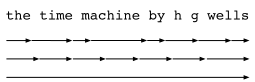
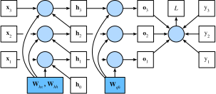

# Rétropropagation à travers le temps
:label:`sec_bptt`

Si vous avez terminé les exercices de la :numref:`sec_rnn-scratch`,
vous avez pu constater que l'écrêtage des gradients (gradient clipping) est vital 
pour empêcher les gradients massifs occasionnels
de déstabiliser l'entraînement.
Nous avions suggéré que l'explosion des gradients
provient de la rétropropagation à travers de longues séquences.
Avant d'introduire une flopée d'architectures modernes de RNN,
examinons de plus près, avec précision mathématique, 
comment la *rétropropagation*
fonctionne dans les modèles séquentiels.
Espérons que cette discussion apportera de la précision 
aux notions de *disparition* et d'*explosion* des gradients.
Si vous vous souvenez de notre discussion sur la propagation 
avant et arrière à travers les graphes de calcul
lors de l'introduction des MLP dans la :numref:`sec_backprop`,
alors la propagation avant dans les RNN
devrait être relativement simple.
L'application de la rétropropagation dans les RNN 
est appelée *rétropropagation à travers le temps* (backpropagation through time) :cite:`Werbos.1990`.
Cette procédure nous oblige à étendre (ou déplier) 
le graphe de calcul d'un RNN
un pas de temps à la fois.
Le RNN déplié est essentiellement 
un réseau de neurones à propagation avant (feedforward)
avec la propriété particulière 
que les mêmes paramètres 
sont répétés tout au long du réseau déplié,
apparaissant à chaque pas de temps.
Ensuite, comme dans tout réseau de neurones à propagation avant,
nous pouvons appliquer la règle de la chaîne, 
en rétropropageant les gradients à travers le réseau déplié.
Le gradient par rapport à chaque paramètre
doit être sommé sur tous les endroits 
où le paramètre apparaît dans le réseau déplié.
La gestion d'un tel partage de poids (weight tying) devrait vous être familière 
d'après nos chapitres sur les réseaux de neurones convolutionnels.

Des complications surviennent parce que les séquences
peuvent être assez longues.
Il n'est pas rare de travailler avec des séquences de texte
composées de plus de mille jetons. 
Notez que cela pose des problèmes tant du point de vue 
computationnel (trop de mémoire)
que de l'optimisation (instabilité numérique). 
L'entrée du premier pas traverse 
plus de 1000 produits matriciels avant d'arriver à la sortie, 
et 1000 autres produits matriciels 
sont nécessaires pour calculer le gradient. 
Nous analysons maintenant ce qui peut mal tourner et 
comment y remédier en pratique.

## Analyse des gradients dans les RNN
:label:`subsec_bptt_analysis`

Nous commençons par un modèle simplifié du fonctionnement d'un RNN.
Ce modèle ignore les détails sur les spécificités 
de l'état caché et la manière dont il est mis à jour.
La notation mathématique ici
ne distingue pas explicitement
les scalaires, les vecteurs et les matrices.
Nous essayons simplement de développer une certaine intuition.
Dans ce modèle simplifié,
nous notons $h_t$ l'état caché,
$x_t$ l'entrée et $o_t$ la sortie
au pas de temps $t$.
Rappelez-vous nos discussions dans la
:numref:`subsec_rnn_w_hidden_states`
selon lesquelles l'entrée et l'état caché
peuvent être concaténés avant d'être multipliés 
par une variable de poids dans la couche cachée.
Ainsi, nous utilisons $w_\textrm{h}$ et $w_\textrm{o}$ pour indiquer respectivement les poids 
de la couche cachée et de la couche de sortie.
Par conséquent, les états cachés et les sorties 
à chaque pas de temps sont

$$\begin{aligned}h_t &= f(x_t, h_{t-1}, w_\textrm{h}),\\o_t &= g(h_t, w_\textrm{o}),\end{aligned}$$
:eqlabel:`eq_bptt_ht_ot`

où $f$ et $g$ sont respectivement des transformations
de la couche cachée et de la couche de sortie.
Par conséquent, nous avons une chaîne de valeurs 
$\{\ldots, (x_{t-1}, h_{t-1}, o_{t-1}), (x_{t}, h_{t}, o_t), \ldots\}$ 
qui dépendent les unes des autres via un calcul récurrent.
La propagation avant est assez simple.
Tout ce dont nous avons besoin est de parcourir les triplets $(x_t, h_t, o_t)$ un pas de temps à la fois.
L'écart entre la sortie $o_t$ et la cible souhaitée $y_t$ 
est ensuite évalué par une fonction objectif 
sur l'ensemble des $T$ pas de temps comme

$$L(x_1, \ldots, x_T, y_1, \ldots, y_T, w_\textrm{h}, w_\textrm{o}) = \frac{1}{T}\sum_{t=1}^T l(y_t, o_t).$$

Pour la rétropropagation, les choses sont un peu plus délicates, 
surtout lorsque nous calculons les gradients 
par rapport aux paramètres $w_\textrm{h}$ de la fonction objectif $L$. 
Pour être précis, selon la règle de la chaîne,

$$\begin{aligned}\frac{\partial L}{\partial w_\textrm{h}}  & = \frac{1}{T}\sum_{t=1}^T \frac{\partial l(y_t, o_t)}{\partial w_\textrm{h}}  \\& = \frac{1}{T}\sum_{t=1}^T \frac{\partial l(y_t, o_t)}{\partial o_t} \frac{\partial g(h_t, w_\textrm{o})}{\partial h_t}  \frac{\partial h_t}{\partial w_\textrm{h}}.\end{aligned}$$
:eqlabel:`eq_bptt_partial_L_wh`

Les premier et deuxième facteurs du
produit dans :eqref:`eq_bptt_partial_L_wh`
sont faciles à calculer.
Le troisième facteur $\partial h_t/\partial w_\textrm{h}$ est là où les choses se compliquent, 
car nous devons calculer de manière récurrente l'effet du paramètre $w_\textrm{h}$ sur $h_t$.
Selon le calcul récurrent
dans :eqref:`eq_bptt_ht_ot`,
$h_t$ dépend à la fois de $h_{t-1}$ et de $w_\textrm{h}$,
où le calcul de $h_{t-1}$
dépend également de $w_\textrm{h}$.
Ainsi, l'évaluation de la dérivée totale de $h_t$ 
par rapport à $w_\textrm{h}$ en utilisant la règle de la chaîne donne

$$\frac{\partial h_t}{\partial w_\textrm{h}}= \frac{\partial f(x_{t},h_{t-1},w_\textrm{h})}{\partial w_\textrm{h}} +\frac{\partial f(x_{t},h_{t-1},w_\textrm{h})}{\partial h_{t-1}} \frac{\partial h_{t-1}}{\partial w_\textrm{h}}.$$
:eqlabel:`eq_bptt_partial_ht_wh_recur`

Pour dériver le gradient ci-dessus, supposons que nous ayons 
trois séquences $\{a_{t}\},\{b_{t}\},\{c_{t}\}$ 
satisfaisant $a_{0}=0$ et $a_{t}=b_{t}+c_{t}a_{t-1}$ pour $t=1, 2,\ldots$.
Alors pour $t\geq 1$, il est facile de montrer que

$$a_{t}=b_{t}+\sum_{i=1}^{t-1}\left(\prod_{j=i+1}^{t}c_{j}\right)b_{i}.$$
:eqlabel:`eq_bptt_at`

En substituant $a_t$, $b_t$ et $c_t$ selon

$$\begin{aligned}a_t &= \frac{\partial h_t}{\partial w_\textrm{h}},\\
b_t &= \frac{\partial f(x_{t},h_{t-1},w_\textrm{h})}{\partial w_\textrm{h}}, \\
c_t &= \frac{\partial f(x_{t},h_{t-1},w_\textrm{h})}{\partial h_{t-1}},\end{aligned}$$

le calcul du gradient dans :eqref:`eq_bptt_partial_ht_wh_recur` satisfait
$a_{t}=b_{t}+c_{t}a_{t-1}$.
Ainsi, selon :eqref:`eq_bptt_at`, 
nous pouvons supprimer le calcul récurrent 
dans :eqref:`eq_bptt_partial_ht_wh_recur` avec

$$\frac{\partial h_t}{\partial w_\textrm{h}}=\frac{\partial f(x_{t},h_{t-1},w_\textrm{h})}{\partial w_\textrm{h}}+\sum_{i=1}^{t-1}\left(\prod_{j=i+1}^{t} \frac{\partial f(x_{j},h_{j-1},w_\textrm{h})}{\partial h_{j-1}} \right) \frac{\partial f(x_{i},h_{i-1},w_\textrm{h})}{\partial w_\textrm{h}}.$$
:eqlabel:`eq_bptt_partial_ht_wh_gen`

Bien que nous puissions utiliser la règle de la chaîne pour calculer $\partial h_t/\partial w_\textrm{h}$ de manière récursive, 
cette chaîne peut devenir très longue chaque fois que $t$ est grand.
Discutons d'un certain nombre de stratégies pour faire face à ce problème.

### Calcul complet ### 

Une idée pourrait être de calculer la somme complète dans :eqref:`eq_bptt_partial_ht_wh_gen`.
Cependant, c'est très lent et les gradients peuvent exploser,
car des changements subtils dans les conditions initiales
peuvent potentiellement affecter beaucoup le résultat.
C'est-à-dire que nous pourrions voir des choses similaires à l'effet papillon,
où des changements minimaux dans les conditions initiales 
entraînent des changements disproportionnés dans le résultat.
C'est généralement indésirable.
Après tout, nous recherchons des estimateurs robustes qui se généralisent bien. 
Par conséquent, cette stratégie n'est presque jamais utilisée en pratique.

### Troncature des pas de temps###

Alternativement,
nous pouvons tronquer la somme dans
:eqref:`eq_bptt_partial_ht_wh_gen`
après $\tau$ pas. 
C'est ce dont nous avons discuté jusqu'à présent. 
Cela conduit à une *approximation* du vrai gradient,
simplement en terminant la somme à $\partial h_{t-\tau}/\partial w_\textrm{h}$. 
En pratique, cela fonctionne assez bien. 
C'est ce qu'on appelle communément la rétropropagation tronquée 
à travers le temps (truncated backpropagation through time) :cite:`Jaeger.2002`.
L'une des conséquences est que le modèle 
se concentre principalement sur l'influence à court terme 
plutôt que sur les conséquences à long terme. 
C'est en fait *souhaitable*, car cela biaise l'estimation 
vers des modèles plus simples et plus stables.

### Troncature aléatoire ### 

Enfin, nous pouvons remplacer $\partial h_t/\partial w_\textrm{h}$
par une variable aléatoire qui est correcte en espérance 
mais tronque la séquence.
Ceci est réalisé en utilisant une séquence de $\xi_t$
avec des $0 \leq \pi_t \leq 1$ prédéfinis,
où $P(\xi_t = 0) = 1-\pi_t$ et 
$P(\xi_t = \pi_t^{-1}) = \pi_t$, donc $E[\xi_t] = 1$.
Nous utilisons cela pour remplacer le gradient
$\partial h_t/\partial w_\textrm{h}$
dans :eqref:`eq_bptt_partial_ht_wh_recur`
avec

$$z_t= \frac{\partial f(x_{t},h_{t-1},w_\textrm{h})}{\partial w_\textrm{h}} +\xi_t \frac{\partial f(x_{t},h_{t-1},w_\textrm{h})}{\partial h_{t-1}} \frac{\partial h_{t-1}}{\partial w_\textrm{h}}.$$

Il découle de la définition de $\xi_t$ 
que $E[z_t] = \partial h_t/\partial w_\textrm{h}$.
Chaque fois que $\xi_t = 0$, le calcul récurrent
se termine à ce pas de temps $t$.
Cela conduit à une somme pondérée de séquences de longueurs variables,
où les séquences longues sont rares mais convenablement surpondérées. 
Cette idée a été proposée par 
:citet:`Tallec.Ollivier.2017`.

### Comparaison des stratégies

:label:`fig_truncated_bptt`

La :numref:`fig_truncated_bptt` illustre les trois stratégies 
lors de l'analyse des premiers caractères de *La Machine à explorer le temps* 
en utilisant la rétropropagation à travers le temps pour les RNN :

* La première ligne est la troncature aléatoire qui divise le texte en segments de longueurs variables.
* La deuxième ligne est la troncature régulière qui divise le texte en sous-séquences de même longueur. C'est ce que nous avons fait dans les expériences sur les RNN.
* La troisième ligne est la rétropropagation complète à travers le temps qui conduit à une expression impossible à calculer en pratique.

Malheureusement, bien qu'attrayante en théorie, 
la troncature aléatoire ne fonctionne pas 
beaucoup mieux que la troncature régulière, 
très probablement en raison d'un certain nombre de facteurs.
Premièrement, l'effet d'une observation
après un certain nombre d'étapes de rétropropagation 
dans le passé est tout à fait suffisant 
pour capturer les dépendances en pratique. 
Deuxièmement, la variance accrue contrecarre le fait 
que le gradient est plus précis avec plus d'étapes. 
Troisièmement, nous *voulons* en fait des modèles qui n'ont qu'une 
courte portée d'interactions. 
Par conséquent, la rétropropagation à travers le temps régulièrement tronquée 
a un léger effet régularisateur qui peut être souhaitable.

## La rétropropagation à travers le temps en détail

Après avoir discuté du principe général,
discutons en détail de la rétropropagation à travers le temps.
Contrairement à l'analyse de la :numref:`subsec_bptt_analysis`,
nous allons montrer dans ce qui suit comment calculer
les gradients de la fonction objectif
par rapport à tous les paramètres décomposés du modèle.
Pour simplifier les choses, nous considérons 
un RNN sans paramètres de biais,
dont la fonction d'activation dans la couche cachée
utilise l'application identité ($\phi(x)=x$).
Pour le pas de temps $t$, soient l'entrée 
d'un seul exemple et la cible respectivement $\mathbf{x}_t \in \mathbb{R}^d$ et $y_t$. 
L'état caché $\mathbf{h}_t \in \mathbb{R}^h$ 
et la sortie $\mathbf{o}_t \in \mathbb{R}^q$
sont calculés comme

$$\begin{aligned}\mathbf{h}_t &= \mathbf{W}_\textrm{hx} \mathbf{x}_t + \mathbf{W}_\textrm{hh} \mathbf{h}_{t-1},\\
\mathbf{o}_t &= \mathbf{W}_\textrm{qh} \mathbf{h}_{t},\end{aligned}$$

où $\mathbf{W}_\textrm{hx} \in \mathbb{R}^{h \times d}$, $\mathbf{W}_\textrm{hh} \in \mathbb{R}^{h \times h}$ et
$\mathbf{W}_\textrm{qh} \in \mathbb{R}^{q \times h}$
sont les paramètres de poids.
Désignons par $l(\mathbf{o}_t, y_t)$
la perte au pas de temps $t$. 
Notre fonction objectif,
la perte sur $T$ pas de temps
depuis le début de la séquence, est donc

$$L = \frac{1}{T} \sum_{t=1}^T l(\mathbf{o}_t, y_t).$$

Afin de visualiser les dépendances entre 
les variables et les paramètres du modèle lors du calcul
du RNN,
nous pouvons dessiner un graphe de calcul pour le modèle,
comme illustré dans la :numref:`fig_rnn_bptt`.
Par exemple, le calcul de l'état caché du pas de temps 3,
$\mathbf{h}_3$, dépend des paramètres du modèle
$\mathbf{W}_\textrm{hx}$ et $\mathbf{W}_\textrm{hh}$,
de l'état caché du pas de temps précédent $\mathbf{h}_2$
et de l'entrée du pas de temps actuel $\mathbf{x}_3$.

:label:`fig_rnn_bptt`

Comme nous venons de le mentionner, les paramètres du modèle dans la :numref:`fig_rnn_bptt` 
sont $\mathbf{W}_\textrm{hx}$, $\mathbf{W}_\textrm{hh}$ et $\mathbf{W}_\textrm{qh}$. 
Généralement, l'entraînement de ce modèle nécessite 
le calcul du gradient par rapport à ces paramètres
$\partial L/\partial \mathbf{W}_\textrm{hx}$, $\partial L/\partial \mathbf{W}_\textrm{hh}$ et $\partial L/\partial \mathbf{W}_\textrm{qh}$.
Selon les dépendances de la :numref:`fig_rnn_bptt`,
nous pouvons parcourir le graphe dans le sens opposé des flèches
pour calculer et stocker les gradients tour à tour.
Pour exprimer de manière flexible la multiplication de 
matrices, vecteurs et scalaires de différentes formes
dans la règle de la chaîne,
nous continuons à utiliser l'opérateur $\textrm{prod}$ 
tel que décrit dans la :numref:`sec_backprop`.

Tout d'abord, la dérivation de la fonction objectif
par rapport à la sortie du modèle à n'importe quel pas de temps $t$
est assez simple :

$$\frac{\partial L}{\partial \mathbf{o}_t} =  \frac{\partial l (\mathbf{o}_t, y_t)}{T \cdot \partial \mathbf{o}_t} \in \mathbb{R}^q.$$
:eqlabel:`eq_bptt_partial_L_ot`

Nous pouvons maintenant calculer le gradient de l'objectif 
par rapport au paramètre $\mathbf{W}_\textrm{qh}$
dans la couche de sortie :
$\partial L/\partial \mathbf{W}_\textrm{qh} \in \mathbb{R}^{q \times h}$. 
Sur la base de la :numref:`fig_rnn_bptt`, 
l'objectif $L$ dépend de $\mathbf{W}_\textrm{qh}$ 
via $\mathbf{o}_1, \ldots, \mathbf{o}_T$. 
L'utilisation de la règle de la chaîne donne

$$
\frac{\partial L}{\partial \mathbf{W}_\textrm{qh}}
= \sum_{t=1}^T \textrm{prod}\left(\frac{\partial L}{\partial \mathbf{o}_t}, \frac{\partial \mathbf{o}_t}{\partial \mathbf{W}_\textrm{qh}}\right)
= \sum_{t=1}^T \frac{\partial L}{\partial \mathbf{o}_t} \mathbf{h}_t^\top,
$$

où $\partial L/\partial \mathbf{o}_t$
est donné par :eqref:`eq_bptt_partial_L_ot`.

Ensuite, comme le montre la :numref:`fig_rnn_bptt`,
au dernier pas de temps $T$,
la fonction objectif
$L$ ne dépend de l'état caché $\mathbf{h}_T$ 
que via $\mathbf{o}_T$.
Par conséquent, nous pouvons facilement trouver le gradient 
$\partial L/\partial \mathbf{h}_T \in \mathbb{R}^h$
en utilisant la règle de la chaîne :

$$\frac{\partial L}{\partial \mathbf{h}_T} = \textrm{prod}\left(\frac{\partial L}{\partial \mathbf{o}_T}, \frac{\partial \mathbf{o}_T}{\partial \mathbf{h}_T} \right) = \mathbf{W}_\textrm{qh}^\top \frac{\partial L}{\partial \mathbf{o}_T}.$$
:eqlabel:`eq_bptt_partial_L_hT_final_step`

Cela devient plus délicat pour n'importe quel pas de temps $t < T$,
où la fonction objectif $L$ dépend de 
$\mathbf{h}_t$ via $\mathbf{h}_{t+1}$ et $\mathbf{o}_t$.
Selon la règle de la chaîne,
le gradient de l'état caché
$\partial L/\partial \mathbf{h}_t \in \mathbb{R}^h$
à n'importe quel pas de temps $t < T$ peut être calculé de manière récurrente comme suit :

$$\frac{\partial L}{\partial \mathbf{h}_t} = \textrm{prod}\left(\frac{\partial L}{\partial \mathbf{h}_{t+1}}, \frac{\partial \mathbf{h}_{t+1}}{\partial \mathbf{h}_t} \right) + \textrm{prod}\left(\frac{\partial L}{\partial \mathbf{o}_t}, \frac{\partial \mathbf{o}_t}{\partial \mathbf{h}_t} \right) = \mathbf{W}_\textrm{hh}^\top \frac{\partial L}{\partial \mathbf{h}_{t+1}} + \mathbf{W}_\textrm{qh}^\top \frac{\partial L}{\partial \mathbf{o}_t}.$$
:eqlabel:`eq_bptt_partial_L_ht_recur`

Pour l'analyse, le développement du calcul récurrent
pour tout pas de temps $1 \leq t \leq T$ donne

$$\frac{\partial L}{\partial \mathbf{h}_t}= \sum_{i=t}^T {\left(\mathbf{W}_\textrm{hh}^\top\right)}^{T-i} \mathbf{W}_\textrm{qh}^\top \frac{\partial L}{\partial \mathbf{o}_{T+t-i}}.$$
:eqlabel:`eq_bptt_partial_L_ht`

Nous pouvons voir d'après :eqref:`eq_bptt_partial_L_ht` 
que ce simple exemple linéaire présente déjà
certains problèmes clés des modèles de séquences longues :
il implique des puissances potentiellement très grandes de $\mathbf{W}_\textrm{hh}^\top$.
En son sein, les valeurs propres inférieures à 1 disparaissent
et les valeurs propres supérieures à 1 divergent.
C'est numériquement instable,
ce qui se manifeste sous la forme de disparition 
et d'explosion des gradients.
Une façon d'y remédier est de tronquer les pas de temps
à une taille pratique pour le calcul,
comme discuté dans la :numref:`subsec_bptt_analysis`. 
En pratique, cette troncature peut également être effectuée 
en détachant le gradient après un nombre donné de pas de temps.
Plus tard, nous verrons comment des modèles de séquences plus sophistiqués 
tels que la mémoire à long et court terme (long short-term memory) peuvent atténuer davantage ce problème. 

Enfin, la :numref:`fig_rnn_bptt` montre 
que la fonction objectif $L$ 
dépend des paramètres du modèle $\mathbf{W}_\textrm{hx}$ et $\mathbf{W}_\textrm{hh}$
dans la couche cachée via les états cachés
$\mathbf{h}_1, \ldots, \mathbf{h}_T$.
Pour calculer les gradients par rapport à ces paramètres
$\partial L / \partial \mathbf{W}_\textrm{hx} \in \mathbb{R}^{h \times d}$ et $\partial L / \partial \mathbf{W}_\textrm{hh} \in \mathbb{R}^{h \times h}$,
nous appliquons la règle de la chaîne, ce qui donne

$$
\begin{aligned}
\frac{\partial L}{\partial \mathbf{W}_\textrm{hx}}
&= \sum_{t=1}^T \textrm{prod}\left(\frac{\partial L}{\partial \mathbf{h}_t}, \frac{\partial \mathbf{h}_t}{\partial \mathbf{W}_\textrm{hx}}\right)
= \sum_{t=1}^T \frac{\partial L}{\partial \mathbf{h}_t} \mathbf{x}_t^\top,\\
\frac{\partial L}{\partial \mathbf{W}_\textrm{hh}}
&= \sum_{t=1}^T \textrm{prod}\left(\frac{\partial L}{\partial \mathbf{h}_t}, \frac{\partial \mathbf{h}_t}{\partial \mathbf{W}_\textrm{hh}}\right)
= \sum_{t=1}^T \frac{\partial L}{\partial \mathbf{h}_t} \mathbf{h}_{t-1}^\top,
\end{aligned}
$$

où $\partial L/\partial \mathbf{h}_t$,
qui est calculé de manière récurrente par
:eqref:`eq_bptt_partial_L_hT_final_step`
et :eqref:`eq_bptt_partial_L_ht_recur`,
est la quantité clé qui affecte la stabilité numérique.

Étant donné que la rétropropagation à travers le temps est l'application de la rétropropagation dans les RNN,
comme nous l'avons expliqué dans la :numref:`sec_backprop`,
l'entraînement des RNN alterne la propagation avant avec
la rétropropagation à travers le temps.
De plus, la rétropropagation à travers le temps
calcule et stocke tour à tour les gradients ci-dessus.
Plus précisément, les valeurs intermédiaires stockées
sont réutilisées pour éviter les calculs en double,
comme le stockage de $\partial L/\partial \mathbf{h}_t$
destiné à être utilisé dans le calcul de $\partial L / \partial \mathbf{W}_\textrm{hx}$ 
et $\partial L / \partial \mathbf{W}_\textrm{hh}$.

## Résumé

* La rétropropagation à travers le temps n'est qu'une application de la rétropropagation aux modèles séquentiels avec un état caché.
* La troncature, qu'elle soit régulière ou aléatoire, est nécessaire pour la commodité du calcul et la stabilité numérique.
* Les puissances élevées de matrices peuvent conduire à des valeurs propres divergentes ou s'évanouissant. Cela se manifeste sous la forme d'explosion ou de disparition des gradients.
* Pour un calcul efficace, les valeurs intermédiaires sont mises en cache pendant la rétropropagation à travers le temps.

## Exercices

1. Supposons que nous ayons une matrice symétrique $\mathbf{M} \in \mathbb{R}^{n \times n}$ avec des valeurs propres $\lambda_i$ dont les vecteurs propres correspondants sont $\mathbf{v}_i$ ($i = 1, \ldots, n$). Sans perte de généralité, supposons qu'ils soient classés dans l'ordre $|\lambda_i| \geq |\lambda_{i+1}|$. 
   1. Montrez que $\mathbf{M}^k$ a des valeurs propres $\lambda_i^k$.
   1. Prouvez que pour un vecteur aléatoire $\mathbf{x} \in \mathbb{R}^n$, avec une probabilité élevée, $\mathbf{M}^k \mathbf{x}$ sera très aligné avec le vecteur propre $\mathbf{v}_1$ de $\mathbf{M}$. Formalisez cette affirmation.
   1. Que signifie le résultat ci-dessus pour les gradients dans les RNN ?
1. Outre l'écrêtage du gradient, pouvez-vous penser à d'autres méthodes pour faire face à l'explosion du gradient dans les réseaux de neurones récurrents ?

[Discussions](https://discuss.d2l.ai/t/334)
