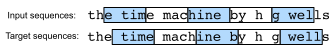

# Modèles de langage
:label:`sec_language-model`

Dans la :numref:`sec_text-sequence`, nous avons vu comment mapper des séquences de texte en jetons (*tokens*), où ces jetons peuvent être vus comme une séquence d'observations discrètes telles que des mots ou des caractères. Supposons que les jetons d'une séquence de texte de longueur $T$ soient tour à tour $x_1, x_2, \ldots, x_T$.
Le but des *modèles de langage*
est d'estimer la probabilité jointe de l'ensemble de la séquence :

$$P(x_1, x_2, \ldots, x_T),$$

où les outils statistiques
de la :numref:`sec_sequence`
peuvent être appliqués.

Les modèles de langage sont incroyablement utiles. Par exemple, un modèle de langage idéal devrait générer de lui-même un texte naturel, simplement en tirant un jeton à la fois $x_t \sim P(x_t \mid x_{t-1}, \ldots, x_1)$.
Contrairement au singe utilisant une machine à écrire, tout texte émergeant d'un tel modèle passerait pour du langage naturel, par exemple du texte en anglais. De plus, cela suffirait à générer un dialogue significatif, simplement en conditionnant le texte sur des fragments de dialogue précédents.
Clairement, nous sommes encore très loin de concevoir un tel système, car il aurait besoin de *comprendre* le texte plutôt que de simplement générer un contenu grammaticalement sensé.

Néanmoins, les modèles de langage sont d'une grande utilité même dans leur forme limitée.
Par exemple, les expressions anglaises "to recognize speech" (reconnaître la parole) et "to wreck a nice beach" (détruire une belle plage) sonnent de manière très similaire.
Cela peut causer une ambiguïté dans la reconnaissance vocale,
qui est facilement résolue par un modèle de langage qui rejette la deuxième traduction comme étant farfelue.
De même, dans un algorithme de résumé de document,
il est utile de savoir que "le chien mord l'homme" est beaucoup plus fréquent que "l'homme mord le chien", ou que "je veux manger grand-mère" est une déclaration plutôt inquiétante, alors que "je veux manger, grand-mère" est beaucoup plus bénigne.

```{.python .input  n=1}
%load_ext d2lbook.tab
tab.interact_select(['mxnet', 'pytorch', 'tensorflow', 'jax'])
```

```{.python .input  n=2}
%%tab mxnet
from d2l import mxnet as d2l
from mxnet import np, npx
npx.set_np()
```

```{.python .input  n=3}
%%tab pytorch
from d2l import torch as d2l
import torch
```

```{.python .input  n=4}
%%tab tensorflow
from d2l import tensorflow as d2l
import tensorflow as tf
```

```{.python .input}
%%tab jax
from d2l import jax as d2l
from jax import numpy as jnp
```

## Apprentissage des modèles de langage

La question évidente est de savoir comment modéliser un document, ou même une séquence de jetons.
Supposons que nous tokenisons les données textuelles au niveau des mots.
Commençons par appliquer les règles de probabilité de base :

$$P(x_1, x_2, \ldots, x_T) = \prod_{t=1}^T P(x_t  \mid  x_1, \ldots, x_{t-1}).$$

Par exemple,
la probabilité d'une séquence de texte contenant quatre mots serait donnée par :

$$\begin{aligned}&P(\textrm{deep}, \textrm{learning}, \textrm{is}, \textrm{fun}) \\
=&P(\textrm{deep}) P(\textrm{learning}  \mid  \textrm{deep}) P(\textrm{is}  \mid  \textrm{deep}, \textrm{learning}) P(\textrm{fun}  \mid  \textrm{deep}, \textrm{learning}, \textrm{is}).\end{aligned}$$

### Modèles de Markov et $n$-grammes
:label:`subsec_markov-models-and-n-grams`

Parmi les analyses de modèles de séquence de la :numref:`sec_sequence`,
appliquons les modèles de Markov à la modélisation du langage.
Une distribution sur des séquences satisfait la propriété de Markov de premier ordre si $P(x_{t+1} \mid x_t, \ldots, x_1) = P(x_{t+1} \mid x_t)$. Des ordres plus élevés correspondent à des dépendances plus longues. Cela conduit à un certain nombre d'approximations que nous pourrions appliquer pour modéliser une séquence :

$$
\begin{aligned}
P(x_1, x_2, x_3, x_4) &=  P(x_1) P(x_2) P(x_3) P(x_4),\\
P(x_1, x_2, x_3, x_4) &=  P(x_1) P(x_2  \mid  x_1) P(x_3  \mid  x_2) P(x_4  \mid  x_3),\\
P(x_1, x_2, x_3, x_4) &=  P(x_1) P(x_2  \mid  x_1) P(x_3  \mid  x_1, x_2) P(x_4  \mid  x_2, x_3).
\end{aligned}
$$

Les formules de probabilité impliquant une, deux et trois variables sont généralement appelées modèles *unigramme*, *bigramme* et *trigramme*, respectivement.
Afin de calculer le modèle de langage, nous devons calculer la
probabilité des mots et la probabilité conditionnelle d'un mot étant donné
les quelques mots précédents.
Notez que
de telles probabilités sont
des paramètres du modèle de langage.

### Fréquence des mots

Ici, nous
supposons que le jeu de données d'entraînement est un large corpus de texte, tel que toutes les
entrées de Wikipédia, [Project Gutenberg](https://en.wikipedia.org/wiki/Project_Gutenberg),
et tout texte publié sur le
Web.
La probabilité des mots peut être calculée à partir de la fréquence relative
des mots dans le jeu de données d'entraînement.
Par exemple, l'estimation $\hat{P}(\textrm{deep})$ peut être calculée comme la
probabilité de n'importe quelle phrase commençant par le mot "deep". Une
approche légèrement moins précise consisterait à compter toutes les occurrences du
mot "deep" et à les diviser par le nombre total de mots dans
le corpus.
Cela fonctionne assez bien, en particulier pour les
mots fréquents. Plus loin, nous pourrions tenter d'estimer

$$\hat{P}(\textrm{learning} \mid \textrm{deep}) = \frac{n(\textrm{deep, learning})}{n(\textrm{deep})},$$

où $n(x)$ et $n(x, x')$ sont respectivement le nombre d'occurrences de singletons
et de paires de mots consécutifs.
Malheureusement,
estimer la
probabilité d'une paire de mots est un peu plus difficile, car les
occurrences de "deep learning" sont beaucoup moins fréquentes.
En particulier, pour certaines combinaisons de mots inhabituelles, il peut être délicat de
trouver suffisamment d'occurrences pour obtenir des estimations précises.
Comme suggéré par les résultats empiriques de la :numref:`subsec_natural-lang-stat`,
les choses empirent pour les combinaisons de trois mots et au-delà.
Il y aura de nombreuses combinaisons de trois mots plausibles que nous ne verrons probablement pas dans notre jeu de données.
À moins que nous ne fournissions une solution pour attribuer à de telles combinaisons de mots un compte non nul, nous ne pourrons pas les utiliser dans un modèle de langage. Si le jeu de données est petit ou si les mots sont très rares, nous pourrions ne pas en trouver un seul.

### Lissage de Laplace

Une stratégie courante consiste à effectuer une forme de *lissage de Laplace*.
La solution consiste à
ajouter une petite constante à tous les comptes.
Désignons par $n$ le nombre total de mots dans
le jeu d'entraînement
et $m$ le nombre de mots uniques.
Cette solution aide pour les singletons, par exemple via

$$\begin{aligned}
	\hat{P}(x) & = \frac{n(x) + \epsilon_1/m}{n + \epsilon_1}, \\
	\hat{P}(x' \mid x) & = \frac{n(x, x') + \epsilon_2 \hat{P}(x')}{n(x) + \epsilon_2}, \\
	\hat{P}(x'' \mid x,x') & = \frac{n(x, x',x'') + \epsilon_3 \hat{P}(x'')}{n(x, x') + \epsilon_3}.
\end{aligned}$$

Ici, $\epsilon_1, \epsilon_2$ et $\epsilon_3$ sont des hyperparamètres.
Prenons $\epsilon_1$ comme exemple :
quand $\epsilon_1 = 0$, aucun lissage n'est appliqué ;
quand $\epsilon_1$ approche l'infini positif,
$\hat{P}(x)$ approche la probabilité uniforme $1/m$.
Ce qui précède est une variante plutôt primitive de ce que
d'autres techniques peuvent accomplir :cite:`Wood.Gasthaus.Archambeau.ea.2011`.

Malheureusement, les modèles de ce type deviennent rapidement encombrants
pour les raisons suivantes.
Premièrement,
comme discuté dans la :numref:`subsec_natural-lang-stat`,
de nombreux $n$-grammes se produisent très rarement,
rendant le lissage de Laplace plutôt inadapté à la modélisation du langage.
Deuxièmement, nous devons stocker tous les comptes.
Troisièmement, cela ignore entièrement le sens des mots. Par
exemple, "chat" et "félin" devraient apparaître dans des contextes liés.
Il est assez difficile d'adapter de tels modèles à des contextes supplémentaires,
alors que les modèles de langage basés sur le deep learning sont bien adaptés pour
prendre cela en compte.
Enfin, les longues séquences de mots
sont presque certainement inédites, donc un modèle qui compte simplement
la fréquence des séquences de mots déjà vues est voué à de mauvaises performances dans ce cas.
Par conséquent, nous nous concentrons sur l'utilisation de réseaux de neurones pour la modélisation du langage
dans le reste du chapitre.

## Perplexité
:label:`subsec_perplexity`

Ensuite, discutons de la manière de mesurer la qualité du modèle de langage, que nous utiliserons ensuite pour évaluer nos modèles dans les sections suivantes.
Une façon est de vérifier à quel point le texte est surprenant.
Un bon modèle de langage est capable de prédire, avec une grande précision, les jetons qui viennent ensuite.
Considérez les continuations suivantes de la phrase anglaise "It is raining" (Il pleut), telles que proposées par différents modèles de langage :

1. "It is raining outside" (Il pleut dehors)
1. "It is raining banana tree" (Il pleut bananier)
1. "It is raining piouw;kcj pwepoiut"

En termes de qualité, l'exemple 1 est clairement le meilleur. Les mots sont sensés et logiquement cohérents.
Bien qu'il ne reflète pas forcément avec précision quel mot suit sémantiquement ("in San Francisco" ou "in winter" auraient été des extensions parfaitement raisonnables), le modèle est capable de capturer quel type de mot suit.
L'exemple 2 est nettement moins bon en produisant une extension absurde. Néanmoins, au moins le modèle a appris à épeler les mots et un certain degré de corrélation entre les mots. Enfin, l'exemple 3 indique un modèle mal entraîné qui ne correspond pas correctement aux données.

Nous pourrions mesurer la qualité du modèle en calculant la vraisemblance de la séquence.
Malheureusement, c'est un nombre qui est difficile à comprendre et difficile à comparer.
Après tout, les séquences courtes ont beaucoup plus de chances de se produire que les plus longues,
par conséquent l'évaluation du modèle sur le chef-d'œuvre de Tolstoï
*Guerre et Paix* produira inévitablement une vraisemblance beaucoup plus petite que, disons, sur la nouvelle de Saint-Exupéry *Le Petit Prince*. Ce qui manque, c'est l'équivalent d'une moyenne.

La théorie de l'information s'avère utile ici.
Nous avons défini l'entropie, la surprise et l'entropie croisée
lorsque nous avons introduit la régression softmax
(:numref:`subsec_info_theory_basics`).
Si nous voulons compresser du texte, nous pouvons nous poser la question de la
prédiction du jeton suivant étant donné l'ensemble actuel de jetons.
Un meilleur modèle de langage devrait nous permettre de prédire le jeton suivant plus précisément.
Ainsi, il devrait nous permettre de dépenser moins de bits pour compresser la séquence.
Nous pouvons donc le mesurer par la perte d'entropie croisée moyennée
sur l'ensemble des $n$ jetons d'une séquence :

$$\frac{1}{n} \sum_{t=1}^n -\log P(x_t \mid x_{t-1}, \ldots, x_1),$$
:eqlabel:`eq_avg_ce_for_lm`

où $P$ est donné par un modèle de langage et $x_t$ est le jeton réel observé au pas de temps $t$ de la séquence.
Cela rend comparables les performances sur des documents de différentes longueurs. Pour des raisons historiques, les scientifiques du traitement du langage naturel préfèrent utiliser une quantité appelée *perplexité*. En résumé, il s'agit de l'exponentielle de l':eqref:`eq_avg_ce_for_lm` :

$$\exp\left(-\frac{1}{n} \sum_{t=1}^n \log P(x_t \mid x_{t-1}, \ldots, x_1)\right).$$

La perplexité peut être comprise au mieux comme l'inverse de la moyenne géométrique du nombre de choix réels que nous avons lors de la décision du prochain jeton à choisir. Regardons un certain nombre de cas :

* Dans le meilleur des scénarios, le modèle estime toujours parfaitement la probabilité du jeton cible à 1. Dans ce cas, la perplexité du modèle est 1.
* Dans le pire des scénarios, le modèle prédit toujours la probabilité du jeton cible à 0. Dans cette situation, la perplexité est l'infini positif.
* Au point de référence (baseline), le modèle prédit une distribution uniforme sur tous les jetons disponibles du vocabulaire. Dans ce cas, la perplexité est égale au nombre de jetons uniques du vocabulaire. En fait, si nous devions stocker la séquence sans aucune compression, ce serait le mieux que nous pourrions faire pour l'encoder. Par conséquent, cela fournit une borne supérieure non triviale que tout modèle utile doit battre.

## Partitionnement de séquences
:label:`subsec_partitioning-seqs`

Nous concevrons des modèles de langage en utilisant des réseaux de neurones
et utiliserons la perplexité pour évaluer
à quel point le modèle est bon pour
prédire le prochain jeton étant donné l'ensemble actuel de jetons
dans les séquences de texte.
Avant d'introduire le modèle,
supposons qu'il
traite à chaque fois un mini-lot de séquences avec une longueur prédéfinie.
Maintenant, la question est de savoir comment [**lire au hasard des mini-lots de séquences d'entrée et de séquences cibles**].

Supposons que le jeu de données prenne la forme d'une séquence de $T$ indices de jetons dans `corpus`.
Nous allons
le partitionner
en sous-séquences, où chaque sous-séquence a $n$ jetons (pas de temps).
Pour itérer sur
(presque) tous les jetons de l'ensemble du jeu de données
pour chaque époque
et obtenir toutes les sous-séquences de longueur $n$ possibles,
nous pouvons introduire du hasard.
Plus concrètement,
au début de chaque époque,
on rejette les $d$ premiers jetons,
où $d\in [0,n)$ est échantillonné uniformément au hasard.
Le reste de la séquence
est ensuite partitionné
en $m=\lfloor (T-d)/n \rfloor$ sous-séquences.
Désignons par $\mathbf x_t = [x_t, \ldots, x_{t+n-1}]$ la sous-séquence de longueur $n$ commençant au jeton $x_t$ au pas de temps $t$.
Les $m$ sous-séquences partitionnées résultantes
sont
$\mathbf x_d, \mathbf x_{d+n}, \ldots, \mathbf x_{d+n(m-1)}.$
Chaque sous-séquence sera utilisée comme une séquence d'entrée dans le modèle de langage.

Pour la modélisation du langage,
le but est de prédire le prochain jeton basé sur les jetons que nous avons vus jusqu'ici ; par conséquent, les cibles (étiquettes) sont la séquence originale, décalée d'un jeton.
La séquence cible pour n'importe quelle séquence d'entrée $\mathbf x_t$
est $\mathbf x_{t+1}$ de longueur $n$.


:label:`fig_lang_model_data`

La :numref:`fig_lang_model_data` montre un exemple d'obtention de cinq paires de séquences d'entrée et de séquences cibles avec $n=5$ et $d=2$.

```{.python .input  n=5}
%%tab all
@d2l.add_to_class(d2l.TimeMachine)  #@save
def __init__(self, batch_size, num_steps, num_train=10000, num_val=5000):
    super(d2l.TimeMachine, self).__init__()
    self.save_hyperparameters()
    corpus, self.vocab = self.build(self._download())
    array = d2l.tensor([corpus[i:i+num_steps+1] 
                        for i in range(len(corpus)-num_steps)])
    self.X, self.Y = array[:,:-1], array[:,1:]
```

Pour entraîner des modèles de langage,
nous échantillonnerons aléatoirement des
paires de séquences d'entrée et de séquences cibles
en mini-lots.
Le chargeur de données suivant génère aléatoirement un mini-lot à partir du jeu de données à chaque fois.
L'argument `batch_size` spécifie le nombre d'exemples de sous-séquences dans chaque mini-lot
et `num_steps` est la longueur de la sous-séquence en jetons.

```{.python .input  n=6}
%%tab all
@d2l.add_to_class(d2l.TimeMachine)  #@save
def get_dataloader(self, train):
    idx = slice(0, self.num_train) if train else slice(
        self.num_train, self.num_train + self.num_val)
    return self.get_tensorloader([self.X, self.Y], train, idx)
```

Comme nous pouvons le voir ci-dessous,
un mini-lot de séquences cibles
peut être obtenu
en décalant les séquences d'entrée
d'un jeton.

```{.python .input  n=7}
%%tab all
data = d2l.TimeMachine(batch_size=2, num_steps=10)
for X, Y in data.train_dataloader():
    print('X:', X, '\nY:', Y)
    break
```

## Résumé et discussion

Les modèles de langage estiment la probabilité jointe d'une séquence de texte. Pour les séquences longues, les $n$-grammes fournissent un modèle pratique en tronquant la dépendance. Cependant, il y a beaucoup de structure mais pas assez de fréquence pour traiter efficacement les combinaisons de mots peu fréquentes via le lissage de Laplace. Ainsi, nous nous concentrerons sur la modélisation neurale du langage dans les sections suivantes.
Pour entraîner des modèles de langage, nous pouvons échantillonner aléatoirement des paires de séquences d'entrée et de séquences cibles en mini-lots. Après l'entraînement, nous utiliserons la perplexité pour mesurer la qualité du modèle de langage.

Les modèles de langage peuvent être mis à l'échelle avec l'augmentation de la taille des données, de la taille du modèle et de la quantité de calcul pour l'entraînement. Les grands modèles de langage peuvent effectuer les tâches souhaitées en prédisant le texte de sortie à partir d'instructions textuelles d'entrée. Comme nous en discuterons plus tard (par exemple, la :numref:`sec_large-pretraining-transformers`),
à l'heure actuelle,
les grands modèles de langage constituent la base des systèmes de pointe pour diverses tâches.

## Exercices

1. Supposons qu'il y ait 100 000 mots dans le jeu de données d'entraînement. Combien de fréquences de mots et de fréquences de mots adjacents multi-mots un quadri-gramme (*four-gram*) doit-il stocker ?
1. Comment modéliseriez-vous un dialogue ?
1. Quelles autres méthodes pouvez-vous imaginer pour lire des données de séquences longues ?
1. Considérez notre méthode consistant à rejeter un nombre aléatoire uniforme des quelques premiers jetons au début de chaque époque.
    1. Cela conduit-il réellement à une distribution parfaitement uniforme sur les séquences du document ?
    1. Que devriez-vous faire pour rendre les choses encore plus uniformes ?
1. Si nous voulons qu'un exemple de séquence soit une phrase complète, quel genre de problème cela introduit-il dans l'échantillonnage par mini-lots ? Comment pouvons-nous y remédier ?

:begin_tab:`mxnet`
[Discussions](https://discuss.d2l.ai/t/117)
:end_tab:

:begin_tab:`pytorch`
[Discussions](https://discuss.d2l.ai/t/118)
:end_tab:

:begin_tab:`tensorflow`
[Discussions](https://discuss.d2l.ai/t/1049)
:end_tab:

:begin_tab:`jax`
[Discussions](https://discuss.d2l.ai/t/18012)
:end_tab:
