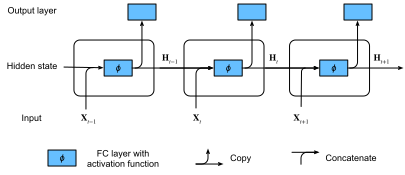
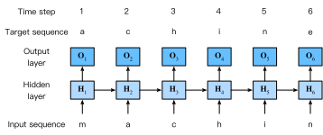

# Réseaux de neurones récurrents
:label:`sec_rnn`


Dans la :numref:`sec_language-model`, nous avons décrit les modèles de Markov et les $n$-grammes pour la modélisation du langage, où la probabilité conditionnelle du jeton $x_t$ à l'étape temporelle $t$ ne dépend que des $n-1$ jetons précédents.
Si nous voulons incorporer l'effet possible de jetons antérieurs à l'étape temporelle $t-(n-1)$ sur $x_t$,
nous devons augmenter $n$.
Cependant, le nombre de paramètres du modèle augmenterait également de manière exponentielle avec lui, car nous devons stocker $|\mathcal{V}|^n$ nombres pour un ensemble de vocabulaire $\mathcal{V}$.
Par conséquent, plutôt que de modéliser $P(x_t \mid x_{t-1}, \ldots, x_{t-n+1})$, il est préférable d'utiliser un modèle à variables latentes,

$$P(x_t \mid x_{t-1}, \ldots, x_1) \approx P(x_t \mid h_{t-1}),$$

où $h_{t-1}$ est un *état caché* qui stocke les informations de la séquence jusqu'à l'étape temporelle $t-1$.
En général,
l'état caché à n'importe quelle étape temporelle $t$ pourrait être calculé sur la base à la fois de l'entrée actuelle $x_{t}$ et de l'état caché précédent $h_{t-1}$ :

$$h_t = f(x_{t}, h_{t-1}).$$
:eqlabel:`eq_ht_xt`

Pour une fonction $f$ suffisamment puissante dans :eqref:`eq_ht_xt`, le modèle à variables latentes n'est pas une approximation. Après tout, $h_t$ peut simplement stocker toutes les données qu'il a observées jusqu'à présent.
Cependant, cela pourrait potentiellement rendre le calcul et le stockage coûteux.

Rappelons que nous avons discuté des couches cachées avec des unités cachées dans le :numref:`chap_perceptrons`.
Il est à noter que
les couches cachées et les états cachés font référence à deux concepts très différents.
Les couches cachées sont, comme expliqué, des couches qui sont cachées à la vue sur le chemin de l'entrée à la sortie.
Les états cachés sont techniquement parlant des *entrées* de tout ce que nous faisons à une étape donnée,
et ils ne peuvent être calculés qu'en examinant les données des étapes temporelles précédentes.

Les *réseaux de neurones récurrents* (RNN) sont des réseaux de neurones avec des états cachés. Avant d'introduire le modèle RNN, nous revisitons d'abord le modèle MLP introduit dans la :numref:`sec_mlp`.

```{.python .input}
%load_ext d2lbook.tab
tab.interact_select('mxnet', 'pytorch', 'tensorflow', 'jax')
```

```{.python .input}
%%tab mxnet
from d2l import mxnet as d2l
from mxnet import np, npx
npx.set_np()
```

```{.python .input}
%%tab pytorch
from d2l import torch as d2l
import torch
```

```{.python .input}
%%tab tensorflow
from d2l import tensorflow as d2l
import tensorflow as tf
```

```{.python .input}
%%tab jax
from d2l import jax as d2l
import jax
from jax import numpy as jnp
```

## Réseaux de neurones sans états cachés

Jetons un coup d'œil à un MLP avec une seule couche cachée.
Soit $\phi$ la fonction d'activation de la couche cachée.
Étant donné un mini-lot d'exemples $\mathbf{X} \in \mathbb{R}^{n \times d}$ avec une taille de lot $n$ et $d$ entrées, la sortie de la couche cachée $\mathbf{H} \in \mathbb{R}^{n \times h}$ est calculée comme suit :

$$\mathbf{H} = \phi(\mathbf{X} \mathbf{W}_{\textrm{xh}} + \mathbf{b}_\textrm{h}).$$
:eqlabel:`rnn_h_without_state`

Dans :eqref:`rnn_h_without_state`, nous avons le paramètre de poids $\mathbf{W}_{\textrm{xh}} \in \mathbb{R}^{d \times h}$, le paramètre de biais $\mathbf{b}_\textrm{h} \in \mathbb{R}^{1 \times h}$ et le nombre d'unités cachées $h$ pour la couche cachée.
Ainsi armés, nous appliquons la diffusion (voir :numref:`subsec_broadcasting`) lors de la sommation.
Ensuite, la sortie de la couche cachée $\mathbf{H}$ est utilisée comme entrée de la couche de sortie, qui est donnée par

$$\mathbf{O} = \mathbf{H} \mathbf{W}_{\textrm{hq}} + \mathbf{b}_\textrm{q},$$

où $\mathbf{O} \in \mathbb{R}^{n \times q}$ est la variable de sortie, $\mathbf{W}_{\textrm{hq}} \in \mathbb{R}^{h \times q}$ est le paramètre de poids et $\mathbf{b}_\textrm{q} \in \mathbb{R}^{1 \times q}$ est le paramètre de biais de la couche de sortie. S'il s'agit d'un problème de classification, nous pouvons utiliser $\mathrm{softmax}(\mathbf{O})$ pour calculer la distribution de probabilité des catégories de sortie.

Ceci est tout à fait analogue au problème de régression que nous avons résolu précédemment dans la :numref:`sec_sequence`, par conséquent nous omettons les détails.
Qu'il suffise de dire que nous pouvons choisir des paires caractéristique-étiquette au hasard et apprendre les paramètres de notre réseau via la différenciation automatique et la descente de gradient stochastique.

## Réseaux de neurones récurrents avec états cachés
:label:`subsec_rnn_w_hidden_states`

Les choses sont tout à fait différentes lorsque nous avons des états cachés. Examinons la structure plus en détail.

Supposons que nous ayons
un mini-lot d'entrées
$\mathbf{X}_t \in \mathbb{R}^{n \times d}$
à l'étape temporelle $t$.
En d'autres termes,
pour un mini-lot de $n$ exemples de séquence,
chaque ligne de $\mathbf{X}_t$ correspond à un exemple à l'étape temporelle $t$ de la séquence.
Ensuite,
notons par $\mathbf{H}_t \in \mathbb{R}^{n \times h}$ la sortie de la couche cachée de l'étape temporelle $t$.
Contrairement au MLP, nous sauvegardons ici la sortie de la couche cachée $\mathbf{H}_{t-1}$ de l'étape temporelle précédente et introduisons un nouveau paramètre de poids $\mathbf{W}_{\textrm{hh}} \in \mathbb{R}^{h \times h}$ pour décrire comment utiliser la sortie de la couche cachée de l'étape temporelle précédente dans l'étape temporelle actuelle. Spécifiquement, le calcul de la sortie de la couche cachée de l'étape temporelle actuelle est déterminé par l'entrée de l'étape temporelle actuelle ainsi que par la sortie de la couche cachée de l'étape temporelle précédente :

$$\mathbf{H}_t = \phi(\mathbf{X}_t \mathbf{W}_{\textrm{xh}} + \mathbf{H}_{t-1} \mathbf{W}_{\textrm{hh}} + \mathbf{b}_\textrm{h}).$$
:eqlabel:`rnn_h_with_state`

Par rapport à :eqref:`rnn_h_without_state`, :eqref:`rnn_h_with_state` ajoute un terme supplémentaire $\mathbf{H}_{t-1} \mathbf{W}_{\textrm{hh}}$ et
instancie ainsi :eqref:`eq_ht_xt`.
D'après la relation entre les sorties des couches cachées $\mathbf{H}_t$ et $\mathbf{H}_{t-1}$ des étapes temporelles adjacentes,
nous savons que ces variables ont capturé et conservé les informations historiques de la séquence jusqu'à leur étape temporelle actuelle, tout comme l'état ou la mémoire de l'étape temporelle actuelle du réseau de neurones. Par conséquent, une telle sortie de couche cachée est appelée un *état caché*.
Étant donné que l'état caché utilise la même définition de l'étape temporelle précédente dans l'étape temporelle actuelle, le calcul de :eqref:`rnn_h_with_state` est *récurrent*. Par conséquent, comme nous l'avons dit, les réseaux de neurones avec des états cachés
basés sur un calcul récurrent sont nommés
*réseaux de neurones récurrents*.
Les couches qui effectuent
le calcul de :eqref:`rnn_h_with_state`
dans les RNN
sont appelées *couches récurrentes*.


Il existe de nombreuses façons différentes de construire des RNN.
Ceux avec un état caché défini par :eqref:`rnn_h_with_state` sont très courants.
Pour l'étape temporelle $t$,
la sortie de la couche de sortie est similaire au calcul dans le MLP :

$$\mathbf{O}_t = \mathbf{H}_t \mathbf{W}_{\textrm{hq}} + \mathbf{b}_\textrm{q}.$$

Les paramètres du RNN
comprennent les poids $\mathbf{W}_{\textrm{xh}} \in \mathbb{R}^{d \times h}, \mathbf{W}_{\textrm{hh}} \in \mathbb{R}^{h \times h}$
et le biais $\mathbf{b}_\textrm{h} \in \mathbb{R}^{1 \times h}$
de la couche cachée,
ainsi que les poids $\mathbf{W}_{\textrm{hq}} \in \mathbb{R}^{h \times q}$
et le biais $\mathbf{b}_\textrm{q} \in \mathbb{R}^{1 \times q}$
de la couche de sortie.
Il convient de mentionner que
même à des étapes temporelles différentes,
les RNN utilisent toujours ces paramètres de modèle.
Par conséquent, le coût de paramétrage d'un RNN
ne croît pas à mesure que le nombre d'étapes temporelles augmente.

La :numref:`fig_rnn` illustre la logique de calcul d'un RNN à trois étapes temporelles adjacentes.
À n'importe quelle étape temporelle $t$,
le calcul de l'état caché peut être traité comme :
(i) la concaténation de l'entrée $\mathbf{X}_t$ à l'étape temporelle actuelle $t$ et de l'état caché $\mathbf{H}_{t-1}$ à l'étape temporelle précédente $t-1$ ;
(ii) l'envoi du résultat de la concaténation dans une couche entièrement connectée avec la fonction d'activation $\phi$.
La sortie d'une telle couche entièrement connectée est l'état caché $\mathbf{H}_t$ de l'étape temporelle actuelle $t$.
Dans ce cas,
les paramètres du modèle sont la concaténation de $\mathbf{W}_{\textrm{xh}}$ et $\mathbf{W}_{\textrm{hh}}$, et un biais de $\mathbf{b}_\textrm{h}$, le tout provenant de :eqref:`rnn_h_with_state`.
L'état caché de l'étape temporelle actuelle $t$, $\mathbf{H}_t$, participera au calcul de l'état caché $\mathbf{H}_{t+1}$ de l'étape temporelle suivante $t+1$.
De plus, $\mathbf{H}_t$ sera également
envoyé dans la couche de sortie entièrement connectée
pour calculer la sortie
$\mathbf{O}_t$ de l'étape temporelle actuelle $t$.


:label:`fig_rnn`

Nous venons de mentionner que le calcul de $\mathbf{X}_t \mathbf{W}_{\textrm{xh}} + \mathbf{H}_{t-1} \mathbf{W}_{\textrm{hh}}$ pour l'état caché est équivalent à
la multiplication matricielle de
la concaténation de $\mathbf{X}_t$ et $\mathbf{H}_{t-1}$
et de
la concaténation de $\mathbf{W}_{\textrm{xh}}$ et $\mathbf{W}_{\textrm{hh}}$.
Bien que cela puisse être prouvé mathématiquement,
dans ce qui suit, nous utilisons simplement un court extrait de code à titre de démonstration.
Pour commencer,
nous définissons les matrices `X`, `W_xh`, `H` et `W_hh`, dont les formes sont respectivement (3, 1), (1, 4), (3, 4) et (4, 4).
En multipliant `X` par `W_xh`, et `H` par `W_hh`, puis en additionnant ces deux produits,
nous obtenons une matrice de forme (3, 4).

```{.python .input}
%%tab mxnet, pytorch
X, W_xh = d2l.randn(3, 1), d2l.randn(1, 4)
H, W_hh = d2l.randn(3, 4), d2l.randn(4, 4)
d2l.matmul(X, W_xh) + d2l.matmul(H, W_hh)
```

```{.python .input}
%%tab tensorflow
X, W_xh = d2l.normal((3, 1)), d2l.normal((1, 4))
H, W_hh = d2l.normal((3, 4)), d2l.normal((4, 4))
d2l.matmul(X, W_xh) + d2l.matmul(H, W_hh)
```

```{.python .input}
%%tab jax
X, W_xh = jax.random.normal(d2l.get_key(), (3, 1)), jax.random.normal(
                                                        d2l.get_key(), (1, 4))
H, W_hh = jax.random.normal(d2l.get_key(), (3, 4)), jax.random.normal(
                                                        d2l.get_key(), (4, 4))
d2l.matmul(X, W_xh) + d2l.matmul(H, W_hh)
```

Maintenant, nous concaténons les matrices `X` et `H`
le long des colonnes (axe 1),
et les matrices
`W_xh` et `W_hh` le long des lignes (axe 0).
Ces deux concaténations
aboutissent à
des matrices de forme (3, 5)
et de forme (5, 4), respectivement.
En multipliant ces deux matrices concaténées,
nous obtenons la même matrice de sortie de forme (3, 4)
que ci-dessus.

```{.python .input}
%%tab all
d2l.matmul(d2l.concat((X, H), 1), d2l.concat((W_xh, W_hh), 0))
```

## Modèles de langage au niveau du caractère basés sur les RNN

Rappelons que pour la modélisation du langage dans la :numref:`sec_language-model`,
nous visons à prédire le jeton suivant sur la base
des jetons actuels et passés ;
ainsi, nous décalons la séquence d'origine d'un jeton
pour les cibles (étiquettes).
:citet:`Bengio.Ducharme.Vincent.ea.2003` a d'abord proposé
d'utiliser un réseau de neurones pour la modélisation du langage.
Dans ce qui suit, nous illustrons comment les RNN peuvent être utilisés pour construire un modèle de langage.
Soit la taille du mini-lot égale à un, et la séquence du texte soit "machine".
Pour simplifier l'entraînement dans les sections suivantes,
nous segmentons le texte en caractères plutôt qu'en mots
et considérons un *modèle de langage au niveau du caractère*.
La :numref:`fig_rnn_train` montre comment prédire le caractère suivant sur la base des caractères actuels et précédents via un RNN pour la modélisation du langage au niveau du caractère.


:label:`fig_rnn_train`

Pendant le processus d'entraînement,
nous exécutons une opération softmax sur la sortie de la couche de sortie pour chaque étape temporelle, puis utilisons la perte d'entropie croisée pour calculer l'erreur entre la sortie du modèle et la cible.
En raison du calcul récurrent de l'état caché dans la couche cachée, la sortie, $\mathbf{O}_3$, de l'étape temporelle 3 dans la :numref:`fig_rnn_train` est déterminée par la séquence de texte "m", "a" et "c". Étant donné que le caractère suivant de la séquence dans les données d'entraînement est "h", la perte de l'étape temporelle 3 dépendra de la distribution de probabilité du caractère suivant généré sur la base de la séquence de caractéristiques "m", "a", "c" et de la cible "h" de cette étape temporelle.

En pratique, chaque jeton est représenté par un vecteur de dimension $d$, et nous utilisons une taille de lot $n>1$. Par conséquent, l'entrée $\mathbf X_t$ à l'étape temporelle $t$ sera une matrice $n \times d$, ce qui est identique à ce que nous avons discuté dans la :numref:`subsec_rnn_w_hidden_states`.

Dans les sections suivantes, nous implémenterons des RNN
pour les modèles de langage au niveau du caractère.


## Résumé

Un réseau de neurones qui utilise un calcul récurrent pour les états cachés est appelé un réseau de neurones récurrent (RNN).
L'état caché d'un RNN peut capturer les informations historiques de la séquence jusqu'à l'étape temporelle actuelle. Avec un calcul récurrent, le nombre de paramètres du modèle RNN ne croît pas à mesure que le nombre d'étapes temporelles augmente. En ce qui concerne les applications, un RNN peut être utilisé pour créer des modèles de langage au niveau du caractère.


## Exercices

1. Si nous utilisons un RNN pour prédire le caractère suivant dans une séquence de texte, quelle est la dimension requise pour n'importe quelle sortie ?
1. Pourquoi les RNN peuvent-ils exprimer la probabilité conditionnelle d'un jeton à une certaine étape temporelle sur la base de tous les jetons précédents de la séquence de texte ?
1. Qu'arrive-t-il au gradient si vous effectuez une rétropropagation à travers une longue séquence ?
1. Quels sont certains des problèmes associés au modèle de langage décrit dans cette section ?


:begin_tab:`mxnet`
[Discussions](https://discuss.d2l.ai/t/337)
:end_tab:

:begin_tab:`pytorch`
[Discussions](https://discuss.d2l.ai/t/1050)
:end_tab:

:begin_tab:`tensorflow`
[Discussions](https://discuss.d2l.ai/t/1051)
:end_tab:

:begin_tab:`jax`
[Discussions](https://discuss.d2l.ai/t/180013)
:end_tab:
