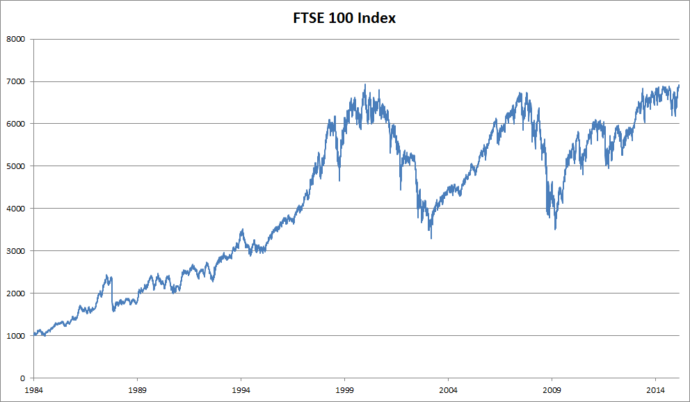
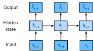

# Travailler avec des séquences
:label:`sec_sequence`

Jusqu'à présent, nous nous sommes concentrés sur des modèles dont les entrées
consistaient en un vecteur de caractéristiques unique $\mathbf{x} \in \mathbb{R}^d$.
Le principal changement de perspective lors du développement de modèles
capables de traiter des séquences est que nous nous
concentrons désormais sur des entrées constituées d'une liste ordonnée
de vecteurs de caractéristiques $\mathbf{x}_1, \dots, \mathbf{x}_T$,
où chaque vecteur de caractéristiques $\mathbf{x}_t$ est
indexé par un pas de temps $t \in \mathbb{Z}^+$
appartenant à $\mathbb{R}^d$.

Certains jeux de données consistent en une seule séquence massive.
Considérez, par exemple, les flux extrêmement longs
de relevés de capteurs qui pourraient être mis à la disposition des climatologues.
Dans de tels cas, nous pourrions créer des jeux de données d'entraînement
en échantillonnant aléatoirement des sous-séquences d'une certaine longueur prédéterminée.
Plus souvent, nos données arrivent sous la forme d'une collection de séquences.
Considérez les exemples suivants :
(i) une collection de documents,
chacun représenté par sa propre séquence de mots,
et chacun ayant sa propre longueur $T_i$ ;
(ii) la représentation séquentielle des
séjours hospitaliers des patients,
où chaque séjour consiste en un certain nombre d'événements
et la longueur de la séquence dépend approximativement
de la durée du séjour.

Auparavant, lorsqu'il s'agissait d'entrées individuelles,
nous supposions qu'elles étaient échantillonnées indépendamment
à partir de la même distribution sous-jacente $P(X)$.
Bien que nous supposions toujours que des séquences entières
(par exemple, des documents entiers ou des trajectoires de patients)
sont échantillonnées indépendamment,
nous ne pouvons pas supposer que les données arrivant
à chaque pas de temps sont indépendantes les unes des autres.
Par exemple, les mots susceptibles d'apparaître plus tard dans un document
dépendent fortement des mots apparaissant plus tôt dans le document.
Le médicament qu'un patient est susceptible de recevoir
le 10e jour d'une visite à l'hôpital
dépend fortement de ce qui s'est passé
au cours des neuf jours précédents.

Cela ne devrait pas surprendre.
Si nous ne pensions pas que les éléments d'une séquence étaient liés,
nous n'aurions pas pris la peine de les modéliser en tant que séquence au départ.
Considérez l'utilité des fonctionnalités de saisie semi-automatique
qui sont populaires sur les outils de recherche et les clients de messagerie modernes.
Elles sont utiles précisément parce qu'il est souvent possible
de prédire (imparfaitement, mais mieux qu'un choix aléatoire)
quelles pourraient être les continuations probables d'une séquence,
étant donné un certain préfixe initial.
Pour la plupart des modèles de séquence,
nous n'exigeons pas l'indépendance,
ni même la stationnarité, de nos séquences.
Au lieu de cela, nous exigeons seulement que
les séquences elles-mêmes soient échantillonnées
à partir d'une distribution sous-jacente fixe
sur des séquences entières.

Cette approche flexible permet de rendre compte de phénomènes
tels que (i) des documents paraissant sensiblement différents
au début et à la fin ;
ou (ii) l'état d'un patient évoluant soit
vers la guérison, soit vers le décès
au cours d'un séjour à l'hôpital ;
ou (iii) les goûts des clients évoluant de manière prévisible
au cours d'une interaction continue avec un système de recommandation.

Nous souhaitons parfois prédire une cible fixe $y$
étant donné une entrée structurée séquentiellement
(par exemple, la classification de sentiment basée sur une critique de film).
À d'autres moments, nous souhaitons prédire une cible structurée séquentiellement
($y_1, \ldots, y_T$)
étant donné une entrée fixe (par exemple, le sous-titrage d'image).
À d'autres moments encore, notre objectif est de prédire des cibles structurées séquentiellement
basées sur des entrées structurées séquentiellement
(par exemple, la traduction automatique ou le sous-titrage vidéo).
De telles tâches séquentiels-vers-séquentiels (sequence-to-sequence) prennent deux formes :
(i) *alignées* : où l'entrée à chaque pas de temps
s'aligne avec une cible correspondante (par exemple, l'étiquetage morpho-syntaxique) ;
(ii) *non alignées* : où l'entrée et la cible
ne présentent pas nécessairement une correspondance pas à pas
(par exemple, la traduction automatique).

Avant de nous soucier de gérer des cibles de quelque nature que ce soit,
nous pouvons nous attaquer au problème le plus simple :
la modélisation de densité non supervisée (également appelée *modélisation de séquence*).
Ici, étant donné une collection de séquences,
notre objectif est d'estimer la fonction de masse de probabilité
qui nous indique la probabilité de voir une séquence donnée,
c'est-à-dire $p(\mathbf{x}_1, \ldots, \mathbf{x}_T)$.

```{.python .input  n=6}
%load_ext d2lbook.tab
tab.interact_select('mxnet', 'pytorch', 'tensorflow', 'jax')
```

```{.python .input  n=7}
%%tab mxnet
%matplotlib inline
from d2l import mxnet as d2l
from mxnet import autograd, np, npx, gluon, init
from mxnet.gluon import nn
npx.set_np()
```

```{.python .input  n=8}
%%tab pytorch
%matplotlib inline
from d2l import torch as d2l
import torch
from torch import nn
```

```{.python .input  n=9}
%%tab tensorflow
%matplotlib inline
from d2l import tensorflow as d2l
import tensorflow as tf
```

```{.python .input  n=9}
%%tab jax
%matplotlib inline
from d2l import jax as d2l
import jax
from jax import numpy as jnp
import numpy as np
```

## Modèles autorégressifs

Avant d'introduire des réseaux de neurones spécialisés
conçus pour gérer des données structurées séquentiellement,
jetons un coup d'œil à quelques données de séquence réelles
et construisons quelques intuitions de base et outils statistiques.
En particulier, nous nous concentrerons sur les données de cours boursiers
de l'indice FTSE 100 (:numref:`fig_ftse100`).
À chaque *pas de temps* $t \in \mathbb{Z}^+$, nous observons
le cours, $x_t$, de l'indice à ce moment-là.


:width:`400px`
:label:`fig_ftse100`

Supposons maintenant qu'un trader souhaite effectuer des transactions à court terme,
en entrant ou en sortant stratégiquement de l'indice,
selon qu'il pense
qu'il va augmenter ou diminuer
au pas de temps suivant.
En l'absence de toute autre caractéristique
(nouvelles, données de rapports financiers, etc.),
le seul signal disponible pour prédire
la valeur suivante est l'historique des cours à ce jour.
Le trader est donc intéressé par la connaissance de
la distribution de probabilité

$$P(x_t \mid x_{t-1}, \ldots, x_1)$$

sur les cours que l'indice pourrait prendre
au pas de temps suivant.
Bien que l'estimation de la distribution entière
d'une variable aléatoire à valeur continue
puisse être difficile, le trader serait heureux
de se concentrer sur quelques statistiques clés de la distribution,
en particulier l'espérance et la variance.
Une stratégie simple pour estimer l'espérance conditionnelle

$$\mathbb{E}[(x_t \mid x_{t-1}, \ldots, x_1)],$$

serait d'appliquer un modèle de régression linéaire
(rappelez-vous :numref:`sec_linear_regression`).
De tels modèles qui régressent la valeur d'un signal
sur les valeurs précédentes de ce même signal
sont naturellement appelés *modèles autorégressifs*.
Il y a juste un problème majeur : le nombre d'entrées,
$x_{t-1}, \ldots, x_1$ varie, selon $t$.
En d'autres termes, le nombre d'entrées augmente
avec la quantité de données que nous rencontrons.
Ainsi, si nous voulons traiter nos données historiques
comme un ensemble d'entraînement, nous nous retrouvons avec le problème
que chaque exemple a un nombre différent de caractéristiques.
Une grande partie de ce qui suit dans ce chapitre
tournera autour de techniques
pour surmonter ces défis
lorsque l'on s'engage dans de tels problèmes de modélisation *autorégressive*
où l'objet d'intérêt est
$P(x_t \mid x_{t-1}, \ldots, x_1)$
ou certaines statistiques de cette distribution.

Quelques stratégies reviennent fréquemment.
Tout d'abord,
nous pourrions croire que bien que de longues séquences
$x_{t-1}, \ldots, x_1$ soient disponibles,
il n'est peut-être pas nécessaire
de remonter si loin dans l'historique
pour prédire le futur proche.
Dans ce cas, nous pourrions nous contenter
de conditionner sur une fenêtre de longueur $\tau$
et d'utiliser seulement les observations $x_{t-1}, \ldots, x_{t-\tau}$.
L'avantage immédiat est que maintenant le nombre d'arguments
est toujours le même, au moins pour $t > \tau$.
Cela nous permet d'entraîner n'importe quel modèle linéaire ou réseau profond
qui nécessite des vecteurs de longueur fixe en entrée.
Deuxièmement, nous pourrions développer des modèles qui maintiennent
un résumé $h_t$ des observations passées
(voir :numref:`fig_sequence-model`)
et mettent à jour $h_t$ en même temps
que la prédiction $\hat{x}_t$.
Cela conduit à des modèles qui estiment non seulement $x_t$
avec $\hat{x}_t = P(x_t \mid h_{t})$
mais aussi des mises à jour de la forme
$h_t = g(h_{t-1}, x_{t-1})$.
Comme $h_t$ n'est jamais observé,
ces modèles sont également appelés
*modèles autorégressifs latents*.


:label:`fig_sequence-model`

Pour construire des données d'entraînement à partir de données historiques, on
crée généralement des exemples en échantillonnant des fenêtres de manière aléatoire.
En général, on ne s'attend pas à ce que le temps s'arrête.
Cependant, nous supposons souvent que bien que
les valeurs spécifiques de $x_t$ puissent changer,
la dynamique selon laquelle chaque observation ultérieure
est générée compte tenu des observations précédentes ne change pas.
Les statisticiens appellent *stationnaires* les dynamiques qui ne changent pas.

## Modèles de séquence

Parfois, en particulier lorsqu'on travaille avec le langage,
nous souhaitons estimer la probabilité jointe
d'une séquence entière.
C'est une tâche courante lorsqu'on travaille avec des séquences
composées de *jetons* (tokens) discrets, tels que des mots.
Généralement, ces fonctions estimées sont appelées *modèles de séquence*
et pour les données de langage naturel, elles sont appelées *modèles de langage*.
Le domaine de la modélisation de séquence a été tellement porté par le traitement du langage naturel
que nous décrivons souvent les modèles de séquence comme des « modèles de langage »,
même lorsqu'il s'agit de données autres que le langage.
Les modèles de langage s'avèrent utiles pour toutes sortes de raisons.
Parfois, nous voulons évaluer la vraisemblance de phrases.
Par exemple, nous pourrions souhaiter comparer
le caractère naturel de deux sorties candidates
générées par un système de traduction automatique
ou par un système de reconnaissance vocale.
Mais la modélisation du langage nous donne non seulement
la capacité d'*évaluer* la vraisemblance,
mais aussi la capacité d'*échantillonner* des séquences,
et même d'optimiser pour les séquences les plus probables.

Bien que la modélisation du langage ne semble pas, à première vue,
être un problème autorégressif,
nous pouvons réduire la modélisation du langage à la prédiction autorégressive
en décomposant la densité jointe d'une séquence $p(x_1, \ldots, x_T)$
en un produit de densités conditionnelles
de gauche à droite
en appliquant la règle de chaîne des probabilités :

$$P(x_1, \ldots, x_T) = P(x_1) \prod_{t=2}^T P(x_t \mid x_{t-1}, \ldots, x_1).$$

Notez que si nous travaillons avec des signaux discrets tels que des mots,
alors le modèle autorégressif doit être un classifieur probabiliste,
produisant une distribution de probabilité complète
sur le vocabulaire pour le mot qui viendra ensuite,
étant donné le contexte à gauche.

### Modèles de Markov
:label:`subsec_markov-models`

Supposons maintenant que nous souhaitions employer la stratégie mentionnée ci-dessus,
où nous conditionnons seulement sur les $\tau$ pas de temps précédents,
c'est-à-dire $x_{t-1}, \ldots, x_{t-\tau}$, plutôt que
sur l'historique complet de la séquence $x_{t-1}, \ldots, x_1$.
Chaque fois que nous pouvons rejeter l'historique
au-delà des $\tau$ pas précédents
sans aucune perte de pouvoir prédictif,
nous disons que la séquence satisfait une *condition de Markov*,
c'est-à-dire *que le futur est conditionnellement indépendant du passé,
étant donné l'historique récent*.
Lorsque $\tau = 1$, nous disons que les données sont caractérisées
par un *modèle de Markov du premier ordre*,
et lorsque $\tau = k$, nous disons que les données sont caractérisées
par un modèle de Markov d'ordre $k$.
Lorsque la condition de Markov du premier ordre est vérifiée ($\tau = 1$),
la factorisation de notre probabilité jointe devient un produit
de probabilités de chaque mot étant donné le *mot* précédent :

$$P(x_1, \ldots, x_T) = P(x_1) \prod_{t=2}^T P(x_t \mid x_{t-1}).$$

Il est souvent utile de travailler avec des modèles qui procèdent
comme si une condition de Markov était satisfaite,
même lorsque nous savons que ce n'est qu'*approximativement* vrai.
Avec de vrais documents textuels, nous continuons à gagner des informations
à mesure que nous incluons de plus en plus de contexte à gauche.
Mais ces gains diminuent rapidement.
Ainsi, nous faisons parfois un compromis, évitant les difficultés informatiques et statistiques
en entraînant des modèles dont la validité dépend
d'une condition de Markov d'ordre $k$.
Même les modèles de langage massifs d'aujourd'hui basés sur les RNN et les Transformers
intègrent rarement plus de milliers de mots de contexte.

Avec des données discrètes, un véritable modèle de Markov
compte simplement le nombre de fois
que chaque mot est apparu dans chaque contexte, produisant
l'estimation de fréquence relative de $P(x_t \mid x_{t-1})$.
Chaque fois que les données ne prennent que des valeurs discrètes
(comme dans le langage),
la séquence de mots la plus probable peut être calculée efficacement
en utilisant la programmation dynamique.

### L'ordre du décodage

Vous vous demandez peut-être pourquoi nous avons représenté
la factorisation d'une séquence de texte $P(x_1, \ldots, x_T)$
sous la forme d'une chaîne de probabilités conditionnelles de gauche à droite.
Pourquoi pas de droite à gauche ou dans un autre ordre apparemment aléatoire ?
En principe, il n'y a rien de mal à déplier
$P(x_1, \ldots, x_T)$ dans l'ordre inverse.
Le résultat est une factorisation valide :

$$P(x_1, \ldots, x_T) = P(x_T) \prod_{t=T-1}^1 P(x_t \mid x_{t+1}, \ldots, x_T).$$

Cependant, il existe de nombreuses raisons pour lesquelles la factorisation du texte
dans le sens inverse de celui dans lequel nous le lisons
(de gauche à droite pour la plupart des langues,
mais de droite à gauche pour l'arabe et l'hébreu)
est préférée pour la tâche de modélisation du langage.
Premièrement, c'est tout simplement une direction plus naturelle pour nous.
Après tout, nous lisons tous du texte tous les jours,
et ce processus est guidé par notre capacité
à anticiper les mots et les phrases
susceptibles de venir ensuite.
Pensez simplement au nombre de fois où vous avez terminé
la phrase de quelqu'un d'autre.
Ainsi, même si nous n'avions aucune autre raison de préférer de tels décodages dans l'ordre,
ils seraient utiles ne serait-ce que parce que nous avons de meilleures intuitions
sur ce qui devrait être probable lors de la prédiction dans cet ordre.

Deuxièmement, en factorisant dans l'ordre,
nous pouvons attribuer des probabilités à des séquences arbitrairement longues
en utilisant le même modèle de langage.
Pour convertir une probabilité sur les étapes $1$ à $t$
en une probabilité qui s'étend au mot $t+1$, il suffit de
multiplier par la probabilité conditionnelle
du jeton supplémentaire étant donné les précédents :
$P(x_{t+1}, \ldots, x_1) = P(x_{t}, \ldots, x_1) \cdot P(x_{t+1} \mid x_{t}, \ldots, x_1)$.

Troisièmement, nous avons des modèles prédictifs plus solides
pour prédire les mots adjacents que pour
les mots à d'autres emplacements arbitraires.
Bien que tous les ordres de factorisation soient valides,
ils ne représentent pas nécessairement tous des problèmes
de modélisation prédictive aussi faciles les uns que les autres.
C'est vrai non seulement pour le langage,
mais aussi pour d'autres types de données,
par exemple lorsque les données sont structurées de manière causale.
Par exemple, nous pensons que les événements futurs ne peuvent pas influencer le passé.
Par conséquent, si nous changeons $x_t$, nous pourrons peut-être influencer
ce qui arrive pour $x_{t+1}$ à l'avenir, mais pas l'inverse.
C'est-à-dire que si nous changeons $x_t$, la distribution des événements passés ne changera pas.
Dans certains contextes, cela facilite la prédiction de $P(x_{t+1} \mid x_t)$
que celle de $P(x_t \mid x_{t+1})$.
Par exemple, dans certains cas, nous pouvons trouver $x_{t+1} = f(x_t) + \epsilon$
pour un bruit additif $\epsilon$,
alors que l'inverse n'est pas vrai :cite:`Hoyer.Janzing.Mooij.ea.2009`.
C'est une excellente nouvelle, car c'est généralement la direction avant
que nous sommes intéressés à estimer.
Le livre de :citet:`Peters.Janzing.Scholkopf.2017` contient plus d'informations sur ce sujet.
Nous n'en effleurons que la surface.

## Entraînement

Avant de porter notre attention sur les données textuelles,
essayons d'abord cela avec des
données synthétiques à valeurs continues.

(**Ici, nos 1000 données synthétiques suivront
la fonction trigonométrique `sin`,
appliquée à 0,01 fois le pas de temps.
Pour rendre le problème un peu plus intéressant,
nous corrompons chaque échantillon avec un bruit additif.**)
De cette séquence, nous extrayons des exemples d'entraînement,
chacun composé de caractéristiques et d'une étiquette.

```{.python .input  n=10}
%%tab all
class Data(d2l.DataModule):
    def __init__(self, batch_size=16, T=1000, num_train=600, tau=4):
        self.save_hyperparameters()
        self.time = d2l.arange(1, T + 1, dtype=d2l.float32)
        if tab.selected('mxnet', 'pytorch'):
            self.x = d2l.sin(0.01 * self.time) + d2l.randn(T) * 0.2
        if tab.selected('tensorflow'):
            self.x = d2l.sin(0.01 * self.time) + d2l.normal([T]) * 0.2
        if tab.selected('jax'):
            key = d2l.get_key()
            self.x = d2l.sin(0.01 * self.time) + jax.random.normal(key,
                                                                   [T]) * 0.2
```

```{.python .input}
%%tab all
data = Data()
d2l.plot(data.time, data.x, 'time', 'x', xlim=[1, 1000], figsize=(6, 3))
```

Pour commencer, nous essayons un modèle qui agit comme si
les données satisfaisaient une condition de Markov d'ordre $\tau$,
et prédit donc $x_t$ en utilisant seulement les $\tau$ observations passées.
[**Ainsi, pour chaque pas de temps, nous avons un exemple
avec l'étiquette $y = x_t$ et les caractéristiques
$\mathbf{x}_t = [x_{t-\tau}, \ldots, x_{t-1}]$.**]
Le lecteur averti aura peut-être remarqué que
cela donne $1000-\tau$ exemples,
puisqu'il nous manque un historique suffisant pour $y_1, \ldots, y_\tau$.
Bien que nous puissions compléter les premières $\tau$ séquences avec des zéros,
pour rester simple, nous les abandonnons pour le moment.
Le jeu de données résultant contient $T - \tau$ exemples,
où chaque entrée du modèle a une longueur de séquence $\tau$.
Nous (**créons un itérateur de données sur les 600 premiers exemples**),
couvrant une période de la fonction sinus.

```{.python .input}
%%tab all
@d2l.add_to_class(Data)
def get_dataloader(self, train):
    features = [self.x[i : self.T-self.tau+i] for i in range(self.tau)]
    self.features = d2l.stack(features, 1)
    self.labels = d2l.reshape(self.x[self.tau:], (-1, 1))
    i = slice(0, self.num_train) if train else slice(self.num_train, None)
    return self.get_tensorloader([self.features, self.labels], train, i)
```

Dans cet exemple, notre modèle sera une régression linéaire standard.

```{.python .input}
%%tab all
model = d2l.LinearRegression(lr=0.01)
trainer = d2l.Trainer(max_epochs=5)
trainer.fit(model, data)
```

## Prédiction

[**Pour évaluer notre modèle, nous vérifions d'abord
ses performances en prédiction à un pas**].

```{.python .input}
%%tab pytorch, mxnet, tensorflow
onestep_preds = d2l.numpy(model(data.features))
d2l.plot(data.time[data.tau:], [data.labels, onestep_preds], 'time', 'x',
         legend=['labels', '1-step preds'], figsize=(6, 3))
```

```{.python .input}
%%tab jax
onestep_preds = model.apply({'params': trainer.state.params}, data.features)
d2l.plot(data.time[data.tau:], [data.labels, onestep_preds], 'time', 'x',
         legend=['labels', '1-step preds'], figsize=(6, 3))
```

Ces prédictions semblent bonnes,
même vers la fin à $t=1000$.

Mais que se passerait-il si nous n'observions les données de séquence
que jusqu'au pas de temps 604 (`n_train + tau`)
et que nous souhaitions faire des prédictions plusieurs pas
dans le futur ?
Malheureusement, nous ne pouvons pas calculer directement
la prédiction à un pas pour le pas de temps 609,
car nous ne connaissons pas les entrées correspondantes,
n'ayant vu que jusqu'à $x_{604}$.
Nous pouvons résoudre ce problème en utilisant
nos prédictions précédentes comme entrées de notre modèle
pour faire des prédictions ultérieures,
en projetant vers l'avant, un pas à la fois,
jusqu'à atteindre le pas de temps souhaité :

$$\begin{aligned}
\hat{x}_{605} &= f(x_{601}, x_{602}, x_{603}, x_{604}), \\
\hat{x}_{606} &= f(x_{602}, x_{603}, x_{604}, \hat{x}_{605}), \\
\hat{x}_{607} &= f(x_{603}, x_{604}, \hat{x}_{605}, \hat{x}_{606}),\\
\hat{x}_{608} &= f(x_{604}, \hat{x}_{605}, \hat{x}_{606}, \hat{x}_{607}),\\
\hat{x}_{609} &= f(\hat{x}_{605}, \hat{x}_{606}, \hat{x}_{607}, \hat{x}_{608}),\\
&\vdots\end{aligned}$$

En général, pour une séquence observée $x_1, \ldots, x_t$,
sa sortie prédite $\hat{x}_{t+k}$ au pas de temps $t+k$
est appelée la *prédiction à $k$ pas*.
Comme nous avons observé jusqu'à $x_{604}$,
sa prédiction à $k$ pas est $\hat{x}_{604+k}$.
En d'autres termes, nous devrons
continuer à utiliser nos propres prédictions
pour faire des prédictions à plusieurs pas.
Voyons comment cela se passe.

```{.python .input}
%%tab mxnet, pytorch
multistep_preds = d2l.zeros(data.T)
multistep_preds[:] = data.x
for i in range(data.num_train + data.tau, data.T):
    multistep_preds[i] = model(
        d2l.reshape(multistep_preds[i-data.tau : i], (1, -1)))
multistep_preds = d2l.numpy(multistep_preds)
```

```{.python .input}
%%tab tensorflow
multistep_preds = tf.Variable(d2l.zeros(data.T))
multistep_preds[:].assign(data.x)
for i in range(data.num_train + data.tau, data.T):
    multistep_preds[i].assign(d2l.reshape(model(
        d2l.reshape(multistep_preds[i-data.tau : i], (1, -1))), ()))
```

```{.python .input}
%%tab jax
multistep_preds = d2l.zeros(data.T)
multistep_preds = multistep_preds.at[:].set(data.x)
for i in range(data.num_train + data.tau, data.T):
    pred = model.apply({'params': trainer.state.params},
                       d2l.reshape(multistep_preds[i-data.tau : i], (1, -1)))
    multistep_preds = multistep_preds.at[i].set(pred.item())
```

```{.python .input}
%%tab all
d2l.plot([data.time[data.tau:], data.time[data.num_train+data.tau:]],
         [onestep_preds, multistep_preds[data.num_train+data.tau:]], 'time',
         'x', legend=['1-step preds', 'multistep preds'], figsize=(6, 3))
```

Malheureusement, dans ce cas, nous échouons de manière spectaculaire.
Les prédictions décroissent vers une constante
assez rapidement après quelques pas.
Pourquoi l'algorithme a-t-il été si peu performant
lors de la prédiction plus loin dans le futur ?
En fin de compte, cela est dû au fait que
les erreurs s'accumulent.
Disons qu'après l'étape 1, nous avons une erreur $\epsilon_1 = \bar\epsilon$.
Maintenant, l'*entrée* pour l'étape 2 est perturbée par $\epsilon_1$,
nous subissons donc une erreur de l'ordre de
$\epsilon_2 = \bar\epsilon + c \epsilon_1$
pour une certaine constante $c$, et ainsi de suite.
Les prédictions peuvent diverger rapidement
des observations réelles.
Vous connaissez peut-être déjà
ce phénomène courant.
Par exemple, les prévisions météorologiques pour les prochaines 24 heures
tendent à être assez précises, mais au-delà,
la précision décline rapidement.
Nous discuterons des méthodes pour améliorer cela
tout au long de ce chapitre et au-delà.

Jetons un [**coup d'œil de plus près aux difficultés des prédictions à $k$ pas**]
en calculant des prédictions sur l'ensemble de la séquence pour $k = 1, 4, 16, 64$.

```{.python .input}
%%tab pytorch, mxnet, tensorflow
def k_step_pred(k):
    features = []
    for i in range(data.tau):
        features.append(data.x[i : i+data.T-data.tau-k+1])
    # The (i+tau)-th element stores the (i+1)-step-ahead predictions
    for i in range(k):
        preds = model(d2l.stack(features[i : i+data.tau], 1))
        features.append(d2l.reshape(preds, -1))
    return features[data.tau:]
```

```{.python .input}
%%tab jax
def k_step_pred(k):
    features = []
    for i in range(data.tau):
        features.append(data.x[i : i+data.T-data.tau-k+1])
    # The (i+tau)-th element stores the (i+1)-step-ahead predictions
    for i in range(k):
        preds = model.apply({'params': trainer.state.params},
                            d2l.stack(features[i : i+data.tau], 1))
        features.append(d2l.reshape(preds, -1))
    return features[data.tau:]
```

```{.python .input}
%%tab all
steps = (1, 4, 16, 64)
preds = k_step_pred(steps[-1])
d2l.plot(data.time[data.tau+steps[-1]-1:],
         [d2l.numpy(preds[k-1]) for k in steps], 'time', 'x',
         legend=[f'{k}-step preds' for k in steps], figsize=(6, 3))
```

Cela illustre clairement comment la qualité de la prédiction change
à mesure que nous essayons de prédire plus loin dans le futur.
Alors que les prédictions à 4 pas semblent encore bonnes,
tout ce qui va au-delà est presque inutile.

## Résumé

Il existe une différence considérable de difficulté
entre l'interpolation et l'extrapolation.
Par conséquent, si vous avez une séquence, respectez toujours
l'ordre temporel des données lors de l'entraînement,
c'est-à-dire ne vous entraînez jamais sur des données futures.
Compte tenu de ce type de données,
les modèles de séquence nécessitent des outils statistiques spécialisés pour l'estimation.
Deux choix populaires sont les modèles autorégressifs
et les modèles autorégressifs à variables latentes.
Pour les modèles causaux (par exemple, le temps qui avance),
l'estimation de la direction avant est généralement
beaucoup plus facile que la direction inverse.
Pour une séquence observée jusqu'au pas de temps $t$,
sa sortie prédite au pas de temps $t+k$
est la *prédiction à $k$ pas*.
À mesure que nous prédisons plus loin dans le temps en augmentant $k$,
les erreurs s'accumulent et la qualité de la prédiction se dégrade,
souvent de manière spectaculaire.

## Exercices

1. Améliorez le modèle dans l'expérience de cette section.
    1. Incorporez plus que les quatre dernières observations ? De combien en avez-vous réellement besoin ?
    1. De combien d'observations passées auriez-vous besoin s'il n'y avait pas de bruit ? Indice : vous pouvez écrire $\sin$ et $\cos$ sous forme d'équation différentielle.
    1. Pouvez-vous incorporer des observations plus anciennes tout en gardant constant le nombre total de caractéristiques ? Est-ce que cela améliore la précision ? Pourquoi ?
    1. Modifiez l'architecture du réseau de neurones et évaluez les performances. Vous pouvez entraîner le nouveau modèle avec plus d'époques. Qu'observez-vous ?
1. Un investisseur souhaite trouver un bon titre à acheter.
   Il examine les rendements passés pour décider lequel est susceptible de bien se comporter.
   Qu'est-ce qui pourrait mal se passer avec cette stratégie ?
1. La causalité s'applique-t-elle également au texte ? Dans quelle mesure ?
1. Donnez un exemple de cas où un modèle autorégressif latent
   pourrait être nécessaire pour capturer la dynamique des données.

:begin_tab:`mxnet`
[Discussions](https://discuss.d2l.ai/t/113)
:end_tab:

:begin_tab:`pytorch`
[Discussions](https://discuss.d2l.ai/t/114)
:end_tab:

:begin_tab:`tensorflow`
[Discussions](https://discuss.d2l.ai/t/1048)
:end_tab:

:begin_tab:`jax`
[Discussions](https://discuss.d2l.ai/t/18010)
:end_tab:
